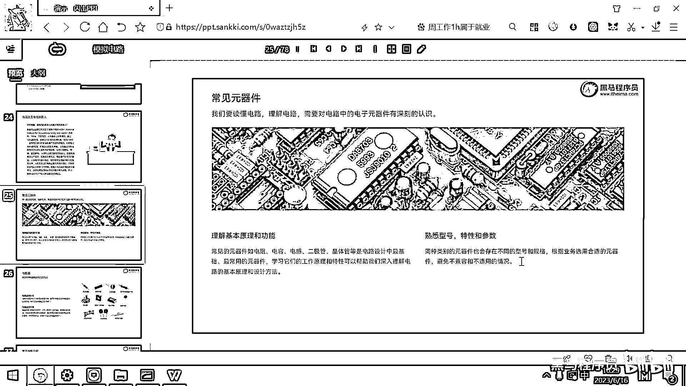

# 黑马程序员嵌入式开发入门模电（模拟电路）基础，从0到1搭建NE555模拟电路、制作电子琴，集成电路应用开发入门教程 - P10：11_元器件和pcb - 黑马程序员 - BV1cM4y1s7Qk

好 那刚才呢有一个小细节忘了补充一下了，就是这个电流啊，它对人体产生伤害是需要持续性的电流才会产生伤害的，那如果呢，这个电流持续的这个时间非常非常短，对我们来讲呢，也也没有什么危害，对吧。

学化学还有学这个药理学，有一句话叫抛开剂量谈毒性都是耍流氓，对吧，你说这个皮霜呢很厉害，但我就吃一毫吃零点零几毫克，对吧，啊，这个没什么危害啊，那稍微吃多一点还能治疗白血病，对吧。

但吃的更多了就就挂掉了，那这个电压它产生的电流也是跟这个持续时间呢有密切关系的啊，如果这个持续的时间非常短啊，那也不会有什么危害，那像冬天你去脱这个毛衣，你能听到噼里啪啦的这个声音，对吧。

那个静电呢有几十万伏啊，但是呢它产生的电流啊都是都是微秒纳秒级的啊，你就感觉看到一个电火花啊，也没有也也没有什么别的影响，对吧，好，另外呢，还有一个工具是神器，夏天的神器叫电纹喷儿，这个电纹喷儿呢。

它把一个3。7伏电池的电压升到三千伏啊，或者五千伏，那这个五千伏去电这个蚊子一下噼里啪啦就把蚊子电死了，对吧，但是你人用手摸一下，只是只是剧痛一下啊，那对我们人呢，也没有太大的伤害，就是剧痛一下。

如果如果你把手伸进去试一下的话，非常痛的剧痛一下，但是手还是完好的，好。

接下来的话呢，我们就开始给大家去介绍各种常见的元气剑，因为整个这个集成电路就是把这些元气电呢，给组合到一个PCB电路板上啊，去实现你想要的功能，那我们要去组合这些元气电呀。

实际上就跟小朋友去搭这个乐高积木一样，你要熟悉这个积木块是干嘛的，那个积木块是干嘛的，然后把这些积木块组合在一起去实现一个小功能，然后再把这些小功能组合在一起去实现一个大功能。

举一个最简单的例子就是你打开任何一个电路板，你都可以去发现这个电路板无非就是有一个电源模块，用来去管理电源对吧，究竟是升压呀，降压呀，怎么管理这个锂电池，怎么管理这个充放电，那肯定是有一个电压模块的。

然后呢，你所有的这种高级一点的开发板都是有这个微处理器的，还有这个MCU，那MCU呢，我们就可以写代码编程，那这个MCU呢，又有不同的架构，对吧，有什么51架构的有ARM架构的有RESC-V架构的好。

这些架构呢，有不同的特性，我去选一个处理器的这个模块，那处理器模块有了之后呢，又可能有各种各样的外设，那这个外设是操作屏幕的，这个外设呢，是驱动电机的啊，这个外设呢。

是接收这个环境温度的一些传感器的外设，哎，把这些东西组合在一起，形成一个电路板，然后就可以去实现你想要的功能了，就所有的复杂的东西都是有简单的东西，一步一步组拼出来的，那后面的课程呢，我们也会带大家呢。

去做一个功能完备的计算机，你会发现归根结底还都是元器件组成起来的，用电呢，去控制电用代码呢，去控制电好，这个就是电路的原理，我们要读懂电路理解电路，那你就要对电路当中的每个元器件呢，有深刻的认识，好。

这些元器件最常见的是什么呢，电阻对吧，用来限流的啊，用来分压的那电容是干嘛的，电感是干嘛的，二极管三极管，晶体管，MOS管这些是干嘛的，这些是属于最基础的元器件，你一旦理解了它的原理之后，后面呢。

你就可以基于这些元器件呢，进行一些高级的设计，好，那另外呢，我们去学这个元器件的时候呀，大家一定要去熟悉它的型号特性和参数好，这些东西啊，每一个厂生产出来的都不一样。

那你要干的事情就是要去读这个厂家的数据手册，对吧，根据你的需求去选择合适的型号啊，那当然还要考虑这个成本性价比考虑考虑它的这个耐用性，考虑各种各样的特性，然后呢，这些组件之间的要彼此可以匹配。

免得出现不兼容或者不适用的情况好，那整个硬件相关的设计就是元器件的选行，然后以及他们是如何连接在一起的，你绘制完原理图，绘制完PCB，再把它们给焊到一起，这个底层的硬件就搞定了，那搞定了底层硬件之后。

那剩下来就是给他注入灵魂了，对吧，你写写代码，哎，在这种情况下干什么事，在那种情况下干什么什么事，这几个外设之间如何互相通讯，对吧，他们访问一些共享的资源如何去解决互斥的问题。

那整个这个软件硬件打通了啊。

那你的一个产品呢，就设计出来了，拜拜。