# 黑马程序员嵌入式开发入门模电（模拟电路）基础，从0到1搭建NE555模拟电路、制作电子琴，集成电路应用开发入门教程 - P11：12_电阻器 - 黑马程序员 - BV1cM4y1s7Qk

好 那我再讲一个小的元器件，这元器件呢 叫电阻，电阻呢 是我们的一个通用的说法，其实更准确的说法呢 叫电阻器，加上一个气是不是就高级很多 对吧，那电阻的作用呢 就是阻碍电流的流动。

好 那关于电阻呢 有很多图片。

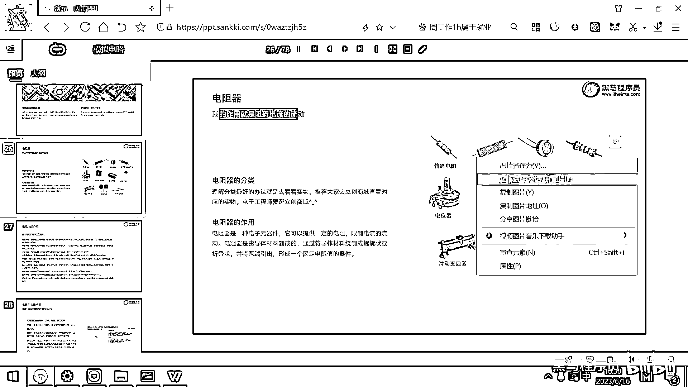

这些图片呢 都是我在力创商城上搞下来的图片，然后大家可以去瞧一下，好 这种建的 这种大家都见过 对吧，普通的电阻 然后都有什么薄膜电阻，它就是把那种，半 就是不太导电的材料一层一层的压在一起。

构成的一个电阻，好 光敏电阻 这种电阻呢 很有意思，就是有光的时候 它导通，没光的时候 它就断开，或者是光照呢 会影响它的电阻值，这个阻值呢 从几十万欧到几百欧之间，快速的剧烈的变化，这就光敏电阻。

那一般光敏电阻呢 就用在这个楼道的感应灯，对吧 那白天的时候它不亮，晚上的时候呢 它就亮 这种光敏电阻，好 这是什么金属薄膜电阻 电位器，这个电位器呢 大家应该都用过，因为有很多台灯上面都有一个旋钮。

往左转一转就变暗了，往右转一转就变亮了 对吧，这个其实就是靠电阻来实现的一个电位器，好 那旋钮可调电阻，这个我们后面经常用到，贴片电阻就是你看着这个图很大，这个比例呢 是不太正确的。

这个贴片电阻0603，它代表的就是长是六个毫米，宽是三个毫米，这是一种非常小的电阻，适合你做很小的PCB板用这种贴片的，我们整个就业班的课程呢，也是先带大家用这种大的，你方便焊 方便操作。

这些你搞熟练之后呢，我们再用这种贴片的小的，好 热敏电阻不同的，你看写的有NTC，在不同温度下它的阻值不一样，那利用热敏电阻呢，我们就可以测量环境的温度，好 那滑动变阻器呢。

这个是初中做电穴实验用的 对吧，往左滑 往右滑 压敏电阻，还有这种高精度电阻，这高精度电阻呢，它的精确度呢，可以到千分之一或者千分之零点五，那当然价格呢，也非常友好，对吧。

这个像我们这种电阻可能几分钱一个，那高精度电阻呢，可能好几毛或者几块钱一个，一般的高精度电阻可能就用在军工呀，航天这样的场景下，对这个精度要求呢，非常非常的高。

好 这些图片呢。

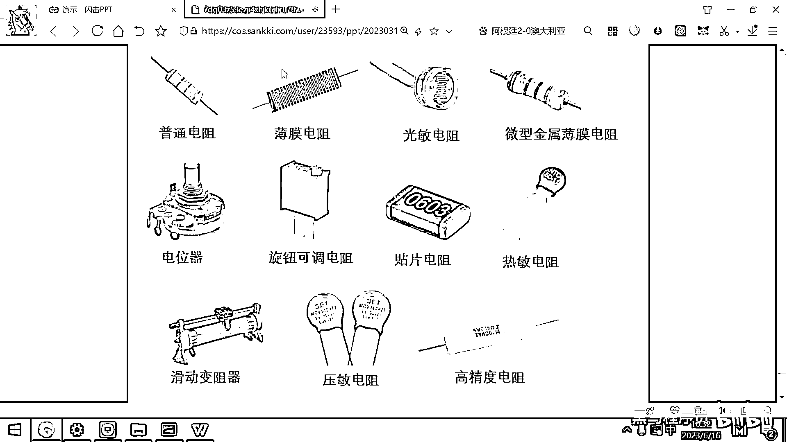

你没事干的时候，你就可以跑到这个力创商城上，然后你找到这，这是不是有一个分类对吧，叫电阻，然后你点开这个分类，然后你就看一看这个左边的图片了，你看哦，哎，这是一个贴片电阻长什么样啊。

这这些都是贴片电阻长什么样，然后你看他还有什么呀，有插件电阻，那插件电阻的话，我应用一下塞旋啊，你看这种插件电阻一般就是有两个引脚，对吧，插到这个板子上的，那你还可以去看一看像什么这种磁管电阻，或者。

或者是可变电阻，这些呢，你都可以去塞选一下，看看他长什么样，好，你看这种电阻就属于金属的绕线电阻，那，就比较高级一些了，当然价格呢也很贵，你看这一个电阻就四十多块钱啊，他的。

铝壳的铝壳的电阻呢散热很好啊，一般呢，你比如说你要测试对这个电池进行放电，对电容进行放电就可以用这个铝壳电阻。

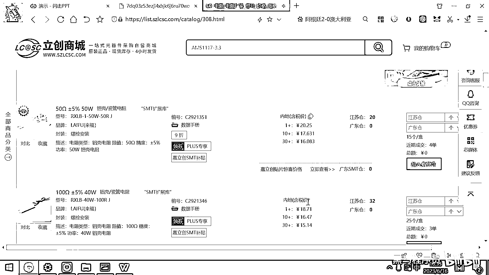

这是各种各样的电阻啊，没事的话，你去逛一逛看一看，好，那电阻呢，它的作用就是阻碍电流的流动，对吧，那电阻器呢，根据他制造的工艺啊，可以去做成各种各样的形状啊，满足不同的需求，好。

那其实电阻的最重要的一个作用呢，就是阻碍电子流动，那一阻碍电子流动，大家想一下他带来的一个效果就是什么呀，就是发热，对吧，一阻碍电子的流动啊，那电子不能流动了，这个能量的就会以热量的方式散发出来。

所以电阻最重要的一个作用就是发热，你们用的很多什么电热水器，热水壶里头呢，实际上都是一个大电阻来进行这个发热，好，那像。

电阻的制作呢。

也非常的简单，你看这写了什么呀，叫早线电阻，对吧，这个什么金属薄膜电阻还有这个薄膜电阻，它实际上都是这个线呢，一圈一圈绕出来的，只要你的这个电线够长啊。

他就会有这个电阻啊。

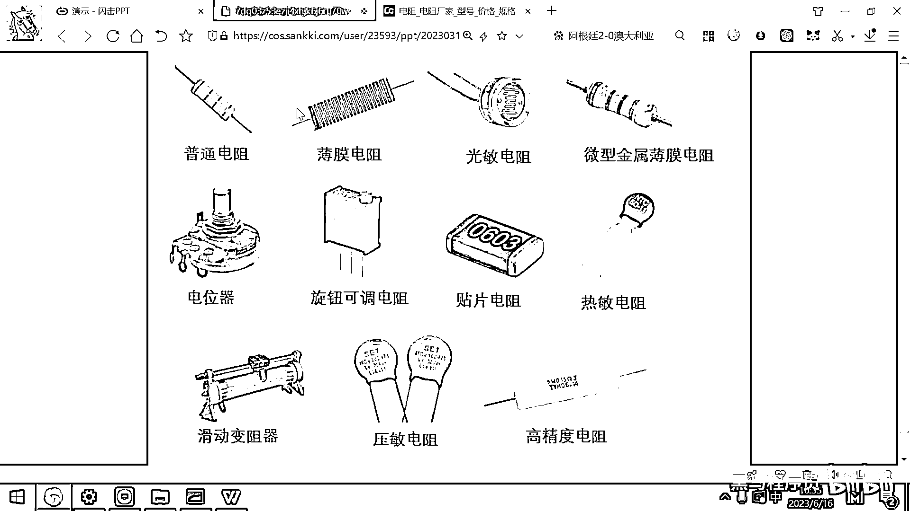

那像大家用的很多家用电器啊，他就是把这个导线呢，按照一定的规则，然后去去布一下，最终呢，就会就会形成一个电阻的效果。

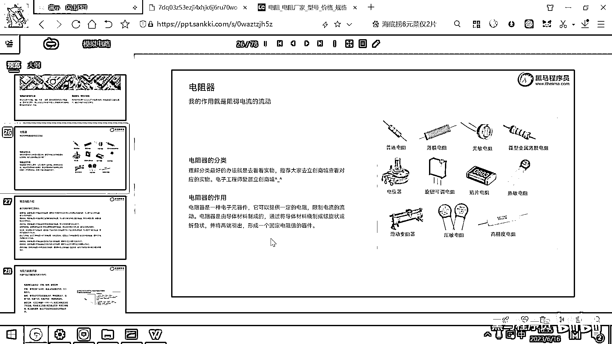

好，这有一个图给大家看一下。

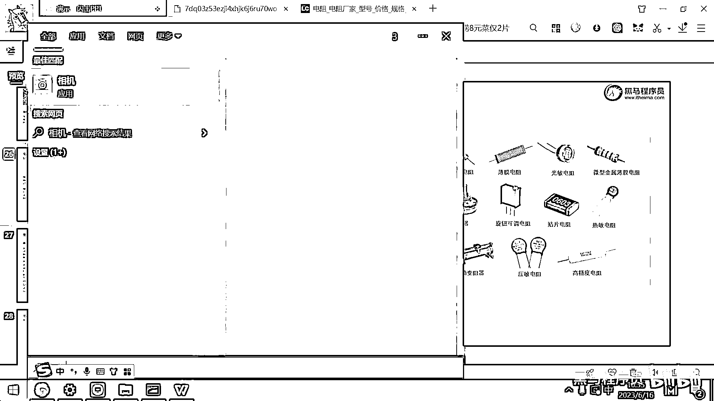

这其实也是一个电阻，好，大家仔细观察一下我的这个板子，这个板子你看我，我在PCB上画了一根导线啊，这个导线跟迷宫一样，你仔细看从这进去，然后他转转转转转转转转转转转转转转。

你看一下他跟任何他就是这样牛牛牛牛牛这个线呢，有一个名字叫希尔伯特曲线啊，从这个地方扭扭扭扭扭扭扭上来扭下去扭上来扭下去好，这个线呢，很长很长，从这儿进去，从这儿出来。

这根导线现在就变成了一个绕线电阻啊，这个电阻的阻值呢，大概是6欧左右，那你们用的一些加热台呀，烘干器呀，他里面呢，实际上就是这样的一个电路啊，只要一通电这个板子呢，温度就立刻会上上来啊。

像这个板子的温度在几十秒内，就可以上升到九十度左右啊，你去你去加热一个什么东西啊，就很方便啊，那一期你们有同学就自己画一个这个东西，然后用来热牛奶啊，那这个牛奶凉的喝的肚子很不舒服，对吧。

然后给这样一个板子一通电啊，那他很快就可以把这个牛奶呢，给热起来好，那他其实也是一个电阻啊。

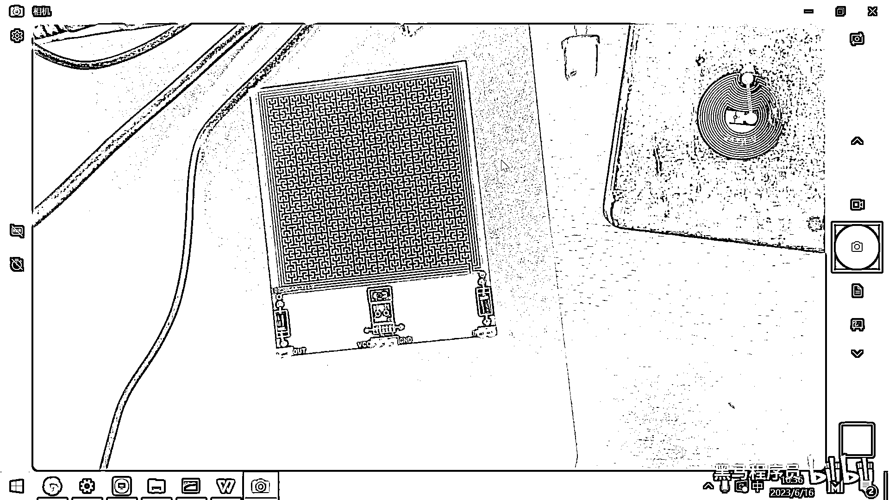

那这就是，电阻的另外一个应用场景，你家里用的电暖气呀，然后电水壶啊，他里面的也是电阻，通过这个电阻发热啊，来把温度呢，提升起来，好，那电阻呢，他的区别主要是在于啊，他的功能还有制作工艺。

那普通的电阻就是最便宜的啊，就，一些金属导线绕字而成的对吧，然后两边引脚，那薄膜电阻呢，是金属薄膜，然后压字而成的光敏电阻呢，是接受光照，然后电阻值会发生变化啊，那电位器呢，带小旋钮可以调节对吧。

电位器跟这个可调电阻呢，是类似的好热敏电阻呢，叫NTC啊，他是随着这个温度变化组织呢，会有很大的变化，所以一般NTC热敏电阻呢，用于温度采样和控制系统，那压敏电阻呢，这个也很常用。

那压敏电阻他可以基于这个，压力的这个值啊，来去变化出来不同的组织啊，就是这个东西你背一背他，他的电阻呢就变化了，那像，一期有同学去做这个体重秤，去做伽利创的火星计划，那买的就是这个压敏电阻啊。

那你用一个压敏电阻，你读一下他的组织，然后基于他的公式你就知道，哎这个人有多重了啊，所以电子秤呀，体重秤他的工作原理呢，就基于压敏电阻啊，那还有一些高精度电阻，这一般航空航天军工了，会用这种啊。

高精度的电阻，好，那电阻我们最关心的是什么东西呢，关心的就是他的封装标秤，还有额定功率啊，这是我们电阻最关心的东西，好，我在这呢。

带大家呢。

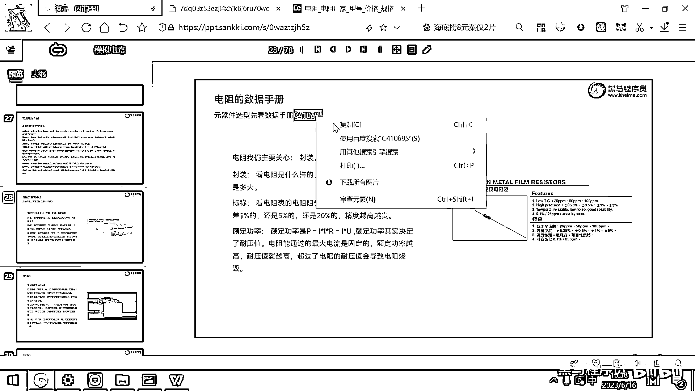

去看一个数据手册啊，来简单去瞄一下，好，那大家看这是一个金属薄膜电阻啊，我们我们用的很多电阻都长这个样子啊，金属薄膜的啊，然后你看一下他的数据手册，这个数据手册呢，我们打开，好，哎，这个是。

这个是国产的。

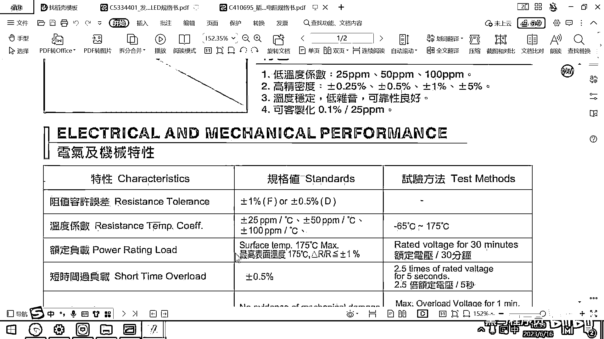

然后里头还有一些中文挺好的，对吧，你看中英文的feature，然后特点中英文对照翻译，好，那特点呢，就是低的温度系数，好，那说明说明温度对这个电阻的影响呢，啊，不太敏感啊，就温度变换呢。

不会大幅度的影响这个电阻的阻值，好，那这个电阻呢，他有这样的几种情况啊，有2。5%的误差的，有5%误差的，正负5%误差的好，那不同的这个精度价格肯定是不一样的啊，然后温度稳定，然后这个叫可靠性好，对吧。

好，这个叫低，这个是这个繁体字应该是噪音的意思啊，低噪音啊，那利用利用这样的一个电阻呢，不会产生过多的电信号干扰，就叫低噪音，好，然后电阻的特点，然后我们最关心的电阻的特点是什么呢。

其实是这样的几个东西，第一个就是封装也叫做尺寸，什么意思呢，就这个电阻长多大，对吧，那如果这个电阻很大，你在画板子的时候，是不是要给他预留很大的空间才可以放到这，如果这个电阻很小。

是不是稍微找一个边边角角往那一放就可以了。

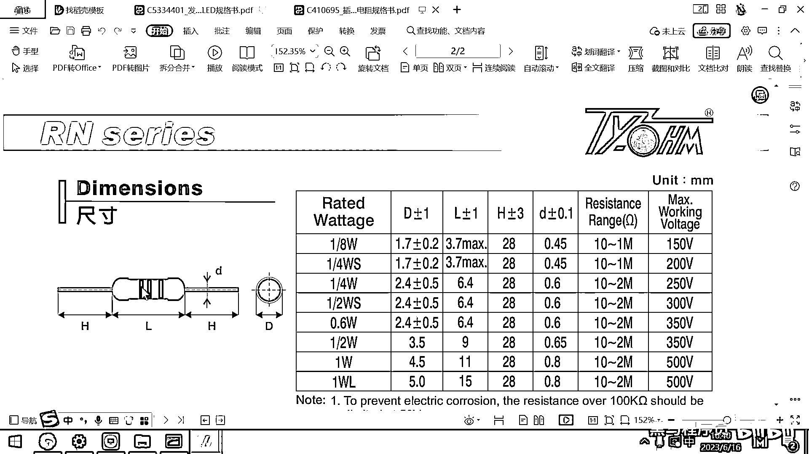

好，所以第一个我们关心的内容呢，就是封装或者叫尺寸啊，你要，就做做这个硬件的尺寸非常重要啊，你你打一个板子，本来这个单位是毫米，然后你没搞好，把这个单位搞成米了，对吧，那等这个板子寄过来之后，你看哇。

比我的脸还大，对吧，那这样的话就是尺寸问题，不过呢，通常情况下啊，不会出现这么低级的这个错误。

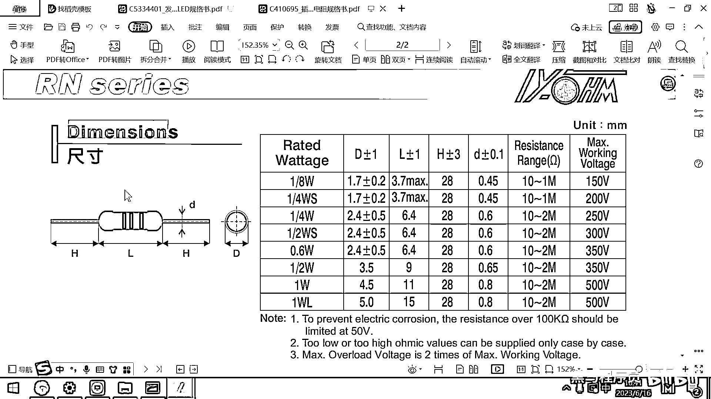

好，那第二个呢，就是我们还要关心什么呢。

我们要关心他的标称，什么叫标称呢，标称就是这个电阻的，这个参数就叫做标称，它是一个精确度多高的电阻啊，正负1%还是正负5%，这个就叫做标称啊。

叫阻值。

阻值容许误差啊，就是标称你买的这个是1K的，那如果呢，他误差是20%，那可能呢，就是800欧啊，也可能呢，是1200欧，对吧，就同一个批次生产的电阻，它的阻值呢。

都可能是不太一样的。

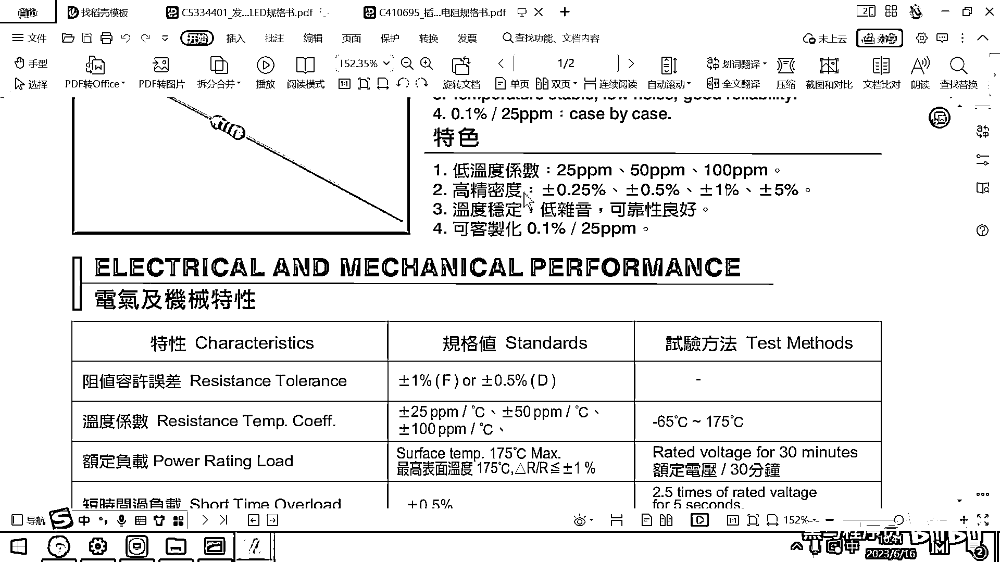

都是会有一些差异的，好，这个就叫做标称，那最后一个是什么呢，我们要关心他的额定功率，额定功率是啥呀，我们在初中物理学过功率，对吧，这功率P就等于U乘以I，电压乘以电流就是功率啊。

功率它其实反映的是一个设备的耗电的程度，功率越大是不是就越耗电，那越耗电，它转化的这个能量是不是就越强呀，对吧，你去买这个电动车，你买这个电机，这电机呢，功率有250瓦的，350瓦的，1000瓦的。

那你你想买多大的，肯定想买更大功率的，对吧，但更大功率就意味着更费电，更费电就意味着它的动能越强，那街上有一些那种台电的拉克的电动车啊，它的功率呢，可能就是1000瓦的，一加油门啊，那跑的比汽车还快。

对吧，那如果呢，你是普通的就国标的电动车啊，那功率250瓦的最高速度呢，不得不得超过20公里每小时，那他跑的就很慢，好，这就是功率，那理解了这个功率之后，我们知道功率是等于I乘以U的。

而这个U又等于什么呀，又等于I乘以R对吧，欧姆定律，所以这个功率是不是就等于I平方乘以R呀，好，那任何一个电阻。

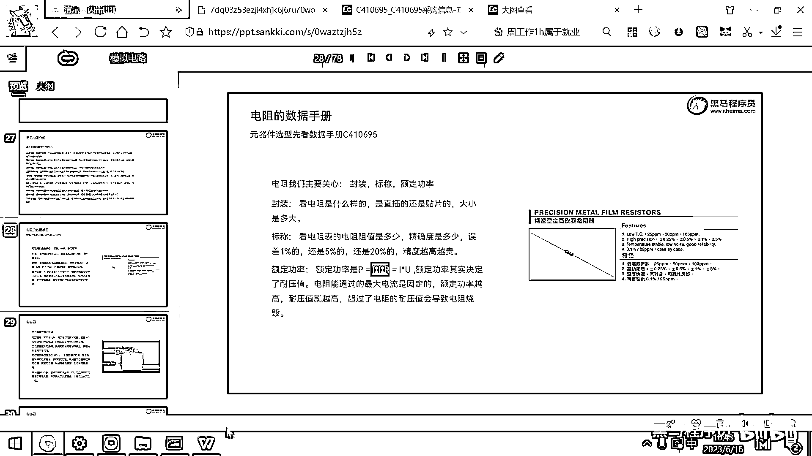

他都是有这个功率的这个参数的啊。

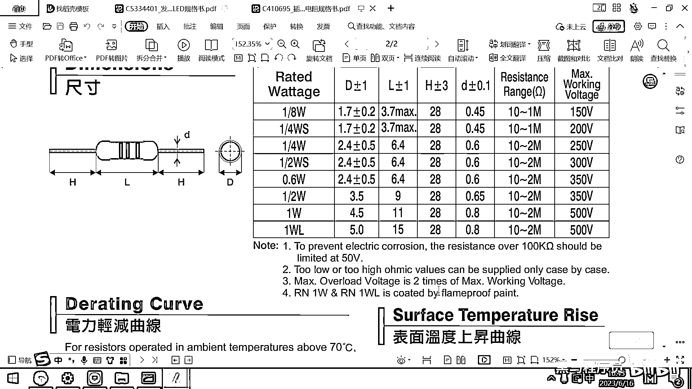

我们我们刚才选的这个电阻，大家看一下这个电阻这个地方。

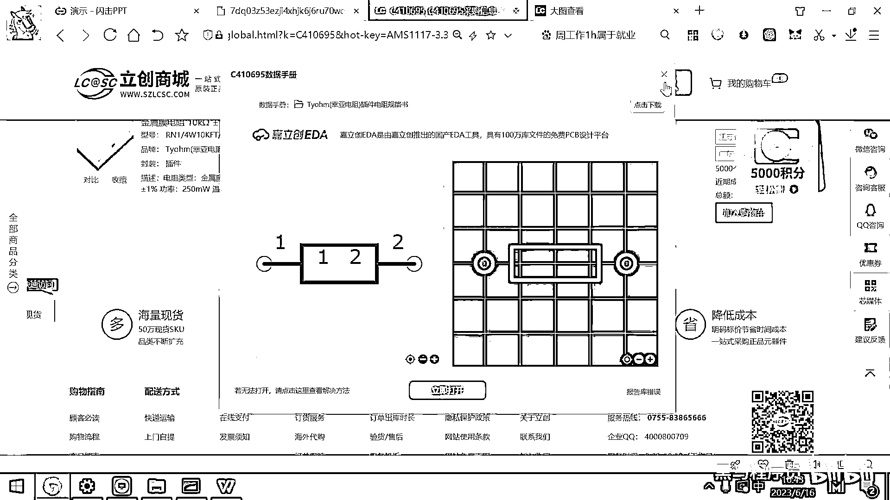

左边就会写它的功率，这功率是多少，250毫瓦，毫是10的M，就是10的-3。

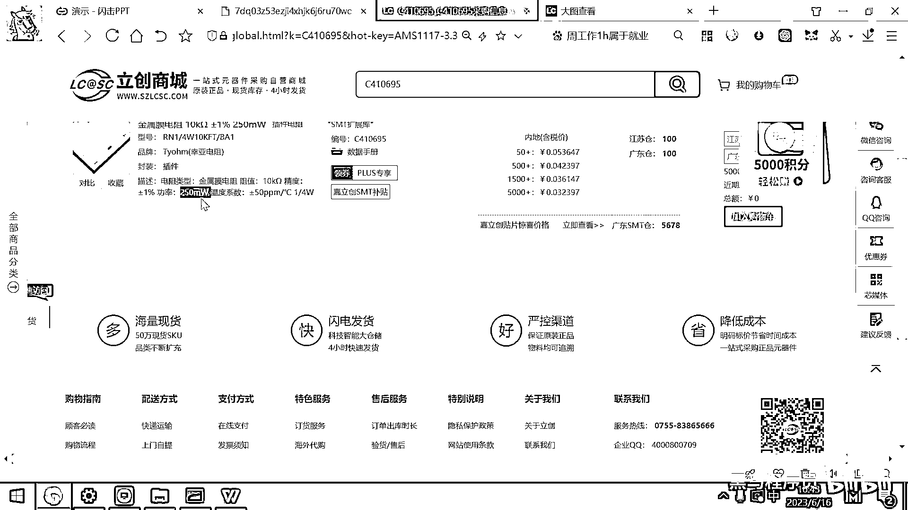

对吧，那250毫瓦实际上就是0。25瓦。

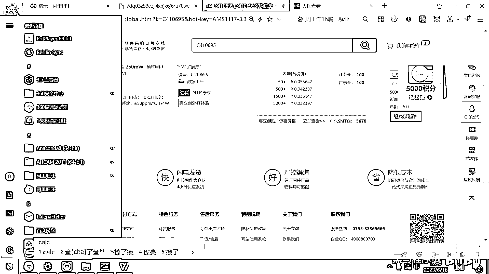

那0。25瓦，0。25就是他的功率，对吧，那这个功率去除以什么呢，去除以这个电阻，这个电阻是多少，10K，10K代表什么，10K就是一万，对吧。

去除以一万。

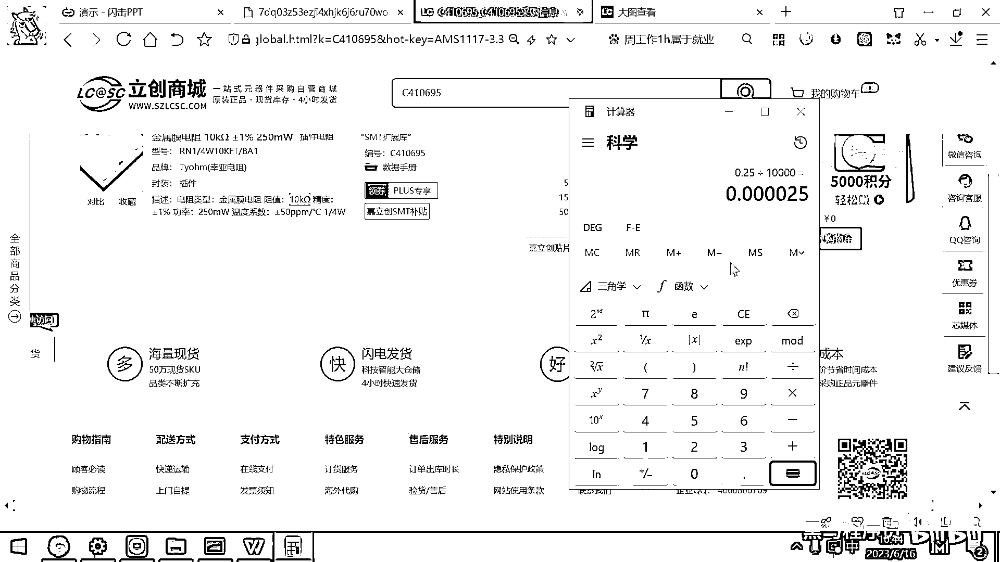

那这个得到的是什么呢，我们看一下PPT还有没有印象，拿功率去除以电阻，得到的是什么，I平方，对吧，得到的是两个I，I平方，那我们对它进行开根号，这个得到的是多少呀，得到的就是I，就是电流。

也就是说这个电阻，它的标称电流是多大呀，5毫安，对吧，0。005A，就是5毫安。

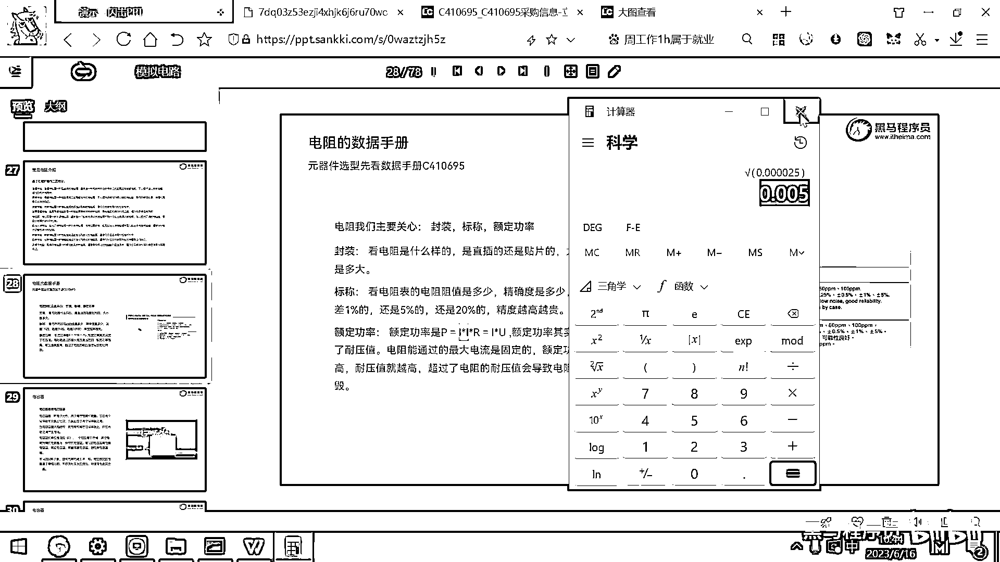

也就是说呀，这个电阻过一个，刚才我们看到的这个电阻。

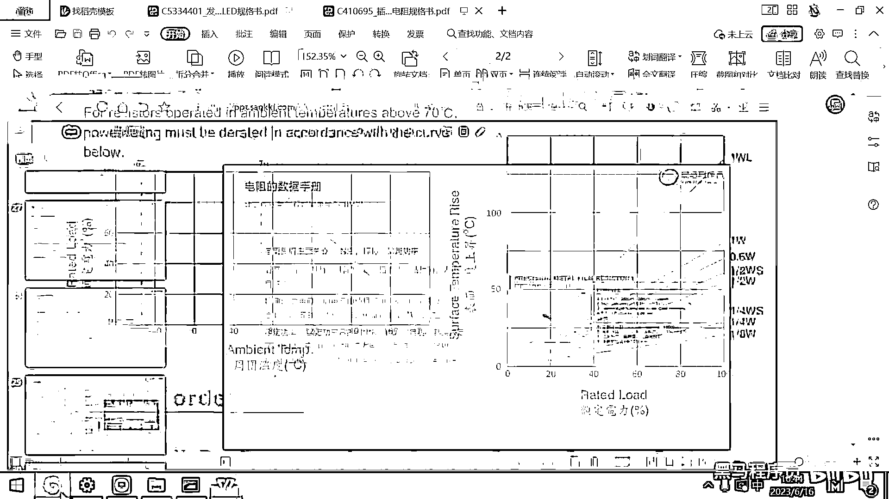

过一个5毫安的电流，是它的标称的，是没有问题的，那如果我给他过一个30毫安的电流，会有什么问题吗，可以过，就是这个电阻有点热，如果你给他过一个200毫安的电流，那这个电阻就可能非常热。

如果你给他过一个亿安的电流，那这个电阻呢，就可能冒一下烟，然后就变黑了，然后这个电阻呢，就断开了，好，所以呢，你在进行这个元器件选行的时候呀，一定要考虑它的功率，一定要考虑它的功率，这个功率越大。

它能通过的电流呢，就越大，这个功率小，通过的电流呢，就小，好，所以在设计的时候，你要知道这条线过多大的电流，我应该选多大的电阻，好，那，当然这些都是，都是我们设计上这样讲，在实际上呢。

一般我们我们这个单片机，它的功耗很低，然后通常选一个四分之一瓦，或者是选一个二分之一瓦的这个电阻，直接放上去就可以了，那这个电流呢。

都不会超过它的最大负荷。

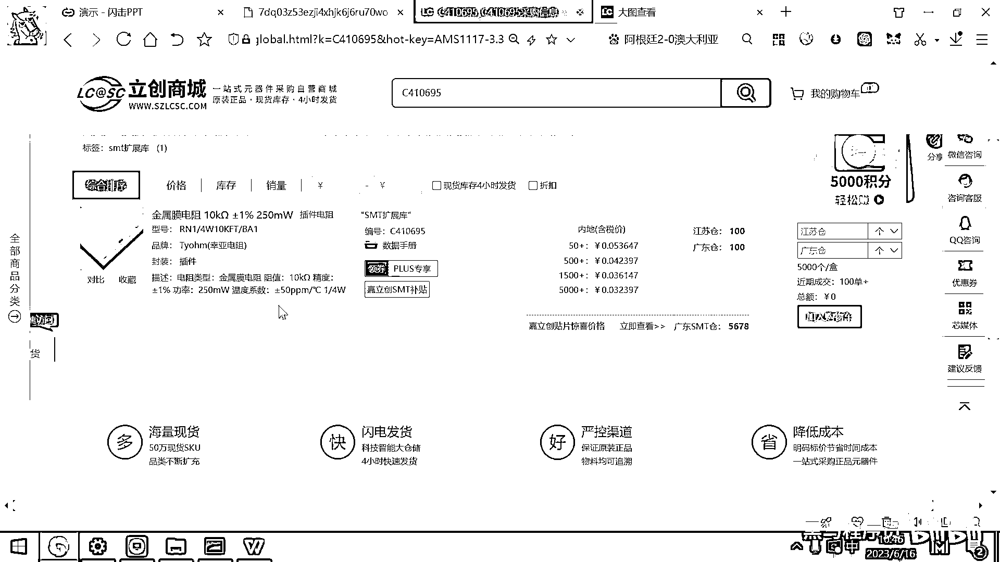

都不会超过最大负荷。