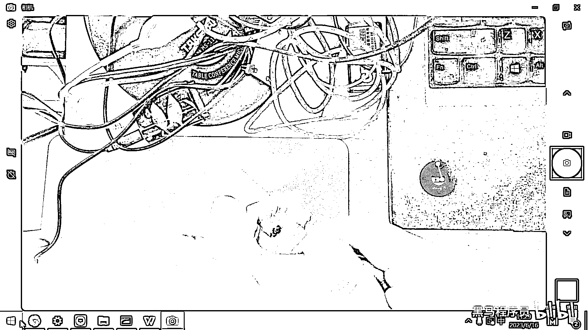
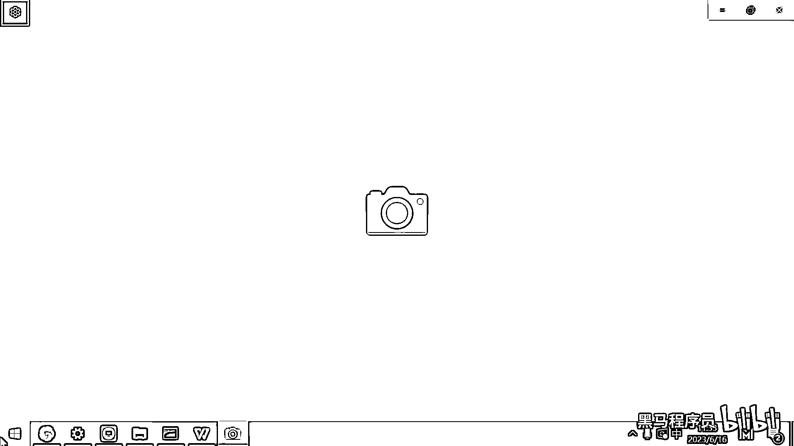

# 黑马程序员嵌入式开发入门模电（模拟电路）基础，从0到1搭建NE555模拟电路、制作电子琴，集成电路应用开发入门教程 - P13：14_电和磁的关系 - 黑马程序员 - BV1cM4y1s7Qk

好 那现在呢 我们给大家介绍了两种藏剑的元器件了 对吧。

一种呢 是电容器 一种呢 是电阻器，那课下呢 有一个任务就是，你们来到这个力创商城或者华秋商城，然后去看一看这些不同类型的电容 对吧，怎么铝电解电容呀，薄膜电容 可调电容 这都长什么样。

然后你看看这些电阻，贴片的 直插的 采样的 铝壳的 NTC的，这些电阻都长什么样，你就进去看一看 有个印象，好 下面呢 我们要介绍下一个重要的元器件了，叫什么呀 电感，你看这个电感 它斜杠还有个线圈。

还有一个变压器 对吧，那说明这三个东西呢 实际上是一类。

电感就是线圈做的 变压器呢 也是线圈做的，好 我们来去看一下这个电感器，好 要讲解这个电感器的话呢，我们必须要理解这个电和磁之间的关系，我们在这个初中物理学过什么右手螺旋定律，然后什么手握着线圈的方向。

然后拇指指向什么电流的方向 对吧，好 这还有印象吧 可能已经全都忘记了，好 那电和磁之间的关系就是，电可以产生磁 磁呢 也可以产生电，好 我们举一个生活当中的例子 你就可以理解了。

好 那电为什么可以产生磁呢，就好像是你往水里面去扔一个石头，这个石头扔进去之后，是不是水里面就会产生很多波纹啊 对吧，向外扩散的这个涟漪，那其实电子呢 它在挤的时候呢，也会产生这个电场。

就好像是这个水在互相挤来挤去产生的这个涟漪一样，那当我们往水里面扔了一个石头的话，这个时候就会产生这个涟漪，这个涟漪在扩散 对吧，在扩散的过程中，它是不是又带动了周围的这个水上下的移动啊。

就所以电和磁呢，它就跟你往水里面扔石头一样，那它会导致这个水周围的这个水呢 也上下的移动，那周围的这个水上下移动呢，又会导致更远的这个地方也会产生这个扩散 对吧，好 那我们当这个电产生的时候。

那电周围呢 就会有磁场，当磁场产生的时候呢，它又会影响周围的电子运动去产生电，所以呢 电和磁之间是可以互相转化的，那我们的这些发电站是怎么发电的呢，一般就是水流带动这个发电机 对吧。

发电机里面是有电子和钻子的这些永磁体，它们一转就产生了这个电，那我们的电机又是怎么工作的呢，是电进去之后产生了磁，然后互相排斥这个电机又动起来了 对吧，所以电和磁它们之间可以互相转化。

好 电机中的电流流过线圈产生磁场，磁场又旋转起来，带动这个就是电磁感应的一个应用，发电机和电机是正好相反的，那发电机呢是把机械能转化成电能，电机呢是把电能转化成机械能。

好 那理解了这个电和磁之间有关系之后呢，我们在这还是给大家做一个小实验，这个小实验呢就是电它是可以产生磁的。

好 那我打开一下我的相机。

这个东西呢非常简单。

这个东西就是一个线圈，这个线圈是怎么做的呢。

大家仔细看一下，它实际上就是铜丝。

你看我把这个胶具放到这对一下胶，它实际上就是铜丝。

你把这个铜丝一圈一圈一圈的绕制出来。

就做出来了一个线圈，但这个线圈里面还有一个什么呢，这个中间它包了一个铁。

它包了一个铁，包这个铁的作用呢，就是可以让它产生的磁场呢变得更强一些。

好 然后这个后面有两个端子，一个端子是正极，一个是负极，这个其实是没有正负极的。

你怎么接它都会产生磁，只不过产生的这个磁一个是N极。

一个是S极，对吧，好那行，那我们现在有这样一个东西了。

我就去接一下我的直流电源。

这种线圈呢。

它在生活当中的应用呢也非常广泛，就比如说很多公司有那种磁吸的门禁，对吧，你指纹输入正确了，这个门才会打开。

如果没有输入指纹的话，这个门就一直吸着的，那就是它有一个磁铁一直吸着门上的那个铁片，当你输完指纹之后呢，它把这个电呢给断开，它就不吸这个铁片了。

你就可以把门呢给打开了。

好，那我在这儿把这个电源打开。

为了方便大家看到效果。

我在这儿还是把这个直流电源的电压呢。

给它给它展示出来，好。

这个是电压，好。

现在我就有供电了，这个是2。8伏的电压。

2。8伏的电压，大家看一下。

2。8伏的电压，你看我就已经我就已经干嘛了。

就把这个LED灯给吸起来了，对吧，因为它这个脚是铁做的。

就已经把它给吸起来了，好，那如果呢，我把这个电压调低一点。

调到这个0。8伏，好，大家看一下，磁力就不够了。

然后它就掉下去了，对吧，那所以呢，就是只要你的电流够大。

然后它就可以产生一个比较强的磁场，那这个磁场呢就产生了磁力，可以把这种金属金属铁片呢给吸起来。

好。

那明白了这个原理之后呢，实际上像像很多电子阀呀，继电器呀，大家就理解了，这个电子阀继电器是怎么工作的呢，像像这个卫生间里，我们装了一个电控的水阀，对吧，如果有人过去了，他就自动的冲水，如果没有人了。

他就把这个阀呢给关掉，那实际上这个电控的水阀。

它的内部，你把它给拆开，就是这样的一个。

就是这样的一个线圈，这个线圈呢，如果通电了。

这个线圈就把这个开关，把这个阀门吸上来，对吧，吸上来的话，水就导通了，就可以冲水，那如果没人了，我就把这个电关了，那这个阀呢又合并起来，那这个时候就水就断开了，好，所以很多很多东西。

电控的阀门。

都是基于这样一个线圈来去设计的，好，那通过这样一个小实验呢，我们得知了电是可以产生磁的，对吧，那那电感器是怎么工作的呢。

咱们下期再见。

