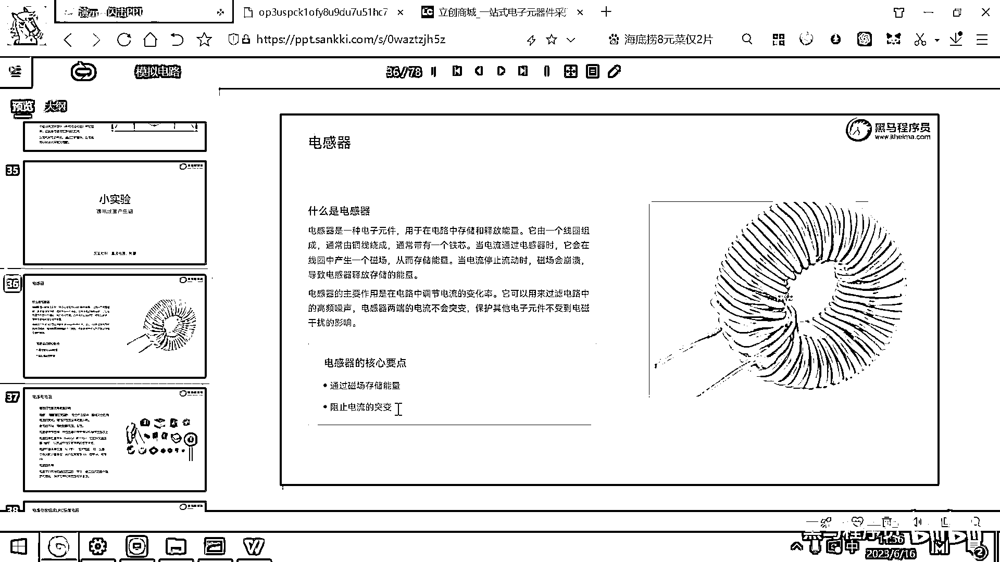
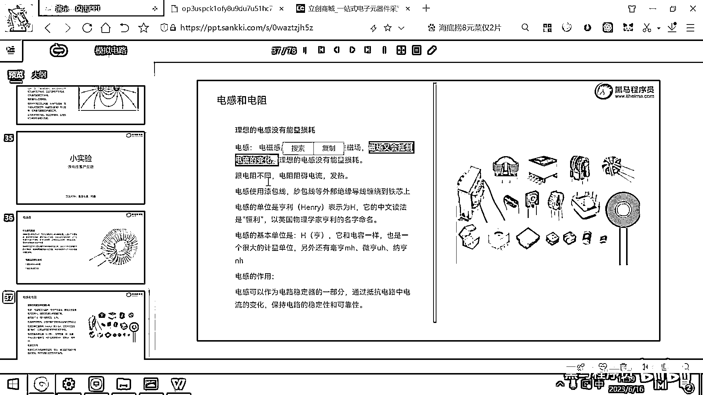
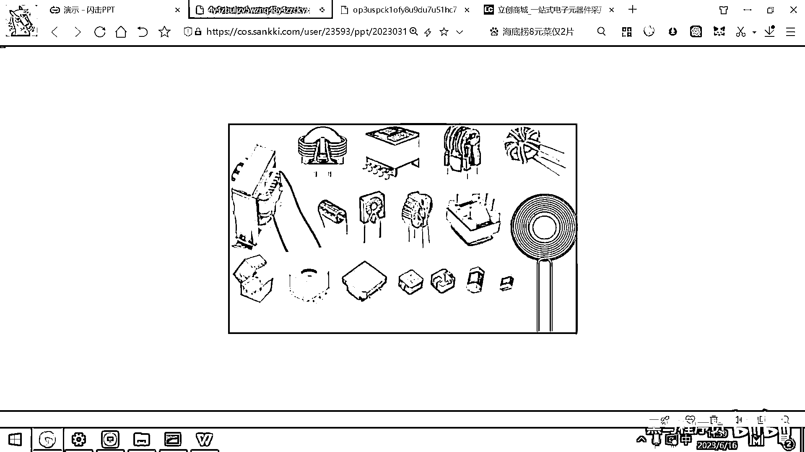
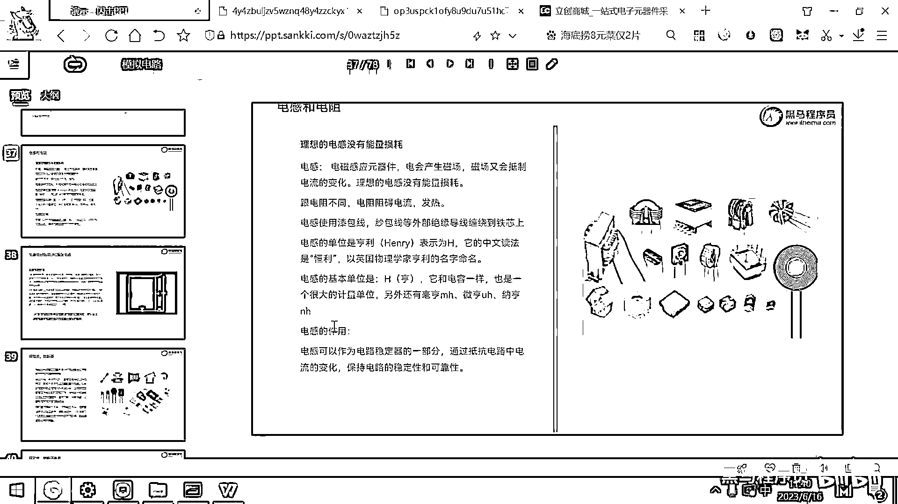

# 黑马程序员嵌入式开发入门模电（模拟电路）基础，从0到1搭建NE555模拟电路、制作电子琴，集成电路应用开发入门教程 - P14：15_电感介绍 - 黑马程序员 - BV1cM4y1s7Qk

好 那大家看右邊呢 就有一個電感器，這個電感器呢 是一個裸露的，比較典型的電感器，好 大家看它實際上就是什麼呀 把這個銅絲，怎麼一圈一圈的，纏繞起來 對吧 這就做成了一個電感器。

那電感器呢 是一種電子元件，它在電路中呢 是用來儲存和釋放，能量的，好 我們說電可以產生磁，一旦一通電 大家想一下，這個線圈是不是就產生了一個磁場呀，就產生了一個磁場 那但當我。

突然間斷電的時候 這個磁場呢，由於已經沒有電流了，這個磁場呢 就會崩潰 崩潰的時候，磁場所存儲的能量呢，又會被釋放出來 這個就是電感器，工作的原理 由電產生了磁，然後呢 當突然間電沒有的時候。

這個磁場還在 它會慢慢的，崩潰 然後會維持之前，電流的 它會維持，之前電流的方向 讓這個電流呢，不會產生突變 從而保護其他的，元器件 不受這個很強的電池干擾，所以呢 電感器它的特點呢 就是。

通過磁場去存儲能量，這個線圈你繞得越多 繞得越密，這個電感器的，這個容量呢 就越大 如果，這個線纏的少 然後纏的沒有那麼密，這個電感器的容量呢 就會小一些，電感器的單位呢 是這個亨。

是這個亨利 亨利呢 也是一個，非常非常大的單位 通常我們用的，都是這種 豪亨 微亨 或者納亨，這是這個電感器 電感器的，作用 它可以防止電流的突變，好 那元器件介紹到這，我們有兩個重要的元器件。

以後經常要用了 第一個重要的。

元器件就是電容 電容的作用，是防止電壓的突變，你想一下 如果有一個電容，我這裡面是不是蓄了很多的水呀 對吧 裝了，很多的電池 那即便是我把這個閥門給關了，這個電壓會瞬間突變嗎 不會。

對吧 電容器的作用是防止，電壓的瞬間突變 那電感器，的作用呢 它是防止電流，的瞬間突變 因為你電流，一經過我的這個電感 就產生了一個，電場 這個電場呢 即便是你把這個電流給。

你把這個電路斷開了 沒有這個電流了，但這個電場呢 還是在的 它會，慢慢的崩潰 由這個磁，再轉成這個電 好 所以呢 電感器，可以阻止電流的突變，那後面呢 我們在做這個開發的時候。

經常會接觸到一些 DC to DC，的芯片 就是降壓的芯片 或者，升壓的芯片 或者呢 是一些穩壓的這種，芯片 這些芯片呢 往往都要配合，合適的電容和電感 才可以，正常工作 你比如說我有一個輸出的。

電流 對吧 在我這個輸出端 我可能，就要去接一個功率電感 這樣做有，什麼好處呀 電感的作用是，電流不會突變 對吧，那你接了這樣一個功率電感之後 我輸出的，這個電流 它就不會在短期內。

突變 然後保護我們的，這個電路 好 那你接一個電容的話，它可以讓電壓在短期內不會突變，那接一個電容呢 就可以起到一些穩壓，的作用 這是電感器，電感器呢 理想的電感呢 是沒有能量損耗的。

這個也要去強調一下，就是電感它實際上是，把電能轉化成了磁場能 然後呢，在需要的時候再把這個磁場的能量呢，再轉成電能 理想的電感是沒有，能量損耗的 那為什麼我們現實生活中的，電感有能量損耗呢 主要原因呢。

就是這個線圈還是有電阻的 對吧，這個線圈有電阻的 那如果呢，你能夠生產一種線圈沒有，任何電阻 那這個線圈就是所謂的，超導體了 對吧 那超導體，有什麼好處呢 你像這個上海有。

磁懸浮的列車 對吧 那如果超導體，技術 常溫超導體技術能夠，能夠大規模的應用了，那我就只需要通一下電 是不是就有磁場了，然後它又沒有能量損耗 這個磁場力，就像磁鐵一樣是一直存在的 那我就。

可以以非常低的成本把這個，列車拖起來了 再稍微給點力，這個磁懸浮列車呢 就可以地面飛行了，對吧 那所以一旦超導技術，出現之後 對整個這個能量應用，對我們很多場景，都是有非常大的這個改變。

好 那理想的電感沒有能量損耗，電感呢是一個電池感應的，元器件 對吧 電會產生磁場 磁場呢，又會抵制電流的變化 好那。

這右邊呢有各種各樣的電感，但這些電感的核心呢 都是，七包線 都是線圈一圈一圈的，這樣繞製成的 好這些都是電感，你看這個線圈一圈一圈的繞，線圈線圈線圈 這個封裝裡面也是線圈，那大家以後用的這種貼片的。

電感 這裡面呢也是線圈 你把這個外殼，剪開之後 可以看到裡面的線圈。

好 那電感的作用呢 是電路穩定器的一部分，可以抵抗電流的變化，保持這個電路的穩定性和可靠性，(字幕製作:貝爾)。

感謝您的觀看。

