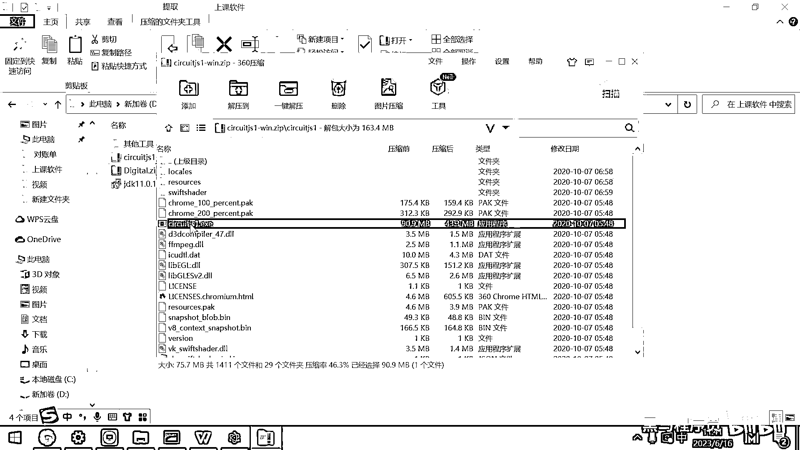

# 黑马程序员嵌入式开发入门模电（模拟电路）基础，从0到1搭建NE555模拟电路、制作电子琴，集成电路应用开发入门教程 - P15：16_LRC振荡电路 - 黑马程序员 - BV1cM4y1s7Qk

好 那下面我们看一个由电感和电容组成的振荡电路，这个振荡电路呢 等后面我们还会详细的给大家去讲解，现在呢 你就先有一个印象，然后知道这个振荡电路的一个效果就可以了，我去打开一个模拟软件。

这个模拟软件呢 叫circuit的gs。

它之前是用java写的 然后有人把它给用javascript呢 又重写了一遍。

我给大家提供的这个软件呢 是自带了一个浏览器的内核，然后所以你就直接双击就可以运行。

那今天的资料呢 中午的话会共享给大家，这里面就包含了包含了我们全部的这个内容，比如说上课的视频在这儿 然后上课的软件，这个就是circuit的gs 这样一个软件解压就可以了。

使用起来很简单 解压出来一个绿色软件，你就直接去打开就可以了，解压完毕之后是一堆的文件，然后你找到里面的这个叫circuitgs。

exe 双击打开就可以了。

好 那当前这个电路呢 我们来给大家去看一下这个电路的一个结构，好 这个结构这儿有一个什么东西啊，这个图片是一个电容 对吧，好 这是一个15μ法的电容，好 然后这个东西是一个电感。

这个电感是一个很大的电感 有一横，好 为了方便大家观察 我先把这个电阻给删掉，我先把这个电阻给删掉，那现在呢 这就变成了一个理想电路，没有电阻的理想电路，好 我去运行这个仿真。

好 把这个开关给闭合的时候，大家看一下会出现一个什么情况，开关闭合的话 是不是有电流就要通过这个电感了。

电感我们说它是啥呀。

电感就长这个样子，它实际上就是一个线圈 对吧，这个线圈一通电之后 是不是产生磁场，这个磁场呢 就储存的有能量。

好 现在呢 我把这个开关咔的一下给断开了，那大家想电感的作用是什么呀，它保持这个电流不会突变 对吧，那刚才它的这个能量，这个电场释放的，这个磁场释放的能量就跑到哪去了，就给这个电容充电去了 对吧。

我可以把这个仿真速度呢 给搞的慢一些，然后我们重新给大家去做演示，好 我去运行，先把电流速度搞快一点，好 大家看现在电流是通过了这个电感 对吧，电流通过了这个电感。

现在这个电感上已经存储的有这个磁场的能量了，好 我把这个开关一断开的瞬间，大家想一下，这个磁场的能量是不是无处安放呀，它就只能干嘛呀，继续顺着这个方向流，然后相当于把这个电流流到这个电容了 对吧。

相当于是给这个电容去充电，好 你看我打开这个开关，它是不是先流到这个电容 给这个电容充电呀，那全都流到这个电容了 电容充电了，那现在我刚才这个电感上的磁场还有吗，就没有了 对吧。

那没有了 我电容又有电压了，电容有电压之后，它是不是又会给这个电感充电呀，所以整个这个流程就是电感给电容充电，电容呢 充高之后又给这个电感充电，好 它就这样，如果是一个没有电阻的电路。

它就这样一直震荡起来了，就它给它电，然后它电压高了之后又给它充，它有了这个磁场之后给它充，所以你看这个电流的方向就是，一会儿正着流 一会儿倒着流，一会儿正着流 一会儿倒着流。

这个就是一个非常典型的震荡电路。

非常典型的震荡电路，那震荡电路的原理呢，就是由一个电感L，由一个电容C，还有一个电阻R所组成 对吧，那震荡电路呢，就可以产生稳定的交流电信号，这个电呢 一会儿正着流 一会儿倒着流，这个就是交流电。

一会儿从左边流到右边，一会儿从右边流到左边，那在这个震荡电路里面，它工作的原理是什么呀，其实就是电感有能量给电容充电，电容充高之后再放电，给这个电感呢去充能量 对吧，它就这样周期性的变化。

在这个文档里面写得很详细，说当电容器的电荷达到0的时候，电感器的电流最大 对吧，好 这个时候呢，它就开始干嘛呀，把这个电流回流给这个电容，然后电容器的电荷增加 电压增加，然后当电容器的电荷最大的时候。

电感器的电流又到0了 对吧，然后这个时候，电感 就是电容已经最大电压了，电感器没有电流了，那是不是电容又给这个电感进行放电 对吧，就这样周期往复，一个周期性的交流电的信号呢就出现了。

好 这个LRC震荡电路呢，你可以去调这个L的大小，也可以调这个C的大小，通过调节这两个电容和电感的大小，来去改变输出信号的频率，这就是震荡器，这个震荡器呢有很多的应用场景，有什么应用场景呢。

第一个就是你街上看的那些爆散灯，就交警放到路上的，一会蓝一会红的那种爆散灯，它其实就是震荡电路来做的，为什么呢，因为它也不需要用什么单片机，也不需要写代码 对吧，它只需要周期性的产生这个电流信号就行了。

因为LED灯有一个特性，就是正电的时候才亮，电流是逆着的时候是不会亮的 对吧，那周期性的产生正负交替的这个电，然后这个灯呢就会一亮一灭一亮一灭，这样周期性的切换了，好 采用非常便宜的一个电感和一个电容。

就可以去做出来这种呼吸灯呀，或者散灯的这个效果。

再次感谢各位的关心。