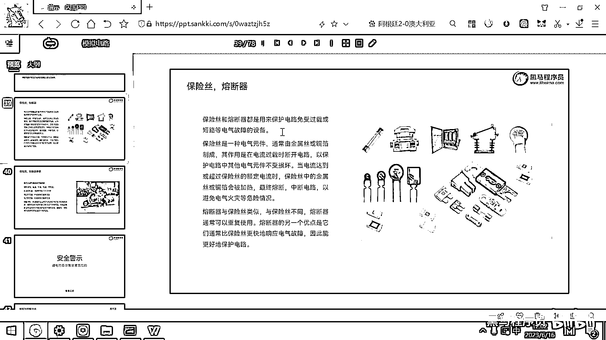
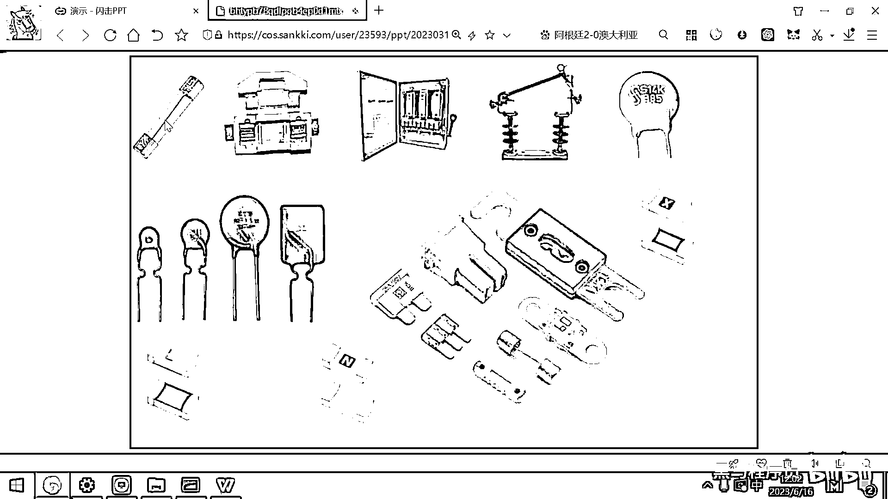
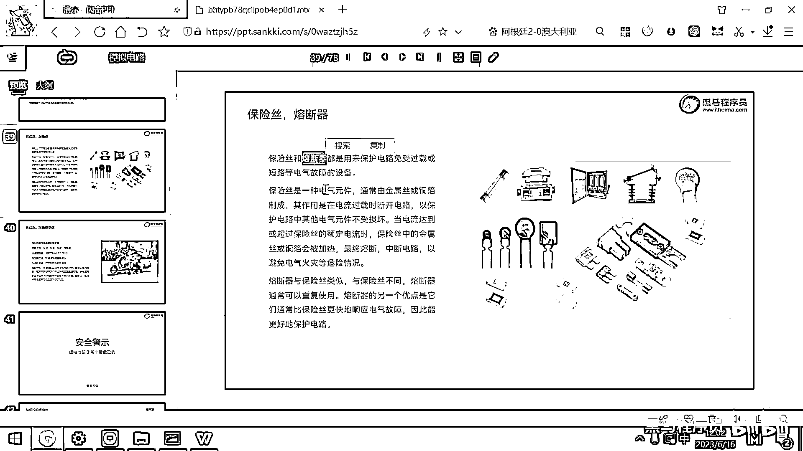
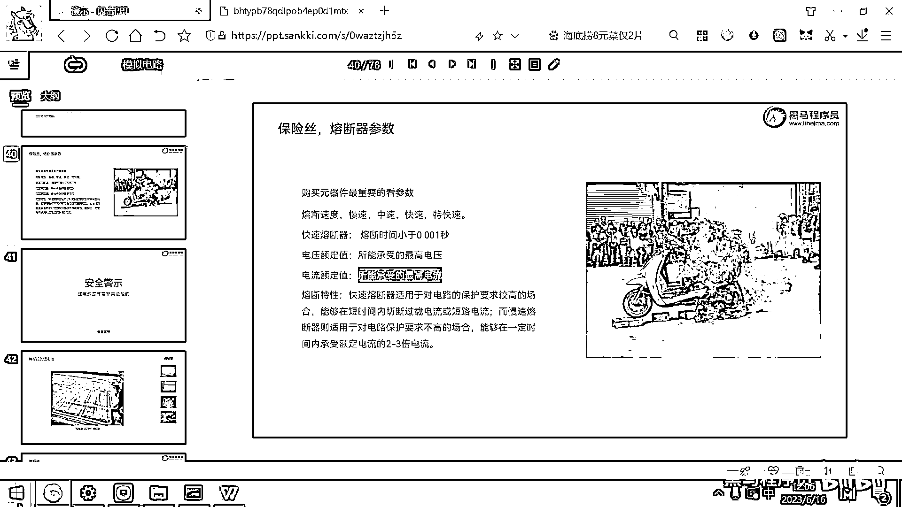
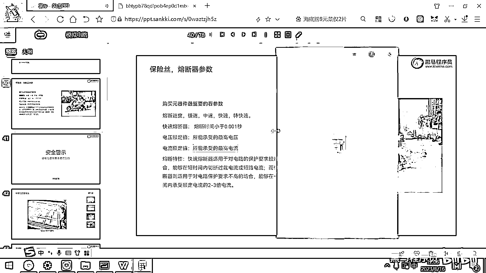
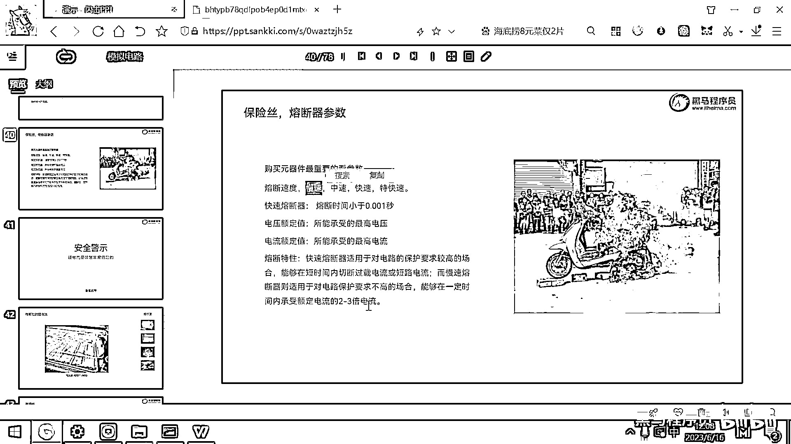

# 黑马程序员嵌入式开发入门模电（模拟电路）基础，从0到1搭建NE555模拟电路、制作电子琴，集成电路应用开发入门教程 - P16：17_保险丝和熔断器 - 黑马程序员 - BV1cM4y1s7Qk

下面我们给大家介绍一个非常重要的元器件，这个元器件叫保险丝或者是熔断器，保险丝和熔断器，它的作用是什么呢，是用来保护电路，防止电路出现过载或者是短路这样的电气故障，啥叫过载呢，过载很容易理解。

就是我的这根线，只能扛得住两安的电流，对吧，那结果呢，我现在这个用电器，一直要三安的电流，那是不是这个导线就越来越热，越来越热，然后最后就发烫，甚至可能起火，对吧，那这个就是保险丝的作用。

一旦电路的电流超过两安了，那我就把这个电路断开，电路就安全了，那熔断器呢，它跟保险丝是类似的，保险丝呢。

一般是长这个样子，大家看一下，这个是保险丝，它中间呢，有一根很细的金属线，这个金属线呢，有一定的额定电流，一旦这个电流超过这个值了，这个线就直接断掉了，那你要，你要怎么做这个电路，才能继续工作呀。

你是不是要把保险丝取下来，再换一个新的，才可以正常工作呀，对吧，像汽车呀，然后之前的，有一些用电器都是有这个保险丝的，那现在呢。

保险丝用的越来越少了。

然后现在用的都是这个熔断器，这个熔断器呢。

它跟保险丝类似，这个熔断器呢，跟保险丝类似，你看这下面呢，这是保险丝，然后这个东西就是一个熔断器，好，熔断器还有一些这种类型的。

这个类型的也是熔断器。

熔断器它是怎么工作的呢，熔断器当电流呀，超过一定值的时候，熔断器会断开，但是当时间长了，然后过一段时间，温度降下来了，这个熔断器呢，还可以自恢复，那怎么实现的呢，有两种，有两种技术比较常见，第一种呢。

就是某种金属温度达到一定的值，这个金属就会融化，一融化这个电路呢，就断开了，好，但是当温度降下来的时候，这个金属呢，又凝固起来了，这个电路呢，又恢复了，这是一种，然后还有一种用的最多，最常见的。

就是大家的烧水壶，这个烧水壶里面呢，其实也是有一个熔断器的，就是为啥水烧开了一百度，咕噜咕噜一会儿，然后就跳闸，这个跳闸呢，实际上就是一个熔断器，这个熔断器，它的原理是，用两个金属片压合在一起。

组成的熔断器，那这两个金属片，由于它的材料不一样，它的热胀冷缩的系数不一样，那当到这一个一百度的时候，有一个金属片呢，脏得厉害，另外一个金属片呢，脏得不太敏感，然后呢，它就弯过去了，这个电路呢就断开了。

这个就是烧水壶用的那种熔断器，它是两种不同的金属压制而成的，那熔断器和保险丝呢，它们都可以保护我们的电路，熔断器的特点呢，就是它还可以自恢复，对吧，另外熔断器呢，根据特性分为几种熔断器。

有这种叫快速熔断器，那它的熔断时间呢，就小于零点零零一秒，这叫快速熔断器，那还有一些慢速中速的，还有特快速的，特快速的，有一些防浪泳的熔断器，这个可以在几百纳秒级别，然后就完成这个熔断，好，这是熔断器。

好，那熔断器还有这个保险丝呢，一般我们还要看它的额定电压，好，那几伏的时候，它就会熔断，对吧，是五伏的还是六伏的，还是二百二十伏的，你要看它的额定电压，那前面呢，给大家说，我们要保护这个电脑的USB口。

对吧，这个USB口是五伏的，如果你在调这个电机的时候，一不小心，把一个十几伏的电压，灌到这个USB口里了，那你的主板呢，就可能会损坏，那保护主板，我们设计一个熔断器，那这个熔断器，它的电压呢。

就应该是在五点二伏左右，五点二伏左右，因为正常的USB是五伏，对吧，我们留一些冗余，百分之二十的冗余，百分之十的冗余，那我们设计一个五点二伏的，这个电压，超过五点二伏了，我就瞬间把这个电路断开。

那你的外部电源就不会损坏，我的电脑的主板了，好，那还有一个呢，就是额定电流值，这个代表的是能承受的最高电流，你可以根据你的实际需要，像一个电动车的话，如果你给他做一个熔断器。

那我们就去计算电动车的熔断器的电流是多少，好，那我这儿举一个例子，假设我的电动车的电池是四十八伏的。

然后电动车的功率呢，是三百五十瓦。

那是不是你就拿三百五十瓦去除以多少呀，除以电压，这个得到的就是电流，也就是说你的这个三百五十瓦的电机，那他满功率工作的电流是多少呀，7。29安，7。29安，那你在设计这个熔断器的时候。

可能就选一个十安的或者九安的，这样就可以了，因为稍微留一点冗余，那假设在独转的时候，或者是在负重上坡的时候，可能是要到九安或者到十安的，你要选一个稍微大一点的参数，要不然的话，你就按这个7。

29去选一个熔断器，他一上坡，或者带的人多了，对吧，然后然后电动车就断电了，那这个肯定不行，你要根据这个特点，好，另外的话呢，熔断器呢，也要去选一下这个熔断时间，你到底呢，是慢慢熔断还是特快熔断，对吧。

紧急情况下，肯定要用快速熔断的，像笔记本的这个TVS管，我们肯定要选一个快速，或者是特快速，因为你很高的电压，多灌一会儿，可能主板就烧了，那如果在零点，就是10的负6次方这样一个级别。

那就不会损坏我的电脑，好，那像电动车呀，这些属于不是特别紧急，然后慢速的，慢速的这个电路，只要不是长时间的短路，都不会有问题，那你可以选一个稍微高一点的耐受值，对吧，选一个10安的电流。

选一个慢性的熔断器，这个都是可以的，謝謝大家。

麻烦您稍后再见。