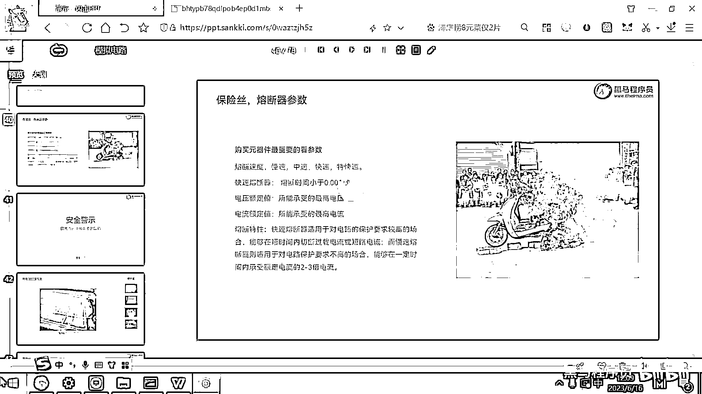
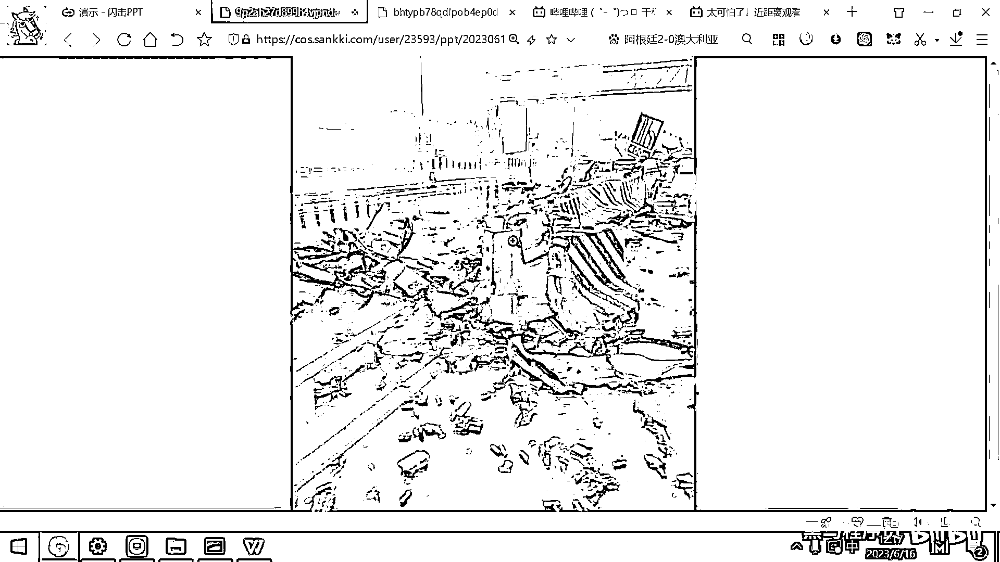
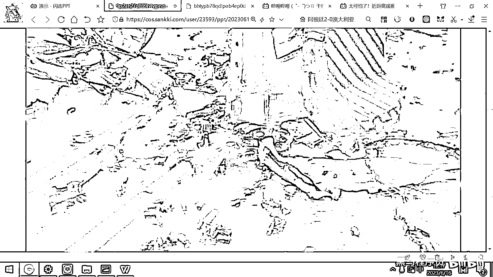

# 黑马程序员嵌入式开发入门模电（模拟电路）基础，从0到1搭建NE555模拟电路、制作电子琴，集成电路应用开发入门教程 - P17：18_安全警示 - 黑马程序员 - BV1cM4y1s7Qk

好 那接下来的话呢 我们要花几分钟时间给大家进行一些，这种安全的培训 因为我们搞这个学科呢实际上还是有一些安全隐患的，就比如说你在制作电路板的时候 你需要用到烙铁 对吧，有可能会烫着手 那这会产生烫伤。

所以我们备的有烫伤膏 那另外呢 你在操作这个电池的时候，因为大家去做四轮的小车呀 平衡车或者后面的机器狗机械臂这些东西，都是需要用到锂电池的 我们用的这个锂电池呢 是这样的一种锂电池。

这个锂电池呢 我用这个屏幕共享给大家看一下吧。

这个锂电池呢 长这个样子 长这个样子 它的名字呢 叫18650，它为什么叫18650呢 它的直径是18毫米，然后这个总长度呢 是65毫米 也就是6。5厘米。

所以这个电池呢 就叫做18650 它是这样的一个锂电池。

好 这个锂电池呢 应用的非常广泛，那大家骑的这个电动自行车 然后坐的这些绝大多数的电动汽车，都是用的18650 像比亚迪呢 是自己研制的有这个锂电池。

它是刀片装的 刀片电池 但像特斯拉呀 还有一些别的 用这个，用的都是18650 好，那这个18650呢 它实际上是一个较为危险的电池。

因为它里面的 它里面用的技术呢 是锂电，锂电池 锂是一个非常活跃的金属。

这个锂呢 是一个非常非常活跃的金属。

那就给大家说一个叫18650爆炸 对吧。

这个大家可以看到 有很多很多这样的视频。

这儿有一个视频 给大家看一下 还是还是蛮吓人的。

这个教室的网速 消耗殆尽。

大家看他在干什么事情。

他弄了一个 他弄了一个加热台，这是他做的一个加热台。

然后这个加热台呢 可以可以干的这个事情。

就是给这个铜线的这个线圈加热，实际上这个铜的这个圈就是一个电阻。

然后他把一个锂电池充上电。

然后放到这个线圈里面，好 大家看现在已经开始了。

省流是到两分钟左右吧。

好 那好 现在线圈开始加热，然后这个锂电池呢就越来越热 越来越热，对吧 好，那大家看到这个现象了没有，这跟一个二脚踢一样 对吧，然后瞬间喷出来了很多火，然后冒出来了很多烟，这个就是一节18650。

他采用的这个锂电池呢 是一个18650的动力锂电池，就是放电能力比较强，所以喷的这个火呢就比较多，我们上课给大家用的不属于动力锂电池，就按理说从这个道理上讲不会出现这种问题。

好 为什么这个18650会爆炸呢，最主要的原因就是电池过热了，那什么时候这个电池会过热呢，大家想一下电池为啥会突然间很热呀，短路了 对吧，这个电池短路了就会突然间的非常非常热，好 那所以所有的电动汽车。

他们最重要的有一个模块就叫做电池管理模块，在这个电池管理模块里面呢，最重要的管理呢就是热管理，就是他必须要监控整个电池组温度情况，热量情况来进行来来进行这个安全的防范。

一旦发现某个电池组温度已经到90度了，100度了，那这个时候肯定要立刻把它给掐断掉，这样才能保证这个锂电池的温度不会过高。

防止它出现这种爆炸的这个情况。

好 那电动汽车呢，他其实大家只要去这个B站上看。

对吧，你就你就搜这个搜这个特斯拉，对吧，你就搜这个自然。

你就能看到大量的这样的这样的视频。

并且这个很吓人的，你随便打开一个。

你你可以看到他从冒烟，然后到完全早起来。

可能也就是几秒钟的时间，你看哪一个是特斯拉呀，这个是对吧，他为他挂了一个蓝牌，是吧，他挂了一个蓝牌，然后你看这个旁边有一个奥迪车，对吧，也是一个电车，然后，然后。

从什么地方开始呀。

从从这个地方，没看到冒烟呀，那大家看这个后面有点灰色的烟已经出来了，对吧，这个地方已经冒烟了，你看从冒烟。

然后到到到这个爆炸起火。

就是就是一瞬间，对吧，为为啥为啥这么快呢，你想一下一节电池，如果他短路了，然后爆炸了，他就会瞬间产生很高的温度，然后把周围的几节电池弄的温度很高，对吧，那周围的几节电池呢又爆炸了。

又会把周围周围的几节电池呢，温度弄得很高，所以整个这个过程呢。

就跟就跟过去的这个原子弹一样，对吧，啊，他是一个变两个两个两个变四个四个变八个。

然后一瞬间就就全都爆了，你看这个还是非常多的，对吧，这已经开始冒烟了，冒完烟之后，就是立刻就喷火，如果你你的车停在他的车旁边。

你的这个车呢，也会被引燃，因为因为他的，啊。

出来的这个温度呢，大概在1300400度左右啊，然后周围的物体呢。

也很容易被引燃，好，这是只要是离电池电动车的一个通病。

那为了解决这个问题怎么做的呢。

啊，其实大家看一下特斯拉呢，还是做了很多的这个设计的，好，大家看这个图片实际上就是特斯拉的底盘啊，就你把这个车的上盖给给搞下来，然后整个这个底盘实际上是什么呢，是7000个18650啊。

就是7000个当刚才大家看到的这个电池，7000节，然后在每一节，每一节就长这个样子啊，它是被焊在这个钢板上的，你看这个特斯拉呢，他实际上做了很多的细节工作，这个离电池上面你看这有一个什么呀。

这有一个保险丝，对吧，这个是熔断型的保险丝，就如果这个离电池不太正常了，这个这个保险丝呢，会会瞬间断掉，好，但是什么东西都是有概率的，对吧，那生产的多了，每10万个里面肯定会有一个啊。

这样的一个保险没有起到作用，或者是别的地方短路了，或者进水了啊，什么都有可能啊，我这有一个很惨烈的图片。

这个给大家看一下这个图片呢，大家去瞧一下是上海的。

是上海的某一个某一个某一个就高架桥上来。

然后这个特斯拉呢，他开的时候不小心直接撞到这个隔离柱上了。

对吧，就撞完之后，整个车就散架了。

你来去看一看，这个散架完了之后，这些全都是什么东西啊，这些全都是18650，对吧，这些全都是离电池，好，这个特斯拉的拆机离电池还是很贵的啊，这一个特斯拉拆机离电池都是动力离电池，这一个可以卖10块钱。

也就是说你把这这些东西捡一捡就可以卖好几百。

对吧，这这是，所以市场上有很多人去卖这个特斯拉的拆机离电池，一般都是汽车报废了，然后他把离电池拆出来，然后再去卖一卖，因为汽车报废了，它里面的这个离电池有很多呢，还都是好的呢，他把它拆出来测试一下。

然后就重新上市去卖了，好，另外呢。

市面上的这种电动车一般三年之后，这个电池损耗就很高啊，之前你充满电可以跑500公里，对吧，过了三年充满电就只能跑300公里了，有些原因呢，就是电源管理模块，然后主动的让一些电池失效了。

就这个电池不再工作了，可能保险是熔断了，或者采用软件控制的方式，这个电池不工作了，那所以他的里程呢就越来越低，好，另外呢，离电池，他也是有这个寿命的，大概呢，是充电500次到1000次之间。

有这样一个寿命，那用的时间长了，然后他就充不进去电了，这个也是有可能的，好，那我们在上课的时候呢，也会用到这个18650的离电池，这个离电池怎么才能保证使用安全呢，第一点呢，就是你不能用打火机去烧他。

如果你用烙铁啊，或者用打火机去烧他，这个是很危险的，很危险的，好，第二个呢，就是这个离电池千万不要正负极短路，如果正负极短路的话，他也是会单位时间内释放出来大量的热，有一些同学呢。

用这个金属的镊子去变这个电池，然后正好呢，这个镊子又是金属的，把这个正极的头和他的负极的这个壳体搭在一起，那短时间内呢，你的这个镊子就会变得非常烫，手上几秒钟就会烫出来一个包，那当然如果时间更长的话。

这个离电池呢，就会很热，好，所以操作的时候，操作的时候一定要规范操作，不要用这种金属去去灭他，对吧，好，那还有一点为啥电动车容易爆炸，还有一个原因呢，就是离电池是有一个工作的安全电压范围的。

离电池最高充电，这一节R18650是最多最多只能充到4。2伏，如果你继续给他充电，他里面的这个离元素就会变得越来越活跃，你给他充到一个5伏可能还没事，还不会爆炸，你充到个67伏，这个电池呢。

肯定是要爆炸的，不过我们买的这个R18650呢，都是带这个安全阀的，就如果里面压力太大的话，他有一个安全阀会爆浆，会爆浆，好，那，所以离电池一定不能过充，如果过充的话，就很危险，那市面上呢。

有些人充他的离电池，用一些劣质的充电器，对吧，用一些劣质的充电器，那这个电压保护，电压保护不正常，那本来应该是充到4。2伏的，他给你充到6伏或者7伏，那这个爆炸呢。

就很危险了。

我之前在一个在这个B站上就看一个有个人的。

有个人的这种太阳能离电池爆炸，整个这个车都被都被炸的面目全非。

所以充电呢是很重要的，那我们上课呢，为了为了避免大家会出现这种问题，所以我们的离电池都是一节一节充，这样就这样就不会出现这个过充的问题。

謝謝大家 晚安。

我們下次節目再見。