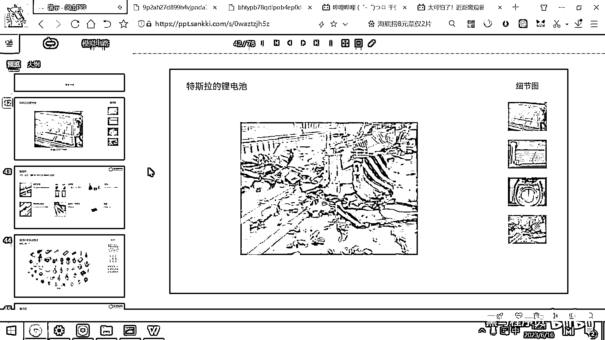
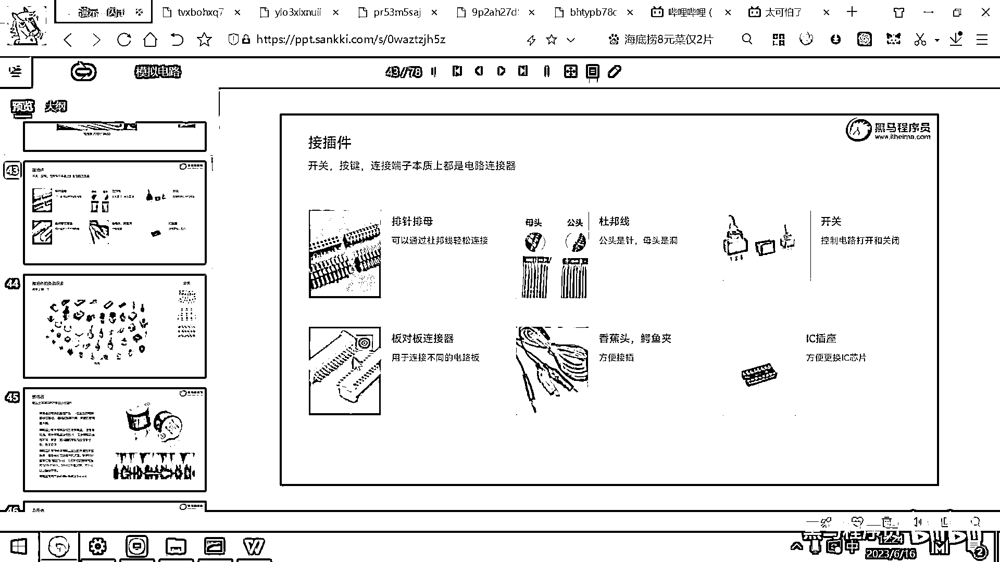

# 黑马程序员嵌入式开发入门模电（模拟电路）基础，从0到1搭建NE555模拟电路、制作电子琴，集成电路应用开发入门教程 - P18：19_接插件 - 黑马程序员 - BV1cM4y1s7Qk

剩下来的时间 我们再给大家介绍一些别的元器件了。

这些元器件也是我们在实际开发的过程中需要经常用到的，排真排母。

这个我打开大图给大家看一下，排真排母，这个排真排母有什么作用呢，在你的开发板上是会有很多的排真排母的，因为你们开发需要去撤一些电压 去撤一些信号，我们用逻辑分析仪这样的一些工具。

你去撤它的整个通讯的协议，你就需要把一些线给接到这个板子上，排真排母非常方便我们去用这种线连接你的板子。

这个叫排真排母，那用什么线去连接这个板子呢，这个线的名字就叫做杜邦线。

杜邦线它是这种彩色的线，很好看对吧，各种颜色的都有，然后杜邦线有两种头，一种叫公头，一种叫母头，我们做电纸设计的时候，大家只要明白一点，你就可以很容易区分公头和母头，所有的公头都是一根针。

都是凸出来的一根针，所有的母头大家看一下，它都是一个洞对吧，所有的母头都是一个洞，所以公头是针母头是洞，然后这个针是不是就可以插到这个洞里，对吧，好。

这是公头母头。

那我们刚才所看到的这个排真排母，是不是也是一样，你用杜邦线的公头，是不是就可以插到这个排母里面，这个电路就连接起来了，你用杜邦线的母头。

是不是可以插到这个排真里面。

那你的电路连接就建立起来了，好，这是排真排母，还有杜邦线，好，那电路呢，我们是需要有开关的。

对吧，这开关的作用呢，就是断开电路或者打开电路，好，这些呢，都是常见的开关，长这样子，长这样子，长这样子。

这些都是开关。

好，那还有一些板对板的连接器，板对板的连接器干嘛呢。

比如说我们的电机，有六根线，或者有八根线的电机，那这个线呢，就需要插到这个板子上，有这样的连接器，你的摄像头可能有20根线。

也需要插到这个板子上。

就需要用到这样的连接器，好，那鳄鱼头，香蕉头，还有这个鳄鱼夹。

这个大家已经见过了，像我们刚才的直流电源，就是这样的鳄鱼夹，对吧，那可以夹着某一个金属片，然后这样电路呢。

就导通了。

好，那最后呢，还有一个IC插座，这个IC插座呢。

它主要呢，就是为了方便你更换这个芯片的，你先装一个IC插座，然后你可以把芯片的拔起来，然后再装上去。

这个是IC的插座，好，这些连接器呢，种类非常多，我在这给大家列的，只是非常少的一部分。

那大家呢，有空的话，还是去来到这个力创商城，对吧，然后你去看什么东西呢，你看这有一个，这有一个选项叫什么呀，叫连接器开关，好，在这个连接器和开关里面呀，它给我们提供了一个非常好的功能，在右上角叫什么呀。

看图选行，好，那你就点开，好，那有的时候你都不知道这个端子叫什么名字。

那你就看画就可以了，对吧，好，那长这个样子，长这个样子。

长这个样子，各种各样的长相都有，但他们的作用都是什么呀，全都是用来通过线，让板子的电路呢。

得到这个连通，你看这个开关，这个开关呢，你也可以按图选行，你想要大的小的高的矮的长的短的，好，这什么开关都有，对吧，好，这种的开关，这种开关。

轻触的按的。

然后向上突起的，自锁的船行的，然后这种拨码的，什么样的开关都有，那你根据你的需求，然后去选择合适的开关就行了，好，这个就是机械键盘的，这个键轴，那我们后面课程，你学完之后呢。

就可以自己做一个任意的机械键盘，用这种开关就可以了。

字幕志愿者:三毛，請不吝點贊訂閱轉發打賞支持明鏡與點點欄目。

