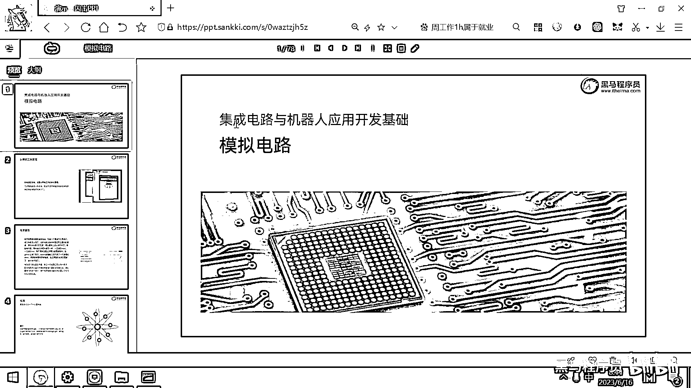
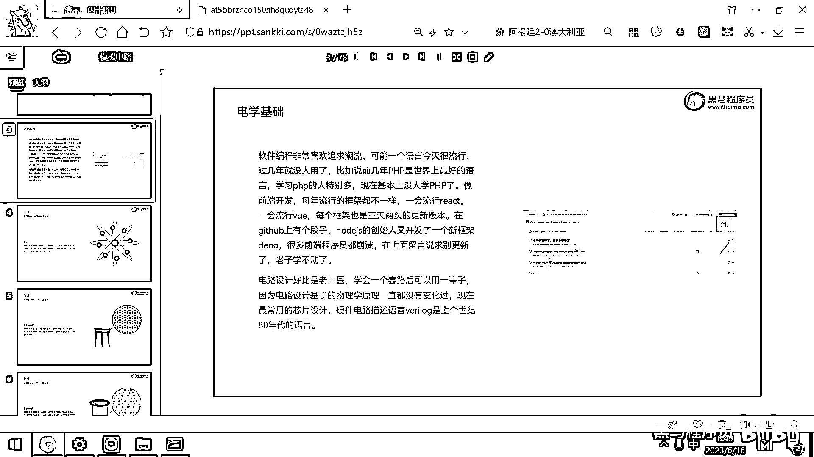
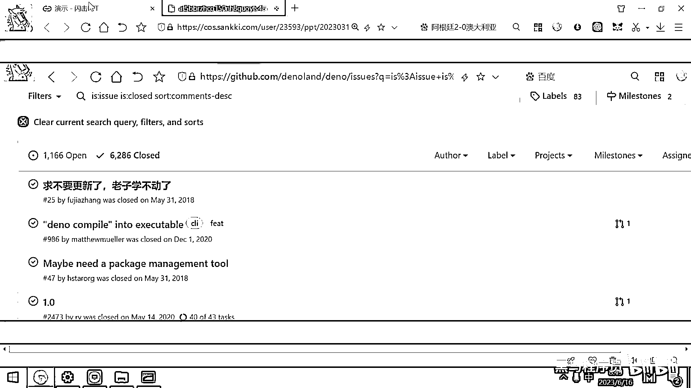
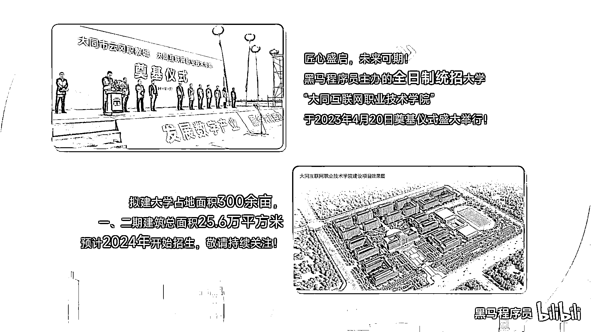
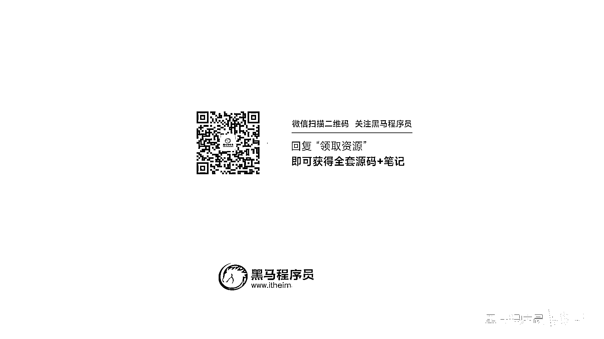

# 黑马程序员嵌入式开发入门模电（模拟电路）基础，从0到1搭建NE555模拟电路、制作电子琴，集成电路应用开发入门教程 - P1：01_背景介绍 - 黑马程序员 - BV1cM4y1s7Qk

领基础学IT 月薪过万 就来黑马程序员，好。

那废话不多说了，我们就直接进入正题了，接下来的这两天时间，我们会带大家去讲一讲模拟电路，这个模拟电路，如果大学是学电子或者通讯相关的，应该会花一个学期到两个学期的时间，去讲模拟电路，其实磨电。

如果抛开那些枯燥的理论，只讲这个应用，实际上还是蛮简单的，并且还挺有趣的，我们就快速的带大家把磨电给过一下。

好，为什么要讲模拟电路，最主要的原因就是，我们现在是搞硬件和软件结合，对吧，计算机它是一个硬件的载体，然后上面工作的有软件，硬件和软件是怎么结合的，怎么搭配的，它最底层的工作原理。

实际上就是用电再去控制电，用电去控制电，是计算机的核心原理，好，一旦你理解了，电路是怎么连的，怎么接的，以后你再去看，单片机或者切入式的代码，你会觉得很容易理解了，无非就是把这个开关打开。

就实现一个功能，把这个开关给关闭，就变成了另外的一个功能，所以用电去控制电，是计算机工作的核心原理，好，学硬件，与电学相关的内容，它实际上就好比是老中医，你学会了一个套路，或者你见过一个症状之后。

你脑子里面就形成了一种方案，或者是一种思想，你见的越多，你解的疑难杂症越多，你的经验就越丰富，所以搞与硬件打交道的，这种开发调试和编程，它是越老越吃香，你干的活多了，别人可能要打几个板，对吧。

要做几次验证，然后最终这个方案才能成行，你经验丰富的，可能就是一个方案，然后就直接打烊就成功了，这样的话，就可以节约很多的时间，好，另外大家想电路的原理，它一直都没有变，对吧，初中我们都学过欧姆定律。

或者一些电学定律，这些电路的原理，是没有发生任何的变化的，所以，这个支次点，它更新迭代的速度，就非常的慢，计算机大家感觉，蓬勃发展了好几十年，底层的原理没变化，变化的是什么，其实变化的是制作工艺。

之前你要去制作出来这样一个电路，可能体积很大，功耗很大，对吧，现在你制作出来相同功能的电路，可能你的工艺已经到28纳米了，对吧，或者更厉害7纳米，4纳米，你的工艺提升了，功耗降低了。

但它底层物理的电学原理，是没有任何变化的，最近这个阶段，我们知道，有很多这种芯片公司，很缺人，对吧，大家听说过有一个芯片公司叫OPPO，然后它整个芯片的4000个，就是原地解散，对吧，4000个员工。

两三天就被别的企业给瓜分完了，这个主要原因还是，做硬件设计，其实还是一个非常稀缺的，稀缺的资源，每个员工都很宝贵，这个硬件设计，芯片设计的语言叫verylog，verylog是上个世纪80年代的产物。

到今天还在用语言来去设计硬件，另外大家学的C语言，实际上还是C89 C99的标准，也就是说你们学的C语言，还是89年和99年的标准，因为在嵌入式上，它支持的C语言的编译器，标准就是89的或者99的。

一个89年99年的标准，我们用到了现在，对吧，好，别的，如果是纯软件的编程，它就非常追求潮流，可能今天流行这个，明天流行那个，对吧，如果大家之前做过家外，或者做过前端相关的，应该有深有这样的体会。

像前端可能这一段流行VOE，对吧，过一段时间又流行react，并且版本今天一更新，明天一更新，可能4个月就有一个大的版本，迭代出来，像这有一个段子，我给大家看一下，看一下这个照片了。

这个照片它实际上就是，前端一个流行的框架，叫nodejs，用nodejs又可以写桌面代码，又可以写后台，又可以写网页，nodejs目前用的很多，但nodejs的创始人觉得。

nodejs又不太好用。

他又搞了一个新框架，叫DNO，这个框架一推出来之后，在Github上就有很多的关注，然后这里面最有意思的一个，就是求不要更新了，老子学不动了，这个是，他评论大概有好几千个。

原因就是。

纯软件的这种语言，它更新迭代的速度，非常快。

本期视频就拍摄到这里了，下期再见，请不吝点赞 订阅 转发 打赏支持明镜与点点栏目。

明镜需要您的支持 欢迎收看订阅明镜。

我会回来的。