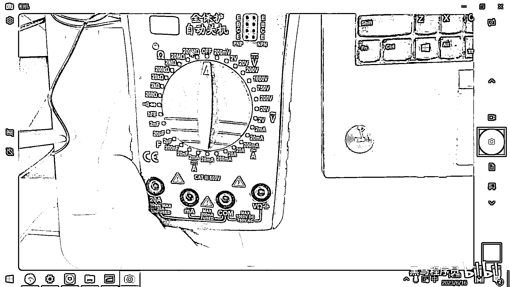
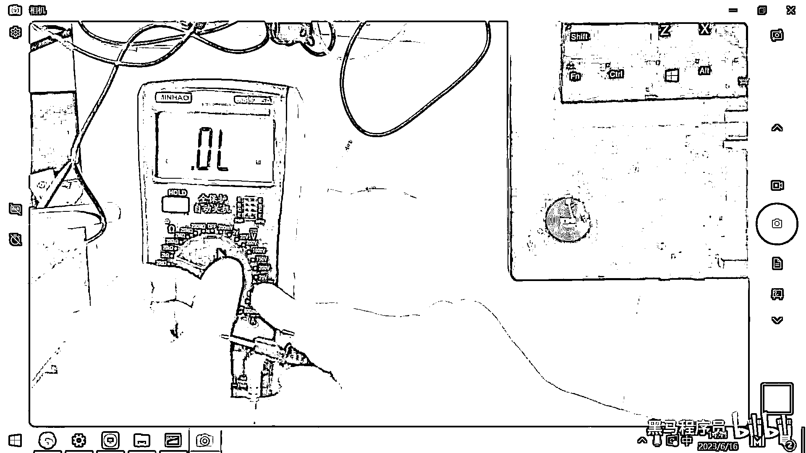
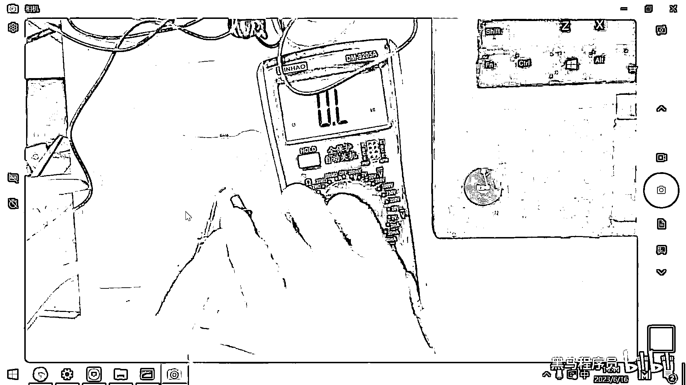
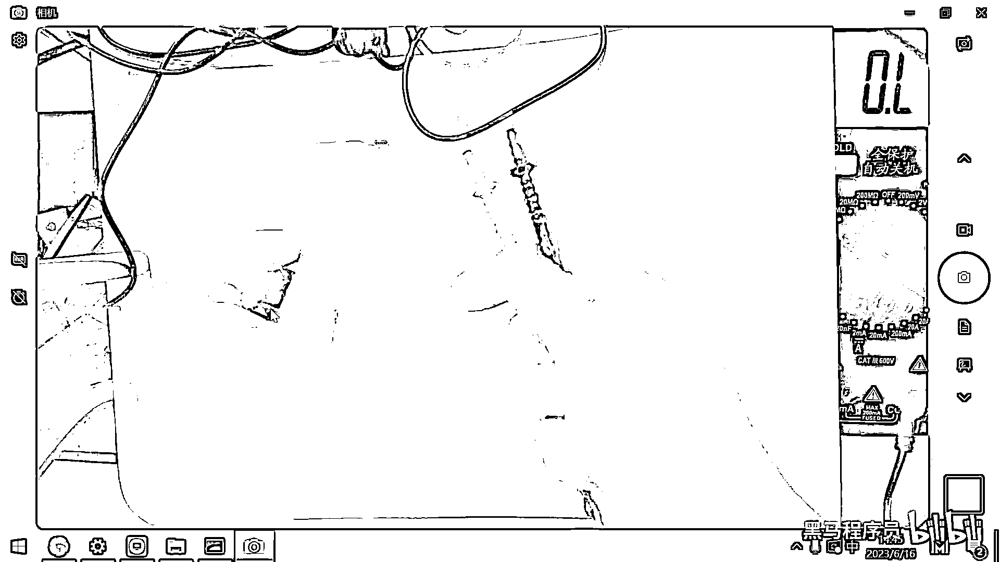

# 黑马程序员嵌入式开发入门模电（模拟电路）基础，从0到1搭建NE555模拟电路、制作电子琴，集成电路应用开发入门教程 - P20：21_电阻的测量 - 黑马程序员 - BV1cM4y1s7Qk~1

好 那今天下午呢 我们先带大家呢去熟悉一个以后我们经常用到的工具啊。

这个工具呢，就叫做万用表，万用表呢，我们必须要熟练掌握啊，因为这是以后我们排查这个软硬件故障啊，经常要用到的一个吃饭的家伙，那另外一个经常要用到的东西呢，就是逻辑分析仪啊，你去排查各种协议的话。

也要也要经常去使用啊，那由于我们所开发的绝大多数的电路呢，都是属于数字电路啊，那四波器呢，他更主要的是用在这个模拟电路上啊，四波器的话，一是他非常的贵，二是呢。

他在去分析这个数字信号的时候并没有逻辑分析仪方便啊，那所以我们以后经常用到的第一个呢，就是万用表，第二个呢，就是逻辑分析仪，万用表呢，是一种电子测量仪器啊，然后他可以测电压测电流测电阻啊。

你通过这万用表呢，可以去排查你的你的这个电路哪个地方有问题，好，那给大家去看一下这个万用表的照片，好，这是一个万用表的照片，好，那一会儿呢，会给每一个同学去发一个万用表啊，然后我们现在呢。

先看一下这个万用表。

应该如何去使用，万用表呢，第一个作用呢，就是用来去测量电阻，对吧，你用来测量电阻，这个测量步骤呢，第一步就是你先预估一下这个电阻的阻值啊，你你估计这是一个多大的电阻啊，然后呢，调到一个合适的档位啊。

接着用万用表的表笔的两端去短接一下啊，就可以读到读数了，好，那我拿一个万用表来给大家做一下示范。

(画面示范)。

好，那在这个地方呢，有一个有一个万用表，然后这个万用表呢，大家看一下这个上面是显示屏，对吧，然后这个下面呢。

是有一个这样的表盘，有这样一个表盘，在这个表盘的上方呢。

有一个有一个这样的旋钮，对吧，这个旋钮可以旋到一些不同的这个档位。

好，那我们先去看在这个万用表上呢。

有有这样的几个符号。

第一个这个符号，这画的有一个Omega一样的符号，对吧，那这个其实代表的就是电阻，电阻O，大家去看一下这个档位。

这个档位呢，最小的档位是200欧，对吧，然后2000欧，20千，200千，两噪，20噪，200噪，你再测一个电阻的时候呢。

你可以先预估一下这个电阻大体上是在哪一个范围。

那越小的电阻，你肯定是用越小的档位去测量，这个才更准确，对吧，好，这是这一块是电阻相关的。

好，那这个万用表呢，大家如果是第一次拿到的话。

需要给他装上电池。

好，那一小会儿我还要带一个螺丝刀上来，因为这个电池装上之后。

你看它背面是有一个螺丝的，对吧。

要去上这个螺丝，好，把这个电池装上之后呢，然后测电阻就把它调到这个电阻相关的档位。

好，在这个下面大家看一下，这有一些洞。

这有些洞，好，那如果呢，你你要去测电压或者是电阻的话，那你就要用到这个COM是相当于是公共或者是接地啊。

这个就相当于是接地的这一端，然后右边大家看V是什么呀，是电压，Omega是什么呀，是电阻，对吧，好，那一端呢，要插到这个COM端，一端要插到这个电压电阻端，那左边大家看这有一个毫安。

还有一个二十安。

这两个洞呢，是用来测电流用的，一会儿我们再演示怎么去用，好。

在这个万用表里面呢，有有两根线，一根是这个红色的线。

对吧，一根呢，是这个黑色的线，一般呢。

我们我们用这个红色的线表示正极或者黑色的线表示负极，好，这两根线大家看黑色的就接到这个COM的这个动力。

然后红色的你就放到V和Omega这个动力。

那现在这个万用表呢，就就装好了，就装好了，好，那我们来去测一测电阻。

那，好。

我这儿呢有一包电阻，这个电阻呢，大家看一下它的丝印。

这个丝印呢，是1/4瓦，然后10kΩ的一个电阻。

对吧，10kΩ的一个电阻，这个电阻呢。

它上面有这个色环，如果大家去网上看一些教程。

经常会有人教，怎么区分这个颜色呀。

然后每个颜色代表多少，然后最后把电阻给算出来，好，那这些教程呢。

在实际工作当中呢，是没有任何用处的，为什么呢，因为一是这个颜色很多批次呢。

都不是特别准确，二是呢。

就是你你这个公式还有这个对应的这个值呢。

你很难去记忆，最后最后你想确定这个电阻怎么方便，还不如拿这个万用表。

然后往上面放一下，这个来得快，对吧，所以在实际应用的时候。

基本上没有人会去基于这个颜色呢。

来去来去算这个电阻，好，那大家看这有这有两个电阻。

这两个电阻呢，我把这个表笔一端呢，压着左边一端呢，压着右边，好，大家看这个读数就出来了，是9。84，后面后面有这个单位。

大家看到了吧。

千欧9。84kΩ，好，这个万用表呢是属于比较智能的万用表。

他他会把这个单位还有相关的信息呢给列出来。

好，我们要注意一个小细节，这个电阻呢是10千欧的，对吧。

如果我把这个档位放到200欧，大家看一下会有什么样的问题。

好，这个档位呢，现在只到了200欧，也就是说他最大只能测200欧的电阻。

那把它放上去之后，你发现，哎，没有这个读数，对吧，然后这个没有读数呢，就代表是量不出来，如果你在测这个电阻的时候，你发现，哎，怎么量不出来呀，那这个时候呢，往往就是量层不够了，对吧。

你可以呢去扩大一下他量层，现在呢还是量不出来，那再扩大一下这个量层，好，扩大量层之后呢，大家看到现在就已经显示的是9。8千欧了。

对吧。

我这次扩大的量层一下扩大到多少了，扩大到200千欧了。

对吧，那大的量层是不是可以量小的呀，但小的量层量不了大的。

有同学说，那要不要搞到这个200兆呀。

200个百万，好，那这个放上去之后，大家看0。005。

0。003，你发现，哎，这个素质很不准确。

对吧，因为你选的这个量层太大了，这个误差呢已经超出了它的范围。

所以大家应该是根据合适的档位去测量这个电阻。

你事先呢就应该估计出来电阻的这个大小。

通常我们就放在20千欧左右，然后去测量。

就可以测量出来绝大多数电阻了，如果超出量层，你再扩大一点。

如果呢发现，哎，这个电阻值比较小，你再用小量层呢去测一下。

好，这是测量电阻的一个小技巧了，好。

那还有一点呢，非常非常重要，这个也是大家以后一定会遇到的一个坑。

就是有一些同学呀，笔记本电脑非常高级，是什么铝合金，什么拉丝工艺。

就反正你的你的这个笔记本啊，是一个那种可以导电的外壳。

是铝合金的外壳，好，大家看我在上午做实验的时候。

并没有在这个板子上垫一张纸。

那今天下午的话，我就专门在这个上面垫了一张纸，对吧，因为这个纸是不导电的。

但是下面的这个板子呀，它实际上是下面这个板子呢。

实际上是一个金属，它是导电的，那如果你把这个元器件放在这个金属上了。

你现在再去测，大家看这个数值，这个数值直接就测出来零了，对吧，为啥呀，因为下面这个金属呢，是导电的，它这个电阻很小，那你最终测量出来，发现这个电阻呢，在这来回的变，对吧，然后这个值呢，也不正确。

主要原因呢，是下面有这个金属的导体。

那在就业班一期的时候，有同学用这个ARM的开发板量三派。

那一个板子108块钱，然后呢，他去做实验。

垫一插，然后就把这个板子放到了他的笔记本上。

他这个笔记本又是我，我这个台座的这种材质，对吧。

那运气好的没事，运气不好的正好把VCC和GND短接到一起了。

那你的这个MCU呢就烧掉了，这一个MCU呢。

就要五六十块钱，那你烧掉了，只能吹下来再换一个新的。

所以做这个实验的时候呢，一定要注意。

不要把你的这些开发板呢，放到这个金属材质上。

一是会导致测量的结果不准确，二是会导致什么呀，二是会导致你可能会烧毁对应的元器件。

好。

那现在呢，我们再给大家做一个实验，做一个什么实验呢。

这两个电阻呢，我们知道它都是10千欧的，对吧，我们可以把这两个电阻干嘛呢。

我可以把它给串联起来，对吧，好，这两个电阻呢。

现在就串联起来了，好，串联起来这个电阻之后，我们再去测试一下这个电阻的阻值。

对吧，好。

那我们串联起来测试这个阻值，可以看到这个阻值呢，大概就是18。7千欧，对吧，这些电阻呢，都不是高精度的电阻，它生产出来同一批次的话，也会有一些误差，所以这个每一个大概是9。2 9。3，对吧，好。

这是这个电阻的串联，另外呢，我用手去捏着它，捏着它这个也有一些接触不良，好，18。6。

这是电阻的串联，那同样的话，我们还可以怎么测呢，还可以让这个电阻给并联起来。

对吧，那上午学的这个欧姆定律。

如果两个电阻并联的话，那大家看。

现在它整体的电阻就变成，原来的1/2了，对吧，为啥呀。

因为并联之后的电阻分之一就等于，并联之前的每一个电阻的，1/r1+1/r2，对吧，这个算出来就是4。8。

好，那这个实验呢，一会儿大家可以去做一下，去测一测这个电阻。

으면。