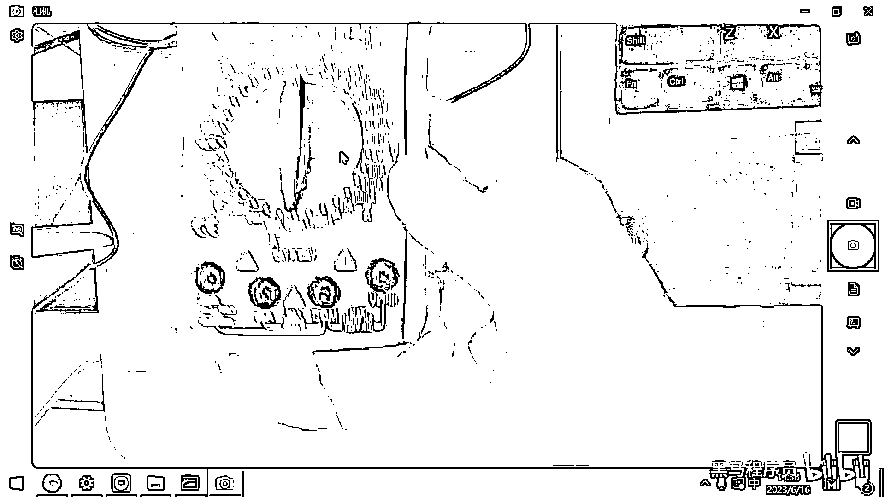
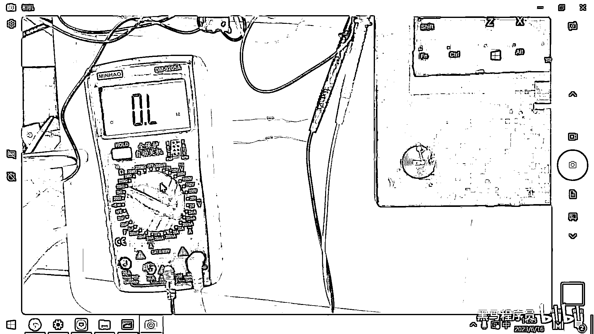
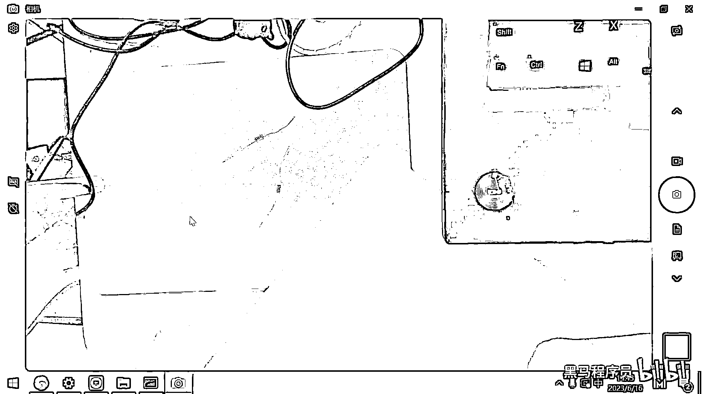

# 黑马程序员嵌入式开发入门模电（模拟电路）基础，从0到1搭建NE555模拟电路、制作电子琴，集成电路应用开发入门教程 - P20：21_电阻的测量 - 黑马程序员 - BV1cM4y1s7Qk~2

好 那今天下午呢 我们先带大家呢去熟悉一个以后我们经常用到的工具。

这个工具呢就叫做万用表，万用表呢我们必须要熟练掌握，因为这是以后我们排查这个软硬件故障经常要用到的一个吃饭的家伙，那另外一个经常要用到的东西呢就是逻辑分析仪，你去排查各种协议的话也要经常去使用。

那由于我们所开发的绝大多数的电路呢都是属于数字电路，那四波器呢 它更主要的是用在这个模拟电路上，四波器的话 一是它非常的贵，二是呢它在去分析这个数字信号的时候并没有逻辑分析仪方便。

那所以我们以后经常用到的第一个呢就是万用表，第二个呢就是逻辑分析仪，万用表呢是一种电子测量仪器，然后它可以测电压 测电流 测电阻，通过这个万用表呢可以去排查你的这个电路哪个地方有问题。

好 那给大家去看一下这个万用表的照片。

这是一个万用表的照片，好 那一会儿呢会给每一个同学去发一个万用表，然后我们现在呢先看一下这个万用表应该如何去使用。

万用表呢第一个作用呢就是用来去测量电阻 对吧，你用来测量电阻，这个测量步骤呢第一步就是你先预估一下这个电阻的阻值，你估计这是一个多大的电阻，然后呢调到一个合适的档位，接着用万用表的表笔的两端去短接一下。

就可以读到读数了，好 那我拿一个万用表来给大家做一下示范。

[音乐]。

好 那在这个地方呢有一个万用表，然后这个万用表呢大家看一下，这个上面是显示屏 对吧，然后这个下面呢是有一个这样的表盘。

有这样一个表盘，在这个表盘的上方呢有一个这样的旋钮 对吧。

这个旋钮可以旋到一些不同的这个档位。

好 那我们先去看在这个万用表上呢。

有这样的几个符号，第一个这个符号。

这画的有一个Omega一样的符号 对吧，那这个其实代表的就是电阻，电阻O，大家去看一下这个档位。

这个档位呢最小的档位是200欧 对吧，然后2000欧20千 200千，两灶20灶200灶，你在测一个电阻的时候呢，你可以先预估一下这个电阻大体上是在哪一个范围，那越小的电阻你肯定是用越小的档位去测量。

这个才更准确 对吧，好 这是这一块是电阻相关的。

好 那这个万用表呢大家如果是第一次拿到的话。

需要给它装上电池。

好 那一小会儿我还要带一个螺丝刀上来，因为这个电池装上之后你看。

它背面是有一个螺丝的 对吧。

要去上这个螺丝，好 把这个电池装上之后呢，然后测电阻就把它调到这个电阻相关的档位。

好 在这个下面大家看一下这有一些洞。

这有一些洞，好 那如果呢你要去测电压或者是电阻的话，那你就要用到这个COM是相当于是公共或者是接地，这个就相当于是接地的这一端，然后右边大家看V是什么呀，是电压，Ω是什么呀。

是电阻 对吧。

好 那一端呢要插到这个COM端，一端要插到这个电压电阻端，那左边大家看这有一个mA还有一个20A。

这两个洞呢是用来测电流用的，一会儿我们再演示怎么去用。

好 在这个万用表里面呢有两根线，一根是这个红色的线 对吧。

一根呢是这个黑色的线，一般呢我们用这个红色的线表示正极。

或者黑色的线表示负极，好 这两根线大家看。

黑色的就接到这个COM的这个洞里。

然后红色的你就放到V和Ω这个洞里。

那现在这个万用表呢就装好了，好 那我们来去测一测电阻。

好 那，好 我这儿呢有一包电阻。

这个电阻呢大家看一下它的丝印。

这个丝印呢是1/4瓦，然后10kΩ的一个电阻 对吧。

10kΩ的一个电阻。

这个电阻呢它上面有这个色环，如果大家去网上看一些教程。

经常会有人教，怎么区分这个颜色呀。

然后每个颜色代表多少，然后最后把电阻给算出来，好 那这些教程呢在实际工作当中呢。

是没有任何用处的 为什么呢，因为一是这个颜色。

很多批次呢都不是特别准确，二是呢就是你这个公式还有这个对应的。

这个值呢你很难去记忆。

最后你想确定这个电阻怎么方便，还不如拿这个万用表。

然后往上面放一下，这个来的快 对吧，所以在实际应用的时候。

基本上没有人会去基于这个颜色呢。

来去算这个电阻，好 那大家看这儿有两个电阻。

这两个电阻呢，我把这个表笔，一端呢压着左边，一端呢压着右边，好 大家看这个读数就出来了，是9。84，后面有这个单位大家看到了吧。

千欧 9。84KO，好 这个万用表呢是属于比较智能的万用表。

它会把这个单位还有相关的信息呢给列出来。

好 我们要注意一个小细节，这个电阻呢是10千欧的 对吧。

如果我把这个档位放到200欧，大家看一下会有什么样的问题。

好 这个档位呢现在只到了200欧，也就是说它最大只能测200欧的电阻。

好 那把它放上去之后，你发现 诶 没有这个读数 对吧，然后这个没有读数呢就代表是量不出来，如果你在测这个电阻的时候，你发现诶 怎么量不出来呀，那这个时候呢往往就是量层不够了 对吧。

你可以呢去扩大一下它量层，现在呢还是量不出来，那再扩大一下这个量层，好 扩大量层之后呢，大家看到现在就已经显示的是9。

8千欧了 对吧。

我这次扩大的量层一下扩大到多少了，扩大到200千欧了 对吧。

那大的量层是不是可以量小的呀，但小的量层量不了大的。

有同学说那要不要搞到这个200兆呀。

200个百万，好 那这个放上去之后，大家看0。005 0。003。

你发现诶 这个素质很不准确 对吧。

因为你选的这个量层太大了，这个误差呢已经超出了它的范围。

所以大家应该是根据合适的档位。

去测量这个电阻，你事先呢就应该估计出来电阻的这个大小。

通常我们就放在20千欧左右，然后去测量。

就可以测量出来绝大多数电阻了，如果超出量层，你再扩大一点。

如果呢发现，诶 这个电阻值比较小，你再用小量层去测一下。

好 这是测量电阻的一个小技巧了。

好 那还有一点呢非常非常重要，这个也是大家以后一定会遇到的一个坑。

就是有一些同学呀，笔记本电脑非常高级，是什么铝合金 什么拉丝工艺。

就反正你的这个笔记本呀，是一个那种可以导电的外壳。

是铝合金的外壳，好 大家看我在上午做实验的时候。

并没有在这个板子上垫一张纸。

那今天下午的话我就专门在这个上面，垫了一张纸 对吧，因为这个纸是不导电的。

但是下面的这个板子呀，它实际上是。

下面这个板子呢实际上是一个金属，它是导电的，那如果你把这个元器件。

放在这个金属上了，你现在再去测，大家看这个竖直，这个竖直直接就测出来零了 对吧，为啥呀 因为，下面这个金属呢是，导电的 它这个电阻很小，那你最终测量出来，发现这个电阻呢在这来回的变 对吧。

然后这个值呢也不正确，主要原因呢是下面有这个金属的导体。

那在就业班一期的时候，有同学用这个ARM的开发板量三派。

那一个板子108块钱，然后呢他去做实验。

垫一插，然后就把这个板子放到了他的笔记本上。

他这个笔记本又是我，我这个台座的这种材质 对吧。

那运气好的 没事，运气不好的正好把，VCC和GND短接到一起了。

那你的这个MCU呢就烧掉了，这一个MCU呢。

就要五六十块钱，那你烧掉了只能吹下来再换一个新的。

所以做这个实验的时候呢，一定要注意。

不要把你的这些开发板呢，放到这个金属材质上。

一是会导致测量的结果不准确，二是会导致什么呀，二是会导致你可能会烧毁对应的元器件。

好 那现在呢我们再给大家做一个实验。

做一个什么实验呢。

这两个电阻呢，我们知道它都是10千欧的 对吧，我们可以把这两个电阻干嘛呢。

我可以把它给串联起来 对吧，好 这两个电阻呢现在就串联起来了。

好 串联起来这个电阻之后，我们再去测试一下这个电阻的阻值 对吧。

好 那我们串联起来测试这个阻值，可以看到这个阻值呢，大概就是18。7千欧 对吧，这些电阻呢都不是高精度的电阻，它生产出来同一批次的话，也会有一些误差，所以这个每一个大概是9。2 9。3 对吧。

好 这是这个电阻的串联，另外呢我用手去捏着它，捏着它这个也有一些接触不了，好 18。6 这是电阻的串联。

那同样的话我们还可以怎么测呢，还可以让这个电阻给并联起来 对吧。

那上午学的这个欧姆定律。

如果两个电阻并联的话，那大家看现在它整体的电阻就变成。

原来的1/2了 对吧，为啥呀 因为并联之后的电阻分之一。

就等于并联之前的每一个电阻的，1/r1+1/r2 对吧，这个算出来就是4。8。

好 那这个实验呢一会儿大家可以去做一下，去测一测这个电阻。

好了。