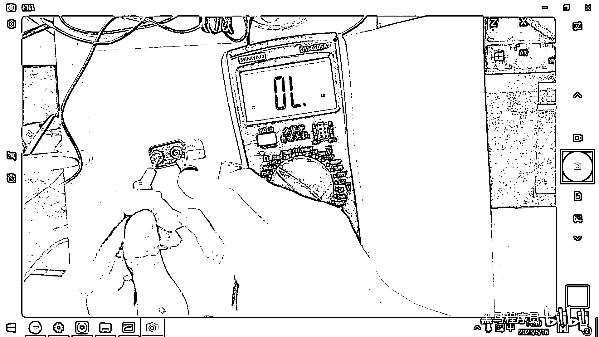
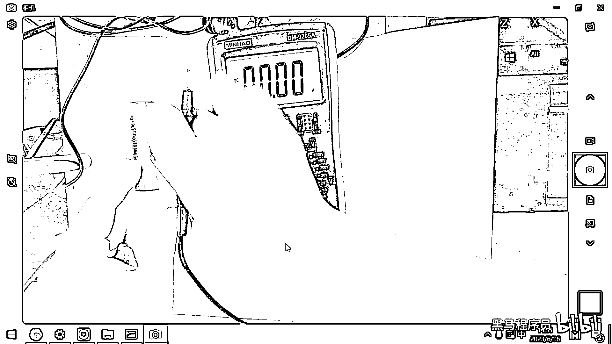

# 黑马程序员嵌入式开发入门模电（模拟电路）基础，从0到1搭建NE555模拟电路、制作电子琴，集成电路应用开发入门教程 - P21：22_万用表测电压 - 黑马程序员 - BV1cM4y1s7Qk

好 那我们再简单回顾一下这个电阻的测量方法。

这些万用表呢 它都大同小异。

好 大家看这个万用表是不是，欧姆的档位也在这个左边呀 对吧，你先调到一个合适的档位，然后呢 去进行这个测量。

测量的步骤呢 就是预估一下阻值，然后调到一个合适的档位，把这个表笔呢 放到两端，根据这个读数呢 就是它所对应的电阻。

好 那测完这个电阻之后呢 我们，再来去测一下这个电压，好 方式呢 跟刚才是完完全全一模一样的，方式和刚才是一样的，好 我找两个电池来。

好 在我这儿呢 有两个电池。

一个电池呢 大家看一下是。

一个9伏的碳性电池 对吧。

好 那我把这个表笔呢 给放到这个电池的两端，好 那测出来是什么呢。

0千欧 为啥呀，因为当前我是把它给放到了一个。

测量电阻的档位 对吧，好 在这个万用表里面呢 有这样的。

两种符号，一种符号呢 大家看这个V上面画了一条横线，这个横线呢 代表的就是直流电。

还有一个呢 是这个V上面画了一个波浪线，这个波浪线代表什么呀。

代表的是交流电，那我们现在测的电池 它是一个直流电源。

那所以呢 我们应该是把这个档位呢 给，给放到这个直流电源的档位 对吧。

好 那放到这个档位之后 我现在呢，往上面一插 大家看一下这个电压是多少呀，这个电压呢 它是9。9伏，这是一个刚拆封的新电池，它的电压接近10伏 9。9伏。

那用一段时间呢 它降到这个7点几伏。

就没有电了，好 像我们用的。

像我们用的这种1。5伏的，1。5伏的这种电池，新的电池呢 电压一般在1。62到1。65之间，当这个电压降到1。

3伏左右的时候。

好 这是电池，好 那在进行这个测量的时候呀。

有的时候有同学呀，把这个正负极接反了，你看这个万用表呢 是很智能的 对吧，你一测 测出来这个电压是负的9。91伏。

那就说明 你的正负极呢 接反了。

那右边这个是正极，左边这个呢 是负极 对吧。

那重新测量，交换一下位置 就是9。91，好 所以呢 用这个万用表测电压的同时呢，你还可以区分当前这个电池的正负极。

可以用这种方式呢 区分正负极。

好 那接下来呢 我这儿有一个。

18650的锂电池，这个锂电池呢 我们来量一下它的电压，好 大家看这个是4。26伏，说明这个锂电池呢 已经充满电了，4。26伏，那它的标准电压呢 是3。

7伏。

一般呢 这个锂电池低于3。3伏左右的话，就没有电了。

好 这是18650的电池，也是短接它的正负极。

来去测试，如果这个正负极搞反了 你看，它对应的就是负的4。27伏了 对吧，那说明 我们表比跟电池的正负极呢。

正好是相反的，(字幕製作/時間軸:秋月AutumnMoon)。

(開啟鈴鐺)。