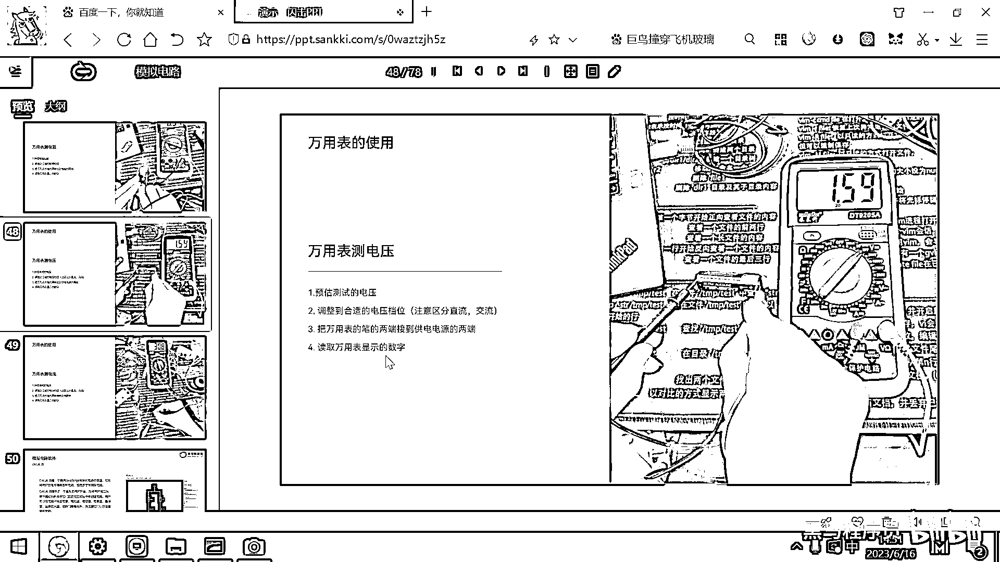
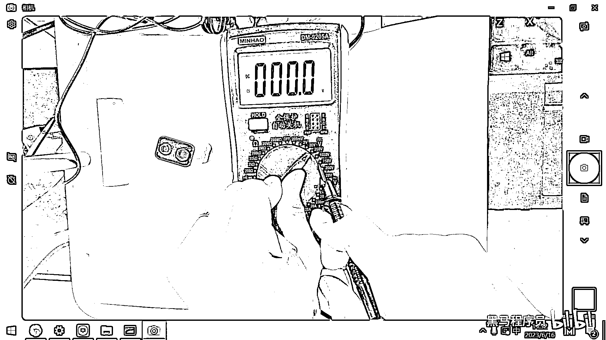

# 黑马程序员嵌入式开发入门模电（模拟电路）基础，从0到1搭建NE555模拟电路、制作电子琴，集成电路应用开发入门教程 - P22：23_电压表量程 - 黑马程序员 - BV1cM4y1s7Qk

好，那测电压的方式也是一样的，我们预估一下一个电压的范围，对吧，然后调到一个合适的档位，用万用表的表笔去测电源的两端。

看显示的数字。

好，跟刚才一样，跟刚才一样，如果你把这个档位。

给放到一个不合适的档位，你比如说我把这个档位，放到了两伏。

对吧，如果是放到两伏的档位，你现在去测试电池。

你看到它就不显示内容了，对吧，因为它的电压超过了，它所测量的范围，所以就没有测出来电压，你可以把它放到，我们放到200伏试一下，这个就是0。

098。

对吧，这个小数点在倒数第二位。

还是9。8伏。

你把它给放到1000的档位，你看这个还是，这个就是9伏了。

对吧，它的小数点就不见了，小数点就不见了，所以范围越小。

精度会越高一点，越高一点，我们这一次用的万用表，是较为智能的万用表，它直接把读数。

还有单位，都已经在上面给显示出来了，在一期的时候。

我们用的万用表，就没有那么智能，然后它显示的。

这个数字就是1。59，然后你就要自己去推断，然后它的单位，还有小数点。

好，好，最后我们再给大家演示一下，用万用表去测电流，测电流的话，实际上就是，要调整一下万用表的，两个线的位置。

好，大家看一下，万用表之前，我们接的这两个线，是不是，靠木端黑的在这，然后红色的在右边，对吧，如果你要测电流的话，那就需要，把红色的，给接到左边了，这个ma说明测的电流比较小，是毫安级的，如果是20a。

就测的电流比较大，是20安的最大良程，但要注意的是，这些万用表，虽然都标的是，测最大的良程是20安。

但一般电流超过10安的话，就已经比较危险了，它发热，短期内发热就会比较大。

所以它虽然标的这么高，但大家尽量也不要用，这种的设备。

去测这种大电流，这个是不安全的，好，还有一点。

刚才可能有同学也看到了，我们万用表测电压。

你看，它还可以测啥，还可以测交流电，对吧，然后位置，竟然到了750伏，其实你拿着我们的万用表，去捅前面擦线板的插柱，也是可以测出来，擦线板的电压的，这个电压应该是在230伏左右，但非常强烈建议大家。

不要去插它，为啥，因为毕竟是220伏的，强电，对吧，如果是设备出现了什么问题，对吧，这个就触电了，就不太好了，所以我们还是尽量的去玩，这种低压弱电，交流强电，就不要去操作它了。

移動鏡頭。

