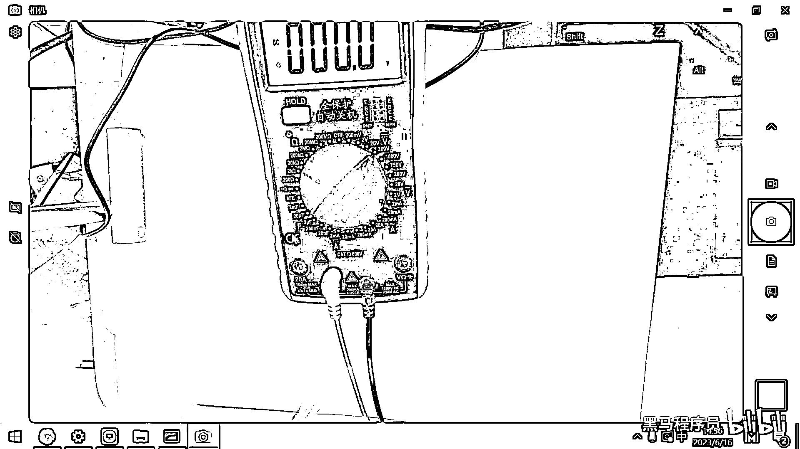
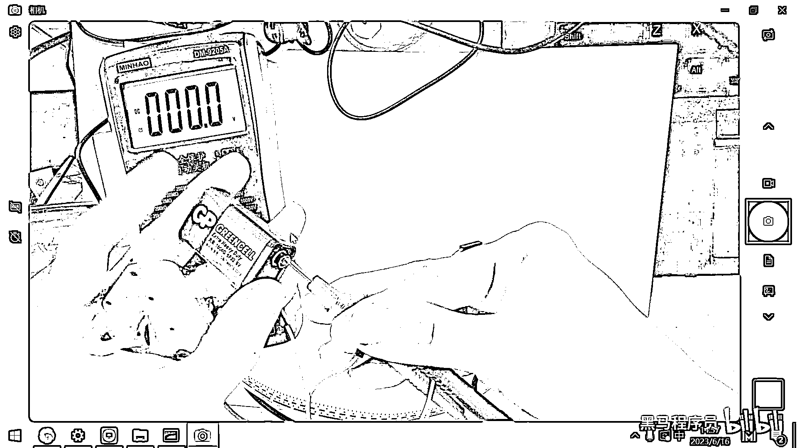
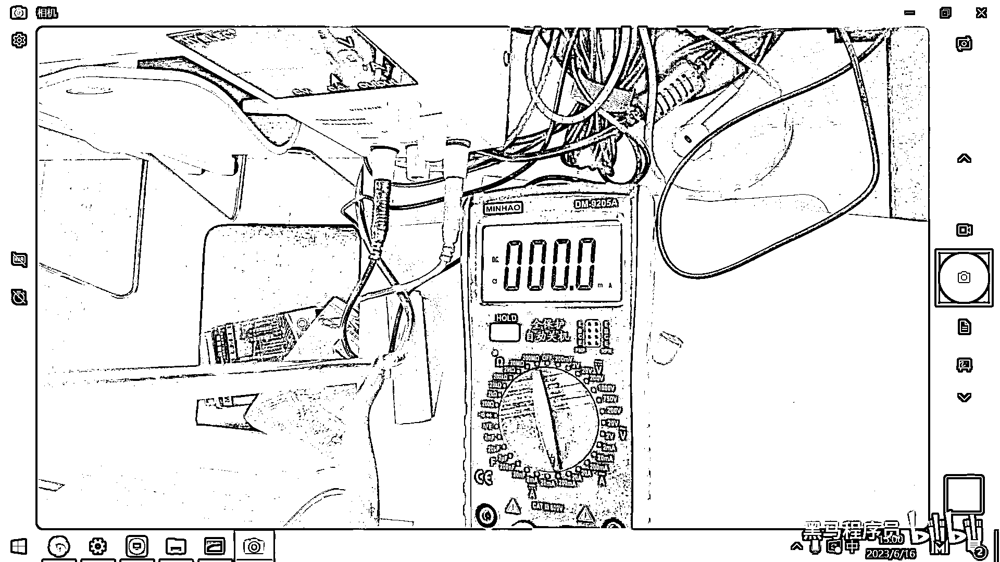

# 黑马程序员嵌入式开发入门模电（模拟电路）基础，从0到1搭建NE555模拟电路、制作电子琴，集成电路应用开发入门教程 - P23：24_万用表测电流 - 黑马程序员 - BV1cM4y1s7Qk

好，那下面我们再给大家演示一下，用万用表去测电流，其实用万用表去测电流的话，在实际应用的场景上，并不是特别多。

但大家也了解一下。

应该怎么去操作，好，那我在这做一下演示了。

好，第一步是既然要测电流了，对吧，那要把红色的端子，给接到豪安的位置。

如何去测电流呢。

好。

如何去测电流呢，好，那大家看一下，我这有一个电机。

对吧，这个电机我接到9伏的电池上之后。

这个电机就开始钻起来了，对吧，那这个电机究竟过了多大的电流。

那怎么去做测试呢，我们就把万用表的一端。

抗母端接到这个地方，然后其实就是让电流流经电流表。

其实就是让电流流经电流表。

我这个操作起来不是特别方便。

好，大家看之前我们的接法是什么，之前我的接法就是。

直接正极负极，往电机上一连。

电机就转动了，对吧，那现在我想知道它的电流是多大，我不能让正极和负极直接连电池了。

我让它先经过我的电流表的一端。

对吧，先经过我电流表的一端。

然后再通过电流表。

然后去让它去导通。

对吧，应该是这样的一个测量方法，好，那线比较多，然后我一捏就接触不了。

为了方便大家观察，我用一个直流电源来给大家做对比观察了，好，那这个直流电源，这个桌子没有那么大。

好，大家看一下。

这有一个直流电源。

好，那现在应该是正好了，对吧，好，大家可以看到直流电源的电压是2。8伏，电流现在由于没有外接设备。

这个电流是零，对吧，好，那，三五的时候我们知道，这个直流电源。

一端可以接什么，接LED的正极。

对吧，好，一端接LED的负极，好。

那大家看一下，这个灯就已经点亮了，2。8伏电流是多少，0。146安。

147安左右，对吧，好，那行，那现在我们的灯已经点亮了。

好，那假设你没有直流电源，你怎么能够知道它的电流是151毫安呢。

你怎么能够知道电流是多大呢。

好，这个时候我们的电流表就可以去派上用场了。

对吧，就可以派上用场了，好，那，毫安，好，然后我一端接着它的这个负极，然后让另外一端去接上这个电流表的正极，好。

然后我们把万用表调到哪一个档位呢。

大家看一下，大概是调到200毫安的档位，对吧，好，调到这个档位之后，大家看。

其实我的这个电灯，我这个电灯的线是怎么接的，我们仔细再观察一下这个线是怎么接的。

从直流电源的正极出来，先经过了什么，先经过了万用表的红线，对吧，然后又从万用表的黑线出来，接到灯的正极。

然后灯的负极接到直流电源的负极。

好，那大家现在看一下，我的电流表是83。4毫安。

对吧，MA，然后你看最上面的直流电源，是不是也是0。082 0。083，对吧，好，那采用这种方式，就把电流给撤出来了。

把电流给撤出来了。

好，用万用表撤电流不是特别常用，为什么，因为我们开发板一旦你设计完了之后。

这个开发板你不可能把一根线给剪断，然后再把电流表接到这根剪断的线的两端。

好，一般我们在实际应用的时候，如果有撤电流的需求。

会采用一个电流的采样芯片，然后直接你在代码里面，就可以把电流给读出来。

好，那用万用表撤电流的这种操作。

并不是特别多，大家了解一下就可以了。