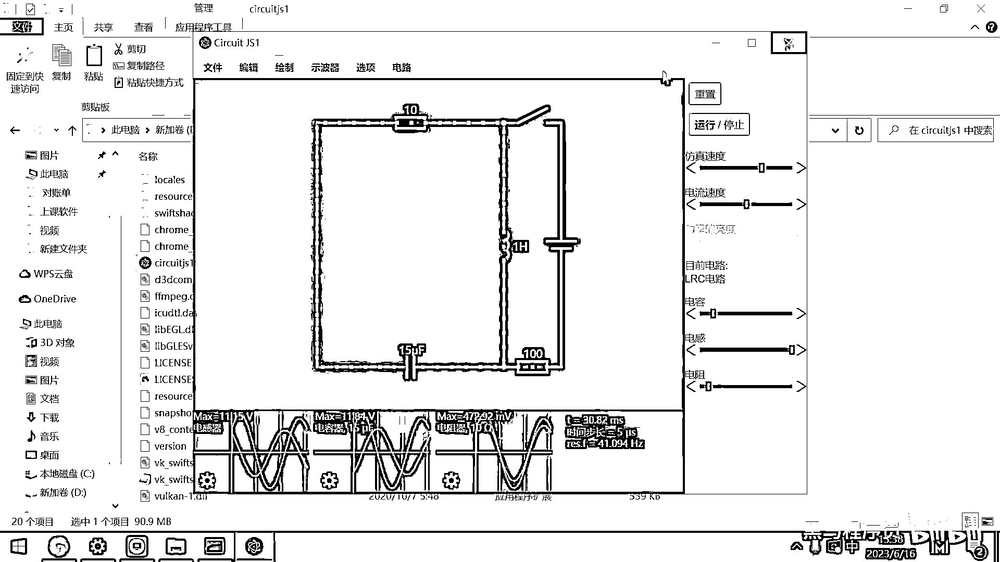
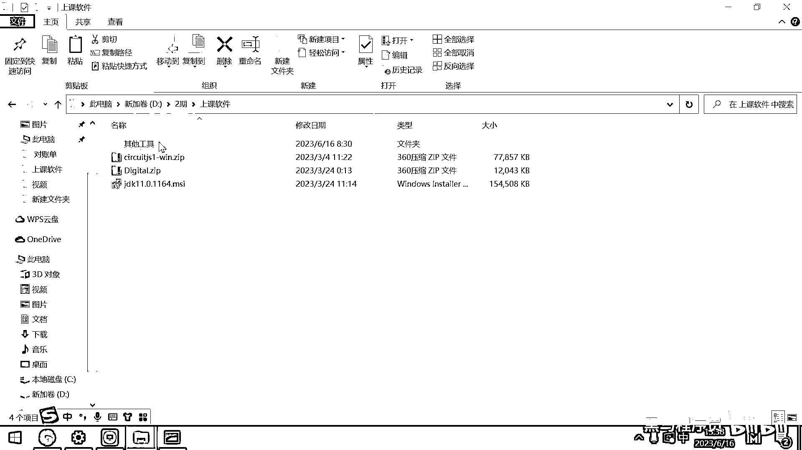
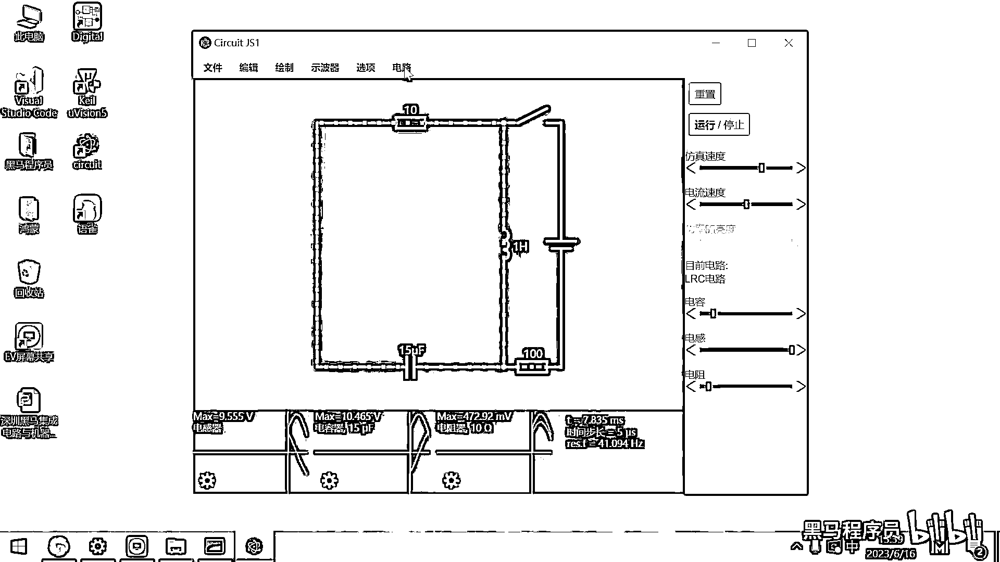

# 黑马程序员嵌入式开发入门模电（模拟电路）基础，从0到1搭建NE555模拟电路、制作电子琴，集成电路应用开发入门教程 - P24：25_circuit软件入门 - 黑马程序员 - BV1cM4y1s7Qk

好 那接下来呢 我们来给大家介绍一下一个模拟电路的软件，叫Circuit。js，这个软件呢 它最早是由Java开发的 只能在Applet里面去运行。

那后来呢 有大牛程序员用Javascript把它整体的翻译了一遍，在网站上去运行这个项目，那为了大家使用方便呢，我给大家整理了一个用Chrome内核打包过的软件，这个软件呢 你直接解压就可以运行。

这个软件在今天的资料里面。

等一下共享完资料 你们就可以去玩一玩了，在上课软件里面有一个Circuit。js的。zip文件，使用方法呢 很简单，解压一下 然后就可以去使用了。

好 这是绿色软件。

好 那这个Circuit。js可以有什么用呢，它功能非常强大，你常用的电源 电阻 电容 电感，连晶体管 门电路这些呢 它都可以去模拟，然后并且可以进行仿真运算，你说我前面欧姆定律啊。

欧姆定律对吧 还有一些别的电学相关的不太熟悉，那没关系 你把这个电路画出来仿真一下，你就知道它的数据大小了，好 那这个软件呢，它可以非常方便的帮助我们去理解电路的行为。

我们带大家呢 来去玩一玩这个软件。

好 那第一步的话 使用方式是，找到这个软件 对吧，然后右键去解压它，这样解压一下，大家看到这里面呢 有很多。class文件，它其实是由加密语言来写的，然后打开之后呢。

来去瞧 这有一个叫circuitgs1。exe的文件，你就双击打开它就可以了。

这就是这个软件的安装和打开方式。

这个软件是绿色的，如果你以后不需要它了，你就直接把它给删掉就可以了，直接删掉 这个软件就卸载成功了。

在我电脑上已经装过了 我双击打开它。

好 我们要想去创建新的电路，大家默认打开的话。

这个语言集有可能是英文的，这个里面有一个选项。

应该是可以去修改这个语言，修改这个语言，这个语言呢 是选中国大陆就可以了。

要不然你们默认打开有可能是，有可能是这个英语的。

看着就不太方便。

在选项 就是option，然后里面有一个其他选项，在其他选项里面，选这个中国大陆就可以了，一看到这个中国大陆的字就行了。

这是关于它的语言集的修改。

好 创建一个新的电路，只需要点击文件的左上角，这有一个叫创建新的空白电路就可以了。

点这个按钮，创建一个新的空白电路，我们先创建一个什么呢。

先来一个最简单的，大家来玩一玩，在前面的欧姆定律的题目里面。

我们给大家出了有一些题目，对吧，说一个电路里面有三个电阻，分别是3欧姆 4欧姆 5欧姆，然后电压是12伏特，让你去计算电路中的电流，对吧，让你去计算这个电路中的电流，好，如果呢，你说欧姆定律呢。

我忘记了，我不会算。

那你来到这个软件里面仿真一下就可以了，好，先找到这个汇字里面。

大家看在这个汇字里面呢，有很多有用的工具，比如说添加导线，对应的还有一个快捷键，小写字母W，添加电阻，有一个快捷键是R，好，那这里头呢，还可以添加电容，对吧，开关什么单刀双刺，各种各样的开关，好。

还可以添加什么呢，你看这个输入和电源里面有添加直流电压源。

对吧，那我们把这个直流电压源呢，给添加出来，好，那初中物理我们学过化一个电池，对吧，化这个电池就是这样一个符号，哪边是正哪边是负呀，长正短负，对吧，所有的这些电学符号呢。

基本上都是按照长正短负这样的方式呢，来去设计的，好，那你选中这个电源之后，你看你其实可以在这个界面上随便画，对吧，随便画，那画完之后怎么把它给删除掉呢，要想删除掉某一个元器件，需要用到键盘上的一个按键。

叫shift，你按着shift之后，你再拖动鼠标左键啊，它就是一个框框了，啊，shift。

shift是哪一个键是吧，就是这个这个键啊。

就是键盘上的这个符号的这个键。

对吧，好，叫shift，那你按照这个shift呢，就可以去框出来这个框框，然后把对应的别的内容呢给删掉了，你同样按着shift之后呢，按control+z呢可以去撤销，好，那画出来这个电池之后。

我们接下来要在这个电路里面画什么呀。

画三个电阻，对吧，3欧姆，4欧姆。

5欧姆，那这个电池的电压是12伏特，怎么去设计呢，好。

对着这个元器件点右键，有一个选项叫编辑，好，这个编辑来看，默认电压是5伏，对吧，你把它给调成12伏确定，好，这就变成一个12伏的电池了，大家看右下角，这个右下角是电压源，12伏，对吧，好。

那怎么去绘制电阻呢，你看这有一个添加电阻器，一个电阻，两个电阻，三个电阻，好，这些电阻呢就画完了，这些电阻默认都是1K的，你可以改它的阻值，比如说有一个3欧的，对吧，那这就是3欧姆，那你再来一个4欧的。

这个就是4欧姆，你说我再来一个5欧的，这个搞一个5欧姆就可以了，好，那电阻还有电池都有了，我们怎么把它给连在一起呢，这个时候你需要去绘制导线了，好，那绘制里面，W就是绘制导线，好，这个导线绘制的话。

实际上就是把这些小点给连接在一起，就可以了，好，你看，我连接，连接，连接，然后连接，好，这个弄歪了，重新连一下连接，然后连接，好，这个电路呢就画完了，好，那画完之后呢，大家看，感觉只有右边导通了。

这个左边没有导通，对吧，这个是为啥呢，这是大家以后经常会碰到的一个小错误，就你在连接这个导线的时候呀，一定要从一个点，连到另外的一个点，它是从一个点连到另外的一个点，你千万不要这样连。

你说我从这个点一下连到这儿，好，连到这儿之后，你看到，这个地方就有两个小红点，对吧，这个红点它写了是有两个坏的连接，好，这个电路呢，实际上就没有连接在一起，好，这个软件，你要连接导线的话。

一定要把导线的一端接到一个点上，然后另外一端接到另外的一个点上，好，这个接完之后，大家看，已经开始仿真了，对吧，好，那这个黄色的移动的东西。

就是我们的电流。

好，那关于这个电流，这里面有一个选项，这个选项大家看是什么。

叫传统电流方向，所谓的传统电流方向，就是电流是从正极流向负极的，好，在这个右边，你可以调节它的仿真，还有电流的速度，你把电流弄慢一点，大家看这个黄色的电流，就慢慢的，然后从正极流向负极了，对吧。

你通过调这个速度，可以去观察电流的流向，这是一个非常好用的仿真工具，好，这个仿真工具，它不仅可以仿真电流的流动，它还可以去方便的观察出来，每一个位置的电压，什么意思，你看我在这右键点一下，编辑，好。

这有一个选项，叫显示电压，对吧，好，这个位置电压是多少，12伏，对吧，我来到最左边，我在这编辑，然后显示电压，大家猜，已经显示出来了，不用猜了，这个电压是零伏，好，为啥。

因为电池就是一个提供电势能的工具，对吧，在正极电压是最高的，然后经过一个电阻，是不是电压降低一部分，再经过一个电阻，电压又降低一部分，再经过一个电阻，电压又降低一部分，降到最后是多少。

电池的负极就是GND，就是接地，电池负极都是零伏，电池的正极是12伏，好，同样的话，你说导线上的电流有多大，你可以在这显示电流，你看电流是多大，是1安，为啥，12伏除以三个电阻串联，三个电阻串联。

3+4+5=12，对吧，12除12电流就是1安，你看在整个我的电路里面，是不是每一个位置的电流，全都是一模一样的，对吧，你看这个电流，这是1安，对吧，这是1安，这是1安，在任何一个位置。

这个电流都是一样的，好，1安，1安，好，采用这种仿真的方法，你就可以去解决，初中电学的很多的问题，假设以后大家小孩已经上初中了，对吧，遇到物理很头疼，拿这个东西仿真模拟一下。

什么东西都学会了。

好，这是这样的一个软件，我們下期再見。