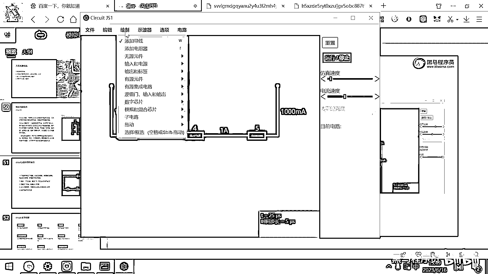

# 黑马程序员嵌入式开发入门模电（模拟电路）基础，从0到1搭建NE555模拟电路、制作电子琴，集成电路应用开发入门教程 - P25：26_欧姆定律和电阻串并联 - 黑马程序员 - BV1cM4y1s7Qk

好 那这个电路会搭建了。

那剩下来我们欧姆定律里面的其他电路搭建起来都非常简单了，对吧，你说什么怎么串联呀，怎么并联呀，有几个电阻呀，你就按这个题目描述去把这个电路一搭建。

就知道它的电压或者电流是多少了。

其实这个软件它实现的原理是什么呢，非常简单，因为在做这个软件的时候，软件的设计者是不是已经很熟悉电学的这些定理了，对吧，那他就基于这个电学的定理，然后这每个元器件输入是多少，输出是多少。

那他代入公式里面算一下，最后呢，来一个图形化的仿真就可以了，其实这个所有的仿真软件呢，都是基于物理公式物理原理来去实现的，那大家用的玩的一些游戏，这个游戏里面有这个物理引擎，对吧，那你扔一个球。

球就掉地上了，然后再弹起几下，这个原因呢，就是物理引擎仿真了所有的牛顿定律，那你扔出去的东西出速度，然后如果有力就有加速度。

那采用软件的方式就可以模拟现实生活中的物体。

好，那接下来的话呢，我们来通过这个软件来带大家呢。

去熟悉摩电里面的各种各样重要的概念和电路。

好，在实际化电路的时候呀，我们有两种画法，一种呢，就是真的画成了这样的一个环路，你在这画一个电池，电池有正极有负极，然后形成一个环路，电流呢，从正极流向负极，但这种画法呢，在我们去做设计的时候呢。

显得有些麻烦，因为你要把所有的电路都画成环路，做起来呢，就比较占用空间，另外一个很常见的做法是什么呢，就是不用这样的不用这样的电路。

不用环路呢。

来去描述我的电路，而是采用VCC和GND来去描述电路。

好啥是VCC呢，好，大家看绘制里面，绘制里面我这有一个电源，对吧，刚才大家添加的是什么呀，二端口的直流电源。

现在我们要添加一个单端口的直流电源。

那这个单端口直流电源画出来之后，大家看一下，它就直接是一根导线，对吧，这个导线所在的位置，它的电压就是5V，就是5V，好，那我们在画这个原理图的时候，经常把这种正极的电压给它起名叫VCC。

就代表电压的正极，好，这个5V就连上来了，好，我可以把这个5V呢，改下电压，比如说改成12V，好，那电池的负极。

一般我们怎么去描述呢。

电池的负极就是D，我们只需要给它来一个叫GND就可以了，我们看这有一个叫什么呀，添加接地。

因为大D的电势是0，所以一旦一个东西接地，那它的电势就是0，好，这个画完之后呢，我们这样往下去拖动一下，选中它，然后往下挪一挪，这有点靠上了，选中它，然后按着Shift往下挪一挪。

把这个导线呢给连在一起，好，那现在这样的话，我这个电路呢，就已经重新改造完毕了，改造完毕，大家看一下是不是像水管水流，从这个高电势的地方，然后慢慢流，最终都被水吸收了，都被这个GND吸收了。

实际上这边就是电池的负极，这边呢就是电池的正极，那采用这样的方式呢，我们不需要画出来一个环路，电流呢也是可以正常的工作的，实际的原理图，绝大多数场景呢。

都是采用这样的一种画法。

好。

那关于这个电学相关的基础概念呢，我们大概要讲这样的九个东西，那这九个东西呢，都是利用这个Circuit。js，就可以非常方便的去模拟和讲解，好。

我们先看第一个内容是欧姆定律。

欧姆定律，欧姆定律它演示的就是电压和电阻的关系，对吧，好，在这个电路里面，大家看基础知识，这有一个什么呀，欧姆定律，你把它给点开，好，点开的话，大家看上面是电池的正极五福，对吧，这下面有两个GND。

说明实际上是有两条环路的，好，左边的这个电阻是100欧，它是不是阻值比较小，所以这个电流流的飞快，对吧，右边的这个电阻是1000欧，所以你看这个电子，电流流动的速度就慢一点，好。

那我们可以去很方便的去修改这些电阻的阻值，你比如说我把这个电阻改成1欧，你再看，这个仿真的速度，电流就已经起飞了，对吧，电流就起飞了，那如果你把这个地方给改成一个0欧，这其实就相当于是短路了。

你看这个电流的大小，电流的大小叫5G安，这个G是1024×1024再乘1024，对吧，那在仿真的环境下，这个是显示出来了，在真实的环境下，不可能有导线能够通过这么大的电流，这条电路一瞬间就烧毁了，好。

那这是采用仿真的方式来去观察电流的大小，好，那利用欧姆定律就是5除以10，得到0。5安，对吧，5除以1000得到的是0。

005安。

就是5毫安，好，那第一个欧姆定律，我们给大家演示完了，然后来去看第二个就是计算电阻的串并联了。

计算电阻的串并联。

好，那关于这个电阻的串并联，它的计算方法，大家脑子里面有一个宏观的概念，就是电阻如果串在一起就越串越大，对吧，如果这个电阻并在一起，是不是越并越小，对吧，好，为什么会有这样的现象。

我们观察这个实验也可以理解，好，你看从电池的正极有电流下来了，对吧，因为电池的正极，它的电压比较高，电压比较高，水流跟电流是一样的。

它肯定是从高电压的地方流到低电压的地方。

对吧，你看这是5伏，然后下面的电压是多少。

是接近电池的负极，导线连通了电池的负极，下面电压肯定是0伏，你想水流肯定是从上面流到下面，好，这个水流现在有一条通路，这条通路是一个100欧的电阻，对吧，好，流下来了，这还有一个800欧的电阻。

虽然它电阻很大，但是也有电流流下来，对吧，只是流的所谓慢一点，大家想如果我把这个开关给关上，是不是又多了一条路，多了一条路，那就有更多的电流被流下来了，所以并联电阻，你并一个电阻就多一条路。

并一个电阻就多一条路，它最终它的电流就会变得更大，你看这个地方的电流就是18。3毫安，我把它给打开，少了一条路，就变成17。3毫安了，对吧，再打开又少了一条路，变成了16。7毫安，好，这个就是并联电阻。

可以增加你电流的通路，所以这三个电阻并在一起，总体的电阻会更小，好，下面我们再来看这样一个实验，我把它打开，好，这两个电阻是怎么来的，串联来的，对吧，串联来的两个电阻，它阻挡了电子的流动。

它也阻挡了电子流动，它俩一起阻挡，是不是就变成更大的一个电阻了，整个电流就只有8。3毫安了，好，所以串联电阻的话，电阻的阻值会增大，好，现在大家看我把右边的导线给闭合，导线一闭合的话。

你瞧电流就从这不经过电阻了，直接走导线了，对吧，为什么，因为电子也是很聪明的，对吧，这个地方阻力比较大，它就不走这了，它就直接走这个地方了，实际上这一块相当于是一个0欧的电阻。

导线就相当于是一个0欧的电阻，好，通过这种实验，然后大家了解一下电阻的串并联。

再次感谢您的关心。