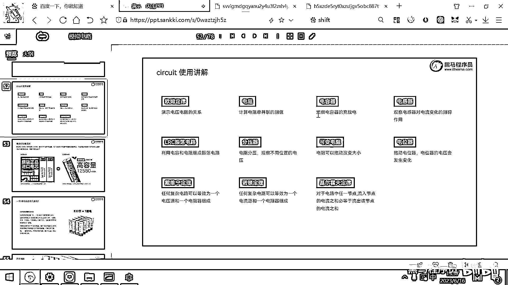
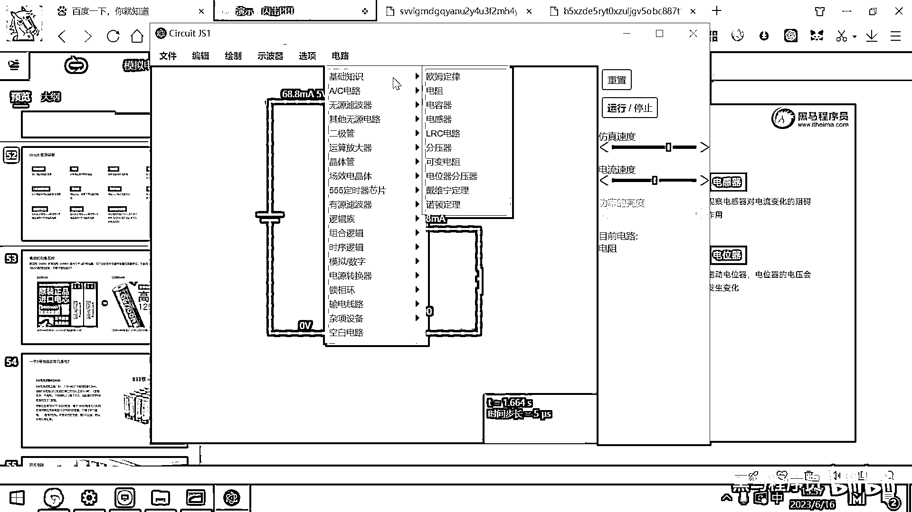
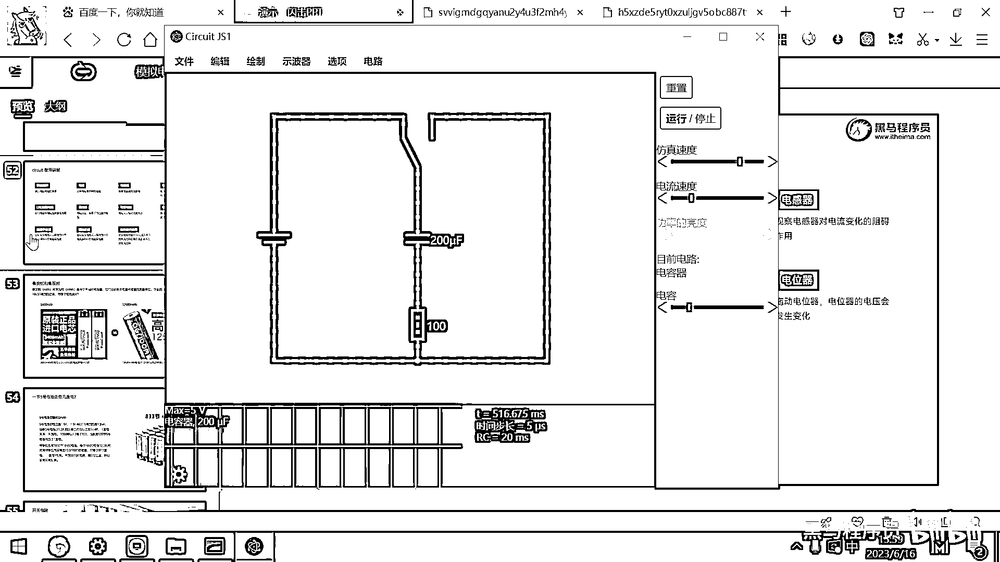
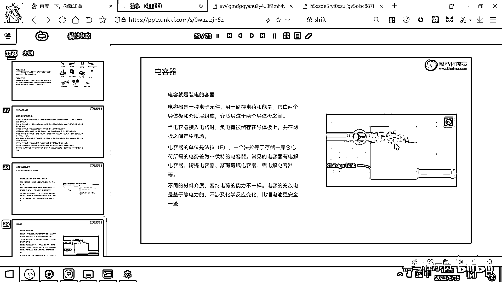
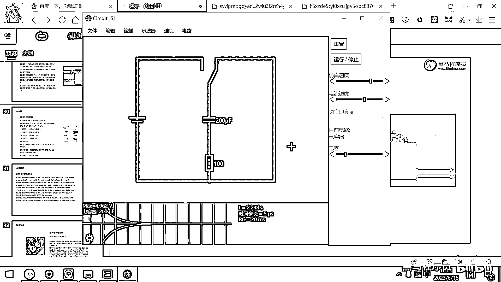
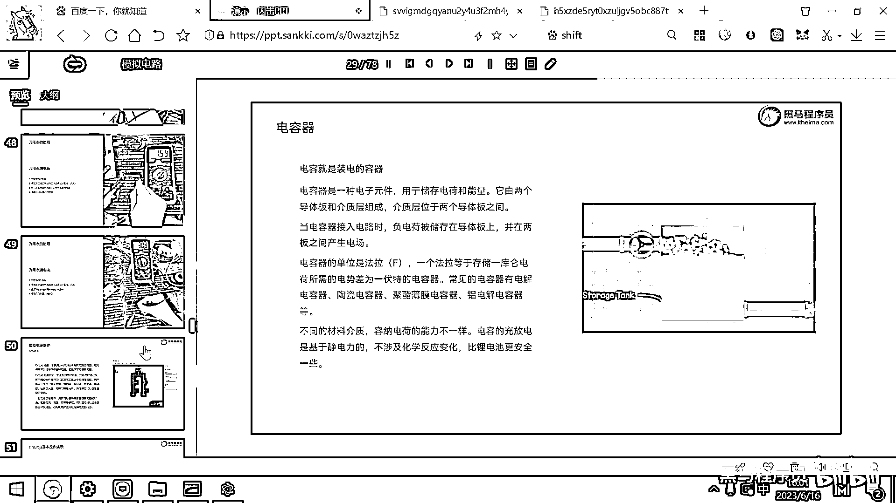
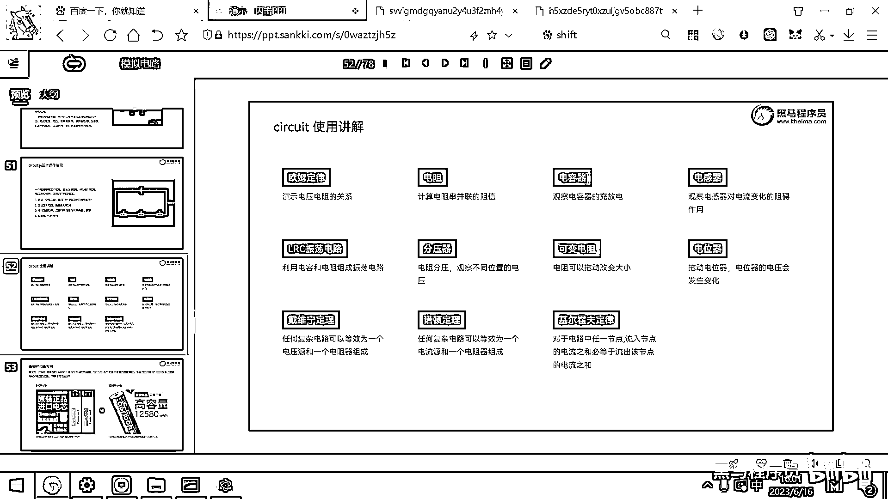

# 黑马程序员嵌入式开发入门模电（模拟电路）基础，从0到1搭建NE555模拟电路、制作电子琴，集成电路应用开发入门教程 - P26：27_电容器仿真 - 黑马程序员 - BV1cM4y1s7Qk

好 那我们再来去看一下一个重要的元器件 叫电容器了，通过仿真软件来观察一下电容器的充放电。

好 打开这个电路，然后大家看这有一个电容器 对吧。

好 那需要大家观察的是什么呢，一个是这个电容器上面的电压，我把这个电容器呢给打开，然后把这个电压呢给它显示出来，我选中上面的导线，或者直接在这个地方呢 在四波器里面查看就可以了。

这个下方呢 大家看这有一个电容器 对吧，这有一个电容器 然后这个电压呢是5V，我重新仿真一下 把这个速度呢给弄慢一点，大家仔细观察观察，好 重置停止，现在呢 大家看电容器的电压是多少呀。

是0V 对吧 是0V，我先把这个开关呢给断开，好 我们去仿真，我把这个开关呢从右边打到左边，那大家想一旦打到左边，是不是这个电池就会给这个电容充电呀 对吧，那电池呢就给电容充电。

好 那把仿真速度呢给搞快一点，你看这个电容的电压呢从700多，从0升高到700多毫伏 对吧，1。1V 1。2V，然后慢慢的升高，升高到什么时候为止呢，升高到跟左边这个电池的电压是一样的时候为止 对吧。

把这个仿真速度呢弄快一点，你看 这个电压越来越高 越来越高 越来越高 越来越高，最后电容呢就被充满电了，它的电压呢就是5V，那现在呢就已经充满了，一旦这个电路充满了，你看 由于这边是5V 这边是5V。

还有没有电视差呀，没有了 对吧，那这个电路里面的电流呢，其实就已经停止了，电子不再移动了，好 那关于这个电容呢。

大家一定要去类比这个图去仔细想一下，好 有一个电池，这边是电池的正极，这边是电池的负极，现在再往这个桶里面灌水 对吧，那一旦这个桶里灌满之后。

这个桶还能灌水吗。

就灌不了了，因为它这边电压跟这边的电压呢是一样了，这个电流呢 水流就停止了，好 那停止之后，现在我把这个开关切换到右边，大家观察现象，把这个开关切到右边，切到这个右边的话，你看一下。

这个电容器的电压是不是这个曲线慢慢的就下来了，对吧，刚才是5伏嘛，然后现在慢慢的下来了，好 那下来了，这个电压就降到多少呀，降到了0伏，好 为啥它的电压下来了，因为这个电容现在就相当于是一个电池。

那这个电池上有一个什么呀，有一个电阻，然后这个电阻呢是产生热的一个元器件，那电流呢经过这个电阻，然后它就把所有的电适差呢给转换成热量，给消耗出来了，好 那电容器的充电，然后放电这样一个过程。

大家再观察一下，你看 先充电，把电压呢充到5伏 对吧，然后我们把开关切过来，放电，好 这个电阻，大家看是不是变红了，越来越烫 越来越烫，然后过一小会儿这个红色又不见了，那说明这个电阻不再烫了。

那当前这个电路呢就已经没有电势能了。

好 电容它就是一个临时存储电量的一个容器，它可以帮助我们积攒一些能量。

积攒一些能量，好 电容器。

