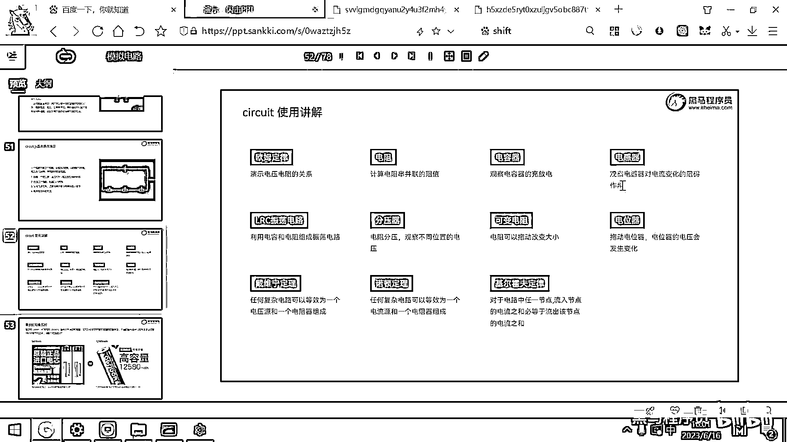
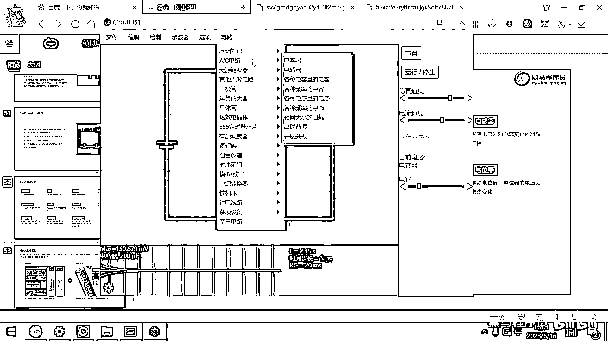
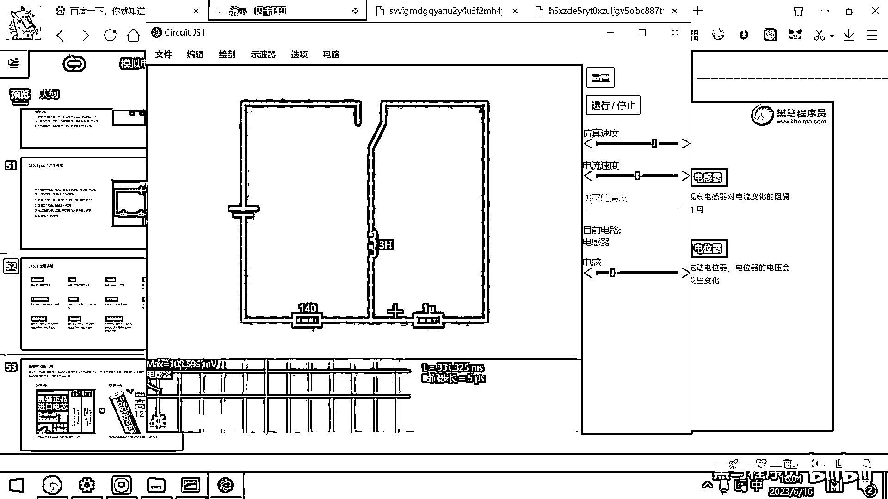

# 黑马程序员嵌入式开发入门模电（模拟电路）基础，从0到1搭建NE555模拟电路、制作电子琴，集成电路应用开发入门教程 - P27：28_电感器仿真 - 黑马程序员 - BV1cM4y1s7Qk

好 那電容器我們觀察完畢之後呢 我們再來去看一下這個電感器。

在電感器裡面呢 啊 這也有一個。

仿真的電路供我們去了解，好 大家看這個電感器，其實跟電容是類似的 對吧，當這個電流流動的時候，這個電感是不是就產生了這個電磁場呀，對吧 這個電磁場的特點呢是，它會崩潰 但是。

電磁場在崩潰的過程中呢 還會維持電流，繼續按照之前的方向流動，好 我要去切換這個開關了 大家注意觀察，我一切換這個開關，大家看一下電流是不是，還沿著剛才的方向，流動了一會兒呀。

對吧 好 如果你要想讓它流動的時間更長，這個也簡單，我把這個電阻140歐給改成10歐，把它給改成10歐，電阻小了 那它產生的熱就少一些，對電流的阻礙作用呢就小一些，好 我現在呢切換開關。

好 大家看是不是由於這個電感的存在，它讓這個電流繼續的按照之前的方向流動呀，由於這個電阻呢，它很小，那所以這個電流呢在這兒，又這樣流了一大會兒 對吧，好 那假設呢我們說，有一種東西呢叫超導體。

你把這個溫度呢已經，超導體有兩種實現方式，一種呢就是你把這個溫度呢給降到，接近絕對零度 對吧，那這些金屬呢就超導了，原因是什麼呢，電子在流動的時候，有的時候它會撞到這個原子核。

你感覺原子核是在原地不動的，實際上它也是在一定範圍內抖動的，那當這個溫度降到零下，絕對零度的時候，所有的物體的這個振動呢都停止了，那就只有，電子跟電子之間的這個磁場，那就變成一個超導體了。

我用這個仿真軟件給大家模擬一個，超導體，這個電阻呢是，0。0001 對吧，好 你看有了超導體之後，這個是不是很厲害，好 那先電池給這個電感呢充電，電感建立了磁場 對吧，我們去切換，那由於。

這一條電路的電阻接近於零，那你看這個電流呢就在這，一直流動下去了，一直流動下去，然後由電呢它可以產生磁，那利用這個磁呢我們就可以搞。

像磁懸浮列車呀這樣的。

這樣的設備，下期见。