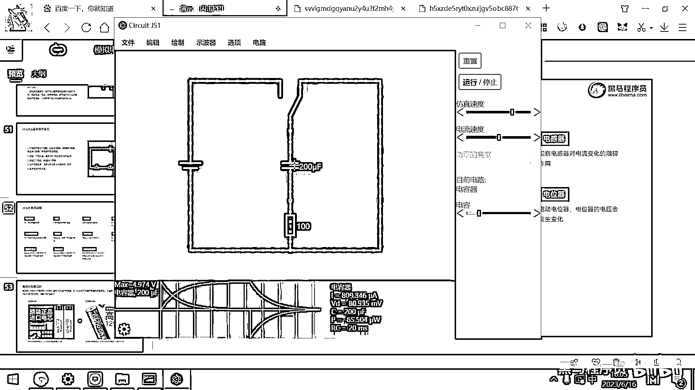
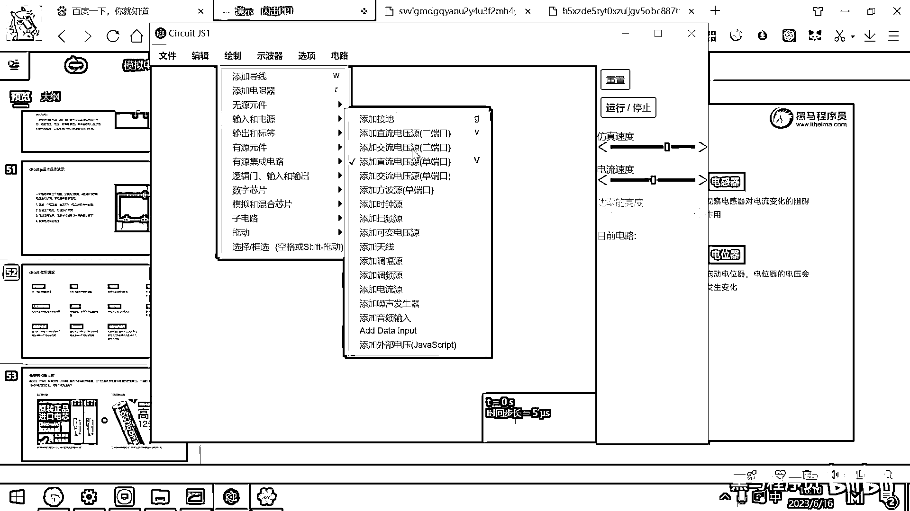
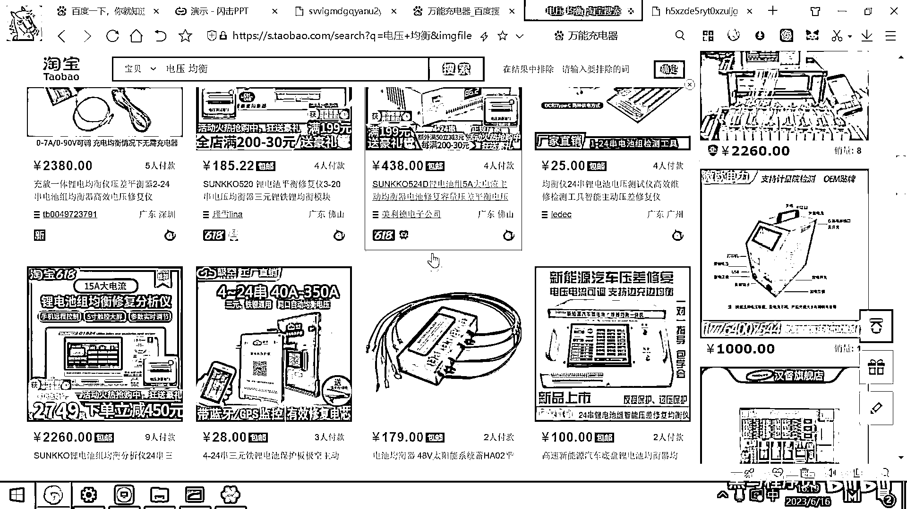
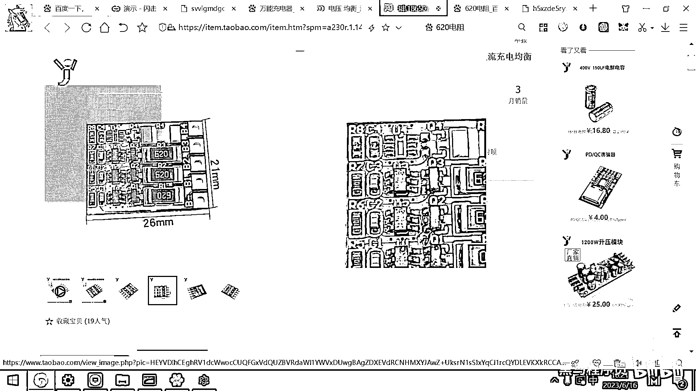

# 黑马程序员嵌入式开发入门模电（模拟电路）基础，从0到1搭建NE555模拟电路、制作电子琴，集成电路应用开发入门教程 - P28：29_分压电路 - 黑马程序员 - BV1cM4y1s7Qk

好 那通过刚才的这个仿真。

大家脑子里面一定要有一个非常重要的概念。

就是电容器，它的特点呢是，阻止电压的突变，你看我把这个开关切过去了，这个电压是不是，缓慢的变化下来的呀。

对吧 它阻止的是这个电压的突变。

这个电压慢慢的降下来了，那电感呢它阻止的是什么呀。

阻止的是电流的突变，你看我把它给切过来，它电流还散到之前的方向，然后继续流动了一会儿才停下来，对吧，那电感呢是防止电流的突变。

这两个重要的概念再熟悉一下。

好 那利用这个电容和电阻，然后我们还有这个电感，我们就可以去组成什么呀，组成这个LRC的振荡电路。

这个给大家已经看过了，一个电容一个电感，电容给电感充电，电感给电容充电，然后最终这个电路呢，就可以这样振荡的工作下去。

一会儿正方向。

一会儿反方向，好 这是LRC的振荡电路，好 那下面呢。

我们来看一个很重要的元器件，这个元器件呢叫分压器了，这个分压器应用场景呢，非常非常的多。

我们先看一下分压器的模拟，分压器。

来观察一下这个电路，这个电路左边有一个电池，我们看这个电池的电压是多少呀。

10V对吧，我把这个电压呢给显示出来。

这个电压呢是10V，也就是上面的电压是10V。

那电池的负极就是GND了，对吧，这个电压呢就是0V。

好 10V 0V，那大家就可以这样去理解，上面呢是很高的水位，对吧，这个下面呢就是海平面，那这个就是0V，那水呢肯定从高处流到低处，那水从高处流到低处的过程，是不是能量在不断的降低的一个过程呀。

如果这个水流到最低点了，就已经没有能量了，好 那大家想，这有两个10K的电阻，如果我这个电流水流从这过了之后，来到这了，大家看这显示的这个电压是几V呀，5V对吧，好，那根据欧姆定律也非常容易理解。

因为总体的电压去除以电阻就是电流了，对吧，那拿这个电流去乘以电阻，我们来看一下这个电流，把这个电流给显示出来，这个地方显示它的电流，要把这个图做的大一点，接一点导线才可以显示出来电流，我先把它给停掉。

然后在这接一段导线，这个仿真软件，如果你要想显示电流的话，是需要在导线上显示电流的，好 我们来进行仿真，好 那编辑显示电流，好 确定，大家看这个电流是怎么算出来的，是拿10V去除以20K对吧。

这个得到的就是500μA，那得到的是500μA，好 那拿这个500μA去乘以10K，这个算出来是不是就是5V，那这个电阻分了5V的电压，这个电阻分了5V的电压，那最终10-5-5就等于0，我们看右边。

右边它这串联了几个电阻，4个10K的电阻对吧，那串4个10K的电阻的话，我们刚才说了，那它的电流是不是就更小了，相当于是10V去除以40K了对吧，好 那这个电流是250μA，那每一个电阻分的电压。

实际上是2。5V，那10V经过一个2。5V，在这就降到7。5V了，10V经过一个2。5V降到5V，又经过一个2。5V降到2。5V，那来到这个最下面就是海平面了，就是0V，好 这个电路呢。

它非常非常的重要，它有大量的应用场景，我们来给大家讲几个很典型的应用场景，好 那刚才呢，刚才有同学用这个万用表的时候，他干了一件很有创新的事情，就是他拿这个万用表，调到这个电阻档去测9V电池的电阻。

去测这个9V电池的电阻，实际上任何一个电器呢，都是有电阻的，他拿万用表去测电池的电阻，没测出来 为什么呢，因为这个万用表20块钱一个，然后精度太差，那电池的内阻呢，一般都是几毫欧到几十毫欧。

你拿这样一个万用表去测电池的内阻，是测不出来的，要测电池的内阻呢，需要有专业的放电设备，基于这个放电的功率来去估算电池的内阻，这电池的内阻因为很小，所以需要用专门的设备去测量的。

好 那讲完这个内容之后呢，跟我们这个分压电路有什么关系呢，好 我们来给大家讲一个场景，我在这给大家画一个场景，在这呢 我有一个电源。

我有一个电源。

画一个双端口的吧，双端口的电源。

好 电源，然后呢 我还有一个东西呢，是电池 是铝电池，我用这样一个电阻来代替这个铝电池。

大家假设这个东西是一个锂电池，好 我们知道这个锂电池的充电电压是从，工作电压是从这个3。7，最低可以降到3。3V，3。3V到4。2V之间，一般我们给锂电池充电呢，你用的手机充电器都是5V的 对吧。

然后插上之后，它会有一个降压模块，把这个电压呢降到4。2V，然后4。2V呢给锂电池充电，那充个一段时间之后，你的电池呢就充满了，就所有充电器的工作原理，其实都是非常简单，就是把一个4。2V的，4。

2V的电源怼到这个锂电池的两端，那就可以给这个锂电池充电了，所以假设你以后你没有这个，你没有那个什么呀，锂电池的充电器了，你就怎么做呢，你就搞一个直流电源，然后把直流电源的电压呢调到4。2V。

正极接到电池的正极，负极接到电池的负极，这样就可以给电池充电了。

大家呢应该已经没有见过这样一个东西了，就叫做万能充电器。

这个是我上大学时候，很流行的一个设备，这个设备呢就叫做万能充。

那曾经的万能充，现在什么都不能充了对吧，为啥呀，因为现在所有的手机锂电池都拆不出来了对吧，那过去的诺基亚的手机，十几年前的手机，这个锂电池都是可以掰下来的，掰下来的话，然后你把这个片接到电池的正极。

这个片接到电池的负极，反正它输出的电压就是4。2V，那什么锂电池这个万能充都可以充，它其实工作原理就很简单，这个片呢可以左右移动，然后怼到这个电池的正负极上，就可以充电了，这就是万能充。

好那理解了这个锂电池是怎么充电的之后。

那我们想，如果你是一节锂电池，我是不是就应该用一个大概4。2V的电压，给它充电呀对吧，如果是一节锂电池，这个充电电压就应该是4。2V，因为你这个电压太高了，就直接把这个锂电池给充爆炸了对吧。

好那市面上的电动车48V的锂电池，它是怎么做出来的呢，其实你把电动车的电池拆开之后，你会发现它是13串，什么是13串，13串就是13个18650串在一起，就叫13串，那13串6并，就是这13串的电池。

我们搞6套并在一起，这就是一般市面上的电动车的电池。

13串6并，所以我们算一下，大家看这个13串6并。

我拿13去乘以一个锂电池，标准电压是3。7V对吧，那这个乘出来就是48V的锂电池，电动车的电池，你拆开之后一看，就是13个电池串联在一起，然后排6排，如果容量大的排8排，容量再大的排10排。

那10个13串的并联，就组成了这样一个锂电池，好那这个锂电池怎么充电呢，这个锂电池充电的方式也很简单，你充一节锂电池，是给它来一个多大的电压，4。2V对吧，那如果我要充两节锂电池。

大家猜一猜或者思考一下。

这个应该怎么充，如果是两节锂电池。

很简单呀，这是两节锂电池在这串联在一起了，那我再给它充电的话，我是不是就要去改一个电压，把这个电压呢给改成8。4V了，对吧，这个可以理解吧，充一个电池用4。2V的充电器，充两个电池用8。4V的对吧。

那充三个的话就是4。2V乘以3了对吧，那这个道理的很简单，我们也可以理解，但这种充电呢，它建立在一个前提条件下，就是这些电池都是性能良好，同一个批次出来的，什么叫性能良好同一个批次呢。

就是同一家厂家生产的，然后新电池，那每一个电池的电阻都是一样大的，只有每一个电池的电阻一样大，只有每一个电池的电阻是一样大的，那每一个电池分道的电压，是不是才是均衡的对吧，这个可以理解吧。

好假设我这个电源是8。4V的，那这个电阻它分道的电压4。2V，这个电阻分道的电压是4。2V对吧，你看这儿，我放到这儿，这显示的右下角4。2V，放到这儿右下角也是4。2V对吧，好那但是呢，这个离电池啊。

它如果用的时间长了，那有的电池放电多，有的电池放电少，这就跟干活一样，一堆人干活，总有那么一些人干得很勤快，还有一些人偷懒，那随着这个时间的推移，这个离电池的内阻会发生变化，那本来呢，这个电池的电阻是。

假设是10毫欧。

我假设是10毫欧，这个电池的电阻呢，最开始也是10毫欧的，好那如果都是10毫欧，大家看这个电池分道的电压是4。2V，这个电池分道电压也是4。2V，好但是呢，随着这个时间的变长，有一个电池坏了。

它的这个电阻呢，变成了50毫欧，好那变成50毫欧的话，大家想一下它的电阻大了，你看它分道的电压，是不是一下变成7V了，这个电阻这个电池分道的电压就变成1。4V了，对吧因为他们电阻不一样了，谁的电阻大。

谁分道的这个电压就多，那你再用这样的一个8。4V的充电器去充的话，这个实际上就相当于用7V的充电器给这个离电池充，用这个1。4V的充电器给这个离电池充，那充着充着这个电池就有可能爆炸起火了。

这个是非常危险的，也就是为啥你看到有很多电动车充着充着就起火了，最主要的原因还是里面的这个电池内阻发生了变化，然后它这个充电器保护板呢，做的又不太好，那就导致这个问题的出现了。

好那市面上的。

你比如说你到这个淘宝上去搜，有很多这样的解决方案，这个就叫叫均衡充电板，这个均衡充电板。

大家看一下就明白它到底是如何去工作的，好。

找一个找一个更。

找一个更明显一点大一点的图片。

离电池均衡充电。

好那。

嗯，没有我想要的这个图片，带一个均衡两个字。

之前一搜的话就会看到很多个就是均衡器吧。

或者叫电压均衡器。

我不知道搜什么样的关键字了。

之前搜一下就出来很多。

我们找几个裸板吧。

你看这有一个叫18650离电池的均衡板，均衡板它工作的原理是什么呢。

这个还不是特别明显，你看这有一个，这有一个电阻，这个电阻是什么呀，620 620 620，它其实呢就是在这搞三个比较大的电阻。

你看这个图片。

它就在这搞三个比较大的电阻，因为离电池的这个电阻，大家想一下都是毫欧级别的，对吧，即便是坏掉了，也是几百毫欧，那几百毫欧对这个620的电阻。

那这个620应该是一个很大的电阻。

我们看一下620电阻实际上是多大的，620电阻呢实际上是62欧的，对吧，那毫欧的数据对这个62欧的数据，这个其实就可以忽略不计了。

那他在设计这个电路的时候。

在设计电路的时候，大家想他就怎么做呀，在电路里面。

在电路里面去放这样的若干个620的电阻，那这620的电阻在这放着，是不是就把这个一个很高的电压均衡的分成几块了，那分成几块之后，在这一块接一个离电池，在这一块接一个离电池，在这一块接一个离电池。

这样一接的话，是不是就可以保证每个离电池的充电电压，都是在一个合适的范围内。

那当然他这个里面还要有一些保护的电路，有这个貌似管，还有防止这个电流的倒灌，他这里面还会有一些别的东西来去实现这个均衡充电。

这样的一个板子就非常非常的重要。

他可以保证每个电池都是4。2伏的均衡电压，然后这个电流是66毫安的这样一个电流，这个充电电流其实还是很小的。

多謝您收睇時局新聞，再會！。