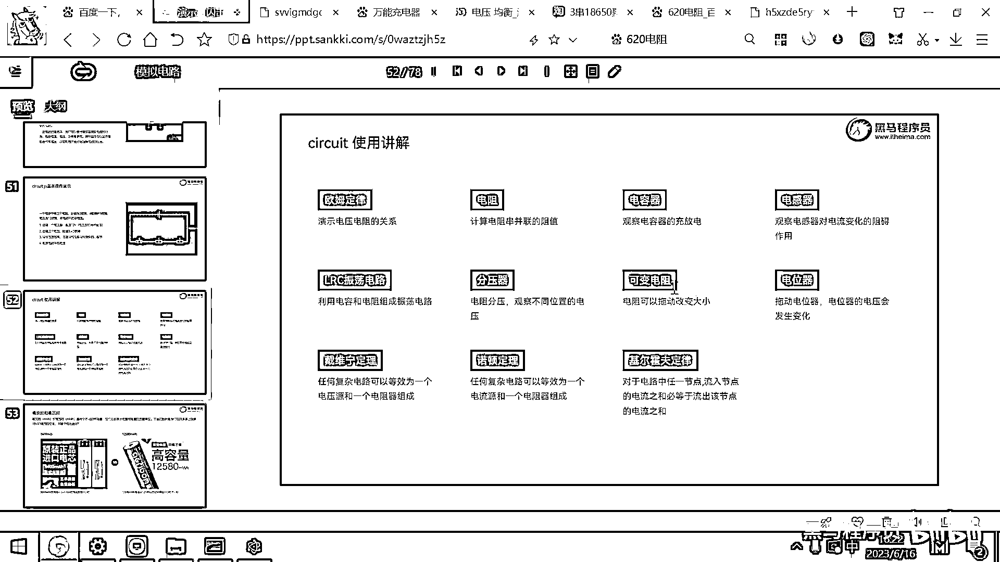
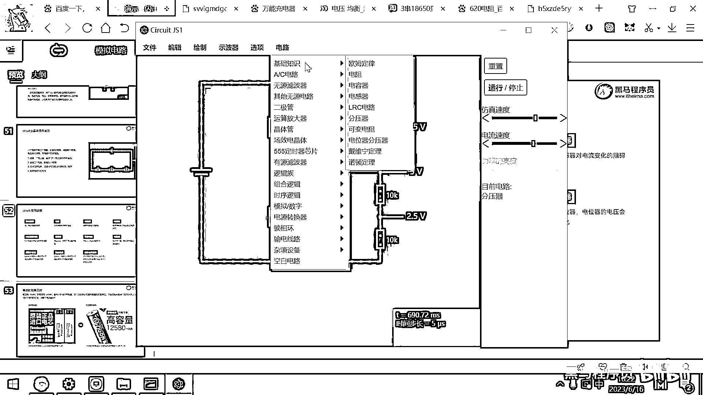
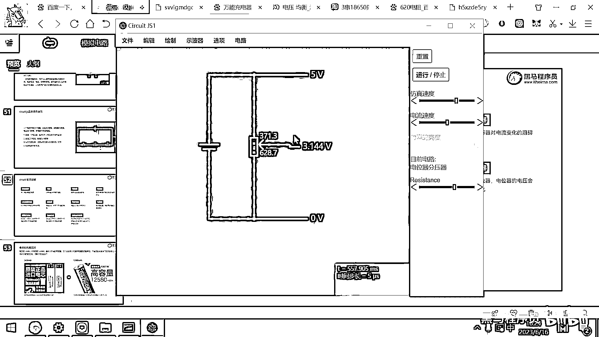

# 黑马程序员嵌入式开发入门模电（模拟电路）基础，从0到1搭建NE555模拟电路、制作电子琴，集成电路应用开发入门教程 - P29：30_电位器仿真 - 黑马程序员 - BV1cM4y1s7Qk

好 那看完这个分压器之后呢 我们再来去看一下可变电阻了。

那可变电阻呢 就是一个可以滑动的电阻。

利用可变电阻呢 就可以去实现很方便的分压，好 那大家去看一下这个电池的电压是多少呀，是5V 对吧，好 那这个电阻怎么去调呢，这个电阻你看，可以往左调 然后往右调。

这个电阻整体的阻值是多少呢 是1000Ω，所以左边是500Ω 右边是500Ω，你把它往左拨一拨，这个是200Ω 右边是800Ω 对吧，好 那这个东西，这个东西 你调整它的位置，那左边的电阻变小了。

是不是这块的电流就变大呀 对吧，那右边的这个电阻变小了，那右边的电流呢就变大，好 这实际上是一个用来去调节电流的一个工具，那大家用的这个直流电源，就刚才我们上课给大家演示的这个直流电源。

它里面呢 肯定就是有这样的可变电阻，用来去调节电流的，好 那看完这个可变电阻之后呢，我们来看一下 利用这个可变电阻去实现分压，去实现分压，好 那默认情况下 这个电阻上面是，500欧 下面是500欧。

那如果我一个导线从这接出来，是不是就只有2。5伏呀，因为它相当于是把这个5伏的电路，一分为二，上面占一半 下面占一半 对吧，那我去拖动这个滑动变阻器，那如果它往下滑，这个电压是不是就降下来了 对吧。

因为下面这个电阻分的电压很少，那如果我往上滑，这个电压呢就升上来了，你们用的有一些调速风扇，那些不用编程的调速风扇，很多都是基于这样一个，滑动变阻器来去实现的，你往右扭一扭 然后它就，它的这个电压呢。

可能就变小了 变大了，然后就转得快 对吧，往左扭一扭 这个电压变小了，风扇就转得慢，有很多不需要编程的，这种小家电，基本上都是利用这种模拟电路。

调一调电阻。

来去实现的改变电压，嗯，點個喜歡，謝謝支持，下次見囉~~~。