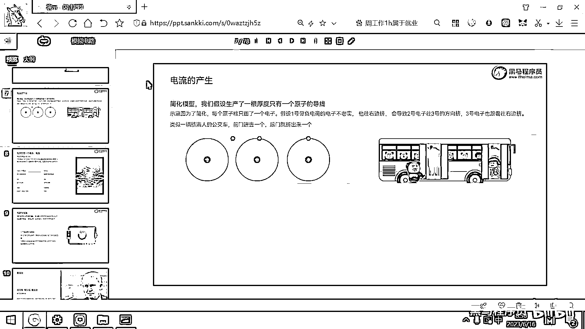
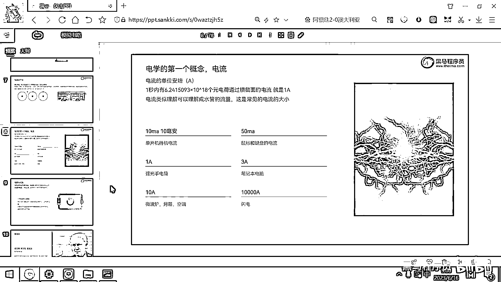

# 黑马程序员嵌入式开发入门模电（模拟电路）基础，从0到1搭建NE555模拟电路、制作电子琴，集成电路应用开发入门教程 - P2：02_电流介绍 - 黑马程序员 - BV1cM4y1s7Qk

好 那我们接下来就直接进入正题了，那先回顾一下初中 高中物理电学相关的一些概念，这些概念都非常简单，那大家看一下 了解一下就可以了，好 第一个概念就是电流，那到底什么是电流呢，要想理解电流。

大家要理解一下这个世间万物都是由原子构成的，好 在右边呢，给大家画了一个非常简易的原子的模型，这个原子呢，它是由中间的质量很大的原子核，对吧，然后以及它周围的一些电子所构成，这个电子呢。

它就在这个原子周围，其实是高速的在移动，好，那这个电子呢，它环绕在这个原子核的中间，对吧，这个原子核它带的电是正电，这个电子呢 带的电是负电，那我们有一个古老的法则，就是叫同性相斥异性相吸，对吧。

那这个带正电，这个带负电，那它们之间就会互相吸引，所以原子呢，就把原子核就把周围的这个电子呢，给吸引住了，好，那我们见到的很多的物体，像比如说桌子呀，然后像这种石头呀，好，这些物体呢。

它也都是由原子构成的，但是呢，这些物体呢，它的这个原子核跟它周围的这个电子呢，是这样紧密地排列起来的，这个结构呢，你看一个带正电核的原子核，周围就有几个，八个带负电的电子，对吧，这样的一种结构呢。

它就类似于蜜蜂做的那个蜂巢一样，它非常的稳定，然后它电子呢，也只能在小范围的移动，然后这个原子核呢，是很大，质量很大，呈现着这个物体的这个形态，好，那所以像木头呀，石头呀，这样的东西呢，它是不导电的。

因为带负电的这个电子呢，都被稳定地束缚住，那还有一种，还有一种，还有很多的物体呢，比如说金属固体，这个金属固体，它的这个电子呀，离这个原子核呢，比较远，然后，大家看原子核是在中间是保持不动的，对吧。

维持着这个物体的稳定，但这个电子的话，由于它离这个原子核比较远，那束缚力呢就比较弱，那，这个电子就可以在，这个空间内左右的移动，对吧，在一个小范围的，区间内可以移动，好。

那如果这个电子可以在小范围的空间内移动，会带来什么问题呢，我们给大家看一下这样的一个图，好，这个图呢，是一个简化的示意图，是为了方便大家理解，我们假设呢，你生产了一根导线，这根导线呢。

它非常非常非常的细，细到什么程度呢，就是这个导线的直径呢，就只有一个原子那么大，好，这左边这个图就是一个导线，那这个导线的直径只有一个原子那么大，那这是一个原子，这是一个原子，这是一个原子，对吧，好。

那中间的这个原子核带正电，它维持着这个物体结构的稳定，然后原子核的周围是不是有电子呀，为了方便大家理解呢，我们这个图又做了进一步的简化，就是这个原子核的周围啊，我就只画了一个电子，好，那现在呢。

我们假设这个是一号电子，这个是二号电子，这个是三号电子，那大家想，如果这个一号电子，它现在往右挤，它现在往右挤，那我们知道呢，这个同性是相斥的，对吧，一号原子往右挤，那它们之间的距离太近了。

那这个二号原子呢，就会远离这个一号原子，就也会跟着往右挤，那这个时候二号原子又靠近三号原子太近了，那三号原子呢，也会被跟着往右挤，那为了方便理解，大家看一下右边的这个图，那假设呢。

一个公交车上现在已经挤满了人，对吧，那如果从前门暴力的挤进去一个人，那这个后门呢，肯定是要被挤出来一个的，因为这个公交车呢，现在已经站满了人，那其实电流呢，就是这样产生的。

一旦有一个电子朝某一个方向去移动，然后它就推动了与它靠近的这个电子，与它靠近的这个电子呢，又去推动与它靠近的电子，这个电流呢，就朝一个方向移动起来了，好，那我们知道这个电流的速度，有人说是接近光速。

在这个B站上还专门有好多up主在论证这个问题，对吧，他们为了论证这个问题，有人甚至还做了几公里长的这个导线，那电流的速度是光速，这种说法呢，实际上并不是特别准确的，电子在这个导线上移动的速度呢。

实际上是很慢的，这个电子从这移动到这，这个速度是很慢的，但为什么有人讲电流是光速呢，最主要的原因是，电厂的建立是以光速的，是以光速建立起来的，大家想这个问题就是，你这个原子，你这个电子往这一挤。

是不是瞬间这个电子也要往右边挤啊，那每一个电子都往右边挤，这个速度，这个电厂建立的速度呢，是光速建立的，那本身电子移动的速度没那么快，但是电厂建立的速度呢，是光速，好。

那了解了这个电流产生之后呢。

我们先给大家介绍一下电学的第一个重要的概念，就是电流的单位，电流的单位呢，用英文字母呢，是用A去表示，这个A呢，叫安培，当一秒钟呢，有6。24×10^18个原电荷，这个就是电子通过横截面的时候。

这个电流呢，就是一安，一秒钟有6。24×10^18个原电荷，好为什么是这么奇怪的一个数字呢，因为最早的这个电流产生呢，是通过化学反应产生的，那他们在做这个化学反应的时候呢。

假设是一默尔的这个物质产生的这个化学反应，那正好呢，对应的这个电荷呢，就是6。24×10^18个，那如果一秒钟就通过这么多个原电荷，那他的电流呢，就是一安，好，那关于这个电流呢，大家一定要理解一个概念。

就是电流他每一个原电荷，大家把它理解成是一个人，那如果单位时间内很多个人要出去，那通道是不是越大，然后他就会流得越顺畅呀，对吧，那如果这个通道很窄的话，那是不是就很容易产生这个踩踏事件，或者挤压事件呀。

假设我们班后面就这样一个小门，然后100个人同时要从这个门里挤出去，那肯定是要有人去受伤的，那所以我们以后在选这个电线的时候，你一定要去了解，我现在要过几安的电流，那过几安的电流。

我就要用几个几个平方毫米的线，对吧，这个线的粗细跟你要承载的电流呢，是有很大的关系的，那如果是一个很细的导线，然后你去过一个三安五安的电流，短时间之内呢，这个导线就会发出来大量的热，外面的绝缘胶皮呢。

有可能都会被烧毁，好，那，了解了电流之后呢，我们来看一下一些常见的电流，那大家用的这种单片机呀，比如说STC的ARM的，或者是RESC-V的，这些单片机，它待机电流呢，一般就是10毫安到50毫安左右。

毫安这个单位呢，是，1000毫安等于一安，也就是说这个10毫安就相当于是0。01安，对吧，好，那大家用的这个鼠标键盘，USB的，你插到电脑上，它的电流呢，大概就是50毫安，好，那强光手电筒。

就那种装离电池的，一打开能够亮瞎眼的，这种强光手电筒，它的电流呢，大概是，一安左右，那大家用的笔记本，你这个笔记本的适配器，输出的电流呢，通常都是在三安左右，好，那大功率的用电器，比如说微波炉啊。

烤箱空调啊，他们一般峰值电流呢，可以到十安，十安，好，最厉害的是谁呢，最厉害的是右边这个雷电法王，对吧，这个散电呢，它的电流呢，可以到十安，十安，好，最厉害的是谁呢，电流呢，可以到一万安。

这是一个非常非常大的电流，如果一个散电打到树上，或者是打到，打到这个动物身上，对吧，那因为电流很大，而这个植物呀，或者动物，它身上还是有一些电阻的，那这个电流经过电阻，瞬间呢，会发出大量的热，那直接就。

一个散电就，就烤焦了，对吧，好，这个是散电，因为它电流呢，非常大，谢谢大家！。

謝謝觀看。