# 黑马程序员嵌入式开发入门模电（模拟电路）基础，从0到1搭建NE555模拟电路、制作电子琴，集成电路应用开发入门教程 - P30：31_常见电学的定律 - 黑马程序员 - BV1cM4y1s7Qk

好 那接下來呢 我們再帶大家看幾個看起來很嚇人的定理。

這個定理呢 聽著名字很厲害 但實際上原理呢 很簡單。

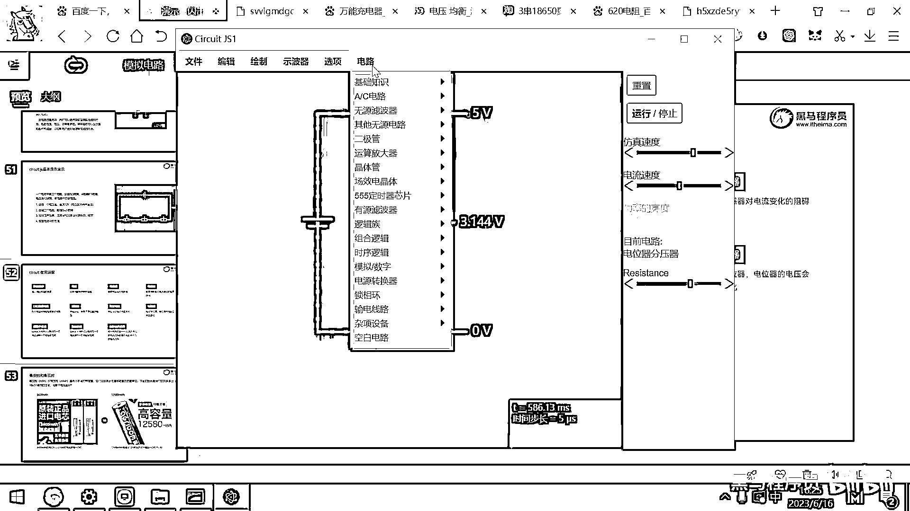

第一個定理呢 叫戴維寧定理，好 大家看這個電路圖就有點嚇人 對吧，這裡面這有一個電源 電阻 什麼電源電阻 電源電阻，然後這外面呢 還有一個 還有一個交流的電壓源 對吧，好 這一大堆電 這個很複雜的電路。

我們可以把它給等價成什麼呢，你看等價成是一個電壓源 加一個電阻 對吧，這個戴維寧定理呢 它就講了。

說任何複雜的電路呀 你都可以把它等效成是一個電壓源。

和一個電阻所組成，那有了這個定理之後 我們去分析電路呢 就會變得非常的簡單，比如說你要去分析一個單片機系統的功耗，那你就給它接一個電源 對吧，然後你看一看它的這個電流是多大。

那有電源 有電流了 你就直接知道功耗了 為啥呀，你把整個單片機系統就當成是一個用電器，當成是一個電阻就可以了，好 那戴維寧定理呢 它就是為了非常方便的。

讓我們去分析電路提出來的一種分析方法。

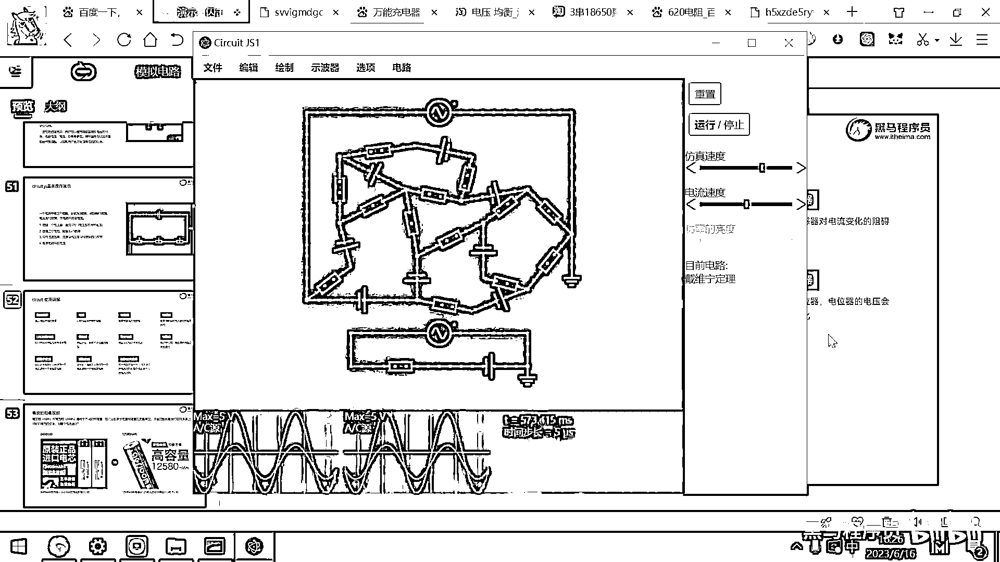

你把任何複雜的電路就理解成是一個電壓源和一個電阻器就可以了。

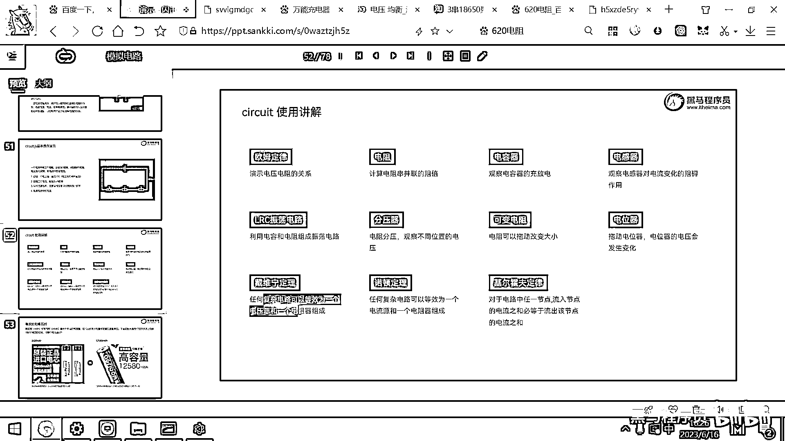

那還有一個人呢 叫諾頓。

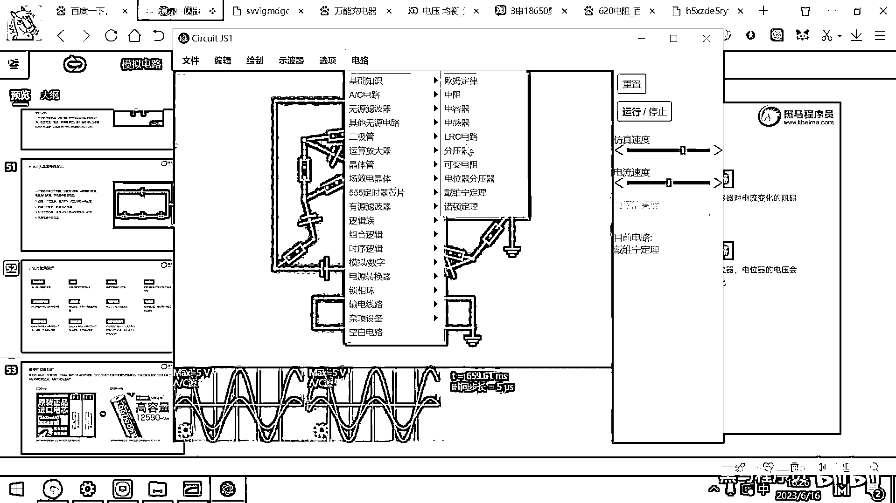

這個諾頓呢 他也提出來一個定理，這個定理呢 其實跟戴維寧類似。

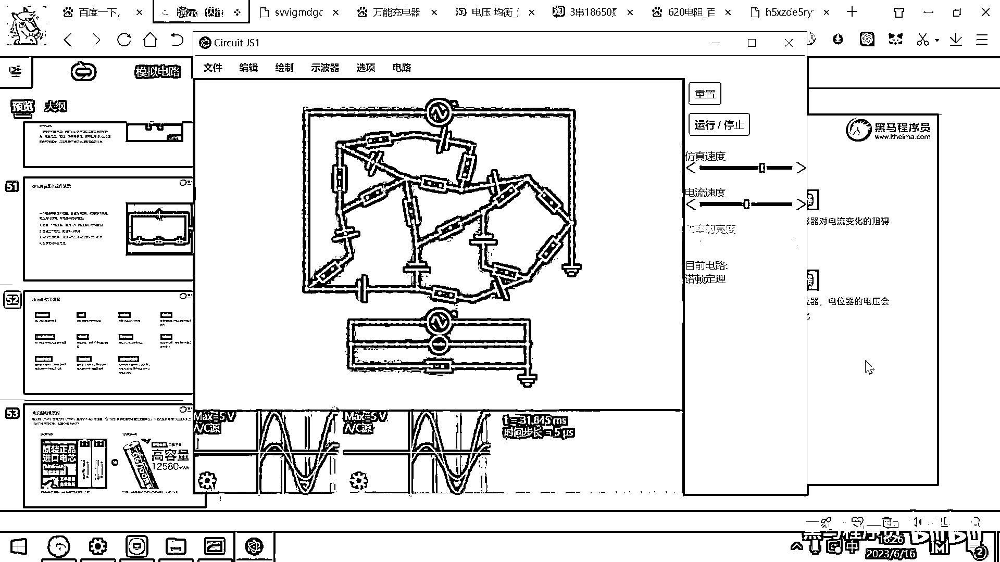

他說的是任何複雜的電路都可以等效成是一個電流源和一個電阻器。

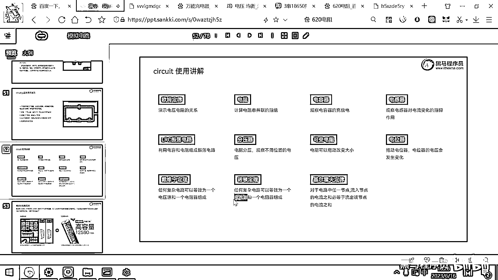

那你看 誒 這有一個電流源 在這產生電流，然後下面有一個電阻 採用這種方式呢，兩個電路呢 也是得到了這個簡化。

方便你分析這個問題。

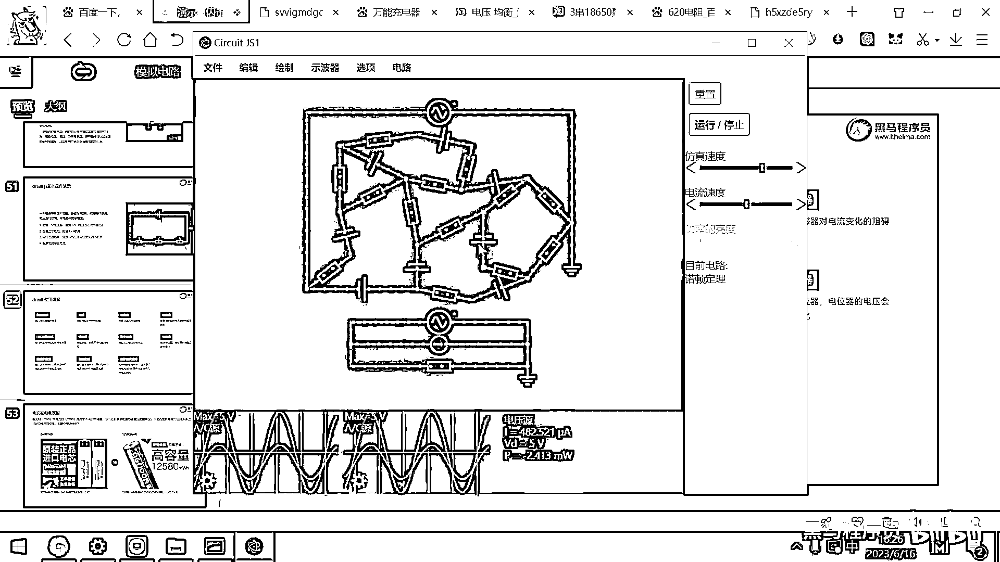

好 那這兩個定理呢 我們了解一下，知道如何利用等效的方法去簡化問題，好 那最後一個定律呢 就是傑爾霍夫定律了，這個定律呢 很重要，它的這個定律說的是什麼呢，說電路中任何一個節點流入的電流之和。

必須等於流出的電流之和，那現在你看這個話感覺就是大白話 對吧。

感覺是很明顯的，但是回到一百多年前，第一個提出來這樣的一個思想的人還是很厲害的。

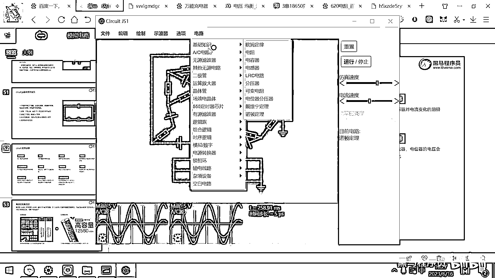

這個就是傑爾霍夫定律。

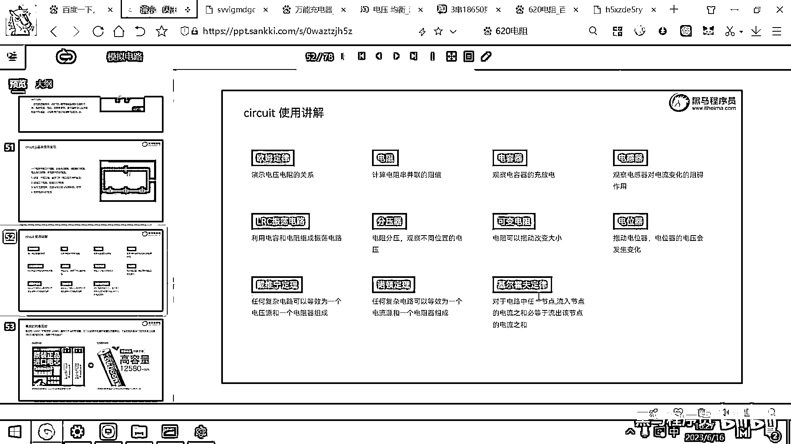

那我們給大家演示一下這個傑爾霍夫定律，好 這個傑爾霍夫定律怎麼去理解呢，你在分析電路的時候，你的這個單片機板子焊完了，一上電發現短路了，那究竟哪裡短路的呢，你是不是要逐塊去分析呀 對吧。

好 那短路的原因就是正極和負極，在什麼地方搭火了或者導通了，那對於任何任意的一個節點，我就以這個節點為例子，這個節點大家想一下流入的電流是誰呀，是不是從這兒流進去電流，然後從這兒流進去電流呀。

那這個節點流出的電流是誰呢，就是下面這個就是流出的電流，好 那你去觀察這個電路的話，你看這個流出的電流是17。3毫安，然後流入的這個電流是多少呢，你可以顯示出來，然後這邊流入的電流呢，也給它顯示出來。

你看15。4，然後加上1。9，是不是正好就等於17。3呀 對吧，那這個從常識上我們也可以理解，你說有兩個小水管匯成了一個水管出來水了，那兩個小水管進去的水量。

肯定要跟出來的這個水管的水量是一模一樣的 對吧，那如果進去的水多出來的水少，那這個管子肯定有問題 對吧，那要麼就被噌爆炸了，要麼就是這個管子肯定還有別的地方洩漏，那如果是進去的少出來的多。

那這個就見鬼了 對吧，你搞一個管子，進去的水很少 出來的水更多，那你開個水廠就可以了，好 所以基於這個基爾霍夫定律，我們用它去分析這個電路，你只要能夠搞清楚這個節點有幾個人進去，有幾個人出來。

那你就可以直接去推算出來什麼呀，推算出來某一個節點的電流，你看這個出來的是18。3，這進去是13。3，這進去是多少呀 1。7，那它加它等於它嗎，不等於那肯定還有地方再給它供電 對吧，那這個供電這個導線。

這個導線沒有畫出來，那看不到這個電流，那這個電流呢肯定就等於18。3-13。3-1。7。

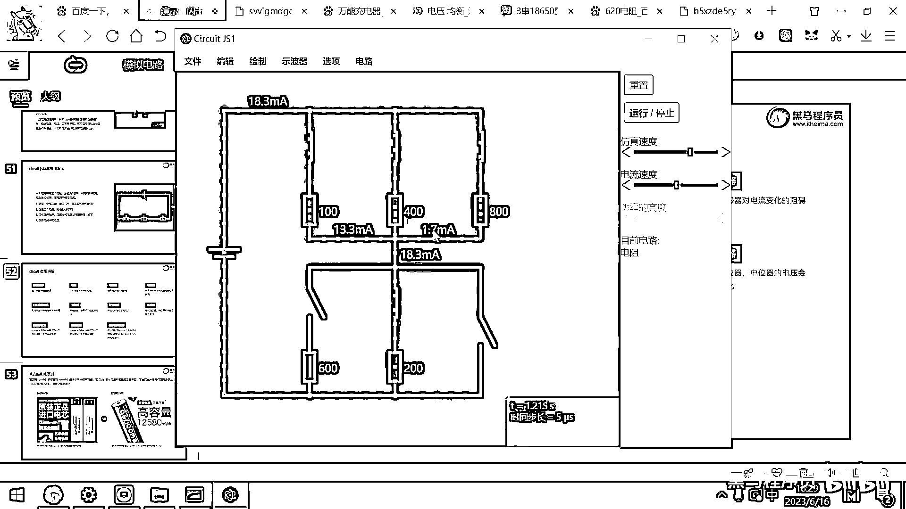

好 對於複雜的電路，你只需要找到其中的某一點，分析它流入的數據和流出的電流數據。

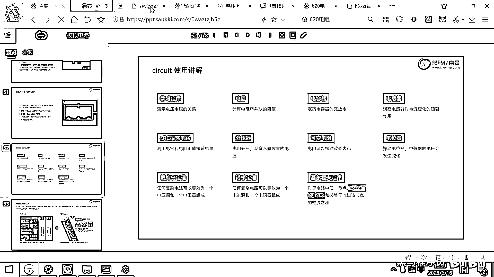

這個和一定是等於零，好 這個就是基爾霍夫定律。