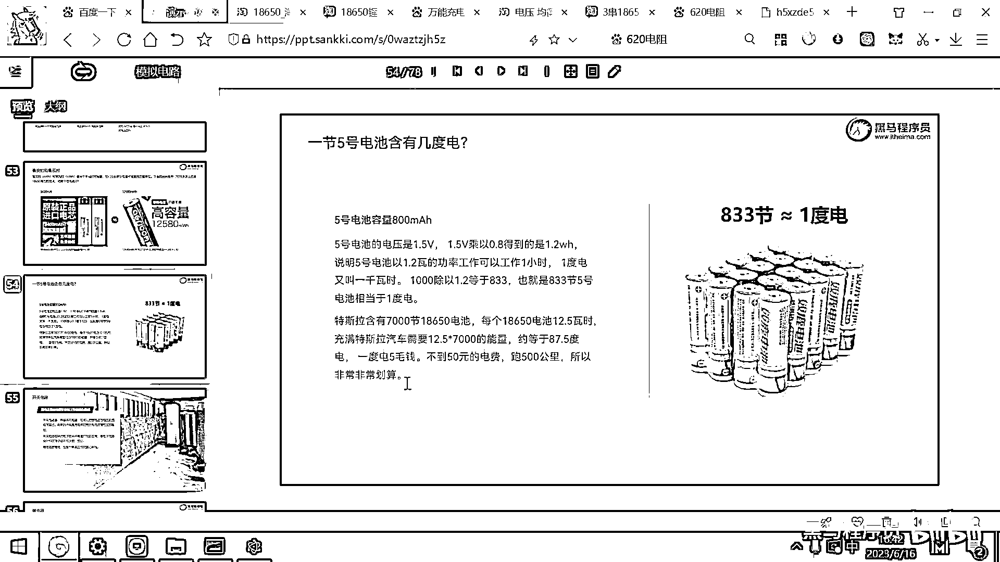

# 黑马程序员嵌入式开发入门模电（模拟电路）基础，从0到1搭建NE555模拟电路、制作电子琴，集成电路应用开发入门教程 - P31：32_毫瓦时和毫安时 - 黑马程序员 - BV1cM4y1s7Qk

好 那今天的内容呢 我们再讲最后一个概念啊。

这个概念呢 是关于能量单位的一个概念，好 那大家在用这个锂电池的时候，用各种充电电池的时候是有两个概念的，一个概念呢 叫毫安时，一个概念呢 叫毫瓦时，这是两个不同的物理量，它代表的是电量和能量。

毫安时大家见的都比较多，你去买这个手机，一般都讲这个手机，像华为手机宣传就是，4000毫安时大电池 对吧，那苹果手机电池呢 一般，3000多 稍微少一点，那另外呢 你买这个充电宝。

一般都是1万毫安时充电宝 对吧，2万毫安时的充电宝，好 这个毫安时到底代表啥含义呢，好 你看这个单位很有意思，毫安后面h是小时 对吧，那假设呢，你看到有一个电池是3400毫安时，它代表的含义就是。

这个电池呀，可以以3。6安的电流放电一小时，3。4安的电流放电一小时，好 这个下面，你看如果是3600毫安时的电池，就是以3600毫安的电流放电一小时，好 那刚才我们给大家做实验，你看到了一个LED灯。

它工作的电流是多大呀，是20毫安左右 对吧，那如果呢，你用一个这样的18650电池，是3400毫安时的，然后去驱动一个LED灯，那你算一下它能亮几个小时呀，应该就是3400除以20 对吧。

那你用一个这么大的锂电池，去点一个LED灯，就可以亮3400除以20，就是340除以2 对吧，170个小时，那一个LED灯用这个锂电池去点亮的话，那大概呢，可以亮170个小时，亮十多天，对吧，亮十多天。

好，那你在这个网上去买东西的时候。

特别是买这个锂电池，你会看到还有一些人呀，他用了另外的一个单位。

好，那我们去搜索，对吧，大家看这个电池呢，是3400mAh，这个是毫安时。

这个值呢，是3400，然后你往下拉，你会发现，哎，还有人卖18650锂电池，这个他写一个叫，9800大容量，对吧。

这个写一个9800大容量。

那如果你仔细观察的话，这个9800到底是啥呢，你看一下他这个大图。

这个是9800mWh，对吧。

而这个3400是什么呀，3400是mAh。

好，这个单位不同，那有很多人呢，都喜欢采用另外的一个单位。

然后这样的话，它的这个数值呢。

就会大很多，那毫瓦时又是啥概念呢，毫瓦时瓦代表的是功率啊，这个毫瓦时代表的是这个电池可以以什么样的功率去工作一小时，那假设呢，我们看右边这有一个电池是叫12580高容量的毫瓦时，它所代表的含义呢。

就是这个电池呀，可以以，12。580瓦的这样一个功率工作一小时，那功率我们知道它是等于什么呀，功率它等于电压乘以电流的，对吧，功率是等于电压乘以电流的，那12。

580功率的这个电池。

它实际上对外输出的电流是多少呢，我们来给大家看一下。

你就拿12580去除以离电池的电压3。7伏，这个除出来呢，就是3400毫安啊，就是3。4安，所以呢，这两个电池一个标说是3400毫安时一个标12580毫瓦时，这两个电池的容量呢，是一模一样的啊。

它只不过换了一个单位，拿这个单位乘以电压就得到了这个毫瓦时，得到了毫瓦时。

那回到我们刚才这个淘宝，你看这个18650，两节卖多少呀，卖。

这个打开看一下具体价格吧，一节18650。

大家看一下它大概是卖这个配充电器，两节平头。

好，这一节电池呢，卖22块钱，对吧，23块钱。

然后呢，你看这个电池，只卖六块钱啊，这个电池究竟容量有多大呢，我们现在已经会算了，就是拿这个9800除以3。7，对吧，好，实际上这个电池呢，大概就2400毫安，2500毫安不得了了，好。

那他卖六块钱一个啊。

那其实买两节这个电池还不一定有一节这个电池啊。

它的这个容量大啊，因为很多铝电池呢，都虚标，它标出来这个9800啊。

可能实际上呢，连1000毫安时都没有啊，反正电子产品的都是一分价钱一分货啊。

你买个30的啊。

跟你买五个这个六块的其实还是不太一样的啊，就不要去只看这个数字，还要去看它后面的这个单位。

好，那一旦理解了这个毫安时和毫瓦时之后，我们现在就可以进行这个能量的计算了啊，在在做这个浅水运用的时候呢，我们对这个能量的要求呢，能量计算要求呢，还是比较高的啊，因为你说啊，我我做一个穿戴设备，对吧。

就穿戴设备呢，肯定要非常的省电啊，电池呢，不能太重啊，另外呢，待机的这个时间要更长，对吧啊，那之前不是有一个有一个笑话说啊，一个商务人士到机场了，然后看到一个卖手表的这个手表呢。

很高级又有什么GPS又可以打电话，看电视，然后还有什么血氧心跳监测啥都有，对吧，你问价格五百块啊，很开心说这个表啊，我买了五百块就交给对方了，好，那交给对方之后把表拿走了，人家说等等等别走啊。

然后为啥啊，旁边还有两个大箱子电池，你还没拿，对吧啊，那这就是一个段子说这个表呢，虽然很好用，但是这个电池呢，需要两个行李箱那么大啊，那这种表呢，还是用不了的，那做这个建设应用的话呢。

你一定要考虑你当前这个设备的功耗啊，然后基于这个功耗呢，来选供电方案，像像这个卫生间里面我们做的做的这个冲水的这个阀啊，这个阀呢啊，他工作的电流就有五百毫安，那五百毫安是什么意思呢，如果呢。

我们用一节18650电池的话，去带这个冲水的这个阀，那大家想一下，他工作电流是五百毫安啊，那用一个三千四百毫安时的电池，也就只能让他工作多久呀，五七三十五对吧，六七个小时啊，然后这个电池呢就没电了，啊。

你说我在啊，并这个电池就没有电了，好，并且呢，这个电池呢，这个水阀它的工作电压是12伏，那其实呢，我就需要四节或者三节这个18650串联啊，还是这个容量的，只能工作个五个小时，六个小时。

那这种这么废电的设备啊，就不适合用锂电池供电了，你要去考虑用一个220伏转12伏的这种电源长期给他供电，好，那如果呢，你一个设备工作的电流呢，就只有几毫安，10毫安，20毫安。

那就非常适合用锂电池去供电，对吧，那怎么想方设法降低你设备的功耗啊，这也是一个我们要考虑的问题。

好，那最后呢，我们来看一下啊，一个小思考题啊，这个思考题呢，就是一度电等于多少节电池一度电一度电实际上就是1000瓦时啊，一度电就是1000瓦时，也就是以1000瓦的功率可以工作一个小时就是一度电。

那我们这个5号电池呀，一般都是800毫安时的啊，800毫安时就算大容量，然后他的电压呢，是1。5伏，你拿这个1。5伏乘以0。8，得到的就是1。2瓦时，也就是说1。5毫电池，他的能量呢，是1。2瓦时。

一度电呢，是1000瓦时，你拿1000去除以1。2，得到的就是833，也就是说你买833节这个电池啊，他具有的能量才是一度电的能量啊，一度电的能量好，那特斯拉汽车呢。

他是有7000节高性能的18650组成的。

那一个18650，刚才我们看到了高容量的是12。580毫瓦时的。

这个就相当于一节18650的电池有12。5瓦时啊，一节18650，那7000个18650乘一下，你拿这个12。5去乘以7000，这个得到的就是8万多，对吧，8000多，8万多，8万多的话，就相当于87。

5度的电，那一般电动车的充电效率呢，就是90%的转化，85%的转化，也就是说大概呢，你用100度电可以把这个特斯拉汽车呢，给充满，那一度电呢，现在价格呢，就是五毛钱，也就是说你把一个特斯拉充满。

也就花了50块钱的电费，那50块钱的电费呢，可以跑500公里，那所以大家想一下，这个是非常非常划算的，对吧，那在深圳呢，坐出租车，坐这个什么网约车，你找不到一辆油车啊，全是电动车，为啥呀。

因为只有电动车才这个成本呢，才足够低，它跑起来才划算啊，如果呢是一个油车去跑滴滴啊，那你想那百公里油耗18个20个对吧，那他挣的这个钱呢，还不够他烧的这个油钱啊，那所以深圳的所有的。

所有的这种网约车全都是电车，另外呢，电车还有一个好处就是它有这个能量回收的装置，就是你刹车的时候呀，它实际上可以把动能再重新转化成电能，再存到这个电池里，所以呢，大家坐这个网约车。

坐这个电车坐着坐着就要吐了，对吧，因为它刹车呢，要比这个油车快很多啊，它不用踩刹车速度就降很快，它一踩刹车，然后再发电能量回收，那这个时候呢，你就你就更晕了，那因为电车呢，很便宜啊，成本呢，很低啊。

所以呢，这个网约车都是电车。

