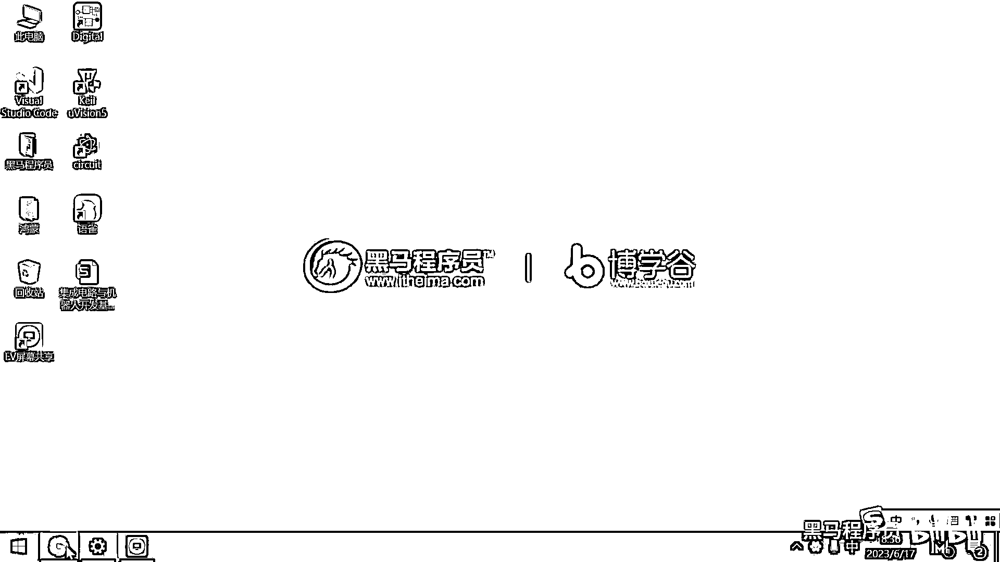
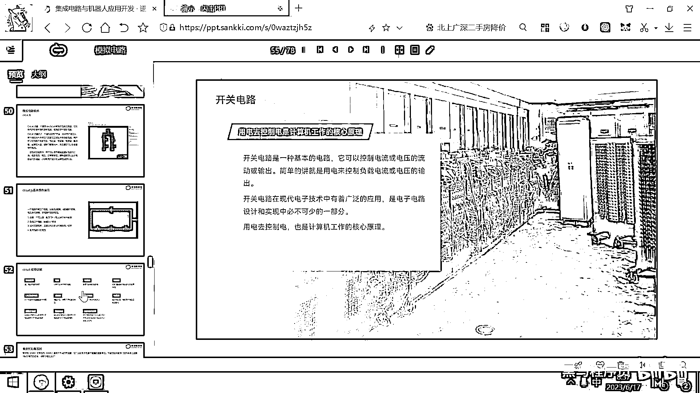
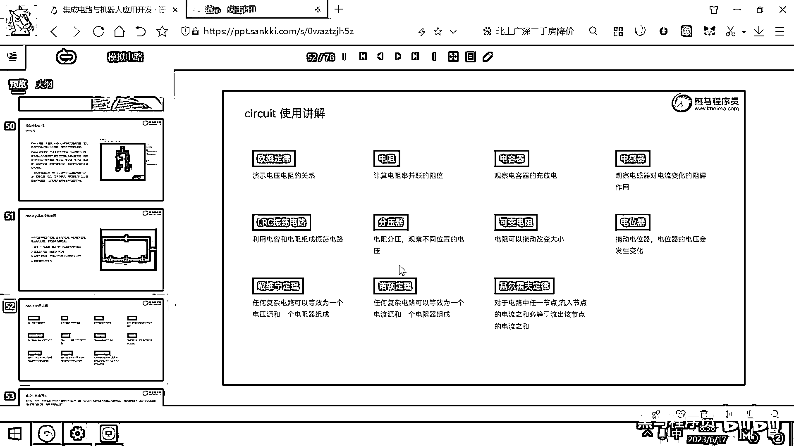
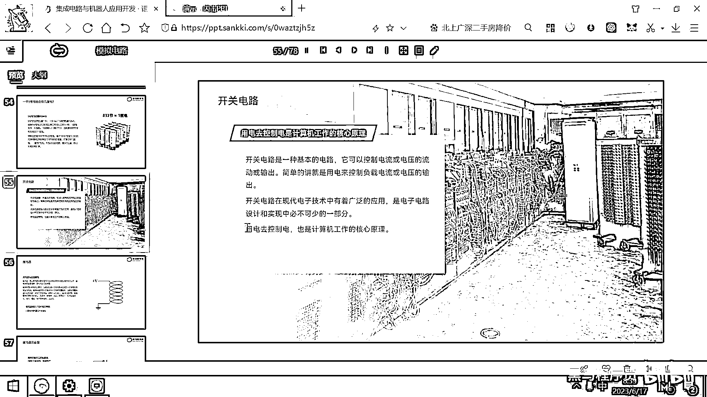
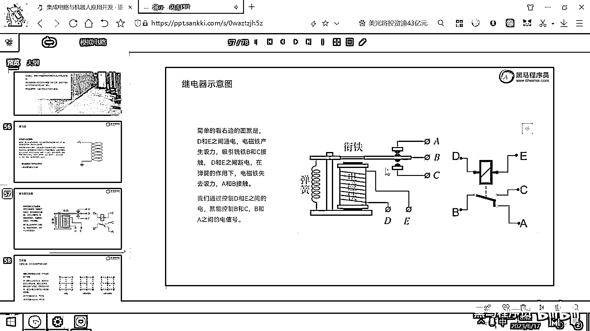
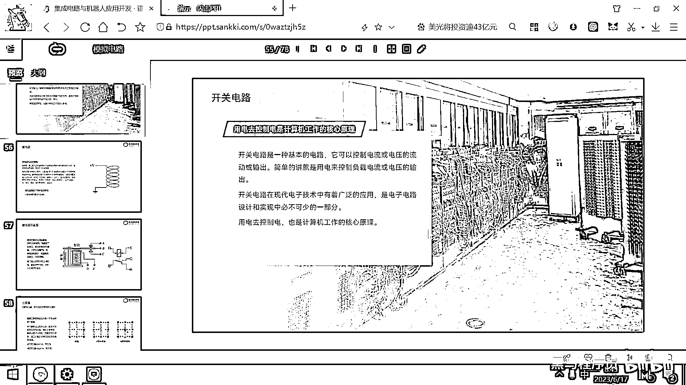
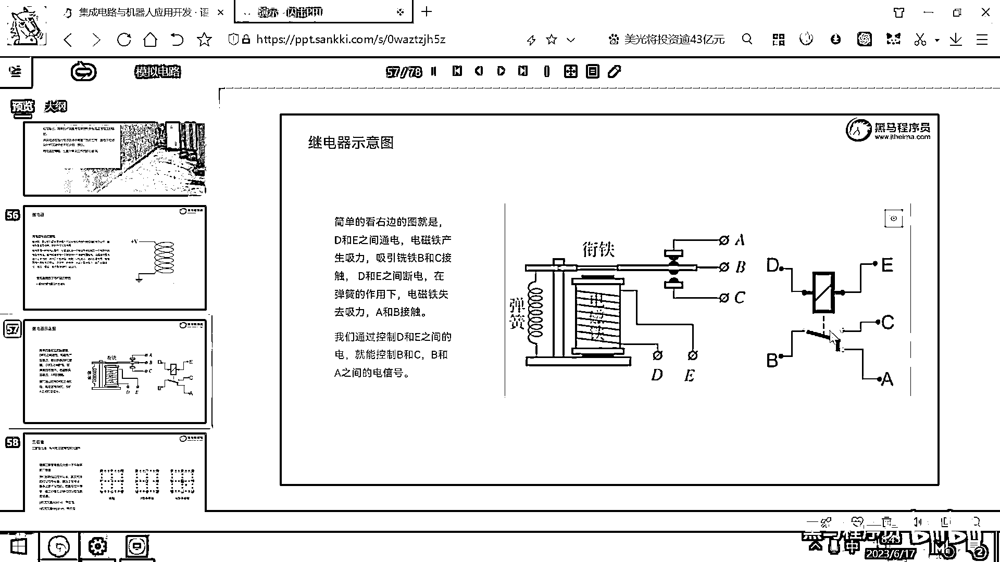

# 黑马程序员嵌入式开发入门模电（模拟电路）基础，从0到1搭建NE555模拟电路、制作电子琴，集成电路应用开发入门教程 - P32：33_继电器入门 - 黑马程序员 - BV1cM4y1s7Qk

好，那昨天一天呢，我们其实介绍的还是属于高中初中的物理知识，对吧？。

我们带大家呢，理解了一下什么是电压，什么是电流，为什么这个电流是从高电压的地方流向低电压，对吧？，这个是传统物理学的一个定义，那只要我们上面的电压比较高，是比如说正5伏的，下面的电压是0伏的。

就是GND，电压呢就会，，这个电流呢就会从高电压的地方往低电压的地方去流，然后除了这个欧姆定律之外呢，我们还给大家看了一些别的常见的电学实验，对吧？

。

好，那这个电容有什么作用，电感有什么作用，电容器呢是防止电压的突变，对吧？，那防止电压的突变，电容器呢就可以去储存一些能量，那后面呢我们也可以用电容器呢进行一些滤波，一些别的操作。，那电感呢。

它是防止电流的突变，对吧？所以很多电源模块后面都要接一个电感，这样可以让它输出的电流呢更加稳定。，那利用电容器和电感器，我们组成了这个LRC振荡电路，那可以通过一个电容还有电感。

形成一种交流电的振荡电路。，好，那利用欧姆定律呢，我们看到了这个分压器，对吧？那调不同的阻值，然后它对应的电压呢就不一样。，那利用分压器的原理，我们也可以做成这种电位器。。

那电学有这样三个比较重要的定理，前面的戴维宁定理和诺顿定理，它的作用呢就是把我们的电路进行等效简化。，那任何复杂的电路可以等效成一个电压源和一个电阻，这个是戴维宁。。

那任何复杂的电路可以等效为一个电流源和一个电阻，这个就是诺顿定理。，在分析电路的过程中呢，我们最常用的有一个定律呢，就叫基尔霍夫定律。。

它的作用呢就是流入一个节点的所有的电流一定等于流出这个节点的所有的电流。，利用这种方式呢，我们可以很方便的去计算出来某一个电路的电流。，好，那昨天的内容呢大概就是这么多，然后从今天开始呢。

我们就要进入到一个新的领域了，就是用电去控制电。。

好，之前的那些电路呢，都比较简单，对吧？，你一打开电路，那电容或者电感就开始就工作了，对吧？，那今天开始呢，我们就要去干一个新的事情，用这个电去控制电。，用电去控制电呢，是计算机工作的核心原理。。

那开关电路呢，实际上就是一种最基本的电路。，我们呢，可以利用开合关电流来去控制另外的一个电路。，开关电路呢，在我们现代电子技术当中呢，有着广泛的应用。，其实整个计算机的基石都是基于开关电路的。

都是用电在控制电。。

好，那行，我们先看一个最简单的开关电路，这个开关电路呢，就叫做继电器。，一旦你理解了继电器之后，那剩下来的所有的新的变种，都跟这个继电器呢，工作原理类似。，好，我们先看右边呢。

就有一个继电器的简化的示意图。，在昨天上课的时候，我们给大家做了一个实验，对吧？，拿了一个铜的金属线圈，我们给这个金属线圈两端加上电压之后，就产生了一个现象，这个线圈呢，就产生了磁场，对吧？。

那这个磁场就把金属物体呢，给吸起来了。，继电器它工作的原理呢，就是通电的线圈会产生磁，然后这个磁呢，可以把一些金属片呢，给吸起来。，好，那大家看在上方呢，我们加上了一个正V，这个就是正电压，对吧？。

那下面这个图呢，就是0伏，代表GND，或者是电磁的负极。，只要一通电的话，在这个线圈里面就产生了磁场，那这个磁场呢，就可以去吸合一些别的金属片。，好，那继电器啊，还有后面要讲的真空管，还有晶体管。

这些呢，它都是用电信号来控制开关的电子元件。，那我们呢，先看一下这个继电器，它到底是如何工作的。，好，为了方便理解呢，我右边这画了一个图，这个图呢，就是一个典型的继电器的抛面图。，好，在下方大家看。

这写的电磁铁，电磁铁，然后有两个端子，一个是D，一个是E。，那当D和E通电的时候，这个电磁铁是不是就产生磁性了，对吧？，那它一产生磁性，这个上面大家看，这有一块衔铁，那这个铁是不是就被这个磁铁吸下来了？

，那吸下来的话，大家看，之前B和C是导通的吗？，之前这个B和C是断开的，对吧？，那当这个D和E通电的时候，衔铁被吸下来，那这个B和C呢，就导通了，A和B呢，就断开了。，好，那这个图呢。

就是继电器工作的原理。，然后右边这有一个图呢，是一个继电器的四翼图，我们来看一下，这个D和E之间，实际上就是线圈，对吧？，线圈一通电就产生磁场，这个线圈一通电的话，就会把这个开关从下面吸到上面。

然后B和C呢，就导通。，默认情况下，B和A是导通的，对吧？，这个看明白了吧？，好，继电器这种元器件呢，它实际上成本呢，非常低，一个这样的继电器呢，大概就是两块钱左右。

。

那在上个世纪四五十年代，就你回到这个1940年，1950年，那个时候的计算机啊，就全都是用继电器搭建的。，你看这个背景图，实际上就是一台超级计算机，这台计算机虽然这么大，占据一百多个平方，对吧？。

有几十吨上百吨，它的运算效率呢，还不如现在你两块钱买的一个STC的单片机的性能高。，大家可以去想一下这一百年间这个科技变化的飞快，对吧？，但是核心的原理，现在手机里面芯片跟过去1940年。

1950年这个计算机工作的原理呢，还都是一模一样的。。

只不过变化的是什么呢？就是用更小的晶体管代替了之前的继电器，但工作的原理还是用电信号来去控制电信号。，这就是我们这个计算机的核心的原理。，为了方便大家理解这个继电器，我们先给大家看一下这个继电器的实物。

然后再带大家做一下继电器相关的仿真。。

