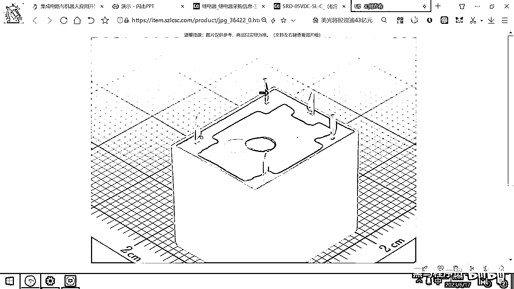
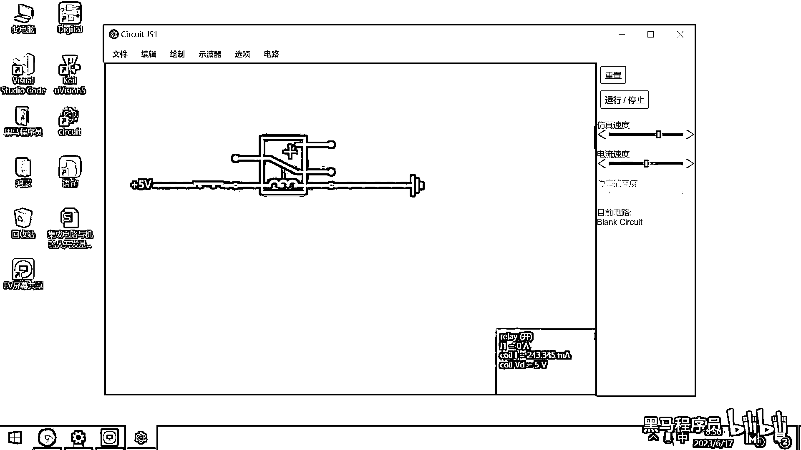
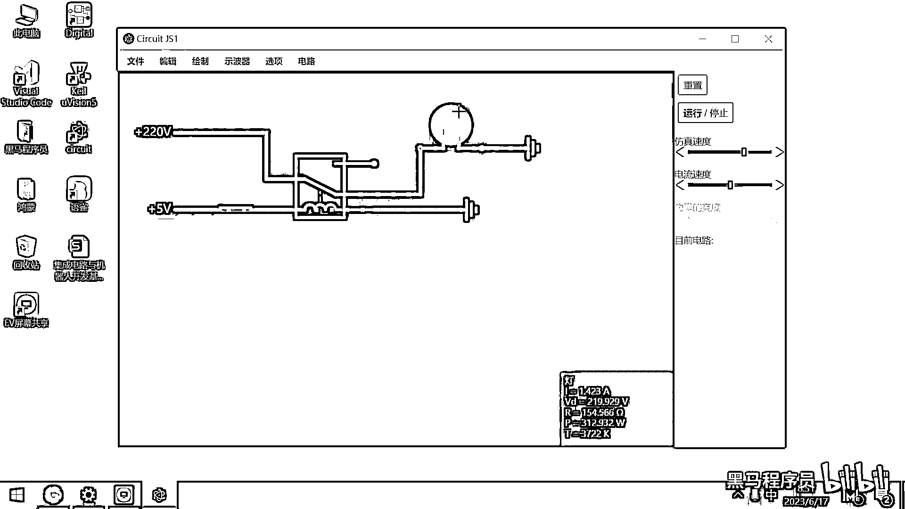

# 黑马程序员嵌入式开发入门模电（模拟电路）基础，从0到1搭建NE555模拟电路、制作电子琴，集成电路应用开发入门教程 - P33：34_继电器仿真 - 黑马程序员 - BV1cM4y1s7Qk

好 我们去打开这个力创商城。

好 那你就去搜一下这个继电器，好 这个继电器的种类很多，那我们找一个最方 最容易理解的，银角最少的，那就看这个销量就可以，好，那大家看一下，这有一个5伏的继电器，对吧，它大概长这个样子，这有一个大图。

大家看它大概长这个样子。

那你要关心的是，你看它的背面有几个针脚呀，它的背面有12345。

五个针脚，对吧，那刚才我们去看这个继电器的原理图，ABCDE是不是也是五个针脚呀。

也是五个针脚，对吧，那这继电器的五个针脚，到底有什么用呢。

我们来对照着这个数据手册，来给大家看一下，好，这个数据手册呢，画了一个简单的示意图。

这个示意图是不是跟我们刚才这个PPT里面的示意图非常类似。

对吧，我们对照着去看一下，好，这个一号银角和四号银角中间画了一个这个框框，这个框框实际上就是一个线圈的示意图，对吧，这个框框是一个线圈的示意图，然后右边你看真实的，这是四号银角，这是什么呀。

这是一号银角，对吧，一号银角和四号银角实际上是一个线圈，一旦你给一号银角接了一个正极，四号银角接了一个负极之后，这个线圈是不是就产生磁场了，这个磁场就会干什么呀。

就会把上面这个开关从三的这个位置给吸到二的这个位置，那实际上就变成什么了，就变成二号银角和五号银角导通了，对吧，那三号银角和五号银角就断开了，好，那继电器呢，它其实有两种缩法。

这个三和五这两个银角叫藏闭端口，这个二和五这个银角呢，叫藏开端口，藏闭和藏开什么意思，就是你在不通电的时候，如果默认是闭合的，那这两个端口呢，就叫藏闭，不通电的时候，如果是打开的，那这个二和五就是藏开。

对吧，这个理解了吧，这个理解了，好，那一旦大家理解了这个继电器，你就可以开发出来很多很实用的小的电子应用了，就比如说卫生间的一个自动冲水器，这个自动冲水器呢，它其实就是用继电器来去控制的，这个继电器。

通电的时候，我就把这个水龙头开关给打开，对吧，通电的时候，你就把这个就相当于是把这个阀门给打开，然后断电的时候，这个阀门呢就自动关闭了，那大家把这个开关，想象一下，它控制的就是一个水管，对吧。

因为我们是不是可以用电来去再去控制一个阀门啊，对吧，一通电的话，那个阀门就吸起来，就通水了，如果一断电，那个阀门掉下去，然后就水就被切断了，好，所以利用这样的继电器的小器件呢。

我们可以很方便的去开发出来各种各样的小应用。

好，那看完了这个数据手册还有它的工作原理之后呢。

我们带大家呢，简单的去画一个继电器。

进行一下仿真，好，打开昨天的这个软件叫CircuitJS。

我们去创建出来一个新的空白电路。

好，在这个电路里面大家看去绘制。

对吧，然后这个绘制里面呢，它有一个叫无源器件，你看这有一个叫什么呀，添加继电器，对吧。

我把这个继电器呢，给添加出来，好，这个继电器呢，大家看一下很容易理解，对吧，它有几个引脚呀，12345。

对吧，是不是跟刚才我们所看到的这个原理都是一样的。

跟这个实物图呢，也是一样的，12345，五个引脚。

好，那有了这五个引脚之后，我们如何去接这个线呢，我先去添加一个电源，我们去添加一个电源。

这是一个单端口的电压源，为了方便观察实验的效果。

我们在这呢，再添加一个开关，好，在这添加一个开关，把这个线呢，给连一下，对吧，好，那右边呢，我们再来一个接地，好，那大家去看一下这个仿真的现象，如果我把这个开关给断开，那大家想这个线圈有没有通电。

没有通电，对吧，没通电就没有磁场。

没有磁场的话，在这个弹簧的作用下。

你看继电器里面是不是有一个弹簧呀，在这个弹簧的作用下，是不是这个衔帖是靠上的呀，这个A和B是接通在一起的，对吧，因为这个弹簧在拉着这个衔帖。

所以这个A和B是藏B的。

A和B是藏B的，那我们仿真的结果也是这个地方是不是就是A呀，这个地方就是B，对吧，A和B是连接的，那我一按一下这个开关。

那大家看是不是衔帖就被吸下来了。

然后这个开关就跑到下面了，那对应我们的原理图是什么呀，这个就是对应的就是B和C连接在一起了。

对吧，B和C连接在一起了，好，那有了这样的一个电路原理图之后，我们就可以开发出来很实用的小应用了，我在这呢。

给给大家举一个例子，比如说我们添加一个小灯泡。

添加一个灯泡，这个灯泡怎么连呢，啊，这个灯泡是一端连在这个地方，然后另外一端呢。

也是接地，啊。

然后我们在在左边呢。

可以再去绘制出来一个电源。

这个电源呢，假设是220V的对吧。

这是一个，高压的，生活用电，好，那我们给大家进行一下仿真，我关闭这个开关，我关闭这个开关，好，一关闭这个开关，大家看一下这个现象，一关闭开关，这个是不是被吸下来了，对吧，然后我们这个灯是不是就亮起来了。

这个就是我的一个电灯泡，它就亮起来了，这个这个仿真软件呢，很有意思，他还会修改这个电灯泡的这个颜色，对吧。

这这个这个电灯泡啊。

已经炸掉了，对吧，因为它的额定电压是多少呀，120V对吧。

那那我们把它给改成220V，因为这个这个软件呢，也是老外开发的啊，在国外很多地方，他们的电压是110V，对吧，那我们这个地方是220V的，220V的啊，那这个灯呢，就亮起来了。

那大家想这个灯是不是可以换成各种各样的元器件啊，这个灯你可以把它给换成电机，这个灯呢，你可以把它给换成啊，各种各种插座的这个开关啊，这些你都可以灵活的去更换，好。

现在大家看这个5V的电压是不是我们手工的去控制的这个开关呀，对吧，等你后面学了单片机的开发啊，你就可以编写代码，让某一个电压是高电压或者低电压，哎，那你接收到了一个网络信号之后，你把这个电压呢。

给设置为一个高电压，哎，这个灯就亮了，然后你再发一个网络信号，把这个电压设置为低电压啊，这个灯呢，就灭了，那市面上的很多需要刷卡用的什么热水器呀，需要用蓝牙去控制的这个灯呀。

其实他们的核心原理都是有这样的一块电路，然后呢，你要干的这个事情就是用代码的方式去控制这个的电压。

到底是高电平，高电压还是低电压。