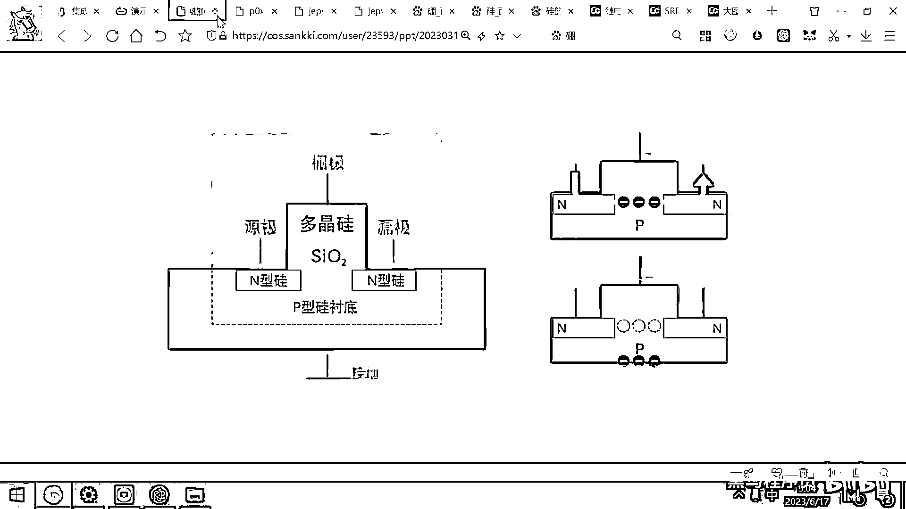

# 黑马程序员嵌入式开发入门模电（模拟电路）基础，从0到1搭建NE555模拟电路、制作电子琴，集成电路应用开发入门教程 - P34：35_三极管入门 - 黑马程序员 - BV1cM4y1s7Qk

理解了这个继电器工作的原理之后，那我们其实就已经掌握了这个叫，易经叫什么一生二二生四对吧，然后八八六十四，然后就组成各种各样的四间万物，那继电器呢，它其实这种用电去控制电的方法。

它就可以去组成各种各样的复杂的功能，这些功能呢我们后面会带大家去实现。

然后我在这先给大家看一个效果图，效果视频，这个视频呢也在昨天给大家共享的资料里，你看这有一个参考视频。

这个参考视频呢。

就是全部用继电器，然后搭建出来的一个计算机，不过这个计算机功能很简单，只能打印Hello world。

但是它这个效果呢还是蛮好的。

我给大家放一下，你看这有很多的继电器对吧。

它一开开关，啪啪啪啪啪，所有的继电器都在快速的跳动。

然后你看右边这个屏幕上呢，就打印了Hello world。

通过电信号的开关，然后实现了屏幕上的打印。

那我们后面呢也会带着大家呢，去做一个类似这样的计算机，不过功能比它更强大一点，还可以编写汇编代码，然后进行运算。

当然我们做的这个计算机呢。

是基于这种仿真软件仿真出来的。

那这个计算机搭建出来最大的，就是最大的壁垒是什么呢，实际上在于成本，因为如果你要做一个能够编程的计算机，大概需要两三千个继电器，那硬件成本呢，可能在四五千块钱左右。

限制你做出来的实际上是成本。

好那继电器理解之后呢，我们接下来的话呢，就给大家去介绍一些更小的，功耗更低的用电去控制电的元器件，你看这个元器件还有什么呀，真空管晶体管对吧，我们先看最简单的一个东西，是叫二级管，因为要想理解三级管。

必须呢，要先去理解二级管，三级管呢，是一种用电去控制电的元器件，那三级管，它是怎么去做的呢，为啥叫三级，为啥叫三级管，我们要先给大家介绍一下，什么是二级管，好那大家都听说过半导体对吧。

那说这个硅呢是半导体，实际上呢，纯净的硅是不导电的，这个硅是怎么做出来的呢，硅实际上是地球上最多的一个元素。

这个元素就是硅，砂质的主要成分呢就是硅。

砂质的主要成分就是硅，那这个硅呢，你把这个砂子呀。

然后烧一烧，然后把里面这个硅提炼出来，这个硅金属呢。

大概就长这个样子，大家看一下，把二氧化硅里面的硅提炼出来。

这个硅单字呢，大概就长这个样子，那纯净的硅呢。

它的这个，它的这个结构是这样的，你看中间是这个硅的原子核对吧，那周围是什么呢，周围是八个电子对吧，然后它全部都是这样的一个结构，每一个硅周围呢都有八个电子，它形成了一个非常稳定的结构。

所以纯净的硅呢是不导电的，基本上就是一个绝缘体，纯净的硅是不导电的，好，但是呢，有一些大牛对吧，然后他做实验的时候，他发现如果这个硅不太纯净，发现它突然间就导起电了，那现在呢就有两种不纯净的硅了。

第一种硅呢，大家看一下，第一种第一种带杂质的这个硅，它参的是什么呢，是三价的鹏，这个高中化学我们学过，有一种元素叫，叫鹏对吧。

这个鹏它的。

它带几个电荷呢，它带三个正电荷。

这个鹏呢是三价的，鹏是三价的，那大家想，如果这个鹏带三个电荷的话，硅是带四个电荷的对吧，这个鹏带三个电荷。

你看这右边是不是就多出来了一个空洞呀。

对吧，这多出来了一个空洞，多出来一个空洞，那多出来一个空洞的话，这个空洞实际上是少了一个电子，对吧，少了一个电子，那整体呢，这样一种参杂出来的半导体呀，它就整体少了一个电子，少了一个电子。

电子是负电的对吧，那整体这个参杂之后的半导体就显正电。

好，所以呢，我们看这个下面讲叫P型半导体，P什么意思呢，P就是positive，正的意思，就是带正电。

那同样呢，还有一种参杂方式呢，就是在硅的里面呢，参一些铃，鹏是三价的。

铃是五价的，对吧，那如果你在这个里面参杂一下这个五价的铃，那会出来一个什么情况呀，本来鹏，本来这个硅是四个电子，对吧，在这儿把周围的这四个位给占据掉，然后两两结合，形成八电子的这个稳定结构，那现在呢。

你在这儿放了一个鹏，这个鹏它多了一个电子，那是不是就在这儿杵着呀，对吧，那整体这个N型半导体呢，它多一个电子，所以呢，它就带负电，好，这个就是P型半导体和N型半导体的区别，P型半导体参杂的有三架鹏。

N型半导体呢，参杂的有五架的铃，P型半导体呢，带正电，N型半导体呢，带负电，好，那理解了这样一个背景之后，我们接下来呢，就可以看下面这个图了，好，二极管，二极管，它其实就是把两种极性的半导体。

贴在一起就组成了二极管，好，那大家去看一下右边的这个电路，好，这个电路呢，我把大图打开。

看的方便一些，好，那大家想P型半导体是positive，说明什么呀，它里头有空洞，对吧。

这个P里面是不是有洞啊，再看一下，这个P型半导体里面有洞。

对吧，有这个空穴，然后这个N型半导体里面有什么呀，有多余的电子，对吧，N型半导体里面有多余的电子。

好，那现在呢，如果我这个半导体，我对它通电，这个左边呢，是电池的正极，右边是电池的负极，那我们知道负负相次，对吧，那负极呢，它会发射电子，这个电子是不是就推着N区那些多余的电子往左跑呀。

那这些多余的电子往左跑了，这个P型半导体里面是不是正好还有一些空洞呀，对吧，它就可以跳到这个空洞里，然后右边呢，不停的有人挤，然后左边呢，它就被挤出去，挤出去的话，这左边还有电池的正极。

又可以吸收这个负电荷，所以呢，最终这条路呢，就导通了，电流呢，就是从正极流向负极，这是传统物理的电流方向，从正极流向负极，实际上从微观上讲是啥呀，是一个一个的电子，从这个N极跑到这个P极。

然后再跑到电池的这个正极，对吧，这个图大家看明白了吧，好，那我们来看二极管为啥具有一个特性，叫反向截止，我把这个电池的正负极调换了一下，现在这个电池的正极在这儿，对吧，然后负极在左边。

那大家想电池正极在这儿了，正极是不是会吸收电子呀，那他就把这个N型半导体里面的这些游离的电子，全都给吸到这个边缘了，吸到这个边缘了，那我们我们看这个地方是负极，对吧，这个负极。

现在有没有这个电子能能过来呀，为什么没有啊，大家想一下这样一个现象，就是如果这个公交车上面挤满了人挤满了人，然后公交车司机一般都会说，中间的乘客请往后门移动，对吧，后面空着呢，往后面走。

这样的话是不是才可以前门上人，后门下人呀，对吧，那如果一个公交车上所有的人都堵在这个前门了，你想一下，所有的人都堵在这个前门了，然后还还能，即便是后面还有很多空位，那这个乘客还能上来吗，上不来了，对吧。

那这这样反向一接通的话，这个P里面有很多的空洞，有很多的空洞，然后呢，又没有电子去填充这些空洞，然后这个N里面呢，有很多电子又被吸到了这一端，好，所以呢，整个这个电路呢，就表现出来了一个反向截止的特性。

那电子呢不能再不能越过，越过这个PN截，不能越过中间的这一块，那整个这个电路呢就断开了，好，所以呢，二极管呢有一个特性是什么呀，是叫正向导通，反向截止，二极管的符号，大家看一下这个我们以后会经常用到。

这个电流呢可以从左边流到右边，但不能呢，从右边流到这个左边。

好，那看完了这个二极管之后，我们就可以很方便的去理解三极管了，好，三极管它是怎么去做的呢，我这右边呢有一个图，大家把这样一个图呢给理解一下，你就明白这个三极管工作的原理了，好。

你先把这个三极管呢当成是一个水龙头，当成是一个水龙头，如果我们打开这个水龙头，底下这个水流呢就可以流动，如果我关闭这个水龙头。

底下的水呢就不能流动了。

好，那我们去看一下这个大图，大家想一想能不能，大家看一下能不能理解。

这个三极管到底是如何工作的，好，我右边的这个图呢实际上是，是这个比较特殊的三极管，是这个貌似管，但貌似管呢比三极管更容易理解，我就把这个图贴到这儿了，好，我们来去瞧一下它的这个结构，为啥叫三极管。

因为你看整个这个制作出来，它有一块N型半导体在这儿，对吧，然后呢，有一块N型半导体在这儿，然后下面呢又有一块P型半导体，在下面去做这种蹭底，有一个N，有一个P，有一个N，好，有这样的三种极性的半导体。

把它结合在一起，所以这个就叫三极管，好，那现在呢我们来去观察一下，这个三极管为啥有的时候可以打开，有的时候可以关闭，你看这有一个N型，N型代表什么呀，negative，说明里头有很多的游离的电子，对吧。

好，这些电子呢，你给它一施加电场，它就会移动，好，这个地方也是N型半导体，那说明有很多电子在这儿游离着，然后P型半导体里面是什么呀，是很多空洞，对吧，是很多空洞，好，那这个空洞呢，它就带正电了，好。

现在呢，大家看右边这个图，如果我在这个三极管的上方，施加一个正电压，施加一个正电压，那大家想正电压，它是不是会吸引电荷呀，对吧，正电压会吸引这个电子，那它就会在这个地方呢，吸引到游离的这个电子。

有了这个电子之后，那大家看这个电路是不是就导通了，我们说电场的建立原因呢，是一个电子挤另外一个电子，另外一个电子挤另外一个电子，它们互相挤，这个电场才建立起来，对吧，那所以这儿我加一个正电压。

这这个空洞里面吸引了几个电子，好，然后，是不是我这边一通电，然后电子挤电子，电子挤电子，然后这条路就打开了，电流就产生了，对吧，那如果我在这个上面加一个负电压，这这个是负极，那负极的话。

大家知道它会排斥电子，对吧，那它就把这几个电子给排斥到下方了，排斥到下方之后，大家看是不是多了几个空洞呀，多了几个空洞之后，那电流还能流通吗，这个就相当于是导线断开了，你这边N虽然有很多电子。

电子挤电子，电子挤电子，但挤到这之后，还有人可以挤吗，这个电场力传递不下去了，对吧，好，这就断开了，那这个电流呢就断开了，好，那通过这样的一个图呢，大家呢就可以去理解一下三极管工作的原理。

它其实就是加上正电压，把这个电子吸过来，形成了一条通道，然后电流呢就流通了，加上一个负电压，把电子全都排斥走了，然后这有很多空穴，就相当于电路断开了，那我们我们这个电流呢就没办法导通了。

这个就是三极管工作的原理，那明白了这个原理之后呢，我们以后再想用电去控制电就非常简单了，我是不是在这加一个正电压，然后下面这两条路就导通了，对吧，我在这加一个负电压，下面这两条路是不是就断开了，对吧。

当我们把电路中的电源模块，然后接到这个控制端或者叫信号端的时候，如果你接的像这种NPN类型的，如果你接的是正电压，然后它就会导通，如果你接的是负电压，它就会断开，这个呢就是三极管工作的原理，好。

那三极管呢，有有这样的一个图，这个图大家看一下，这个B呢就相当于是它的控制端或者是信号端，这个B端呢，如果我们给一个高电压，对吧，给一个高电压，那就会有电流通过，然后这个C和E呢就导通，如果这个B端呢。

我们给一个低电压，这个C和E呢就断开，好，这个三极管呢是一个非常非常伟大的发明，三极管呢，它的这个体积现在可以做到纳米级别，那大家用的电脑里面的CPU，手机里面的各种各样的芯片。

它里头其实全都是有这样的三极管，还有还有像这样的貌似管所组成的，那这个三极管和貌似管呢，在在我们的物理学上统称叫晶体管，叫晶体管，正是由于这个晶体管的体积都做到纳米级别了，所以呢，它非常的省电。

然后你的这个CPU的体积呢又非常的小，一个CPU现在上面呢，可能有几十亿上百亿个晶体管，那大家想。

如果你是上百亿个继电器，那这个耗电量会有会有多大。

这个体积会有多大，对吧，上百亿个这个东西好吓人的。

那科技的进步呢，可以把上百亿个晶体管，集成到一个很小的CPU芯片里面，到影片里面。

