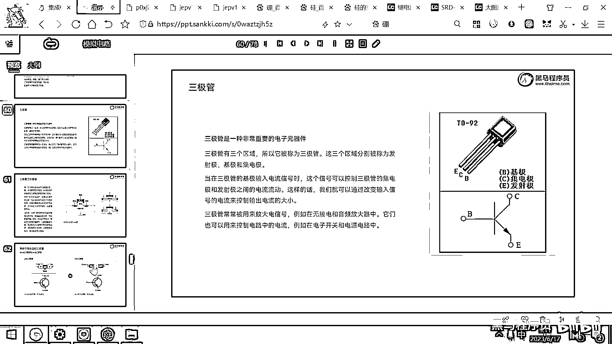
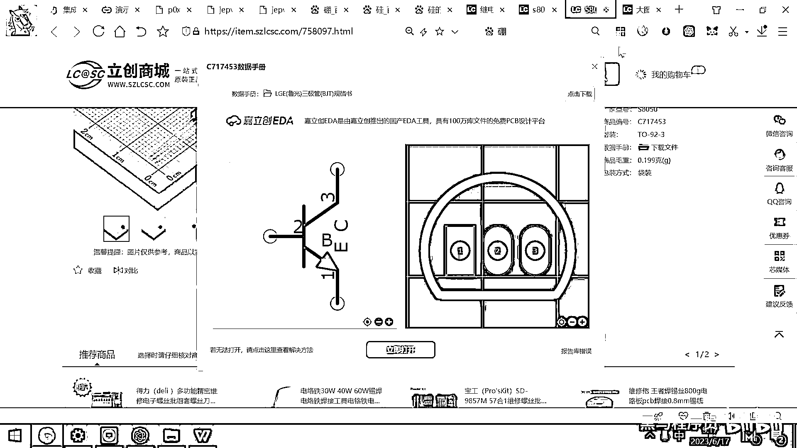
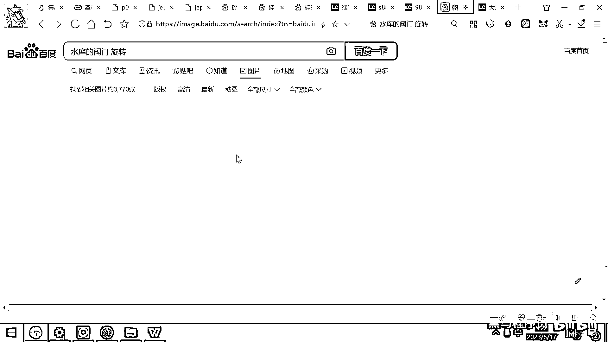

# 黑马程序员嵌入式开发入门模电（模拟电路）基础，从0到1搭建NE555模拟电路、制作电子琴，集成电路应用开发入门教程 - P35：36_npn三极管仿真 - 黑马程序员 - BV1cM4y1s7Qk

好，那下面我们再详细的带大家讨论一下三极管，如果大家在大学学过模拟电路，三极管其实还是一个很大的模块，然后他会详细的去介绍三极管的工作原理，然后讲三极管这几个极之间有什么区别。

然后讲一大堆三极管的物理特性，其实这些东西，你们在工作当中都用不到，我们用三极管最重要的就是，怎么把它给放到电路里面，怎么用三极管去实现你的功能，就其实更重要的是应用。

而不是讲它内部这几个pn节到底是怎么连在一起的，我们先把它给用熟了，然后再带大家去看对应的图。

好，还是打开我们的Circuit GS的工具。

我们带大家来玩一玩三极管。

好，这个三极管大家去看一下，在你的里面，它有一个叫有源元件，然后这里面大家看一下有什么，添加NPN双极性晶体管，这个其实就是三极管，另外大家看这个字母是小写的N，还有一个字母是什么，大写的N，对吧。

N勾到的什么实际上就是MOS管，实际上不管是三极管，三不管是三极管，MOS管，它其实都是有三个极性的晶体管，他们只是电器特性不太一样罢了，好。

那我那先放一个这样的晶体管出来。

好，那大家看一下，它有这样的三个端子，对吧，有三个引脚，好。

这三个引脚分别是什么呢，它对应的就是这个图里面的BCE。

好，BCE，好，这个B实际上就是我们的控制端，你在这加一个高电压，这个C和E就导通，你在这加一个低电压，这个C和E就节制，好。

那我们做个实验来去观察一下现象。

大家就明白这个东西怎么用了，好。

我们添加出来一个开关，我在这加一个开关。

那开关的左边呢，我再去绘制一个电压源。

好，在这里面呢，来一个电压源，好，然后呢，我把这个给连通，这个给连通，好，那右边的话呢。

这个上方的我们也是去绘制一个电压源，也搞一个5伏的。

绘制一个电压源，好，然后在这个下方呢，其实我可以放置一个灯呀。

放置一个什么都可以，我们为了观察实验的现象，我现在就去放一个放一个电灯了，这个灯跑到哪去了，输入器件，添加一个，诶，我们添加一个灯。

方便观察。

诶，怎么灯找不到了，开关，输出标签，我们添加一个灯，好，这个灯呢。

我们现在就添加LED灯了，LED灯呢，它有一个特点，就是只能从正极流向负极，对吧，好，那这样去接，我们呢，来去在这个下方呢，再接一个D，好，那大家去看一下，现在呢，其实这个电路呢，已经导通了，对吧。

我把这个开关给断开，是不是，开关一断开，这个灯就灭掉了，对吧，我把这个开关，一连接起来，然后这个灯呢，就亮起来了，好，那大家看这个电路的工作效果，是不是跟刚才我们用继电器的效果，是一模一样的呀，对吧。

继电器，你把一个开关给关掉，然后它，它就会在这个电路上，断开了，然后呢，它就会在这个电路上，断开，然后呢，它就会在这个电路上，断开，然后呢。

它就会在这个电路上。

断开，然后呢，它就会在这个电路上，断开，然后呢，它就会在这个电路上，断开，然后呢，它就会在这个电路上，断开，然后呢，它就会在这个电路上，断开，然后呢，它就会在这个电路上，断开，然后呢。

它就会在这个电路上。

断开，然后呢，它就会在这个电路上，断开，然后呢，它就会在这个电路上，断开，然后呢，它就会在这个电路上，断开，然后呢。

它就会在这个电路上。

断开，然后呢，它就会在这个电路上，断开，然后呢，它就会在这个电路上。

断开，然后呢，它就会在这个电路上，断开，然后呢，它就会在这个电路上，断开，然后呢，它就会在这个电路上，断开，然后呢，它就会在这个电路上，断开，然后呢，它就会在这个电路上，断开，然后呢。

它就会在这个电路上，断开，然后呢，它就会在这个电路上，断开，然后呢，它就会在这个电路上。

断开，然后呢，它就会在这个电路上，断开，然后呢，它就会在这个电路上，断开，然后呢，它就会在这个电路上。

断开。

然后呢，它就会在这个电路上，断开，然后呢，它就会在这个电路上，断开，然后呢，它就会在这个电路上，断开，然后呢，它就会在这个电路上，断开，然后呢，它就会在这个电路上，断开，然后呢，它就会在这个电路上。

断开，然后呢，它就会在这个电路上，断开，然后呢，它就会在这个电路上，断开，然后呢，它就会在这个电路上。

断开。

然后呢，它就会在这个电路上，断开，然后呢，它就会在这个电路上。

断开，然后呢，它就会在这个电路上，断开，然后呢，它就会在这个电路上，断开，然后呢，它就会在这个电路上，断开，然后呢，它就会在这个电路上，断开，然后呢，它就会在这个电路上，断开，然后呢。

它就会在这个电路上，断开，然后呢，它就会在这个电路上。

断开，然后呢，它就会在这个电路上，断开，然后呢，它就会在这个电路上，断开，然后呢，它就会在这个电路上，断开，然后呢，它就会在这个电路上，断开，然后呢，它就会在这个电路上，断开，然后呢。

它就会在这个电路上，断开，然后呢。

它就会在这个电路上，断开，然后呢，它就会在这个电路上，断开，然后呢，它就会在这个电路上，断开，然后呢，它就会在这个电路上，断开，然后呢，它就会在这个电路上，断开，然后呢，它就会在这个电路上，断开。

然后呢，它就会在这个电路上，断开，然后呢，它就会在这个电路上，断开，然后呢，它就会在这个电路上，断开，然后呢，它就会在这个电路上，断开，然后呢，它就会在这个电路上，断开，然后呢，它就会在这个电路上。

断开。

然后呢，它就会在这个电路上，断开，然后呢，它就会在这个电路上。

断开，然后呢，它就会在这个电路上，断开，然后呢，它就会在这个电路上，断开，然后呢，它就会在这个电路上，断开，然后呢，它就会在这个电路上，断开，然后呢，它就会在这个电路上，断开，然后呢。

它就会在这个电路上，断开，然后呢，它就会在这个电路上，断开，然后呢，它就会在这个电路上，断开，然后呢，它就会在这个电路上，断开，然后呢，它就会在这个电路上，断开，然后呢，它就会在这个电路上，断开。

然后呢。

它就会在这个电路上，断开，然后呢，它就会在这个电路上。

断开，然后呢，它就会在这个电路上，断开，然后呢，它就会在这个电路上，断开，然后呢，它就会在这个电路上，断开，然后呢，它就会在这个电路上，断开，然后呢，它就会在这个电路上，断开，然后呢。

它就会在这个电路上，断开，然后呢，它就会在这个电路上，断开，然后呢，它就会在这个电路上，断开，然后呢，它就会在这个电路上，断开，然后呢，它就会在这个电路上，断开，然后呢，它就会在这个电路上，断开。

然后呢，它就会在这个电路上，断开，然后呢，它就会在这个电路上，断开，然后呢，它就会在这个电路上，断开，然后呢，它就会在这个电路上，断开，然后呢，它就会在这个电路上，断开，然后呢，它就会在这个电路上。

断开，然后呢，它就会在这个电路上，断开，然后呢，它就会在这个电路上，断开，然后呢，它就会在这个电路上，断开，然后呢，它就会在这个电路上，断开，然后呢，它就会在这个电路上，断开，然后呢。

它就会在这个电路上，断开，然后呢，它就会在这个电路上，断开，然后呢，它就会在这个电路上，断开，然后呢。

它就会在这个电路上。

断开，然后呢，它就会在这个电路上，断开，然后呢。

它就会在这个电路上，断开，然后呢，它就会在这个电路上，断开，然后呢，它就会在这个电路上，断开，然后呢。

它就会在这个电路上。

断开，然后呢，它就会在这个电路上，断开，然后呢，它就会在这个电路上，断开，然后呢，如果呢，你的这个电压没有超过0。6伏，那你的这个电路呢，其实是就打不开的，好，这是这样的一个参数，然后呢，他讲。

下面还有一个参数呢，是三极管的这个放大倍数，三极管的放大倍数，三极管的，嗯，这个文档写的，嗯，这个文档里面。

他没有去写当前这个三极管的放大倍数。

好，那在这个仿真软件里面呢，其实大家看一下这个编辑，然后这里面呢，这里面其实有一个默认参数，这个参数是100，也就是说这个三极管呢，它的放大倍数呢，有100倍，这也是我们用三极管时候需要关心的一个参数。

好，在这呢，继续给大家做一些仿真了，我把这个电压呢，给调成700毫伏，好，那大家去看一下，700毫伏或者0。7伏的时候，这个左边是不是这个电子也在移动啊，你看一下这个左边，你仔细观察一下。

我把这个电流速度调快一点，这左边是不是也有电流在流动啊，然后这个从上到下也有电流流，但从上到下流动的这个速度呢，会更快，对吧，那三极管呢，有一个特性呢，就是叫放大放大的这个性能。

它可以用一个小小信号的电流把它给放大成一个很大的这个电流，这个就有点类似于四两拨千斤的这个概念了，对吧，那像水库里面的这个大坝，它的放水量呢，是非常非常非常非常大的，但是呢。

普通人还是可以去转动这个开关的。

这个开关它是怎么去设计的呀，我们看一个图叫水库的阀门，好。

那大家呢，去看一下这个水库的这个阀门。

这个阀门就是这个样子的，你去扭什么呀，你去扭这个旋钮。

然后最终呢，这个地方就会出水，对吧，你扭这个旋钮的力气是不是很小呀，但这个水流最终这个水量呢，是非常非常大的，好。

这个就相当于是用一个小电流来去控制一个大电流啊。

这也是我们三极管的一个重要的特性。

谢谢。