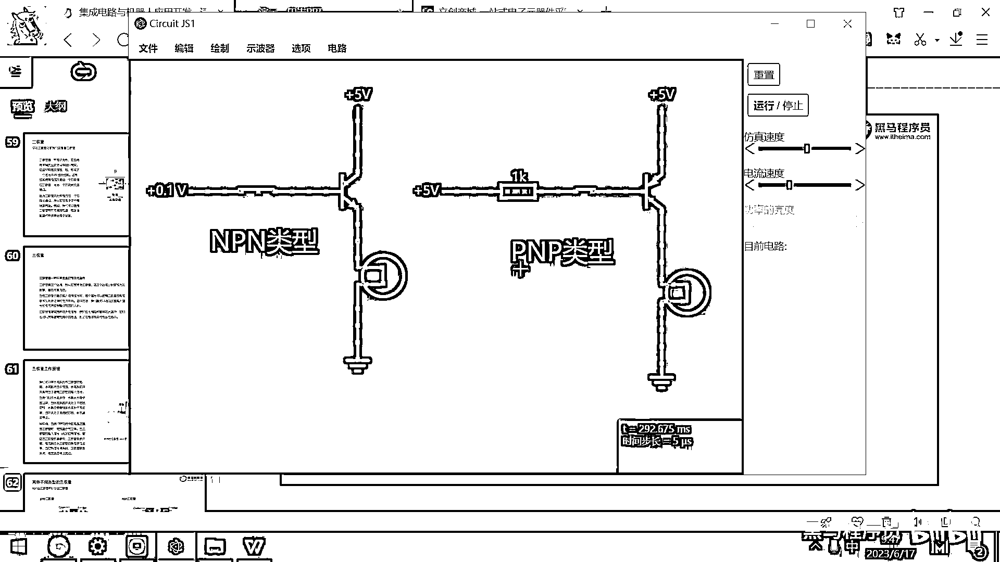
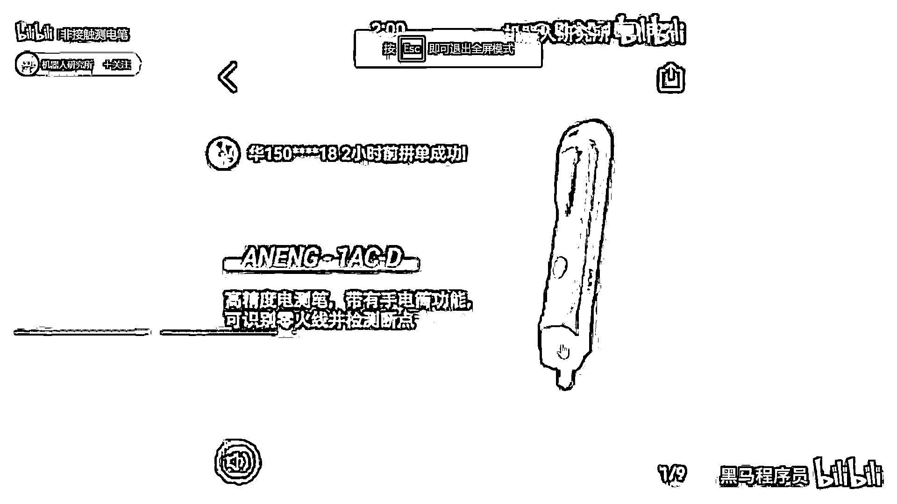

# 黑马程序员嵌入式开发入门模电（模拟电路）基础，从0到1搭建NE555模拟电路、制作电子琴，集成电路应用开发入门教程 - P37：38_三极管的放大特性 - 黑马程序员 - BV1cM4y1s7Qk

好 那三级管呢 两种类型我们就给大家介绍完了。

那接下来的话呢 我们再看一下三级管的一个重要的应用场景。

这个应用场景呢 就是三级管的放大特性，一般来讲呢 讲这个摩电 说到三级管 都要去讲这个三级管的放大特性。

放大特性呢 就是可以用小电流去控制大电流。

可以让小电流放大成大电流，好 那这种放大特性呢 一般都是从几十倍到几百倍之间的。

这个跟元器件的特性有关，你去看这个数据手册 有的数据手册会标出来，它所对应的放大特性，这个放大特性 大家看一下 这个值就是。

β值就是100 放大100。

那三级管的放大特性有什么用处呢，我们给大家看一个现实生活中的案例。

这个案例呢 是拼多多上的一个叫非接触测电笔。

那我们看一下这个视频。

大家看这个笔呢 大概就长这个样子。

外面是一个塑料壳，然后呢 它的特点是什么，这个播放的功能不太友好。

它的特点是 你不用接触电线。

你不用接触它 你离它还有一定的距离，然后你拿着这个笔呢。

你看装两个电池 对吧，装上之后。

装上之后，你看 它就做实验了。

把这个笔往火线这个地方一放，然后这个灯就开始闪烁。

然后往这个零线这个地方放，这个灯就不闪烁，那这个就是非接触的测电笔。

你看 往这一放，这个灯亮了。

往这一放 这个灯不亮，说明这个线有电 这个线没电。

你看这个线断了之后，它这个灯也不闪 对吧，好 这是拼多多上的一些笔。

好 这个笔呢，它在网上卖29块9，但它实际上的成本呢，大概就两块钱左右，我们来带大家去分析一下，这个笔到底是怎么做出来的。

好 这个笔呢。

它的内部原理非常简单，就是利用这个三极管的放大特性，利用三极管的放大特性，好 右边呢，我画了一个非常简易的示意图，这个示意图右边，大家看这是啥呀，这是电池 对吧，两节五号电池就相当于三伏。

好 这个三伏电池，左边这有一个记忆，这个记忆呢，实际上是一小块金属片，就是一小块金属片，这个金属片它连上了一个三极管，对吧，然后这个三极管的输出，它是不是又连了一个三极管，然后这个输出呢。

又连了一个三极管，并且连了一个LED灯，连了一个LED灯，好 那如果这个灯亮了，就说明这一条电线是有电的，是火线，如果这个灯没亮，就说明这条电呢是零线，零线是接地的，对吧，零线是零伏的，是没有电的。

好 那现在呢，为啥这样一个简单的电路，就可以实现这个效果呢，原因的就是，记忆呢，它是一块金属片，金属片呢，它就相当于是电容的一极，就相当于是电容的一极，电容就是两块金属薄板，然后靠近就组成了电容，对吧。

那记忆靠近这个火线的时候，因为火线是交流电，火线上的这个电压呢，实际上是从正的一百，正的二百二，然后降到零，然后再升到，再降到负的二百二，然后再升到正的二百二，它是一秒钟五十赫兹的，正旋波的变化。

那大家想这个电压，在快速的变化，是不是就会带来这个电流，还有磁场的变化，所以呢，你的这个插座交流电口呀，周围是有磁场的变化的，那磁场一变化，在这个记忆端呢，就可以感应出来，非常非常微弱的电流。

这个电流经过一个三级管放大之后，又经过一个三级管放大，再经过一个三级管放大，经过这样的三级放大之后，产生的电流呢，就有好几十毫安了，就可以把这个LED灯呢给点亮，这个就是金属。

非接触测电比的最核心的原理，好那我们来评估一下成本，好这个QE呀，是一个三级管，这个是什么类型的，大家还还能看出来吧，这个是什么类型呀，NPN类型的，对吧。

那所以是有正的电压。

然后它就导通，对吧，那那我们看这个S8050，刚才看这个NPN类型的三级管了。

然后我们在这个商城上，然后去看一下它的价格，好那这一个三级管的话，它的价格大概就是六分钱，对吧，六分钱买的多了还更便宜。

买五万个才三分钱，好一个三级管呢六分钱，三个三级管呢，可能就是一毛钱，对吧，然后再加上这个灯呢一毛钱，然后电池两个，电池两个一块钱，好所以再加上这个电路板，那整个这个硬件成本呢，可能大概就是一块钱。

然后它还做了一个塑料的外壳，塑料外壳注数的话，这个成本大概就是一两毛钱，一个这种塑料外壳，你喝的我们喝的这些矿泉水瓶，都是注数出来的，只要你开好这个膜，然后注数塑料外壳一毛钱。

所以呢它整个这个硬件产品的成本呢。

可能大概就是两块钱，它卖29块9，然后再加上几块钱的油费，所以呢只要这个东西卖的数量大。

这个利润呢还是非常可观的，但它真正的原理，就是这样一个三级放大的原理，由于呢这个模拟器，它并不能真实的去仿真这种东西，你这个画完之后，它模拟出来这个效果不太好，那这个电路呢，我就不带着大家模拟了。

那等到我们画PCB的时候，大家如果有兴趣，可以去画一个这个电路，打一块小板子，然后把这几个东西一焊，你就可以去测出来，插住哪一个是零线。

哪一个是火箱。

一个是火箱不用接触它就可以，谢谢欢迎订阅点赞点分享。