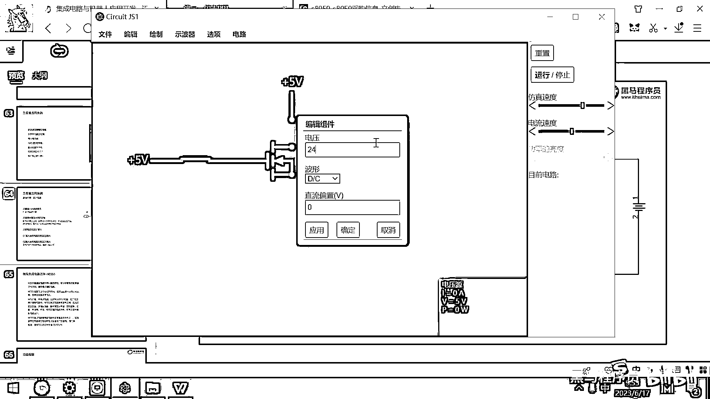

# 黑马程序员嵌入式开发入门模电（模拟电路）基础，从0到1搭建NE555模拟电路、制作电子琴，集成电路应用开发入门教程 - P38：39_mos管和三极管 - 黑马程序员 - BV1cM4y1s7Qk

三极管属于上个世纪七八十年代发明出来的一个元器件。

然后现在又有了一个更高级的三极管，这个三极管叫MOS管，这个MOS管大家看一下，它长得跟三极管类似，也是有一个控制端，然后有一个D端，有一个S端，我们不去讲它具体的物理学的术语名词。

我们只讲它的应用。

这个应用大家看一下，跟之前的应用方法还是一模一样的。

我在这搞一个五伏的电压源。

然后在这绘制一个开关，绘制一个开关。

然后在这去导通，在这去导通，然后在上方，我们再去绘制一个电压源，这个电压源可以让它电压高一点。

假设是一个24伏的我们的24伏的热水阀。

这个热水阀打开水就流通，这个热水阀关闭，这个水就断开，我把这个给连一下。

然后下面我们也是接一个电灯就可以。

比如说我在这来一个灯泡，最下面是来一个GND，大家看这个效果，实际上跟刚才的效果是一样的，你把这个开关断开，现在是零伏，然后电路就断开，然后把这个开关闭合，电路就导通，这个貌似管有一个特点。

就是它耐压值会比较高，很多貌似管耐压值可以到几百伏。

另外还有一点就是貌似管比三极管更省电，貌似管它是一个电压控制的元件，就只要有电压，然后它就会导通，这一端控制极基本上不耗电，而三极管是一个电流控制的元器件，它导通的时候，这里面还会有小的电流通过。

所以三极管与貌似管相比来讲，是有一些缺点的，三极管它有一些耗电，貌似管三极管通过电流来控制，它有一些耗电，貌似管通过电压控制，这个控制极基本上不耗电，另外貌似管它可以有很高的耐压值，有很高的耐压值。

所以像很多这种功率控制的器件，电机驱动，它内部都已经不再用三极管了，而是用貌似管，这些东西只是换了一个名词。

用了一个更先进的技术，对吧，用起来也都是一模一样的，你看刚才我们用了NPN类型的三极管，对吧，跟N钩道的貌似管，实际上是完完全全一模一样的，我们刚才还用了一个三极管。

叫PNP类型的三极管。

对吧，这还有一个叫P钩道的貌似管，这个用法跟刚才也是一模一样的，低电压的时候，D和S导通，高电压的时候，D和S断开，这是貌似管。

后面我们课程里面也会应用到。

