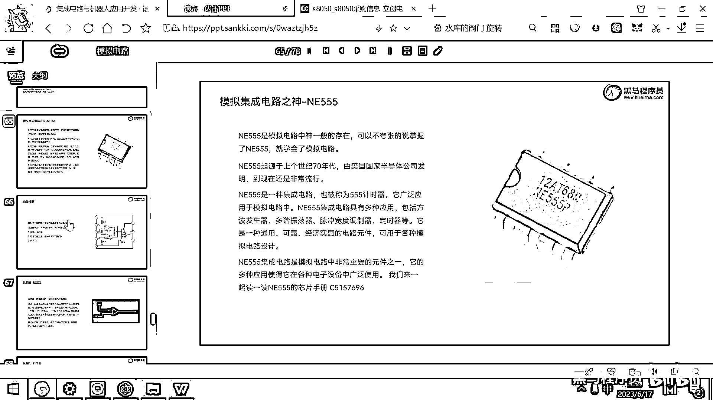
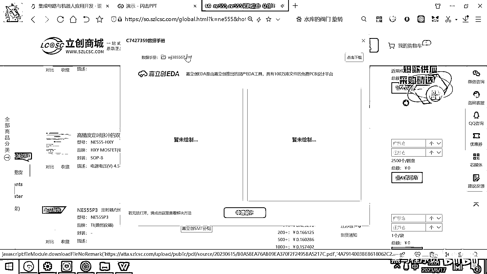
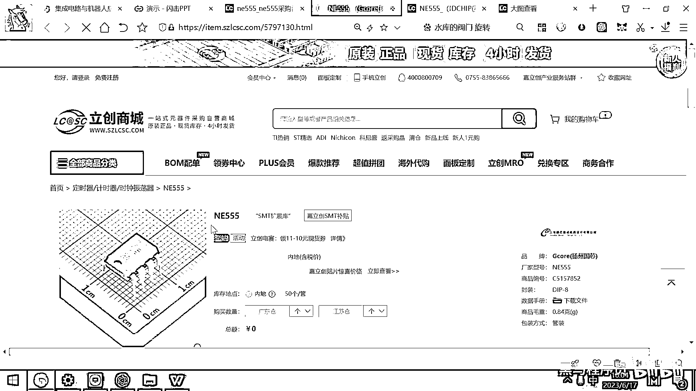
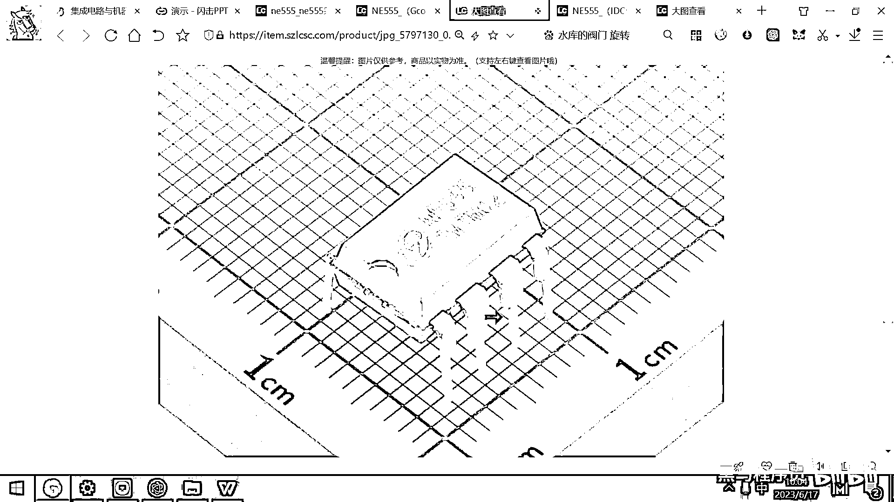
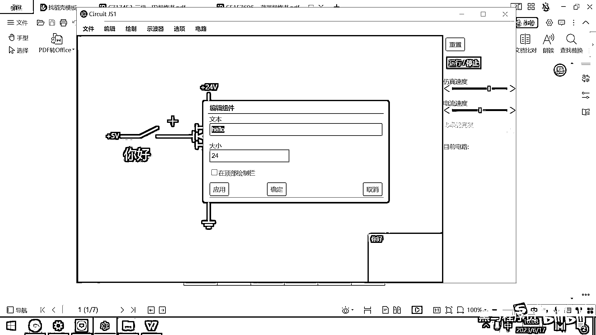

# 黑马程序员嵌入式开发入门模电（模拟电路）基础，从0到1搭建NE555模拟电路、制作电子琴，集成电路应用开发入门教程 - P39：40_ne555简介 - 黑马程序员 - BV1cM4y1s7Qk

领基础许爱蹄月薪过万，就来黑马程序员，好。

那接下来的时间，今天我们就要带大家去讲解一个重要的，芯片，这个芯片叫N155，N155，它是整个模拟电路里面，神一般存在的芯片，这个芯片从上个世纪70年代，被发明出来，到现在已经生产了上百亿颗。

这颗芯片已经生产了上百亿颗，如果大家大学去学模拟电路，基本上磨电的最后一个大作业，就是用N155去做一个模拟电路，你去点个灯也好，然后做一个定时器也好，做一个什么，都用N155。

N155它是上个世纪70年代，由美国军方的一家国家半导体公司，发明出来的，发明完了之后，非常好用，既可以计时，又可以去生成方波，震荡波，生成脉冲波，都可以用N155，好，并且还有一点。

就是N155真的非常便宜。

几毛钱，N155，你看一下它的价格，好，我们按价格进行一下排序，找便宜的，你看N155它非常的便宜，对吧，三毛钱一个，如果你一次买8万个，就一毛五一个，好，那这个芯片，它也没有版权，然后大家都可以生产。

任何一个能够做封装的厂商。

都可以生产N155，好，所以它在全球非常广泛的应用，好，N155是模拟电路当中的，最重要的一个元器件芯片，它应用场景非常多，接下来的话，我们就带大家去学一学，这个芯片应该如何去使用。

好。

那以后工作当中，大家肯定会用到一些新的芯片，用到各种各样的芯片，这些芯片的使用方法，都会有厂家有专门的技术支持，然后去告诉你这个东西怎么去用，好，如果是这种很常见的芯片，那你就自己去学了。

如果是一个厂家，自己刚推出来的芯片的话，一般这个厂家，都会有原厂的售后，咨询的权，你有什么东西不了解，你直接问他的技术人员就可以了，现在这些厂家都非常的卷，像GD32，他们直接这种售后权。

就对接给企业客户，可以做到有问题，8小时之内回复，像海思的可能就更厉害了，华为海思的芯片售后，它可以做到，什么两个小时，4个小时，按你客户的优先级别，因为为什么，因为你只有客户，把他的芯片用熟练了。

会用了，对吧，你才会量产的话，你才会大批量的采购，他才能挣到钱，就说以数据手册，是每一个芯片厂家，都必须要提供给我们的一个。

非常重要的资料。

你看网上任何一家的产品，是不是都要有一个pdf的。

数据手册，这个手册就是告诉你，怎么用，这个芯片特点是什么样子的，然后，应用场景是什么样子，典型电路图是什么样子，就比如说，我们其实也发布了一款，海思的模组，然后这个模组被发布出来的话。

也是必须要提供数据手册的。

好，这个数据手册，你看一下，这个数据手册，其实就是我写的。

然后就介绍了一下，这个模组干嘛，有什么规格，然后长什么样，具有什么样的功能，然后工作条件是什么，电路的原理图是什么样子的，怎么去接线，怎么骚路，引脚定义是什么样的功能，就外观尺寸长什么样子，那把这些。

怎么去焊接，对吧，然后怎么去存储，要把这些东西全都写清楚，你这个产品才可以，才可以去发布。

好，所以数据手册是每一个芯片原厂，或者是三方厂家，必须要提供的一个重要的资料，好，现在我们要用的这个东西。

叫N155，N155，我们来看一下它的数据手册。

好 选这个元器件的话，它其实有很多的封装，因为现在大家还没有去动手去焊板子，对封装的概念，可能还不是特别清楚，我们先简单提一下，你看这个N155。

它长什么样子。

打开之后，你看，它长得很小巧，对吧，它有这样的8个角，趴在地上，好，这种封装实际上叫贴片类型的封装，贴片类型的封装，就可以利用自动化的机器，利用回流焊，让机器给焊出来，它适合做大规模的量产。

这是贴片类型的封装。

还有一种类型的封装，这个就是我们在前期课程。

经常给大家用的封装，这种封装是直插类型的封装，它适合你手工焊接，你把芯片插到板子上，然后用烙铁去焊，然后把它给焊到板子上，好，这种前期手工焊接起来，会比较容易一些，好，所以我们初期的板子。

用的大多数都是直插，还有这种方便烙铁焊接的封装，后期会用贴片类型的封装，让工厂直接给贴出来，好，封装只是它如何被焊到板子上，封装只是这个元器件，到底有多大，但其实它内部的东西，然后你编写的代码。

是不是完完全全一模一样，原理图也完完全全一模一样，代码也完完全全一模一样，只是什么，只是它的外观，长相焊接方式不太一样罢了。

好，这个就是封装，好，我们要用的N1555，我专门挑了一个国产的N1555，因为国产N1555有一个好处。

就是它的数据手册，可能是中文写的，好，大家看这是扬州的一家厂，叫扬州国新做的N1555，好，我们把它数据手册给下载下来。

好，这个数据手册的编号。

我在PPT里面已经把它贴好了，大家直接收编号就行了。

当然你也可以去看一些别的，N1555的芯片，芯片手册，但别的手册很有可能，它就不是中文写的，然后它里面，这个也是中文的，你可以看一些别的，中英文对比的看一下，可能更容易理解，里面的一些小细节，好。

这个N1555是扬州一家公司，叫扬州国新生产的，好，大家看它的说明是什么，是一个叫通用实机电路，对吧，看数据手册的话，我们最重要的，就是看它的概述和特点，看概述的话，你就知道这个芯片是干嘛用的。

你看概述说，我是一个电源管理芯片，那你就知道，这是一个电源管理的，看完这个概述之后，你就要看特点，对吧，我电源管理芯片，具有多大电压的输入，多大电压的输出，然后多大电流的输出能力，好。

这个就是它的主要特点了，好，所以看任何一个芯片手册，数据手册，大家最重要的两块，先看概述，再看主要特点，好，N155是一块通用的实机电路，然后它可以将模拟信号，与逻辑功能组合在一起。

然后可以精准的时间延时和震荡，然后什么电子控制，电子检测，电子报警，脉冲发生器，什么脉宽调制，然后锯齿电压生成，blahblah，有一大堆的功能，对吧，好，这个主要特点，大家看一下，叫静态电流小。

点形值只有2。7毫安，然后还有叫芯片禁止输入端，可使IC掉电，这个什么意思，就是芯片可以把它给打开或者关闭，可以把芯片打开或者关闭，好，掉电时候的静态电流小，点形值就只有65mA了，好。

这还是一个低功耗的芯片，然后可以驱动8欧的喇叭，然后输出功率250毫瓦，然后封装有SOP8，还有DIP8，DIP8就是我们上课要用的插进去的，SOP8就是刚才第一个所看到的，贴片类型的封装，好。

这是上面的描述，好，看完描述之后，接下来我们要看的，就是它的引脚说明了，或者是功能框图，好，那学任何一个芯片，其实我们学的都是什么，学的就是，它有什么样的引脚，这个引脚如何去控制它，如何写代码。

去控制这些引脚，大家想一下，嵌入式编程是干嘛的，就是写代码去控制硬件的，对吧，这个硬件又是咋控制的，就是靠这些芯片的引脚去控制的。

像我们刚才所画的这样一个电路，这个地方的5V，实际上，这个地方的5V，并不是直接接一个5V的电源，这个地方的5V。

它接的实际上应该就是一个，单片机的，单片机的引脚。

这个地方接的是一个，单片机的引脚，好，单片机的引脚，是不是我们可以以后编写代码，去控制它，对吧，你是不是可以编写代码控制它，编写代码控制它，实际上最终的效果，就相当于什么，你可以编写代码。

去控制这个引脚，高电平，这个灯就亮了，低电平，是不是这个灯就灭了，对吧，高电平灯就亮，低电平，低电平这个灯就灭了，好，你说我接入一个什么语音模块，然后一说小度小度开灯，然后小度，你的代码写干什么事情。

就是把这个IO口的引脚，然后设置为高电平，然后你的灯就亮了，然后你说小度小度关灯，然后单片机的引脚设置为低电平。

这个灯就灭了，好，实际上，所有的集成电路编程。

还有嵌入式编程，都是在研究芯片如何去使用，我们如何去控制芯片的引脚，好，行，我们回到正题，来看一下，N155的引脚。

还有功能框图，謝謝，(CC字幕製作:貝爾)。

MING PAO CANADA | MING PAO TORONTO。