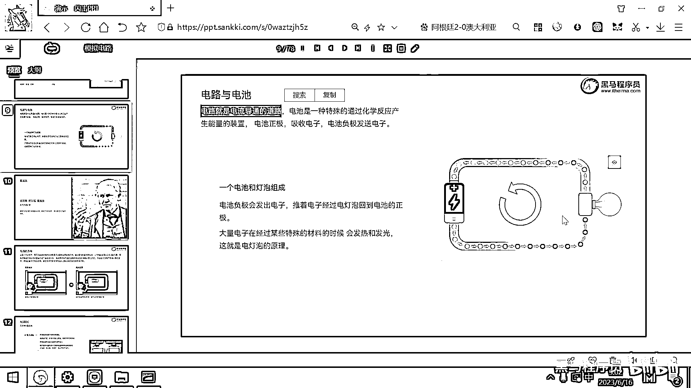
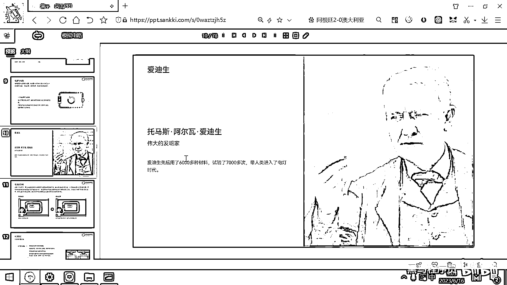

# 黑马程序员嵌入式开发入门模电（模拟电路）基础，从0到1搭建NE555模拟电路、制作电子琴，集成电路应用开发入门教程 - P3：03_电路和电流 - 黑马程序员 - BV1cM4y1s7Qk

好 那下面呢 我们来看一下这个电路和电池，那什么是电路呢，电路它是电流导通的道路，电路是电流导通的道路，而电池呢 是一种特殊的，通过化学反应能够产生能量的装置，好 其实生活中呢有很多。

很多通过这种化学反应产生能量的装置，就比如说你拿一个柠檬，你拿一个柠檬 然后你插一个LED灯上去，这个LED灯呢也可以发出微弱的光，原因呢是柠檬里面有这种酸性的化学物质，那这个化学物质呢。

我们把它给放到一个桶里面，然后包装起来，这个东西呢就叫做电池，这个东西就叫做电池，那电池呢 它有，它里面实际上都是化学物质 对吧，有酸性电池 有碳性电池 有碱性电池，好 这些化学物质就有什么样的特点呢。

电池的负极，它会去发送电池，电池的负极，它有大量的这种负电荷，然后它可以发送电子，大家想负电荷多了，它是不是就推着与它靠近的这个负电荷，然后这个负电荷又推这个，最终这个电荷一个挤一个 一个挤一个。

是不是就挤到这个上面了，挤到这个上面的话，电池的正极，它又非常喜欢这个负电荷，跟这个负电荷会发生这个化学反应，那这个时候，正极去吸收这个电池，负极发送这个电池，那是不是就有电流在这个导线上流动了，对吧。

好 这个呢就是电池和电路，好 那当当我们搭建出来右边的这个电路的时候，这个就是初中我们所学的最基础的电路，对吧，一个电池 一个灯，那这个灯的原理呢，就是当有大量电池经过某一个特殊材料的时候。

这个材料呢会发光发热，然后亮起来了，这就是电灯泡。

好 那历史上呢有这样一个很厉害的人，对吧 叫爱迪生，那他实际上是做了七千次的实验，实验了六千多种不同的材料，最后呢发现乌这样的一种材料呢非常好用，那乌斯的电灯呢就被设计出来了。

把人类呢带入到了这个电灯时代，那实际上大家想，它是属于这种搞纯理论研究的吗，不是的，它是属于这种搞工程的，对吧，实验了各种各样的材料，然后最终呢选中了一个最合适的东西，然后这个东西呢可以量产。

可以大规模的商业使用，好 那我们现代社会也是一样的，就是张雪峰 大家听说过，他之前开了一个讲座里面讲说，学这个工科呢要比学理科，对于大多数人来讲，学工科呢要比学理科呢更实用，为什么呢。

因为你研究理论知识的这个人呢，实际上是非常少的，需求也没有那么多，所以说呢最重要的就是要把理论知识呢，给用工程实践起来。

这个才能创造更多的价值和财富。

嗯，這就是我們第一次開拍的影片。