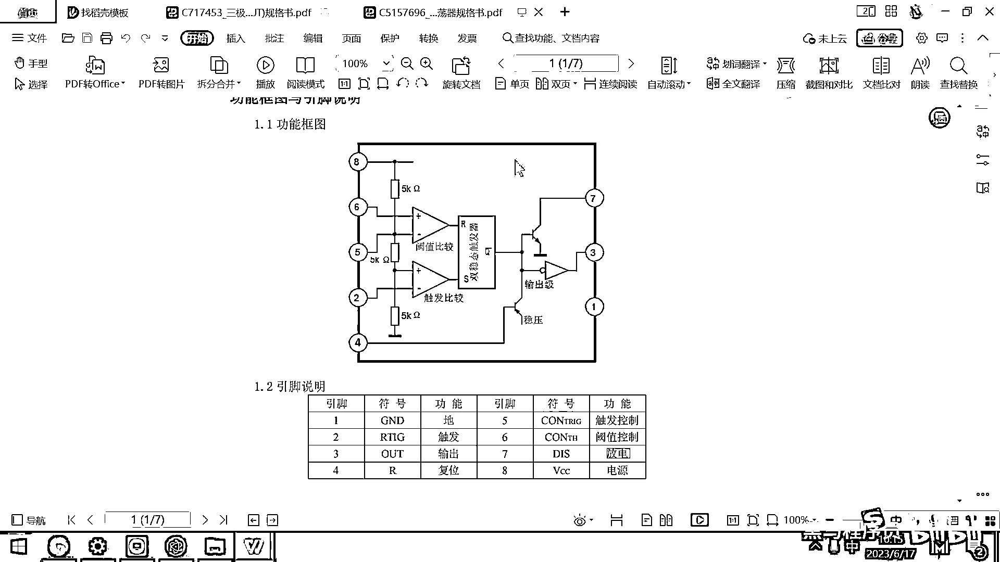

# 黑马程序员嵌入式开发入门模电（模拟电路）基础，从0到1搭建NE555模拟电路、制作电子琴，集成电路应用开发入门教程 - P40：41_ne555引脚简介 - 黑马程序员 - BV1cM4y1s7Qk

好，来看一下这个数据手册，好，这上面呢，有一个功能框图，然后他这写的有12345678，有这样的八个编号，对吧，那这八个编号是啥呢。

我们对照刚才的这个图。

你打开，然后看他的看他的这个数据手册，你看这是不是有12345678，八个引脚呀。

对吧，这八个引脚究竟长啥样呢，你看一下这八个引脚。

他真实就长这个样子，从这个左上角开始，趴到地上，这个是12345678，这八根出来的引脚。

就是我们这个原理图里面画的什么，12345678，对应的是这几个，那他究竟是干嘛的呢，你看一下，一号引脚是什么，GND以后大家一看到GND就知道，他代表的就是电池的负极，对吧，就是GND或者是大D。

他的电压呢，是零伏，这是零伏，另外呢，还有一个术语，以后大家一看到就知道是电源的正极，这个就是VCC对吧，这就是VCC。

他代表的是电源的正极。

一号引脚，GND八号引脚VCC，我们我们对照的这个实物就是这个是GND，然后八号引脚是VCC对吧。

你去你去看这个图也可以看到一号引脚是GND，八号引脚是什么，是VCC对吧，那这个芯片的一般上面都会有一个小缺口，然后这个缺口，你看左上角是一号引脚，右上角是八号引脚，好这个接VCC，这个呢。

去接GND。

好，那再去调试这个电路的时候呀，我们马上就要带着大家去做一个电子琴，或者做一个什么方波发声器，那很多同学板子也画完了，也焊上了，然后就是不想对吧，那如果你做出来的这个电路就是不想。

你第一个要排查的问题就是，你要先量一量这个芯片有没有供电对吧，那你要拿着你的万用表怎么做呀，把这个万用表的黑的放到这儿，红的放到这儿量一量，看看有没有电压对吧，那只有有了电压之后，这个芯片呢才会工作。

所以这个就是排错的第一步，基于这个引脚的分布，你先看一看这个芯片，你有没有给他供电，如果供电都没供。

你就不可能工作了，对吧，好最简单的两个引脚呢，我们就已经看完了，GND还有VCC，接下来的话呢，有一个引脚，这个引脚呢，叫R 叫复位，这个引脚叫R 叫复位，好，这个复位是什么意思呢。

那大家用很多电子产品，这个电子，特别是路由器啊，什么的电子产品，这些电子产品是不是有一个小小的洞，然后你可以用圆珠笔啊，或者用什么东西去锁这个洞，对吧，那这个洞呢，实际上就是复位啊，你假设呢。

你的路由器忘记密码了，你去锁这个复位啊，然后他整个这个芯片呢，就会恢复成出厂设置，你的密码呢，就清除掉了，好，大多数芯片呢，都会有一个复位的这个引脚啊，这个复位呢，如果你你把它从高拉到低。

然后这个芯片呢，就会重启一下，如果你一直保持它的高电压啊，这个芯片呢，就可以正常的工作啊，这个是这个是四号引脚复位啊，那接下来还有什么触发引脚输出引脚，什么触发控制引脚，然后预值控制引脚还有放电引脚。

好，这些看着一脸懵，对吧，不知道咋回事，然后上面呢，这有一个功能框图，好，这个功能框图里面的绝大多数东西呢，我们都没见过，对吧，好，这有一个三角形，这是啥呀，这有一个三角形不知道。

然后这有一个框框也不知道是干嘛的，这有这又有一个三角形也不知道是干嘛的，好，大家要想去理解这个芯片到底是如何工作的，我们需要把几个背景知识呢，给大家补充一下啊，我们要讲解讲解。

它里面的这几个框框到底是干嘛的，那你理解了框框之后。

我们再来去分析这个电路就可以看明白了，拜拜。