# 黑马程序员嵌入式开发入门模电（模拟电路）基础，从0到1搭建NE555模拟电路、制作电子琴，集成电路应用开发入门教程 - P41：42_比较器（运放） - 黑马程序员 - BV1cM4y1s7Qk

好 那我们从简单到复杂。

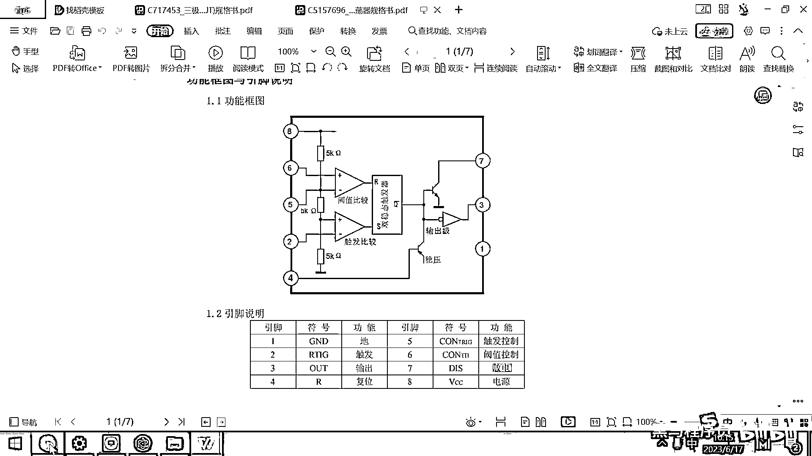

一个一个的来去介绍。

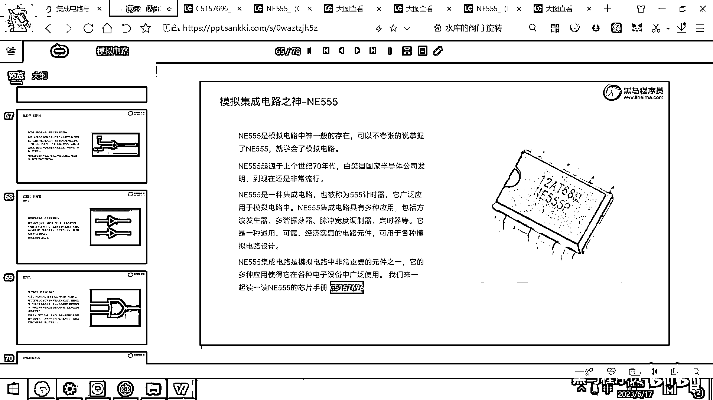

那第一个要介绍的这个框框呢，是这样一个三角形的东西，这个三角形的东西，你看上面叫玉子比较，下面叫触发比较 对吧，这实际上是一个比较器，或者用摩电的术语呢，讲究叫运放运放运算放大器，或者叫比较器。

好 那这个东西怎么去用呢。

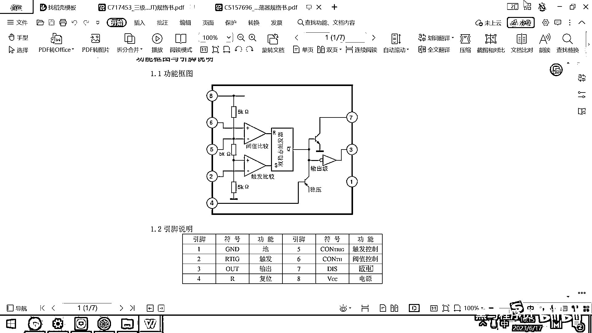

我们来给大家看一看，运放和比较器，运放呢，它实际上是一也是一种电子元器件，摩电专用的，它可以去处理两路电信号，运放它的工作原理呢。

就是去比较这上面的。

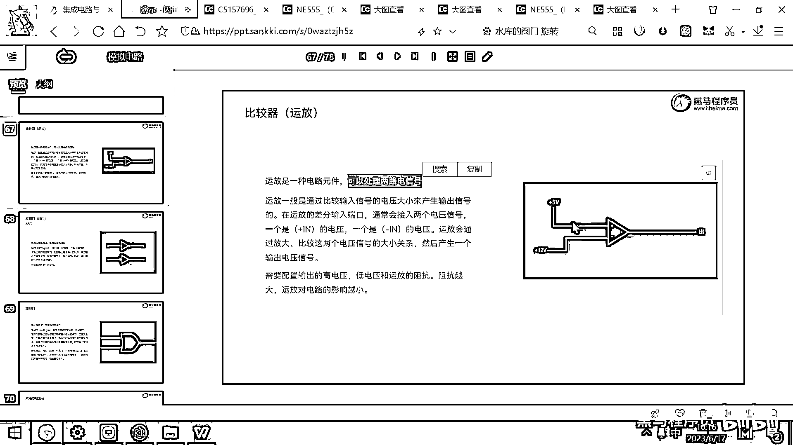

去比较这个三角形上面的电压和下面的电压，它其实就是一个电压比较器，比较上面的电压和下面的电压。

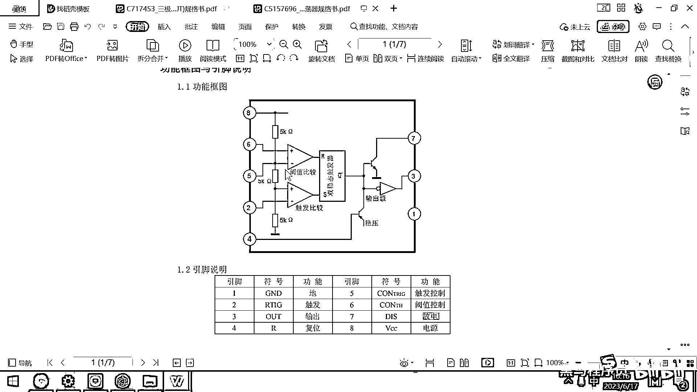

好 那如果呢，上面的电压大于下面的电压，它可能会输出一个高电平的信号，如果上面的电压小于下面的电压呢。

它就会去输出一个低电平的信号。

好 我们直接仿真一下给大家看看效果，你就明白这个东西到底有啥用了。

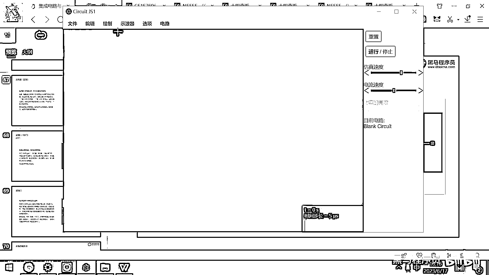

好 在这个绘字里面我们去找一找，然后去找一找，它有一个东西叫什么呀，运算放大器 对吧，好 这个运算放大器有两种。

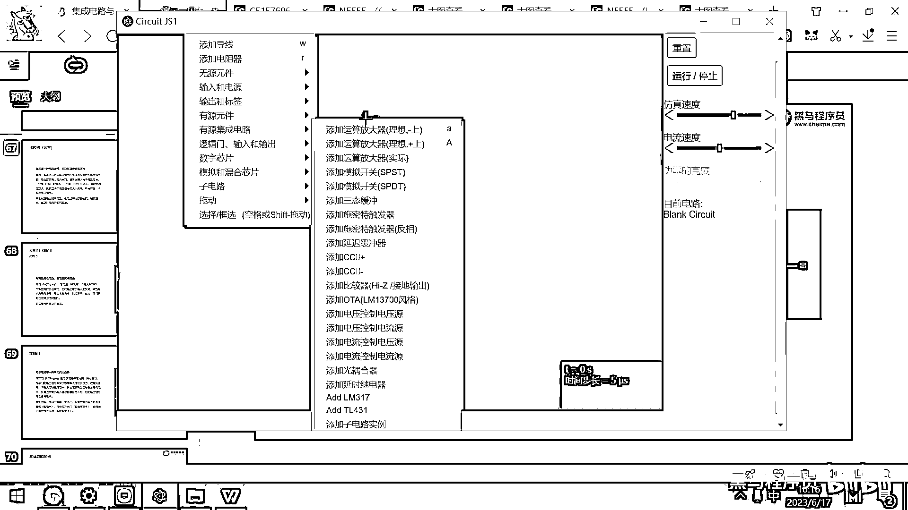

一种是减号再上，一种是加号再上，我们来看一下这个原理图。

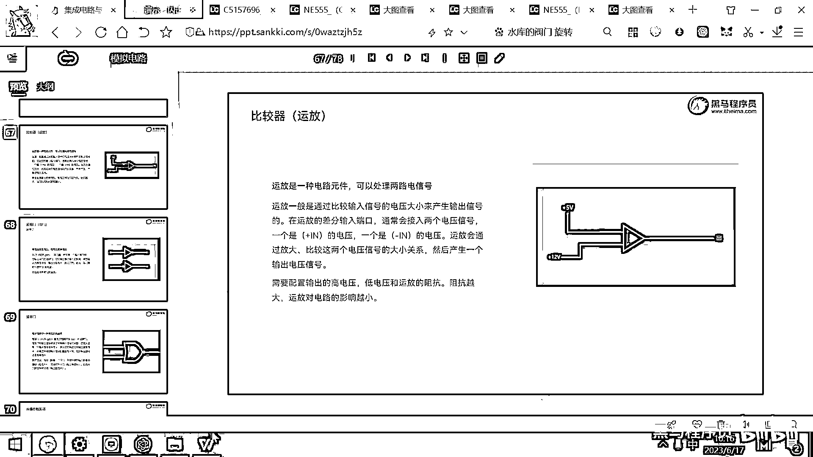

这个是减号再上 加号再上，加号再上 对吧，好 那我们就找到这个运放。

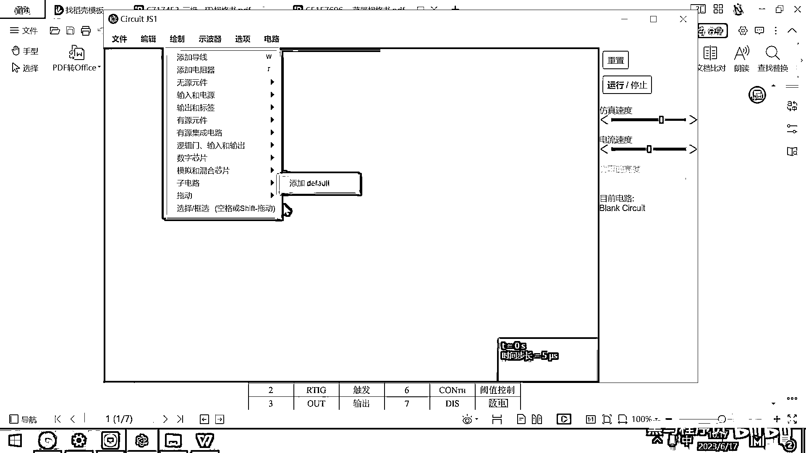

然后加号再上，大家看这个图是不是跟，刚才芯片手册里面的图一模一样呀，对吧 这就是一个运放，好 那这个运放有了之后呢。

我们接下来的话。

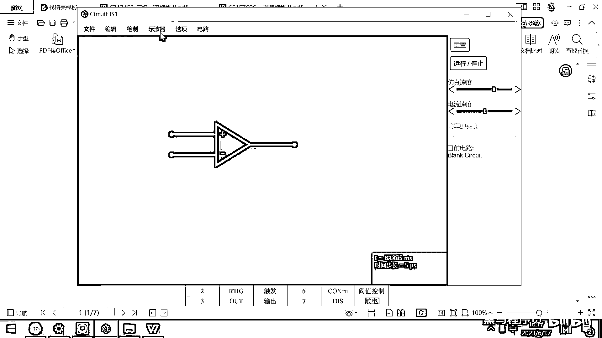

怎么做呢，我们在这绘制两个输入端。

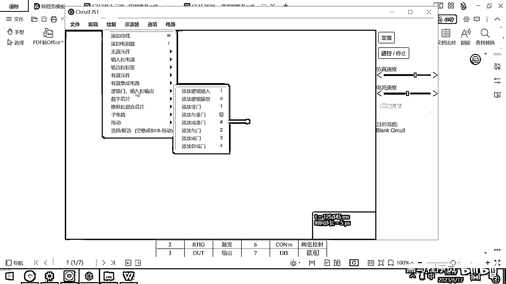

添加一个逻辑的输入，然后把它给指定进来，我先不用逻辑输入吧，我先添加两个电压源。

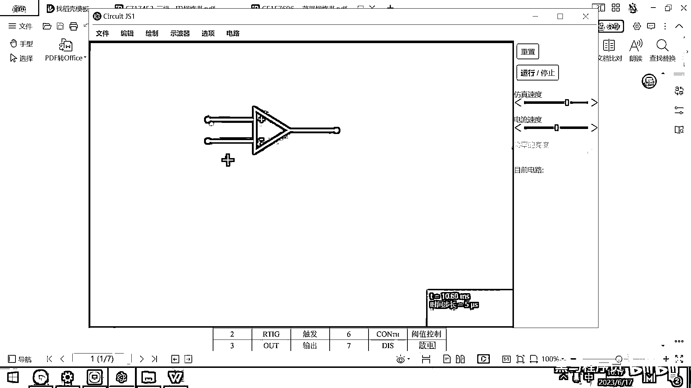

这样大家更容易理解，好 我们添加两个电压源。

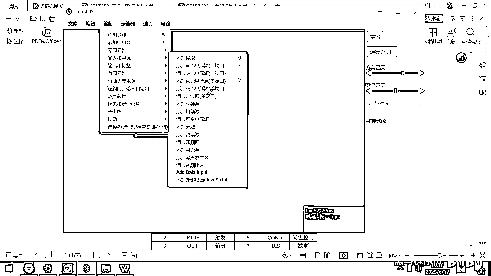

这有一个直流电压源，这有一个直流电压源，我们导线呢，把它给连接一下，然后呢 后面呢，我再输出一段导线，这个导线我把它的电压呢，给显示出来，这就是一个运放，运放有什么作用呢，我们来去瞧一下。

如果我把上面的电压呢，给调到10V，好 那大家看一下，我把上面的这个电压呢，调成一个10V，然后大家看，它输出的电压是多少呀，这个15V跟它里面的这个，这个组件有关，运放它叫运算放大器。

为啥起这样一个名字呢，既能运算又能放大，所以就叫做运算放大器，那如果呢，你把这个运放的电压，你给它调成150V，对吧，你看这个运算完了之后，它这个输出电压就变成什么了，就变成150V了。

好 那大家买那种，一千多块钱的音响，就那种操纵低音炮，然后听着整个人都在震起来的，那种那种设备，它里面呢，就是有大量的运放，它可以把非常细小的声音的音频变化，然后放大十倍到百倍。

然后你最后听着就动次动次动次，那个那个声音就很很爽，对吧，特别是把低音的部分给放大了，那那整个整个人都感觉在震，好，这个实现就是通过运放来实现的，好的运放的价格很贵。

然后它可以把非常细微的变化给比较出来，然后把这个电压呢给放大，好，那现在呢，这个地方我就稍微改一改了，把它这个输出电压呢给改成5V，然后最小值呢给改成0V，好，那现在大家看这个运放的特点。

如果上面正接正的这个电压比下面的高，这个就输出5V对吧，那如果是上面的这个电压比下面的低，这个就输出多少呢，这个实际上就是0V了，这个叫-300μA，对吧，μV，这是一个非常非常小的电压。

我把这个改成0V试一下，改成0V，这个也是一个非常小的电压，好，那利用这样的一个运放的话呢，其实我们就可以比较输入端的电压，如果这个输入端的电压上面比下面高，这个地方是不是输出一个高电平。

如果上面比下面低，这个地方呢就输出一个低电平，好，那通常情况下。

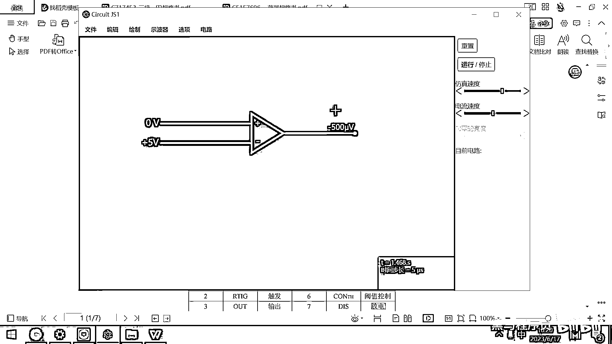

我们的模拟电路跟这个素质电路呢，都是结合在一起的，好。

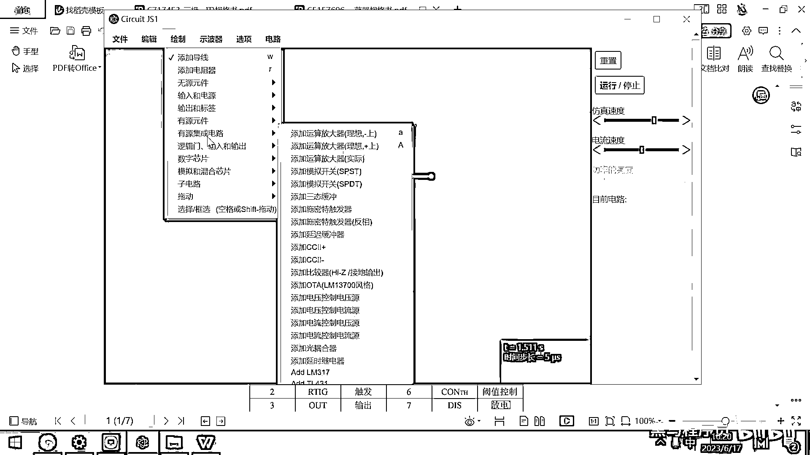

所以在这个输出端呢，我就给它添加出来一个叫逻辑的输出。

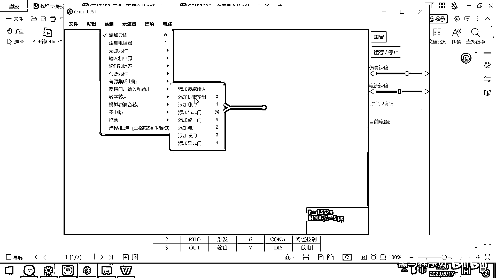

这个输出端现在是一个逻辑的输出了，那逻辑输出就是高电压代表的是high，就是1，低电压呢就是0，就是low，好，我们现在呢再来去，再来去测一下，好，我把这个电压呢给改成7V，好，大家看这显示什么呀。

high，对吧，我把这个电压呢给改成3V，改成这个3V，这个地方呢就显示low，就显示low，好，正是由于有这种比较器的存在，我们就可以很方便的去比较出来两个信号的电压差异，对吧，基于这种电压差异。

我们就可以去完成一些逻辑性的判断了，好，这第一个运放我们就给大家介绍完了。

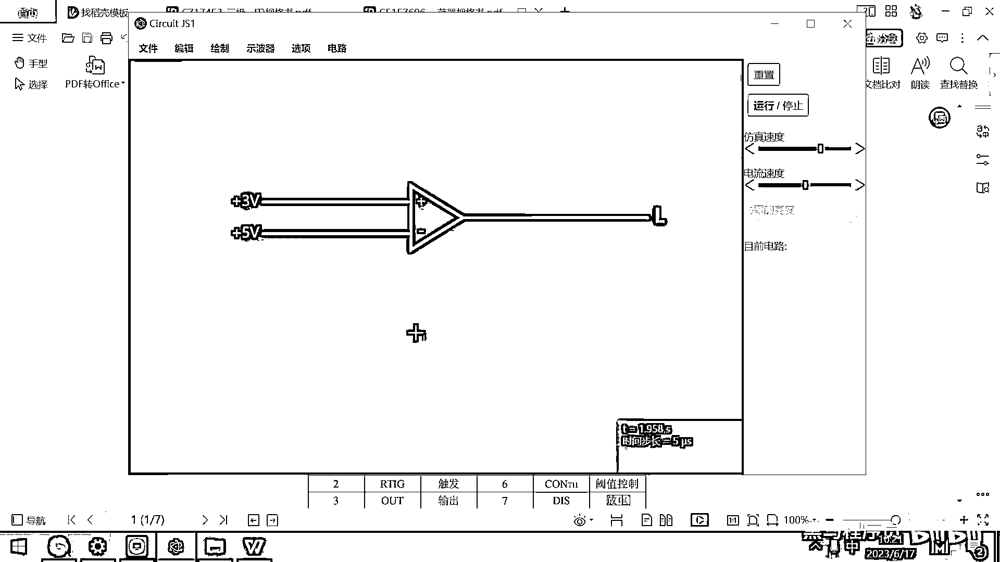