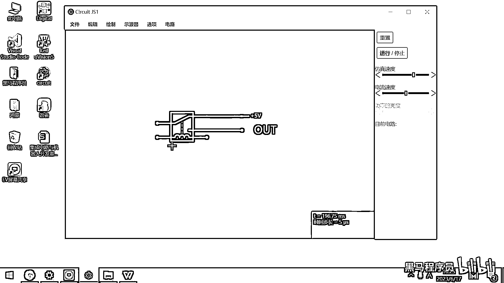

# 黑马程序员嵌入式开发入门模电（模拟电路）基础，从0到1搭建NE555模拟电路、制作电子琴，集成电路应用开发入门教程 - P42：43_相反器 - 黑马程序员 - BV1cM4y1s7Qk

好 那我们再来去看一下第二个元器件。

这个元器件呢 叫做非门或者是相反门，非门或者相反门。

你看在这个原理图里面，在这个功能框图里面，这个地方是不是有这样一个图啊，对吧 一个三角 然后就有一个小圆圈。

好 那这个符号呢 有两种画法，有人呢 把这个小圆圈画到左边，有人把这个小圆圈画到右边，这两种画法呢 代表的含义都是一模一样的，好 这个东西的作用是什么呢，它是一个非门，非门干的事情就是。

它可以把高电压变成低电压，如果是低电压进来的话，它就会把低电压给变成高电压，这个大家理解吧，就是非门 就高压变低压 低压变高压，这个就是非门，好 非门呢 它是一个只有一个端口输入，一个端口输出的逻辑门。

它可以把输入的信号取反之后再输出，所以也有人叫这个非门叫相反器 对吧，高压进来 低压输出。

低电平进来 高电平输出，好 可能有同学觉得 哇 这个元器件好高级啊，对吧 它是如何实现的，实现原理呢 其实也非常简单。

我们在这儿呢 给大家简单演示一下。

你就明白这个实现原理了，好 我用一个 我用一个继电器来给大家实现，好 这个非门 大家想一下，它是不是5V进来 0V输出 对吧，或者呢 是0V进来 5V输出，那这个 这个怎么做呢，大家 大家想一下。

这个应该怎么做，5V进来 0V输出，好 我在这儿去画一个5V的，我在这儿画一个5V的电源，好 这是不是5V进来，这是5V进来，然后呢 这个输出呢，这个输出呢 我们就，嗯 我想一下怎么输出。

好 那这个5V电源不能画到这儿，这个5V的电源呢 我把它给画到这儿，画到这儿，好 我把这个5V的电先连到这儿，好 那接下来呢，这个输出我就把它给连到这儿，画一条线。

然后给这条线起个名字。

就叫输出，out，好 这个是输出 对吧。

好 那大家想一下，现在5V的电进来，这个输出有电吗，这是一条悬空的导线 对吧，这输出肯定是没电的，好 那那接下来的话呢，我们再干一件事情，我就是把这条线，跟下面的这条线给它。

我画一个金地。

来 大家看一下。

我在这儿画一个金地，然后把这个地方给它连上，w，好 然后这条线呢，我给它起下名字，这条线的名字就叫做in。

输入，这条线的名字就叫做in。

好 然后呢，我们再给这个in呢。

给它来一个电压源，这个电压源呢，我也把它给画过来。

这个就是电压源，好 画完了，放真，好 那大家去，我把这个out的电压呢，也给它显示出来，out的电压给显示出来，好 那大家去想一下啊，in是5V，输出的应该是0V 对吧，如果这个in是0V。

然后我们输出的是5V，我把这个。

把这个给改成0V，好 那输出的是5V，好 那，我第一次用这个软件去画。

有点儿，来 我们，我们把这个电压源呢，给放到这边。

还是放到这边，放到这儿，然后这个out呢，这个out就在这个上方，我把这个给剪掉，然后粘到这个上方，好 那现在呢。

就已经画完了，我把这个电压呢，给显示出来，好 大家看一下，这条线是我的输入，对吧，这条线是我的输入，我输入的线，现在电压是0V，这输出的线电压是多少啊，这两条线是直接导通的，对吧，这个5V。

然后这边5V，这输出直接就是5V，对吧，好 那现在呢，我把这个输入的电压，给改成5V，然后这个输出的电压，现在就变成什么了，这个现在应该变成0V了。

这个仿真软件呢。

有点小瑕疵，我这样去干一下，给它加一个下拉电阻。

找一个电阻。

然后我给它接一个下拉电阻。

然后这个上面呢，拉一个GND。

好，那可以了，好，那大家去看一下，输入的是5V，对吧，然后这个输出的，实际上就已经0V了。

然后我们把这个给改成，把这个给改成0V，然后这个输出就变成5V了，好 那大概呢，就是这样的一个原理，它其实内部呢，就是默认让这个out为高，然后你下方一为高。

然后再把它切下来。

那这个out呢就为低，就是这个相反器的工作原理呢。

就是这么简单，那5V进来出去0V，0V进来出去5V，那用这样的一个符号呢，就可以完成一个相反器。

