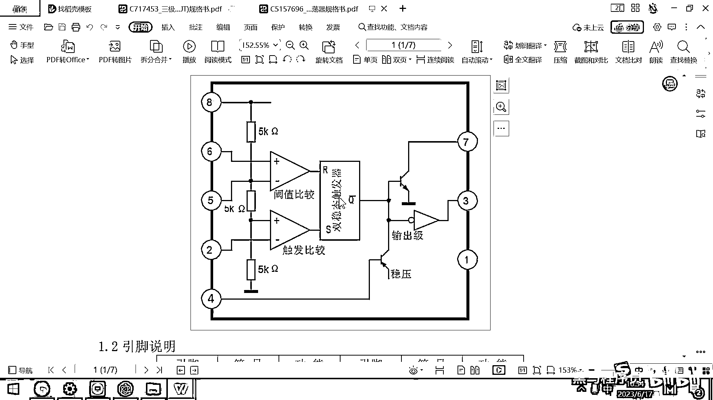
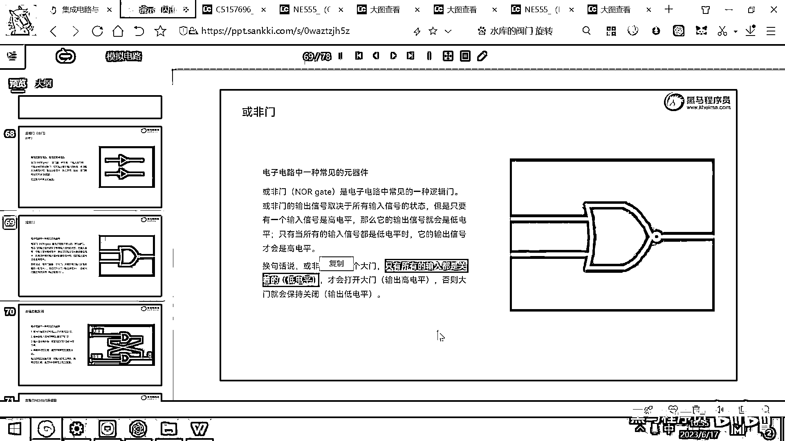
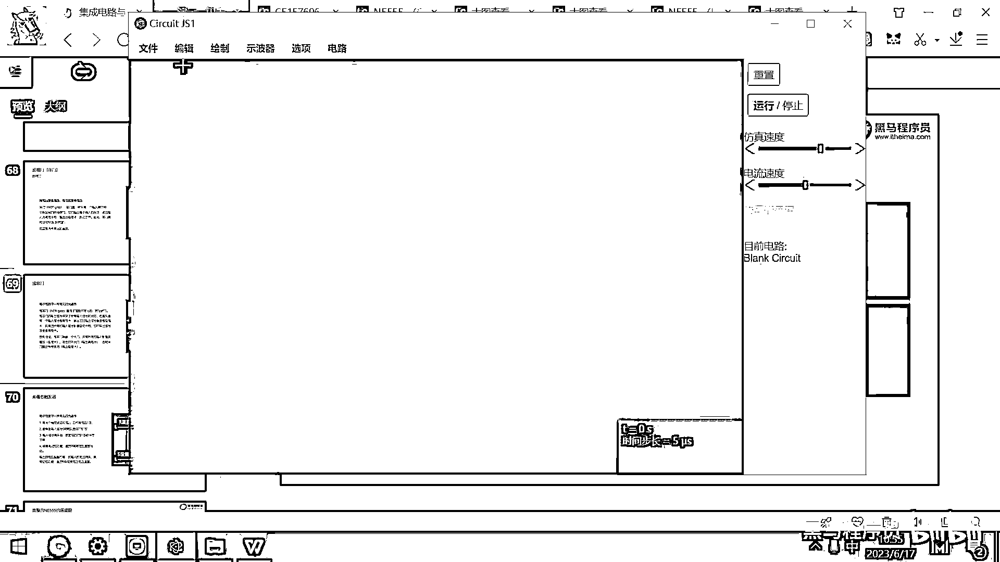
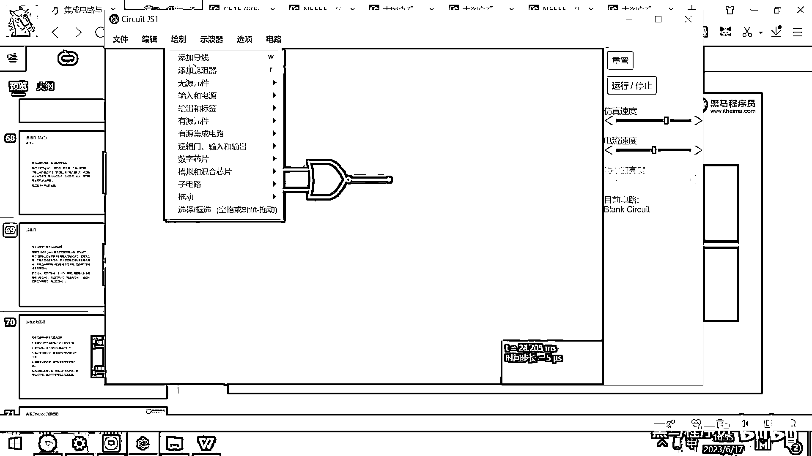
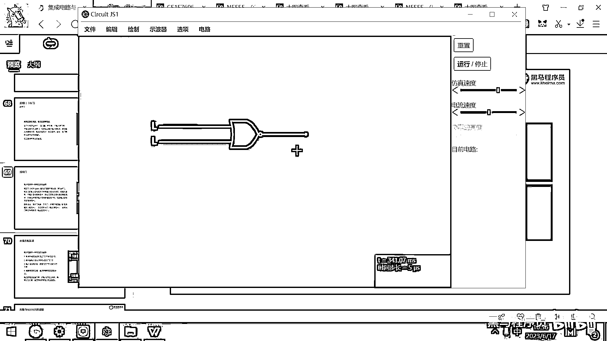
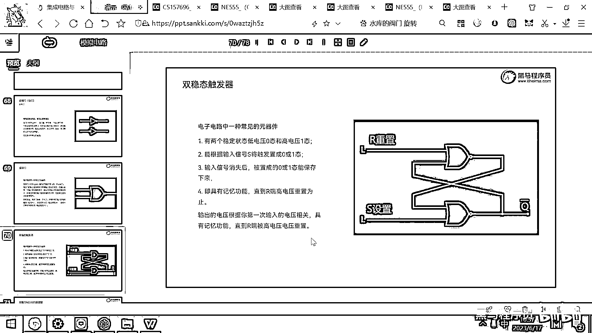

# 黑马程序员嵌入式开发入门模电（模拟电路）基础，从0到1搭建NE555模拟电路、制作电子琴，集成电路应用开发入门教程 - P43：44_或非门 - 黑马程序员 - BV1cM4y1s7Qk

好，那现在呢，整个N155的功能框图，我们是不是已经已经把这块给看完了，这是一个运放，对吧，这下面也是一个运放，它用来比较加号和减号的电压，比较加号减号电压，然后这个输出端的相反器，大家也明白了，对吧。

那如果这条电路是高电压，那输出的3就是低电压，对吧，如果这条路是低电压，输出的3就是高电压，好，现在呢，在这个框图里面还有两个二级管，看大家还有印象吗，这个二级管是什么，这个三级管是什么。

这个三级管是一个NPN类型的三级管，NPN类型的三级管就是，如果这个地方有高电压的话，然后这个7和这个D是不是就导通对吧，如果这个地方是低电压的话，那7和D就截止对吧，好，那你看这个地方又有一个三级管。

这个三级管跟这个是不是正好相反的，那这是NPN的，这个就是PNP的，那PNP的就是4如果是高电压的话，它是截止的，对吧，如果这个4是低电压的话，是不是就是导通的，对吧，好，那行。

那这个功能框图我们都看完了，现在还缺中间的这一块，这有一个叫双稳态触发器，听到这个名字有点吓人，对吧。

双稳态触发器。

那我们来看看这个双稳态触发器到底是个什么东西，好，要理解这个双稳态触发器的话呢，我们还必须要先给大家介绍一种特殊的电路元器件，这个电路元器件呢，叫货飞门，货飞门它的符号长这个样子，弯弯的。

然后前面的有一个小圆圈，这个就是货飞门，好，货飞门的是电子电路当中的一种非常常见的逻辑门，他干的这个事情呢，就是如果所有的输入都是低电频。

这个大门才会开。

否则的话，这个大门就会关，那什么现象呢，我们来给大家看一下。

我绘制一个货飞门，大家看添加货飞门，就长这个样子，那货飞门左边呢。

我给他来一些逻辑的输入，这左边呢，有一个逻辑的输入，L就代表Low，然后Hi的话就代表的是高，这个是高低电频，现在呢，我把这个给他拖过来，这个拖过来，那我们来去，来去这个仿真一下，哪里有问题吗。

我看一下这个现接的有没有问题，好，没问题了，刚才这个线有点没连好，好，那我们呢，来去观察右边的这个线的这个状态，观察这个线的状态，大家看这个L代表低电频，这个L代表低电频，对吧，两个都是低电频。

这个输出的线是绿的说明什么呀，是高电频，对吧，好，那我现在呢，把这个给改成高，你看这个输出变成什么了，变成低了，对吧，我把这个给改成高，这个输出呢，也是低，只有他俩同时是低电频的时候，这个输出呢。

才是高电频啊。

这就是霍飞门霍飞门，他的特点呢，只有所有的输入都是关着的都是低电频才会打开大门输出高电频，那否则的话呢，这个大门呢，就会保持这个关闭状态，霍飞门，好，那有了霍飞门之后呢。

我们就可以去讲这个双稳态的触发器了，好，下面的这段内容呢，我是从这个大学模拟电路课本里面考出来的这一段话啊，这段话呢，读一遍之后读出来肯定很懵，他说有两个稳定的状态。

0和1根据输入的这个S来去触发灵活一态输入的这个信号消失了灵活一态还能保存，具有记忆功能，直到这个R端电压重置为止，然后所以输出的电压跟你第一次输入的电压有关，具有记忆功能，所以呢，也叫双稳态触发器好。

那念完之后看起来肯定还是有点懵的，对吧，那实际上这个东西呢，很容易理解，我们给大家看一个实验就明白啥是双稳态触发器了。

