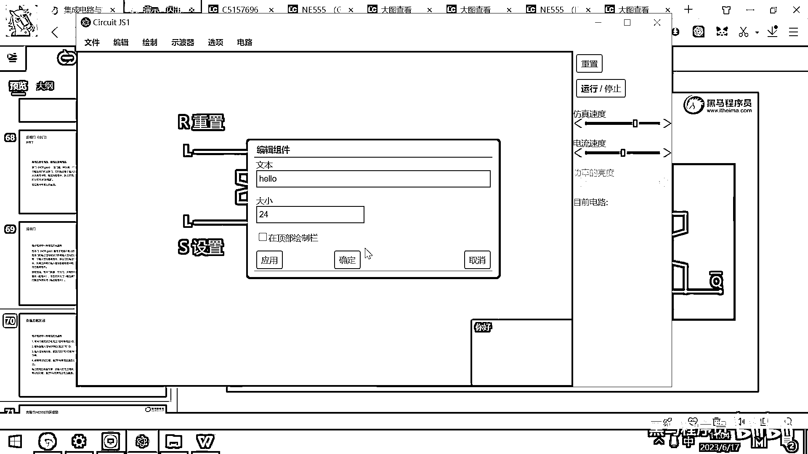

# 黑马程序员嵌入式开发入门模电（模拟电路）基础，从0到1搭建NE555模拟电路、制作电子琴，集成电路应用开发入门教程 - P44：45_双稳态触发器 - 黑马程序员 - BV1cM4y1s7Qk

好 那在这个地方呢 我有一本这个小朋友的书。

这个是给宝宝的第一本计算机工程书。

那这个书呢 它其实设计这个书的人还挺有创意的。

这本书在淘宝上卖80块钱 卖80块钱。

但其实原理呢 非常非常的简单。

它的成本呢 大概就只有10块钱左右，因为你自己去做这个书就成本就10块钱，但是呢 这本书的目标群体非常精准。

就是卖给那些程序员的小孩的。

它在这个抖音上还有淘宝上卖了大概6000套。

你想一下这一套它就挣个五六十 对吧。

这个6000套其实收益还是蛮高的，好 那大家看这个书的特点就是，给宝宝的第一本计算机工程书 对吧，你看这有个按钮，然后这个门大家已经认识了 对吧，这是干嘛的呀，低电压变高电压 对吧。

然后又经过了这个门是什么，高电压变低电压，那两次取返实际上相当于是负负得正 对吧，那如果前面是低电压 这个灯没有亮，然后我一按这个按键，好 大家看这个灯就亮了 对吧。

那这个就是第一个这个飞门。

好 然后我们去看一下，第二个这个是导线。

这个就很容易理解了，我一按这个按键，这个灯就亮了，因为正极给它了5伏。

然后这个是0伏 灯就亮了 对吧，好 我们再去看一些别的门。

这个是货门，货门就是只要有一个灯亮了。

它都会亮，你看我这样一起按 它是可以亮的。

好 那还有一些雨门，还有我们就给大家去看，最后的一个门叫做锁存，好 其实刚才这个双稳态触发器。

它就是一个锁存，就是一个锁存，它写了这么多看着很晕 对吧。

那实际上我们给大家做一下实验。

你就明白了，好 啥叫锁存呢，这个地方叫设定。

好 大家看目前呢，我设定是低电压 对吧，我最终的这个结果是不是也是低电压。

灯没有亮 对吧，我按一下设定。

好 那设定完了之后，这个灯就就一直亮了 对吧，那我再怎么碰这个设定。

我是按下去弹起来，按下去弹起来会影响这个输出吗。

已经不再影响了 对吧，这个输出已经被存起来了，变成了一个稳定的状态，这个状态什么时候才会被打断呀。

必须你要按一下reset，这个状态呢才会被打断。

这个东西就是一个锁存，这个锁存画法呢有很多种。

那我们接下来要看的一种画法呢，就叫做双稳态的触发器，它其实就是锁存的一种，你可以把一个状态，把这个设置的状态给存储起来，直到按这个重置为止，好 这个就是所谓的双稳态触发器，好 我们带大家呢来画一个。

这个双稳态触发器。

好 那还是打开这个电路了。

我们带大家呢画一个双稳态触发器，好 这个触发器的画法呢非常简单，大家去看一下，你找一个货飞门放到这儿，再找一个货飞门放到这儿，好 接下来你要干的事情就是把这一个，画导线了，把这个输入的引脚。

然后连接到这个输出的引脚上，然后把这个输出的引脚，连接到这个输入的引脚上，然后这个就是最终的结果。

那为了观察方便，我在这儿再添加几个逻辑的输入。

逻辑的输入，再给他来一些标签，下面的这个标签就叫S。

S中文就是色字，那上面呢，我们在这来一个标签，这个标签呢就是R。

这个叫重置，叫重置，把对应的线给连一下，有没有连坏啊，好像没有，把这个线给连一下，要注意这个连线呢，应该是一个端点连到另外一个端点上，对吧，千万不要拉长了，拉长了就出错了，好，那这样的一个电路。

它实际上就是一个双稳态的电路，双稳态的电路，然后这个输出的名字呢，有一个专门的学名。

然后这个就叫做Q，我们给它起下名字。

这个就是Q，然后这个状态呢，正好是相反的，所以在上面的一般会画一个这个相反的符号，那来做一下实验看看效果了，好，那目前呢，你看本身这个set是low，对吧，然后这个输出是什么呀，是高对吧，这个灯是亮的。

说明输出是高啊，所以这个输出上他就给他加了一个取反，就代表这个输出的状态跟这个设置状态正好是相反的，我们去点一下这个设置，现在设置成什么了，设置成高了，对吧，这个输出就变成什么了，就变成低了。

那以后我再去动这个设置还有影响吗，没有影响了，是不是这个状态被存储起来了，对吧，那这个状态直到什么时候才会被重置呢，直到你按了一下，R这个状态才会被重置好，这个现象看明白了吧。

跟刚才这个宝宝的书是一样的，只不过这个宝宝的书是怎么做的呢，这个宝宝的书他实际上是输出的是这个信号。

我们给这个信号起个名字就叫Q就好了。

叫Q，然后我把这个给他拉出来，好，实际上这个宝宝计算机书，它显示的是这个内容，我们再给大家仿真一下，好，大家看这个，SET设置为高电频的时候，这上面这个灯是不是就亮了。

然后以后你再怎么切换这个SET会不会影响这个亮的灯啊，不会对吧，那这个亮的灯什么时候熄灭呢，当你按一下Reset键的时候，这个灯就熄灭了，对吧，好，看明白，看明白这个松稳胎出发器了吧，它就是用电路呢。

可以去存储一个状态啊，以后即便是你再去按这个按钮修改这个状态。

这个状态呢，也一直被保留，直到什么时候为止呀，直到你的这个R端被重置为止啊。

那这个就是松稳胎的出发器，好，这个松稳胎出发器对理解我们接下来的电路原理呢，非常非常重要啊，那接下来呢，我留十分钟的时间啊，大家去照着这个电路去画一下啊，然后去按一按这个Reset按一按这个S。

然后你感受一下这个是怎么切换的。

再作別編輯影片還會有更多新的內容。