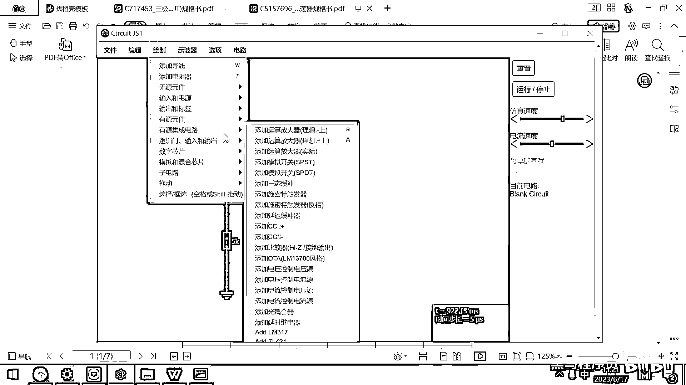
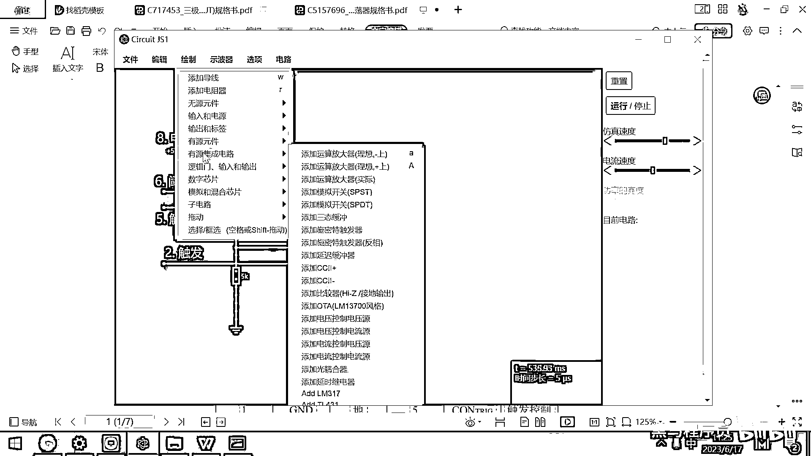
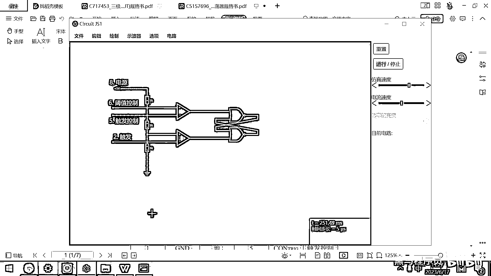

# 黑马程序员嵌入式开发入门模电（模拟电路）基础，从0到1搭建NE555模拟电路、制作电子琴，集成电路应用开发入门教程 - P45：46_ne555的原理图绘制 - 黑马程序员 - BV1cM4y1s7Qk

好 那这个双尾台出发器呢，一会儿我们要去用它啊，他他要在这来回的切换，我们再来去看一下啊，这个SET端是不是设置呀，如果如果这个SET端设置为这个高的话，是不是下面的这个Q反就是低电平，对吧。

好以后你再怎么去切换这个SET，会不会影响这个状态和这个状态啊，不影响，对吧，好，那什么时候这个状态才会被切换修改呀，只有你按了这个Reset的时候，这个状态才会被改回来，对吧，好。

所以这个就叫做双稳态，为啥是双稳态呢，因为他可以有两个输出，这两个输出都是稳定的状态，所以叫双稳态出发器，双稳态出发器，好。

那有了这样的一块电路之后。

我们接下来就可以带着大家去一步一步的去梳理这个N155的功能框图了，可以看这个功能框图了，在这个框图里面，大家想一下是不是所有的东西，我们所有的乐高积木块，我都知道是干嘛的了，对吧。

就是搭在一起究竟是干嘛的还不清楚，我们来一步一步的去分析，好，看任何电路啊，看任何电路都应该是先看简单的，再看复杂的看任何电路，我们是不是先简单后复杂呀，对吧。

那我们也是一步一步把这个电路给画出来。

这样从简单到复杂，我新建一个空白的电路。

然后我们就照着这个去画了，好，那最简单的地方是啥呢，你看画这个线是接地，对吧，画这个线是接地，然后然后这有一个电阻，这有一个电阻，这有一个电阻，然后上面的八是什么呀，八是电源对吧，好。

这个NE55为啥起这样一个名字呢，NE是美国国防部这个开发电路的工程师，他老婆的名字叫NE，然后后面555是什么意思呢，这有一个5000欧的电阻，这有一个5000欧的电阻，这有一个5000欧的电阻。

所以他给它起名就叫NE55，对吧，其实以后大家发明个什么东西。

也可以起一个比较有意思的名字，好，那我们呢，先去画这三个电阻了，这三个电阻一个两个，然后三个好，他们的阻值呢，分别就是5000欧，然后5000欧，还有5000欧。

5000欧。

那上面呢，接的是这个八号引脚。

八号引脚是VCC，我们给他来一个五伏的电源。

在这呢，我来一个电源电源电源电源。

那这搞一个，五伏对吧。

搞一个五伏，然后下方呢，是不是要有一个GND。

我们把这个接地呢，给他画出来，接地给画出来，然后把这些线呢，给连到一起，好，就这块就已经画好了。

好，那为了一会儿方便我们观察这个芯片的引脚，我们在这写一个八号引脚，它的功能是什么呀，电源对吧。

先把这个八号引脚功能电源呢，给写出来，那弄一个T，然后它是我们的八号引脚，它的功能呢，是电源，八号引脚是电源。

好，那第一块框图呢，我们就画完了，好，画完之后，大家看这是不是有两个比较器呀，对吧，一个叫什么玉子比较，这个是R，下面有一个触发比较，这个叫S，好，我们把这两个比较器呢，给画出来。

它其实就是一个运算放大器，我看一下加号在上面减号在下面啊。

那我们去找一找了，加号在上面减号在下面。

好，哎，画一个运放，哎。

画一个运放，好，来仔细观察一下这个连线啊，所有的电路示意图都是这样一个特点，如果两个线之间交叉了，然后有一个这个小黑点说明什么呀，说明他们是搭在一起的是相连的对吧，那如果这个地方从这儿过去了。

没有小黑点说明啥呀，说明这个线是穿过这个电线的，他们之间是没有连接的对吧，好，那我们看从上面这个加号出来一条线是6啊。

我们把这条线先画出来。

从上面这个地方出来一条加号是6，我把它往下稍微挪一点，然后W来一个线对吧，这条线呢，我们给它起个名字就是叫6，叫6，好。

这个6是干嘛的呀。

来看一下原理图，好，这个6呢，他叫，阈值控制对吧。

好，那他怎么写，我就怎么写呗，那6。

然后我们来一个阈值控制，好，这个就是6，好，6是阈值控制，阈值控制。

好，那接下来我们继续观察这个电路图，好，这个电路图这减号连到了什么地方呀，这个减号连到了这个电阻的下方，对吧，然后这个电阻的下方呢，又接出来这个5号引脚。

5号引脚要触发控制。

好，我们把这个给搞出来，好，这个减号呀，他接到了这个电阻的下方，你看我接上了没有接上了，然后呢，再接出来啊，给他来一个说明。

这个这个就是我们的。

看一下芯片手册。

这个是我们的5号引脚叫触发控制。

5号引脚叫触发控制。

哎，这个就画好了，好，这个画好之后，我们继续来观察芯片手册啊。

看看，这个加号是不是连到了第二个电阻的下方，对吧，好，这个加号我们连到了第二个电阻的下方。

我们来连一连，哎，正好连到了这第二个电阻的下方。

然后把这个线接出来，线的名字没接出来。

对吧，那我们，我们就这样去接就可以了。

好，然后再来去瞧一瞧这个减号接出来了，他对应的这个二号引脚起名叫叫触发对吧，这个二号引脚起名叫触发，我们把它给接出来。

画这个原理图呀，要非常的小心，对着这个数据手册一步一步的超过来，如果那你画的时候你不小心，你感觉长得差不多，对吧，等你板子做出来了，你就会发现差的很多，这个根本都不能用了，这个就是触发。

这是我们的二号引脚触发。

好来瞧一瞧，还有什么东西，这好像就画完了，对吧，然后这个四号引脚是什么呀，是复位，对吧，这个复位的话，为了不影响我们理解核心原理，这个四号引脚呢，我就先不去画它了，为什么呢。

因为你看一下他的这个典型应用的示意图，这个四号引脚他就直接接什么呀，接这个VCC对吧，四号引脚和八号引脚是直接接VCC的。

那我们为了简单起见。

这个四号引脚呢，我在我们的仿真电路图里面我就先不去接他了。

好，那还缺什么呀。

还缺这有一块叫双稳态的触发器，对吧，我们把这个双稳态触发器给画一下。

好，大家都已经很有经验了。

双稳态触发器无非就是，霍飞门，霍飞门对吧，这个霍飞门的画法呢，就是，我给他，来点空间，好，这个霍飞门的画法很简单，就是这个的，这个的输出，然后接到这个地方的输入上，对吧，这个地方的输入。

然后接到这个地方的输出上，然后上面的这两块内容，我是不是直接这一接，然后这一接就搞定了，对吧，这个线为啥是红的呀，哎，奇怪啊，我第一次见他变红，这个软件呢，反正是有一些bug，那你见到一些奇怪的现象。

见怪不怪就行了，那这是这样的一个霍飞门，我重新连一下吧，毕竟有这个红色看着，看着也好奇怪，就这样吧，好，那那行。

那这块画完之后。

我们接下来要画什么呀，接下来大家看一下是不是输出呀，输出的话，这有一个三极管。

然后这个地方有一个取反，然后对应的是三号音角是吧，那我们输出，这个地方，这个地方要先来一个，先来一个取反，然后对应的是三号音角，好，那取反的话，需要有一个飞门，对吧，那我们添加一个飞门。

然后把它从这连到这，然后这个其实对应的就是我的三号音角了，对吧，那来一个文本。

这个是我的三号音角，这个实际上是输出。

看一下原理图，三号音角是叫out，就是输出，还缺一个七号音角，七号音角叫什么呀，叫放电，对吧，这个七号音角接了一个什么类型的。

NPN类型的三极管，对吧，那七号音角接了一个NPN类型的三极管。

我们找一找。

找一下NPN类型的三极管。

怎么接的呢，来看一下原理图，七号音角接到三极管的上面，对吧，然后三极管的下面这个接GND。

那我们先来绘制一个GND，然后接在三极管的下方，然后这个上方的话，实际上就是什么呀，是我的七号音角，那我们给它起名的叫放电，七号音角放电，好。

那这个输出是怎么接的。

来看一下是不是从那个Q飞直接控制端就接到这个三极管的控制端了。

对吧，那我们看一下这个导线好像是在这儿，那这个要把它给连一下，往右边挪一挪，右边挪一挪，然后这个接到这，然后这个接到这，好完美，这个全都接完了，那大概就是长这个样子。

好我们再对照一下。

对照一下这个原理图，是不是全都画完了，对吧，还有什么没画呀，还有四号音角，四号音角这个稳压，这个四号音角负责这个复位，我们先不复位这个芯片了，四号就不画了。

然后这个一号还没画。

一号是啥呀，一号是基因D对吧，这个基因D，我们我们其实这个地方就相当于是一号，对吧，这个基因D就是一号，这个也是一号，整个这个N155的原理图呢。

就全都画完了。

好，(「謙虛」無論中文字幕:H Tan，請別破壞我的字幕！)。