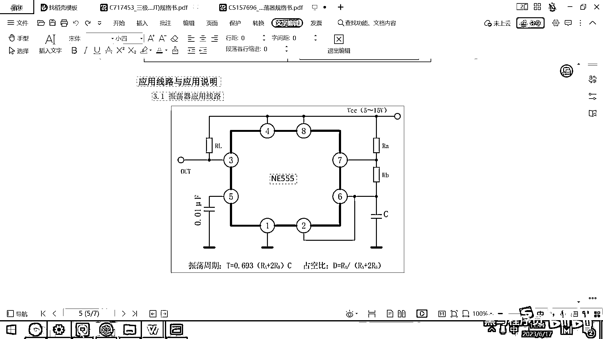
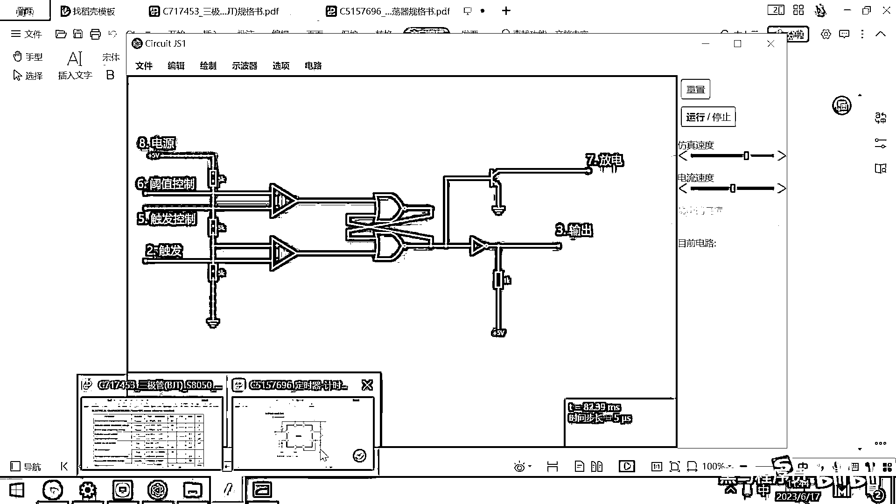

# 黑马程序员嵌入式开发入门模电（模拟电路）基础，从0到1搭建NE555模拟电路、制作电子琴，集成电路应用开发入门教程 - P46：47_外围电路搭建 - 黑马程序员 - BV1cM4y1s7Qk

都有屏幕吧。

好，三节课呢，我们依照着数据手册里面的功能框图，把这个N155的内部结构呢。

给他画完了，好，那接下来呢，我们就要基于这个N155的芯片呢，然后做一些应用了，好，那由于呢，当前这个N155画的比较开，然后这个字就有些小，我把我把这个原理图呢，稍微的调整调整，让他布的更美观一些。

好，还有一个呢，就是我们上一节课看到这个地方标了一个红线，对吧，那这个红线产生的原因是什么呢，在这儿，所有的运放都是有这个输出电压的，对吧，就输出电压在这呢，他默认15伏，这个电压比较高，超过了什么呀。

超过了我的这一个，异货门，对吧，超过了我的这个货飞门所承受的最高电压，所以他这就爆红了，我们调整一下了，输出的电压是5伏，然后最低呢，是零伏对吧，好，这个地方呢，输出的电压是5伏，然后下面的这个是零伏。

做这样一下调整这个红线呢，就不见了，那那我们稍微挪动一下这个原理图，让他不要，就是让他稍微靠的近一点，不要这么开，然后把这条这条导线呢，给删掉。

这个往上再挪动一点。

把这个连到这，好，那行，那我们就基本上是调整完了。

调整完了，好，调整完毕之后。

现在呢，我们就按照数据手册里面所写的这个内容来进行啥呀，来进行这个典型应用了，对吧，好，这典型应用大家看一下，首先我们外部是不是要把这个电池接到这个八号引脚，还有四号引脚上呀。

对吧。

那其实五伏的电池，我已经接到这个八号引脚了，四号引脚是是防防止他复位的，对吧，拉高就正常工作。

拉低就复位，所以这个四号引脚，我现在先不接了，好，大家观察一下这个VCC，他经过一个叫RL的电阻，然后，接到了这个三上对吧，这个VCC经过了一个RL的电阻。

接到这个三上好。

那我们来画一下这个外部的接线图，VCC经过一个电阻。

然后接到这个三上，为啥要接这样一个电阻呢，这个其实是为了让输出的这个高电压更稳定。

加的一个上拉电阻，我们把这个上拉电阻呢，给加一下，比如说我们绘制一个电阻，对吧，然后要连到这个VCC上，VCC呢，其实就是五伏，那这个下面呢，我们来一个五伏，把它给连上来。

连的时候一定要注意没有这个连接错误。

好，那第一块内容，我们就依照这个原理图呢。

给画完了，好，做电子硬件设计呢，其实非常简单，你就多抄原理图，多画板子，多验证啊，那你这些验证完了一个方案呢，你就学会了，以后你就拿这个方案干什么事情都可以好，那第一块RL好了。

然后大家看一下八和七之间是不是接的有一个电阻啊，叫RA八和七之间接的有一个电阻叫RA。

那我们在八和七之间就去接一个电阻吧，八和七之间接的有一个电阻，怎么画呢。

这个八和七现在离的有点远，对吧，你看八和七之间是有一个电阻。

但八和七离的还有点远，那我们为了方便大家观察，我干这样一件事了，我把这个给咔擦掉，然后我们在这来一根导线，然后这个导线咔咔咔咔咔跑到这个地方没问题吧，然后再增加一个七，这个七呢是我们的放电。

那改到这改到这。

再对一下我们的数据手册，看看这个七是叫什么呀，七是放电对吧，Discharge放电，好，那看完了这个内容之后。

我们八和七之间是不是要接一个电阻呀。

对吧，那我们就把这个电阻呢给加上来呗，那现在再加这个电阻，那就比较容易加了，八和七之间加个电阻，这个导线呢稍微短一点，然后我们在这呢，再来一个导线八和七之间搞一个电阻的话，我们先加一个电阻器，对吧。

然后把这个一连这个一连。

然后我们给这个电阻呢改一下它的阻值吧，起个名字也行啊。

这个电阻呢就叫RA，这个电阻的名字是叫RA，小写的A，好那RA呢。

我们就画好了，好来继续看数据手册。

好，七和六之间是不是也有一个电阻啊。

七和六的电阻叫什么叫RB，我们把这个七和六之间的电阻给画出来，它是叫RB，好，那七和六之间的电阻怎么去连好一点呢，那，七和六之间要连在一起，对吧，要这样去连连到左边或者连到右边都行，我把这个给删掉。

然后这个是我们的七，然后七和六之间要有一个电阻，我们绘制一个电阻，这个电阻呢，就是我的RB，好，给这个电阻也起个名字。

哎，这个也搞好了，来继续对这个原理图。

好，然后六和D之间发现有一个什么呀，六和D之间有一个C，C的作用是什么，C是一个电容，对吧，我们说电容的作用是什么呀，呃，它可以储存这个电荷，对吧，它可以储存这个电荷，然后呢，如果有人给他充电。

他的电压就慢慢升高，如果有人给他，有人给他，如果是外部没有电源了，他就会对外慢慢放电，对吧，好，这是这个六。

那六和D之间我们要接一个电容。

好，那六和D之间接一个电容的话，这个电容，我们我这样去画吧，这个电容，哎，这接出来一块，这再接出来一点，然后在这个地方和D之间。

我们要接一个电容。

把这个电容呢，给画出来，添加一个元器件，这个元器件叫电容，添加一个电容。

然后还需要干嘛呀，这个电容是需要接D的，对吧，来一个接D，这个图越画越大。

好，那行，那我们这有一个电容接D，这个电容的大小是多少呢，有没有参考值呢，看一下，这个里面他也没有写这个具体的参考值，对吧。

那如果没有写参考值。

我们写一个100n法，100n法，因为那法太小了，好这接一个100n法。

好，那这个电容就好了，六和二之间。

大家看一下，他还有一个要求是六和二之间要连在一起，对吧，六和二之间要连在一起，那六和二之间要连在一起的话，我把这个导线往上画一下，再往这一接，再往这一接，对吧，这个六和二之间的就接在一起了，为啥又。

为啥又爆红了，把这个电阻呢，我弄大一点，弄个10k，好。

等一会我们再去检查，好，那一号就是接D对吧，这个直接接D，然后五号元器件接了一个0。01μ法的电容。

这个是做滤波用的，我们看一下五号引脚，五号引脚在这个地方，他要接一个0。01法的电容接D，我们给他。

给他接一个电容，好，这个电容呢，他不影响我们的功能，他是滤波让电路更稳定的，没有空间了，我就不画他了，好。

那整体的话呢。

我这整个这个电路呢就已经画完了，整个这个电路就画完了，好，那我们呢，来去来去这个仿真一下，好，一仿真大家看到这个下方左下角出现了一个一个提示，对吧，叫最大电流超过好，为啥最大电流会超过呢。

这个主要的原因，我们想一下什么元器件会超过他的最大电流，在整个我的这个电路图里面呢，就只有这个三极管，它的作用是干嘛呀，是导通电路，还可以放大电流，对吧，那这里面的像比较器啊，电阻呀，这些都是五伏的。

肯定不可能超过这个最大电流，这个电容呢，他是纯属这个电荷的也不会超过最大电流，那产生这个问题的原因呢，就是三极管的这个控制端呀，这个地方一般我们都是需要加限流电阻的，如果你不加限流电阻。

你看那个三极管的放大倍数是多少呀，一百倍，那假设你这个控制端来了一个20毫安的电流，那20毫安乘以一百就变成两千毫安了，就两安了，就是一个很大的电流了，好，所以呢，为了解决这个问题啊，我们在这呢。

应该是要给他加一个限流电阻加限流电阻的方式呢，很简单，就在这添加一个电阻器就可以了，这个添加的位置，往这放一下，那添加完了之后，我们导线去连一下，然后导线连一下，其实大家看一下这个软件。

他已经提示出来了，这个地方是红色的吧，超过了他的最大电流，然后还有一个地方报错，叫，叫这个，Matrix，Matrix，这个跟这个运放有一点点关系，我们来看一下这个运放的电流，高电压5V。

然后七号引脚是放电。

七号引脚和六号引脚之间短接，接了一个RB，七号引脚和八号引脚之间短接。

接了个RA，我们看一下七号和，七号和六号引脚之间接了一个RB，七号和八号引脚之间短接，接了一个RA，看起来没问题。

但仿真的时候这块出问题了。

好，那我们为了检查这个错误。

然后我们来做一下这个排查的这个实验，好，那现在大家看是可以正常仿真的对吧，然后如果我加上这个之后，又正常了，好，这个软件，好，这个软件可能有一点点小bug，因为这个原理图呢，我们都是正常的好，那现在呢。

我们仿真已经开始了，好，这个电路是怎么工作的呢，你看这个感觉一会上面亮，一会下面亮，一会上面亮，一会下面亮，对吧。

我们来仔细分析一下这个电路是如何工作的。

