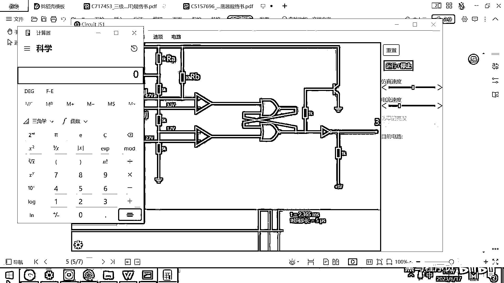
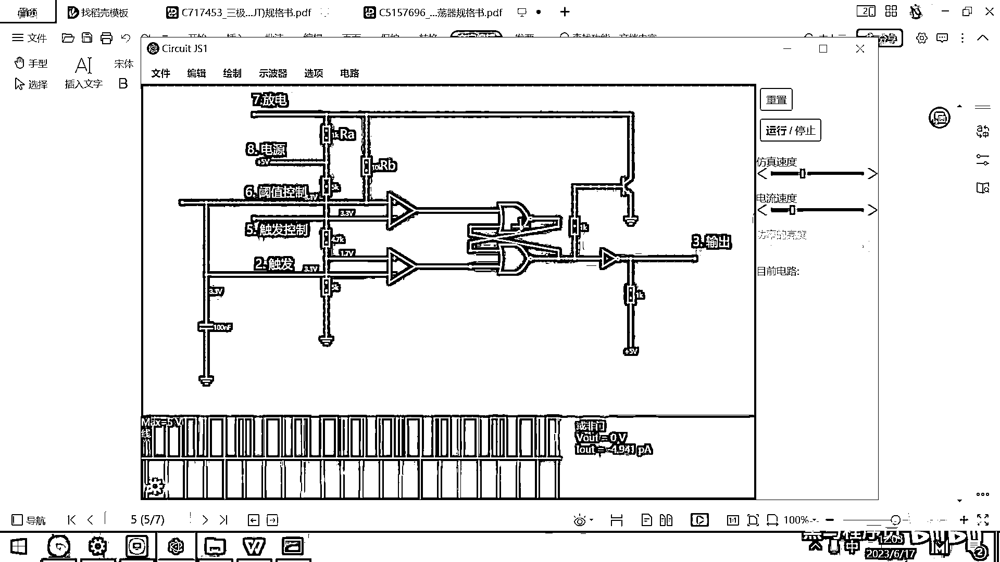

# 黑马程序员嵌入式开发入门模电（模拟电路）基础，从0到1搭建NE555模拟电路、制作电子琴，集成电路应用开发入门教程 - P47：48_ne555输出方波原理 - 黑马程序员 - BV1cM4y1s7Qk

好了，那整个电路是如何工作的呢，我们先看一下，这个N1555电路搭建好之后的这个效果，这个效果在3号输出端口呢，我增加一个试波器，增加一个试波器，然后增加完这个试波器之后，大家看一下试波器的效果是什么。

就是输出一下5伏的高电平，然后又输出低电平，然后等若干时间呢，又输出一下这个5伏的高电平，又输出一个低电平，你直接看这个3号的输出也能看出来，是不是他亮一下，灭一下，亮一下，灭一下，对吧。

就在周期的时间内，他一会输出高电压，一会输出低电压，好，那他究竟是如何完成这样的一个工作的呢，我们来带着大家一起去分析一下这个电路，好，要分析电路的话，有几个地方非常关键，第一个地方呢。

就是这条线的电压，我把它给显示出来，我们显示电压，好，这条电的这条线的电压，现在大家看是多少，3。3伏，对吧，好，这条线呢，我们也去显示一下他的电压，好，然后这条线呢，我们去显示他的电压，这条线呢。

我们也去显示一下他的电压，电压，好，我先把这个整个仿真的给重置掉，然后先先思考一下这个电压，为什么是这样的一个值，好，这条线的电压是3。3伏，为什么呀，好，那大家看八伏这个八是电源，对吧。

这个是五伏五伏的电源经过了一个5K的电阻，经过两个5K电阻，经过三个5K电阻，最后接地，那实际上这三个5K电阻电压是不是都是一样的，对吧，好。

每一个5K的电阻都分掉了我电压源的三分之一。

5除以3等于多少呀，大家看一下，5除以3。

这等于1。67，对吧，好，那你看这个地方的电压1。7伏，是不是正好就是五伏电源的三分之一，对吧，然后这个地方3。3伏是不是正好就是五伏电源的三分之二，然后这个地方就是五伏好。

这两个电压是一直都没有变化的，大家看一下，不管你怎么仿真，这个3。3伏还有这个1。7伏有没有变化呀，没有变化，那变化的是啥呢，你看一下有有两个地方很有意思，这上面这个电压一会高一会低。

这下面这个电压是一会低一会高，我把这个仿真速度再弄慢一点，你看，1。2。6 2。7 3。3又降下来了，降下来之后又升上去了，升上去之后又降下来了，你看这个哥们儿，这个哥们儿是多少呀。

是升上去降下来升上去降下来，对吧，那哎，那我们现在呢，就要去看一下，为啥这两根线的电压一会高一会低了，要看一下为啥这两根线的电压一会高一会低，我们来分析一下这个电路，好，这个电路8是不是一个电源呀。

8这个电源，它是5伏经过了什么，经过了我们的，电阻，那大家看一下这个8这个电源是不是先经过这个电阻，然后又经过这个电阻，然后通过这条线最后流到哪呀，流到这个电容上，看明白了吧。

其实这个8号的这个电源是不是经过了RA又经过了RB。

然后最终的接上了这个电容。

好，这个电容呢，我给大家去看一看它的电容的电压，我们编辑，然后去显示这个电压，大家看一下我重置最开始这个电容的电压是多少呀，0伏，我一运行，你看这个电容是不是在充电呀，它要充到多少伏呀，充到3。

3伏之后，好像就充不上去了，就降下来了，对吧，降下来之后好像又升上去了，那从这个现象上看，大家就发现其实这个电容在一会充电一会放电，对吧，一会充电一会放电，那究竟它是怎么一会充电一会放电的呢。

我们把这个速度再调慢一点，来去分析一下，好，那一上来5伏的电源经过这个RA又经过这个RB，是不是给这个电容充电，对吧，这个电容的电压，你想一下，那是不是从0伏，然后慢慢升高，慢慢升高，慢慢升高呀，对吧。

好，我们来认真观察，好，这个电容的电压就在升高了，好，但是呢，你会发现这条线是不是连着比较器的，这个比较器的下方连着连着这个比较器的上方呀，大家看到了吧，我把这两个比较器的电压呢，也给显示出来。

显示电压，好，这个比较器已经显示电压了，我们来继续仿真，你看1。7伏了，1。8伏了，当这个一下变成两伏的时候，会出现一个什么情况呀，这个set是不是就已经被设置成1了，set就被设置成1了。

但这个时候这个上方还没有升到3。3伏，这个还是0，对吧，好，他继续升高，继续升高，继续升高升高到3。3伏的时候，这个重置按钮，大家想一下是不是拉高了，然后你看到哎。

那这个触发器又把下面的这个状态给重置了，好，那整体的这个仿真呢，就是这个样子的，就是电容充电，然后慢慢充电导致这个下面设置为1，然后继续充电导致这个上面设置为1，这个RS触发器。

这个双稳态触发器就跟我们刚才看到这个现象一样，你先拍一下下面设置一个低电平，再拍一下上面去重置一下，把它置为高电平，再拍一下下面，再拍一下上面，这个看明白了吧，他其实就是电容充电，然后充完电之后。

这个状态切换，这个状态一切换的话，他带来了一个现象是什么呢，这个地方拉高了，然后他就把这个三级管给打开了，这个三级管一打开，你看一下我们这个电容是怎么连的，从这个地方，然后接这个电阻，对吧。

然后经过这个三级管接地，那所以呢，一旦这个三级管被打开，我的这个电容就开始放电，放电之后，电压又降低，好，那整个这个过程就是电容充电，然后电容放电，电容充电，电容放电，电容在充电的过程中。

这个地方输出的是低，电容在放电的过程中，这个地方输出的是高，好，所以一个按照时间频率的方波，我们就利用NE555给生成出来了，好，那整个这样的一个流程，就是NE555芯片工作的内部过程，这个过程呢。

不是特别容易理解，你一定要自己去画一画这个电路，然后呢，你把这个仿真速度调慢一点，看看这两个比较器的电压是怎么发生变化的，这两个东西一变化。

是不是就导致这个输出变化。

这个输出变化，那你就有对应的方波出现了，謝謝。