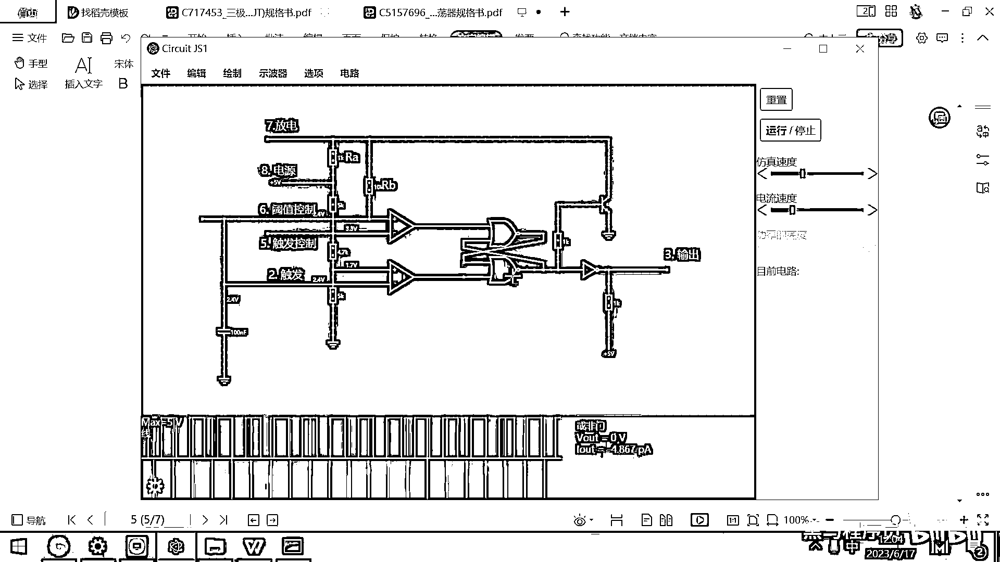
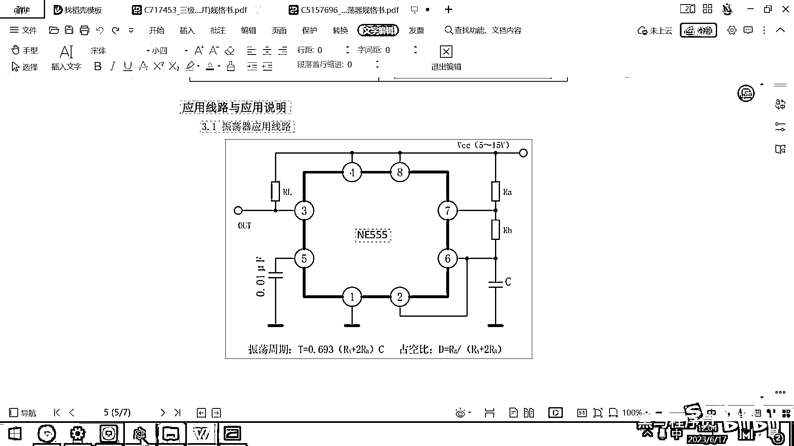
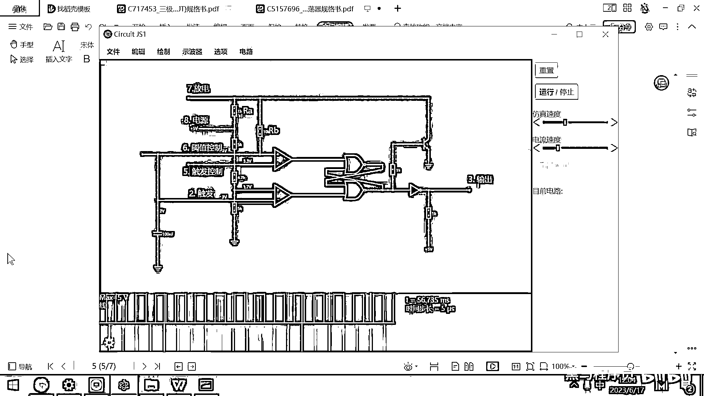
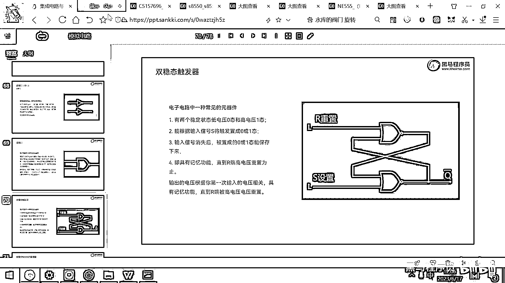
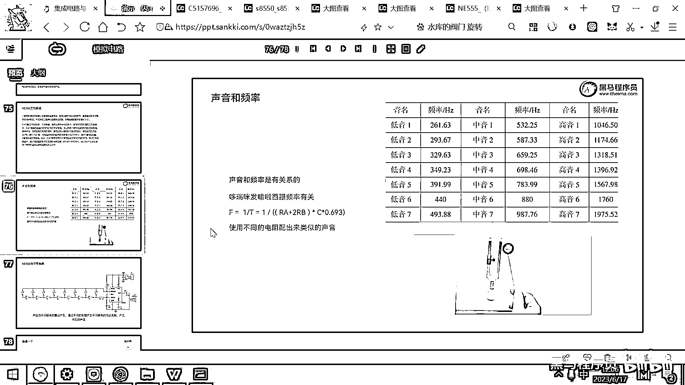

# 黑马程序员嵌入式开发入门模电（模拟电路）基础，从0到1搭建NE555模拟电路、制作电子琴，集成电路应用开发入门教程 - P48：49_ne555外围电路 - 黑马程序员 - BV1cM4y1s7Qk

好 那这块呢 就是属于大学摩电的一个最重要的项目了，就是怎么去理解这个NE55，怎么去用这个NE55。

好，其实呢，我们真正在使用这个芯片的时候呀，你完全可以不用理解这个芯片内部到底是如何工作的。

就我们做这个计算机软件呢，实际上是一层一层凑像出来的，对吧，大家在用你的电脑的时候，你打开一个word，打开一个office，你就可以在里面打字，然后画画了，对吧，你有没有考虑过这个office。

还有这个word的内部代码是怎么实现的，你没有考虑它，对吧，你用这个word office就是在应用它，好。

实际上呢。

绝大多数工程师去使用那个NE55的时候呀，也不清楚它内部到底有几个电容，有几个电阻，然后有什么比较器，他只需要干嘛呀，只需要去看一下这个芯片的应用手册就可以了，他需要知道什么呢，这个8应该接电源。

4应该接电源，4和3之间有个电阻，5可以接一个电容滤波，1接GND，然后2和6短接，6去接一个电容，然后7和8之间有一个电阻，7和6之间有一个电阻，他只需要知道这个电路这样接就可以了，那如果呢。

你要想去调你最终输出的这个方波的频率或者是周期，那怎么办呢，那你就利用人家提供好的公式呗，你看震荡周期等于什么呢，等于0。693×R1加上2倍的Rb，然后去乘以这个电容的大小，那如果呢。

你要想调这个高电平的时长，那你就高电平的时长就是Rb除以Ra，加上2倍的Rb，好，那你只需要知道这个电路怎么接，然后知道这个公式，你就可以去开发出来任意你想要的这种电路了，好，其实呢。

我们我们在实际开发的时候，经常就是看芯片手册，然后看这个外围电路，然后基于这个芯片手册里面的案例呢，来进行这个开发，那里面的这些参数呢，往往都是在手册里面已经写好了。

我们就按照手册里面的要求去选择这个参数就可以，好。

那一旦大家学会了这个NE55。

理解了这个NE55的原理之后呢，我们就可以做一些比较有意思的应用了，好，那第一个应用呢，就是我们可以用NE55去开发一个电子琴。

用NE55开发一个电子琴。

拜拜！，謝謝。