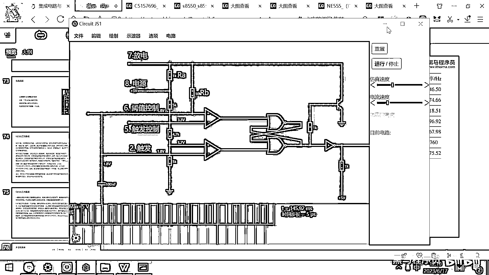
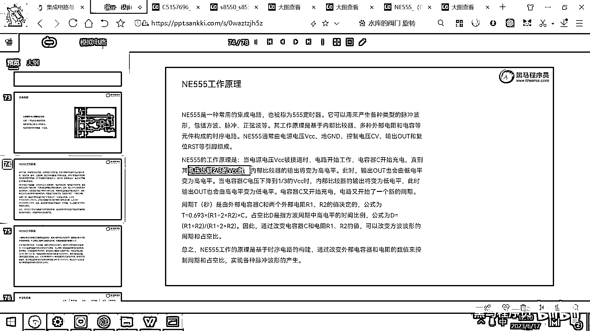
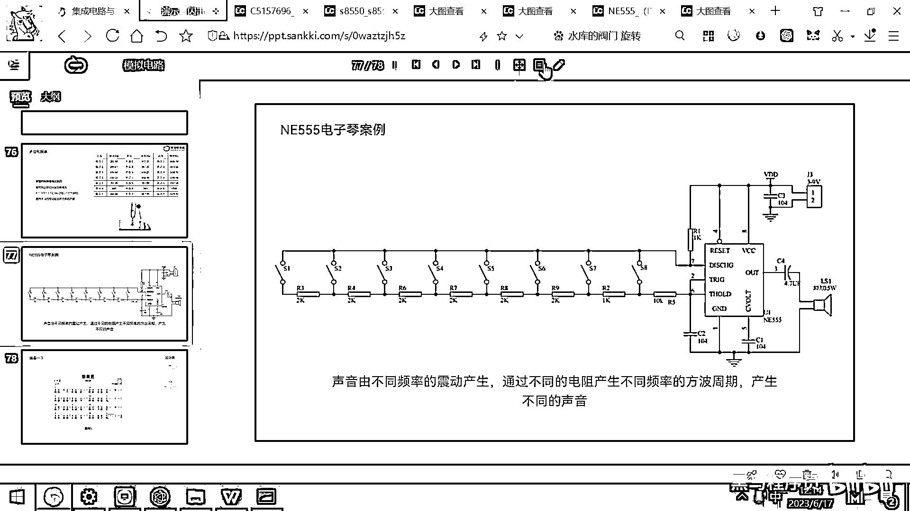

# 黑马程序员嵌入式开发入门模电（模拟电路）基础，从0到1搭建NE555模拟电路、制作电子琴，集成电路应用开发入门教程 - P49：50_ne555电子琴原理介绍 - 黑马程序员 - BV1cM4y1s7Qk

好 我们说这个声音是怎么产生的呀，声音实际上是按照一定的频率振动产生的 对吧。

那刚才我们看到了这个N155，它是不是可以按照一定的频率去输出这个高低电压呀，对吧，它可以按照一定的频率去输出高低电压。

那如果呢我们能够控制它输出的频率，那大家想一下，按照261赫兹的方式，这样一个频率去输出高电压，然后去驱动一个风鸣器或者一个喇叭，那是不是就有一个中音的"哆"就出来了。

然后如果按照293赫兹的频率去驱动喇叭，就一个"Re"出来了，好 所以"Do Re Mi Fa Sol La Si"对吧，你看到这个音的频率是越来越高的，你按照不同的频率去驱动这个喇叭。

喇叭就会播放出来不同的声音，好 另外还有高音的"Do Re Mi Fa Sol La Si"对吧，那这是不同的频率，好 这个频率怎么计算呢。

刚才我们是不是已经看了就有这个公式了。

对吧，什么T=0。693×Ra+2Rb×C。

好 那这个公式究竟是怎么来的呢。

其实一旦你理解了这个原理图，那你就知道这个公式是怎么来的了，好 大家想一下，我们这个双稳态出发器是一会输出高一会输出低对吧，好 为啥双稳态出发器一会高一会低啊，因为这个电容一会充电一会放电对吧。

那这个电容充满电的话，你想一下是不是这个"S"就被拉高了，然后这个下面的"SET"就被拉低了，如果这个电容没电的话，那默认情况下大家看这个应该是低，这个是1。7V对0V，这个肯定是高对吧。

好 所以这个电容充放电的时间就决定了，我最后输出的这个方波高低电频的时间，那什么因素决定这个电容的充放电时间呀，第一个因素就是这个电容的大小对吧，那如果这个电容很大，它充电的时间是不是就长对吧。

那如果这个电容很小，它充电的时间就短，好 那当然如果这个电容很大，它放电的时间是不是也长呀，对吧，好 那还有两个参数，这个参数就是这个RA还有这个RB了，我们看充电的电路是怎么来的，是5V经过这个RA。

然后经过这个RB给这个电容充电对吧，那放电的电路是怎么来的呀，是这个电容经过这个RB，然后经过这个三极管，然后去放电对吧，好 所以这个RB的值如果增大了，是不是会延长它的放电时间。

如果这个RA的值增大了，它会影响它的充电时间，这个理解吧，你这个电阻变大了，电流变小了，那肯定充电时间就长了，那这个RB电阻变大了，放电的电流小了，那肯定放电的时间就变长了。

好 所以呢。

整个这个N155它工作的原理呢，就是什么呀，当这个VCC电源接通的时候，电路开始工作，所以这个电容呢开始充电。

当这个电压充到VCC的三分之二的时候。

就出现什么情况呀，上面的这个Reset了对吧，因为一充到三分之二就大于这个3。3V了。

那上面这个就会Reset，一Reset的话，是不是它就会输出高电频。

一旦输出这个高电频的话，这个三极管被打开，那电容是不是就开始放电对吧。

那电容放电的话，这个电容放电放电到三分之一VCC的时候。

又会出现一个什么情况呀，电容放电到三分之一VCC了，这上面这个1。7V已经比较高了，这个下面的电压已经低于三分之一的VCC，低于一点7V了，是不是这个Set又会被设置为1了，这个Set一设置为1。

这个三极管是不是就关了。

那关了的话又给这个电容充电了，好所以整体的这个流程呢，就是这个C一会充电一会放电，然后经历这个周期，那所以这个公式计算就是什么呢，这个T呢就等于什么0。693乘以R1加2倍打2乘以C。

因为电容大周期就长，然后这个放电的时间长充电的时间长，然后这个周期也就长对吧，那可能有同学问了这个0。693是咋来的呢，这个0。693呢实际上是自然对数E，因为我们电容充电的话，它不是线性充电的。

它是按照一个这种自然底数的方式进行充电的，所以这个值呢就是0。693，那这一个公式呢就对应的是大学的这种，叫大学的电学物理里面的这个内容，你要去理解电容的充放电曲线，然后理解各种各样的参数。

然后你才能搞出来这个公式，但这个公式呢实际上也不需要我们研发，也不需要我们去推理对吧。

大家只需要干嘛呀，只需要去看这个数据手册，然后知道有这样一个公式，能基于这个公式去计算周期和占空比就可以了，那后面呢我们会用到很多的电源模块，这个电源模块呢，它内部的这个原理是用什么胶尔小偷呀。

利用什么反向激荡呀，有很多很多的这种电路的摩电的原理，这些原理呢其实你也不需要关心，你只需要能够选行电源的芯片，然后能够看懂这个芯片，能够看懂它的数据手册，你知道配多大的电阻，产生多大的电压就可以了。

因为我们本身就是基于这种应用层的这个开发，你能够选行，然后选出来性价比高的芯片，然后基于这个芯片呢去完成你想要的功能，好那行，那现在呢这个看完了。

我们来继续来去瞧这个电子琴了。

好这个电子琴呢，在这个下方，我给大家了一个电子琴的参考电路，这个参考电路大家看一下。

是不是就跟我们刚才所画的这个电路是。

基本上是完完全全一模一样的，好那，什么时候充电呀。

你看一下充电的过程是什么样子的，充电的过程是八号引脚过RA，过RB，然后给这个电容充电。

对吧，八号引脚过RA，过RB，然后通过六号引脚给电容充电。

那我们去瞧瞧这个电路图，八号引脚在哪呀，我把这个电路图的大图给打开，好这个八号引脚在什么地方。

我们讲一下八号引脚，对吧，这个八号引脚通过RA，大家看是不是有一个1K的，然后还要通过一个RB，然后给谁充电，给这个CR进行充电，对吧，给这个CR充电，那这个RB在哪呢，大家瞧一下，这是一个开关。

这是一个开关，这是一个开关，这是一个开关，这有一大堆开关，那如果我把这个S8给闭合了，那大家想一下八号引脚过这个RA，然后是不是要过这个R5，然后给这个CR充电呀，对吧，你按这个开关就过R5给CR充电。

那如果呢你按这个S1这个开关，你看一下这个电路，八号引脚过RA，然后走走走走走走到这儿，过这个2K 2K 2K 2K 2K 1K，然后10K才给这个CR充电，对吧，相当于他是过了一个很大的电阻。

给这个CR充电，那如果这个电阻很大的话，那大家想一下，他的这个，看刚才这个公式，看刚才这个公式，他的这个周频率等于什么呀，1除以RA加上RB，那如果这个RB很大的话，你想一下这个除出来的值。

是不是就会变得更小一些呀，对吧，分母变大，除出来的值是不是变小，好，所以呢，最左边的这一个S1的按键呀，就是频率最低的刀，是261。63，好，那最右边的这个按键呢，就是高音的刀了。

这样就Doremi Fasolasi刀，那产生不同的频率，好，如果呢，大家觉得还不是特别的相信的话。

我们可以基于这个公式呢，来进行一下计算，好，那这个电容呢，是100n法，实际上就是，100乘以10的-6次方，就是1乘以10的-4次方，对吧，好，那我们呢来去算一下了，看一下这个电路图。

算一下这个电路图，好，这个RA是多少呀，是1K对吧，这个RB的话是2K，2K 2K 2K 2K 2K 1K 10K，这是2+2=4，4+2=6，6+2=8，10，12，13，23，对吧。

这个RB是23。

好，那我们来一起算一下了，这个RA是。

是多少呀，我已经忘了，这个RA呢是1K，对吧，R1是1K，然后这个RB呢是23K，23K，是23K吧，这个RB是从这儿，这是25，10，12，13，23K对吧，这个是RB，然后这个电容呢是104。

也就是这个C呢是0。0001，因为是100乘以10的-6次方，对吧，这个就是0。0001，好，这是电容，那这些值都有了，我们来看一下计算公式，是不是拿1除以这些值呀，对吧，打开这个计算器，我们来算一下。

打开计算器，我们用1加上个2倍的23，就是446，1加上446，这个叫1加上446，这个实际上等于47，对吧，47我们去乘以0。0001，对吧，再乘以个0。693自然底数，好，这就得出来了这样一个值。

好，这个值我们有了之后，拿1去除以这个时间，是不是就是频率，对吧，好，那1除以这个时间，这个大概得出来的就是307，得出来的是307什么呀，赫兹对吧，就是这个频率，正常的这个刀是多大的频率。

正常的刀是261，然后我们用这个电阻做出来的是多少，是300多，所以这个电子琴呢，你把它给焊完之后，你会听着这个声音发出来的，有一些不是那么真实，对吧，好，那原因呢，就是这个电阻呀，配出来的这个值。

并没有真正的到这个Doremi Fasolasi的这个频率，好，那最主要的原因是什么呢，最主要的原因就是，这个电阻呀，2K的比较常见，你说你要找一个电阻是1。675K，好，这个不太好买，或者你你要去配。

才能配出来这样的电阻，那教学方便的话呢，只是演示一个大体的原理，好，所以这个电阻呢，阻值跟最终的这个频率呢，是大体上符合的，还有一些差异，所以你弹出来这个声音呢，有一点点，有一些失真。

那如果你要想让这个声音很精确，然后这个声音，跟这个频率完完全全一模一样，那你就要去，自己去配这个电阻，把这个电阻呢，给配的比较合适，好，那这就是为什么模拟电路，现在用的越来越少。

然后现在越来越多的都是数字电路了，对吧，好，为啥呀，模拟电路，它没有任何软件的编程，它真的就是靠这个硬件，电容去降低一下这个电流，电容去，这个电阻去降低一下电流，对吧，这个电容调节一下大小。

增加它的充电或者放电的时间，它真的是靠这个硬件的元器件，来完成的这个电路功能，那如果你的这个硬件，你的这个电阻没有一个合适的，你这个功能呢就实现不了，那数字电路有一个什么好处呢。

我们就一般第一个案例就是，就是用这个单片机去播这些音乐，播一个小星星呀，播一个粉刷匠，那个播出来，你就能听到这个声音呢，很逼真，好为啥呀，因为你用代码去控制的话，你可以很容易加一些睡眠。

你让它勾电频一段时间之后，睡眠个多少毫秒，这个时间是不是就调好了，对吧，那你睡眠完了之后再低电频，因为写代码的话，你是可以用程序很容易的去调节，这个程序执行的过程的，你就不需要再配这个电容电阻。

你直接代码就可以让这个频率呢，给发生变化，你单片机你有一个引脚，你说哎，我让他我让他这个高电平，多少多少毫秒，对吧，低电频高电平个0。00325秒，然后低电平个多长时间，你自己写代码这个时间。

你可以精准的控制，那所以一个IO口，你就可以让他去发出来不同频率的，这个高低电平，那不同频率的高低电平，就有不同频率的声音了，好，那正是由于这个单片机呢，越来越便宜，好，一个像STC的这种MCU。

可能就一块钱两块钱，你拿一个这种单片机，然后性能呢也很好，对吧，这个可扩展性可维护性更强，然后功能做出来呢，又比这个模拟电路又强大很多，所以呢，这个摩电就用的越来越少，越来越少。

然后基本上都是往这个速电呢去去转了，好。

арrivederci。