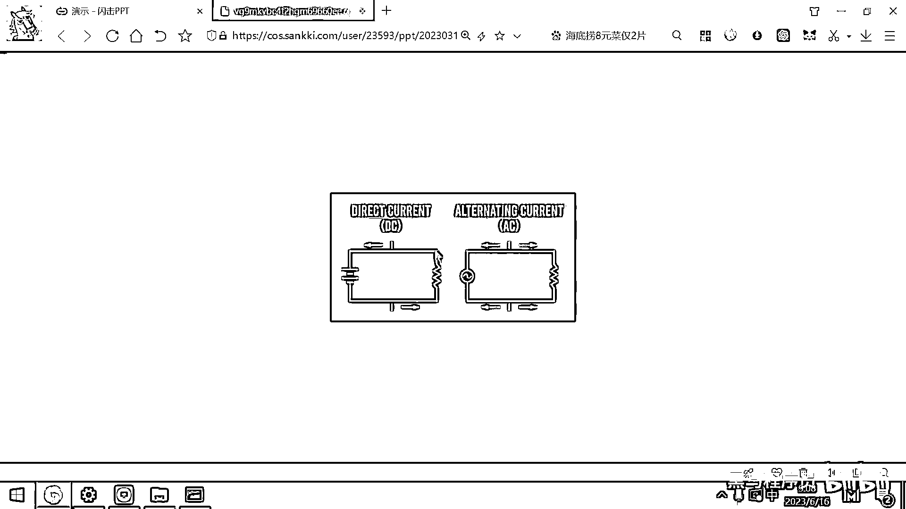
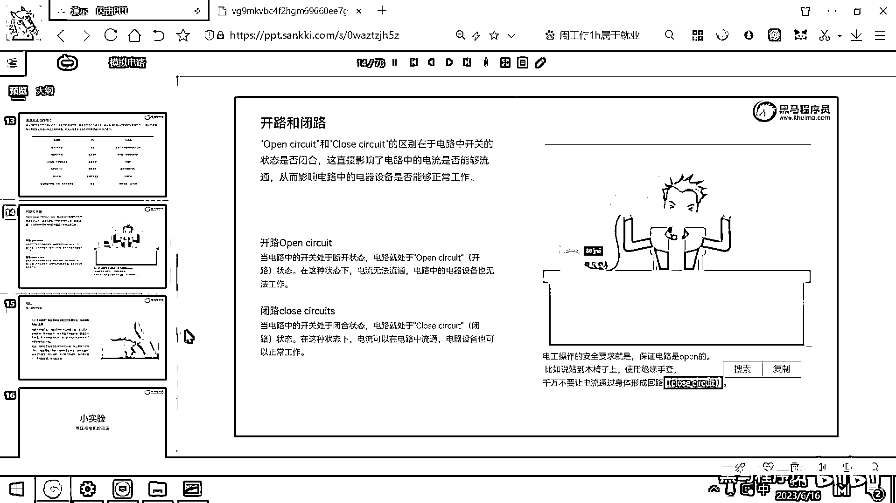

# 黑马程序员嵌入式开发入门模电（模拟电路）基础，从0到1搭建NE555模拟电路、制作电子琴，集成电路应用开发入门教程 - P4：04_直流电和交流电 - 黑马程序员 - BV1cM4y1s7Qk

好 那下面呢 我们要介绍一个非常重要的小细节，就是电流的方向，在200年前呢，科学家发现这个电的时候，他们其实是没有这种电子显微镜，还有高级的这种观测设备的，他们不知道电产生的原因是由于。

电子在这个电路中移动 对吧，电子大家知道是带负电荷的，那其实电流的产生是由于负电荷，在电路上移动所产生的，但在200年前呢，发现这些电的科学家，他们没这个设备也没法观测。

那他们就只能根据这种宏观的实验现象，猜测出来有电流这样的一个东西，那他们就定义，所有的电流都是从正极流向负极的，因为微观世界没法观测，那他就宏观的感觉电流呢，是从正极流向负极，那所以呢就导致了。

所有的物理学的电学相关的公式呀，都是基于电是从正极流向负极，这样一个假设进行设计的，那真实世界里的电流方向，是不是正好跟这个，之前的设定是相反的 对吧，那不过这个方向呢，它不影响任何计算的结果。

那后面我们讲所有的电流，都按照传统电学的方式，都是从正极流向负极，因为大家已经约定熟成了，那很并且符合我们的生活常识，对吧那电流从电池的正极流向负极，这种流向方式呢，是属于传统电学，而真实的微观粒子呢。

是从负极流向正极的。

这个大家注意一下这样一个小细节，好那下面呢，我们就介绍一下两个概念，一个概念呢就叫直流电，一个概念呢叫交流电，直流电呢，它的英文全称呢叫DC，英文缩写叫DC，交流电呢叫AC，这个D呢是Direct。

就是直的意思，这个A呢是叫叫叫这个，Alternating 对吧，Alternating，Alternating就是就是反过来，Alternating就是取反，好所以呢，AC就是交流，一会正着流。

一会反着流，DC呢是直流，好那AC交流电，它有什么样的特点呢，我们用的这种插座里面的电，220伏的，这个都是交流电，这个交流电呢，它实际上是快速变化的一个电流，这个电流的方向呢，一会是从从左。

假设假设有两个洞，对吧，一会左边是正，一会右边是正，这个交流电的电流方向呢，是随这个时间变化的，好这个电荷呢，在正负及两个方向上，周期的交替的流动，周期交替的流动，交流电呢，它一般都是通过。

这种发电站所产生，然后通过这种电网呢去供应，那一般呢各种大功率的电器设备，像电视机，冰箱，微波炉，电动汽车，这些用的都是交流电，好那直流电呢，一般就是靠电池产生的这个电，电流的方向呢是不变的。

电荷呢始终是在同一个方向移动，比如说电流的方向，就是从正极到负极，对吧，那直流电源呢，一般都是通过电池，或者呢通过特殊的直流电源的设备，或者呢是通过这种化学反应来产生。

那直流电呢通常是需要用于稳定的电压，或者恒定方向的小型设备中，那大家用的手机啊，然后如果你笔记本不接这个外部电源，用的也是这个直流电，像电动自行车，24伏的，36伏的，48伏的，这些呢都是属于直流电。

好那大家呢就看一看右边的这个图。

就可以很容易的去理解直流和交流了，左边的DC呢是直流，你看这个电流呢是从这个负极，然后流向正极，对吧，这个是真实的电流方向，好那右边呢这个是交流，这个交流大家看这个电压源。

你看它是不是就像是一个正弦波呀，对吧，一会儿高一会儿低，一会儿高一会儿低，好所以它电流呢就是一会儿往左边流。

一会儿往右边流。

好那这是交流电，好那直流电和交流电，我们进行一下对比，看一下他们的应用场景，直流电呢，它的电流方向是不变的，对吧，而交流电的电流方向呢是周期性变化的，直流电的电压呢，一般可以保持这个稳定不变。

你这个电池1。5伏的，你的这个锂电池呢，4。2伏3。7伏的，好那交流电呢，它的电压实际上是周期性的变化的，周期性的变化的，看刚才这个图你就能够看到。

它的这个电压。

一会儿是零，一会儿是高，然后呢一会儿又降到零。

一会儿又低，它是一个正弦波周期性的变化，好那发电方式呢，交流电通过发电厂进行发电，对吧，那直流电呢，一般像太阳能呀，化学电池呀，或者交流转直流的这种方式产生，好那能量损失呢。

如果我们采用交流电去传输电的话，它的这个能量损失呢，实际上是比较大的，交流电传电的能量损失实际上是比较大的，而直流电的能量损失呢比较小，那现在就有同学有问题了，他说交流电传电的能量损失大。

为啥还用交流电呢，最主要的原因就是，交流电可以很方便的改变电压，交流电可以很方便的改变电压，你电压越高，然后远距离传输的时候，这个传输电啊，它在导线上的损失呢，就会越小。

那所以大家看我们外面是不是有很多这种变电站，对吧，一般超远距离传输电的话，可能就是，是几几百千伏，对吧，甚至上万伏的这种电压，超高的电压，然后去远距离的传输这个电，然后等这个电呢，到我们居民区了。

是不是有这种变电站，把这个11千伏的电，然后变成这个220伏，变成这个380伏，去供这个工厂或者是我们居民去使用，所以呢，因为交流电它可以非常方便的更改电压，所以才用在这个远距离的传输上，好。

那最后的应用呢，就是交流电一般是家用电器啊，工业设备工业机器用交流电，而普通的这种我们家用的小电器一般都是直流电，好，那关于这个电路呢，里面也有两个重要的概念了，叫开路和闭路，这两个概念呢。

大家理解一下明白什么是开，什么是闭路就可以了，这个开呢，它对应的英文单词是叫open，这个闭的话，对应的英文单词叫close，好，所以呢，英文术语一个叫open circuit。

一个叫close circuit，这个区别是什么呢，open的话是开就代表的是断开状态，如果一个电路处于断开状态的话，那大家去思考一下会出现什么问题，假设这个电路现在在这导线断掉了，那这有一个电子挤它。

这有一个电子挤它，这有一个电子挤它，然后它又挤它，但在这导线断掉了，那这个电子还能挤着它吗，挤不到了，对吧，因为它们之间已经断开连接了，那既然它挤不了它了，那这个电场就没了，电流呢，就不会持续的流动。

这个灯呢，就不会亮了，好，所以呢，当一个电路处于这种叫open circuit的状态，就是开路状态，电流呢，是无法导通的，电器设备呢，就没法正常的工作，那还有一个术语呢，叫闭路，闭路呢。

就是close circuit，一旦这个开关呢，处于闭合状态的话，电流可以在电路中流通，然后这个设备呢，就可以正常工作了，好，那关于开路和闭路呢，是大家如果要考电工证的话，里面的一个必考题。

那这个作为一个电工，我们在工作的时候，要保证你的电路是开路的，对吧，那电工操作保证路径呢，是开路的，好，怎么保证呢，一呢，就是使用绝缘手套，对吧，那绝缘手套呢，上面是一个绝缘体，然后电子呢。

是没有办法去经过这个绝缘体的，好，那或者呢，就是电工呢，直接站到一个木椅子，木凳子上，对吧，因为这个木头呢，也不导电，保证整个电路呢，是这种open的，是开路状态，千万不要让电流在身体上形成。

这个叫close circuit，就是形成这个回路，回路，(字幕製作:貝爾)，(看這個爪子的耐力)。

