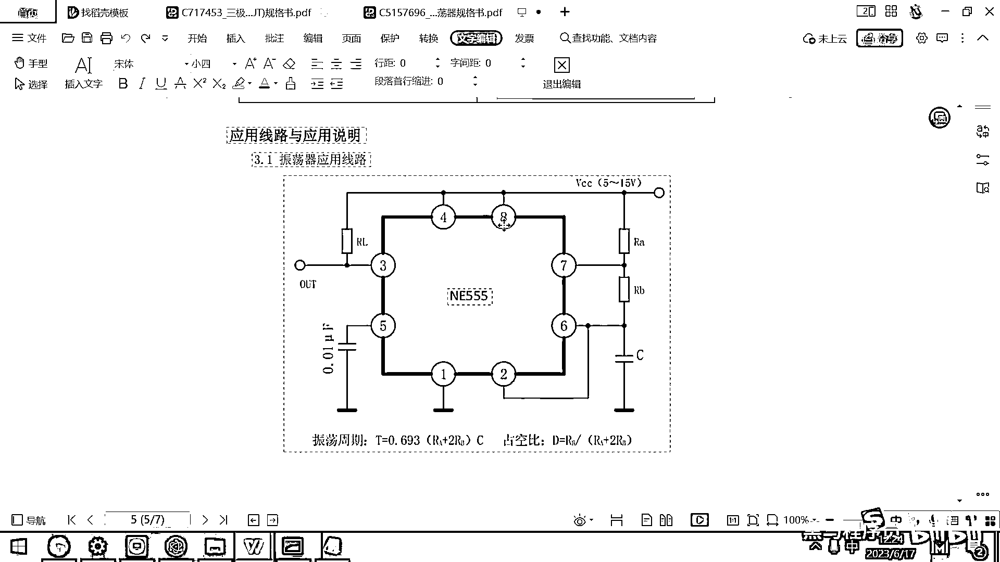

# 黑马程序员嵌入式开发入门模电（模拟电路）基础，从0到1搭建NE555模拟电路、制作电子琴，集成电路应用开发入门教程 - P50：51_模拟器中的ne555 - 黑马程序员 - BV1cM4y1s7Qk

好 那这个N155的这个原理呢 我们就给大家介绍完了，其实呢 大家可以用这样的一个仿真软件。

然后去观察这个N155的运行过程。

好 在这个电路里面呢 大家去看一下，它直接有一个模块叫什么呀，N155定时器。

然后呢 你看这个下面有一个选项叫内部，好 这个其实就是我们上课带大家画的这一个原理图，画的这个原理图，好 不过要注意的是这个原理图的这两个比较器呢。

跟我们芯片手册里面的这一个比较器的上下顺序正好是相反的。

你看上面这个是阈值比较 下面是触发 对吧。

你看它的这个 它没有写，它这个上面是触发 下面是这个阈值比较，它正好把这个上下给颠倒过来了，那大家在看的时候呢 不是特别容易理解。

因为我们正常的这个RS触发器都是上面是从字 下面是设置，这个是芯片手册里面的框图。

然后你去看模拟电路里面的这个框图呢 是正好是相反的，大家要注意一下，好 另外呢 你基于这个N155呢，大家可以看一下 它就可以做什么呀，就可以做这个方波发生器了。

好 那这个图 这个图实际上就是我们刚才在这带着大家画的这个外围电路。

你去比较一下，你就会发现是一模一样的，我们真正在用芯片的时候呀，实际上是不会关心这个芯片的内部的细节的 对吧，我们所关心的是什么呀，就是这个芯片VIN就是正极怎么供电。

这个GND怎么接。

然后呢 这个比如说6号 对吧，6号为啥要接一个电容，这个7号去接一个电阻，这个电阻跟8相连。

这个7接一个电阻跟6相连，你只需要按照芯片手册的连接规范，把对应的这个电路给连好，就可以做出来相同的功能了，好 它的整个这个过程，大家看一下 忽略内部原理，那是不是 哎 这高低电频 高低电频 高低电频。

好 其实你看这个电流一会儿一会儿进一会儿出，原因是啥呀，这个这个出来的时候就是对外放电，进去的时候实际上是是是叫什么呀，Discharge 对吧，这个电容在放电，好 那整体这个流程就这个样子。

你如果呢 要想去修改这个方波的时间，实际上有哪几个参数可以改呀，第一个是这个放电的电阻，你可以把它调大 对吧，这个充电的电阻，你可以调它的大小，然后另外还有一个是我的这个电容可以调节。

这三个值你去调节。

最终影响的就是它的震荡周期，还有这个占空比。

好 那行，那这个上午的内容呢就讲这么多，然后大家呢理解一下这个电子琴的工作原理。

理解完这个原理之后呢。

下午我们会带大家呢，基于这样的一个原理图，把真实的电路呢给画出来，那画完这个电路之后呢，你就可以去下单，把这个板子呢给生产出来，然后过 等到后天的话呢，我们就可以把这个板子呢给焊出来了，然后你看一下。

从原理 然后到实物，实际上整个流程呢还是非常简单的。

