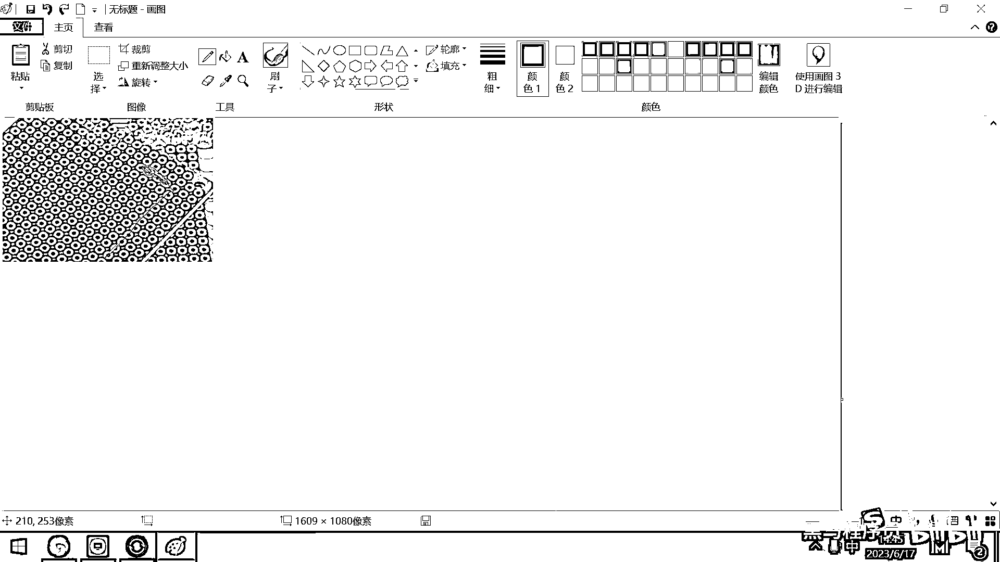

# 黑马程序员嵌入式开发入门模电（模拟电路）基础，从0到1搭建NE555模拟电路、制作电子琴，集成电路应用开发入门教程 - P51：52_pcb概念入门 - 黑马程序员 - BV1cM4y1s7Qk

好 都有屏幕吧，今天下午，我们就带大家来快速的学习一下与PCB设计和生产相关的内容，好，那第一个概念，就是到底什么是PCB呢，PCB，它的英文全称叫Printed Circuit Board，对吧。

这个翻译成中文就叫打印或者是印刷电路板，中文就叫印刷电路板，那大家经常见到的那种绿色的或者黑色的板子，它实际上就是PCB，只要是一个电子产品，只要你用的这个电子设备是装电池的，或者是插这个电源的，对吧。

只要是电子产品，它里面一定是要有这个PCB的，好，这个PCB呢，它通常就是一个薄薄的平坦的板子，这个板子其实最主要的材料是什么呢，它最主要的材料实际上是玻璃纤维，就这个板子。

它基板最主要的材料实际上是玻璃纤维，所以呢，这个板子有人去收购它，给的这个价钱呢很低，你一大箱子这个PCB呢，可能就跟玻璃的这个价格差不多，好，但是呢，也有一些PCB板，也有一些PCB板，它会非常的贵。

因为它为了保证它的工艺，在这个上面做了层金工艺，要注意的是层金听着是金字，实际上不是金，是铜或者是银，是铜或者是银，但这种金属呢，回收起来。

价格呢也是很高的。

好，这是PCB，我打开这个大图，大家看一下，那这些有颜色的地方实际上就是导线，就是铜。

然后上面的这些圆孔呢，就是焊盘，好，PCB呢，是一种非常重要的电子零件，它实际上就相当于是你搭乐高机幕用的底板，你需要把各种各样的元器件呢，给插到这个底板上，把它给焊起来，这样的话。

你才能够构成一个完整的电子产品，PCB呢，它的作用是支撑连接各种电子元件，我们手机呀，电脑呀，电视，只要是电子设备。

里面就一定要有这个PCB。

好，那了解了这个PCB之后呢，我们来看一下这个PCB的历史，实际上在上个世纪50年代，也就是说70年前，还是没有PCB这样一个东西的，好，我这儿呢，有一个图片，这个图片呢，是摩托罗拉的一个豪华电视机。

豪华电视机叫VT73，好，这个大图呢。

可以给大家看一眼，就这样的一个电视机，上世纪50年代，人们的娱乐就是这个样子的，对吧，拿这样一个小盒子，然后这里面能模糊的看到。

看到一个480。

320，这样一个分辨率的画，对吧，好，那这个电视机，它卖的很贵，卖4000美金左右，和现在人民币呢，可能就好几万，对吧，好，那大家看一下它的制作工艺。

这制作工艺呢。

就是一个木盒子，纯手工打磨的，对吧，这样一个木盒子。

然后这个木盒子里面长什么样呢，来看看这个大图，这就是这个木盒子里面的东西，好，这个是用来发射电子的显示屏，它把这个电子加速之后，打到这个屏幕上，产生黑白的画面，好，然后这里面，大家看这大的出的。

要么就是电容，要么就是晶体管，然后所有的这个线，都是纯手工打造的，手工连这个连这个，所以那个时候，电视机要卖这么贵，对吧，没有一点电子的经验，你都焊不出来，它这个生产人员，也要求经验很丰富，好。

并且如果焊完之后，还很容易出问题，对吧，一不小心晃了一下，震了一下，哪一个线接触不良了，这个电视就不亮了，好，所以过去的电视，几十年前的这个电视，大家应该知道，如果电视不亮了，有一招很厉害，就是。

就拍它几下，对吧，然后这个电视就亮了，好，为啥，因为一般电视不亮，有可能就是，哪两个导线接触不良，或者这个元器件松动了，你拍一拍一震动，这个就亮了，过去的电子产品，就是，不响了，揍两下。

然后这个就又响了。

那这是，没有PCB的板子，然后这里面有一些大图。

也可以给大家看一下，这真是纯手工绕制，对吧，你看这个地方是一个电容，然后这有电阻，然后有电位器，这转圈的是电位器。

然后这里面真的是。

一个元件一个元件，这样焊接在一起的，好，为什么要开发出来PCB。

这样一个东西呢，这个东西最主要的原因，就是，有了这个PCB板之后，你的产品就可以像，像印刷书本一样，这样大规模的，快速的，复制出来，对吧，纯手工意味着价格昂贵，无法量产，其实纯手工还有一个问题，就是。

质量无法保证，有很多女生喜欢很贵的包，对吧，一个包两三万，这个包为什么这么贵，原因就是，它真的是纯手工打造，然后它价格昂贵，好，另外它其实品质，也没有办法完全保障，你如果去收一些这种，丝滑包包。

然后你就看到，经常是背着开线了，对吧，几万块钱的一个东西，背两下断线了，好，这些都是由于手工制作，它没有办法保证品质，完全是统一的，电路板也是一样的，早期的电路板。

这样去制作。

哪些人运气好，他电视就没问题，有些人运气不太好。

刚用没多久就故障了，好，制作方式低洽，容易出错，从上个世纪40年代的时候，就有美国的一位工程师，想发明一种电路方式了，他就把导线的印刷到，一块板上，这个是PCB的雏形，PCB制作的技术。

在上个世纪六七十年代，才慢慢普及起来，好，随着PCB技术的不断发展，对吧，现在它已经变成了，我们集成电路当中，最重要的一部分，PCB它其实是一块绝缘材料，就是它的底板，上面是一个玻璃纤维。

然后表层去铺一层铜，最后你把你需要的电路给留下来，别的电路把它给腐蚀掉，这样就形成了一个PCB，就形成了一个PCB，好，在04年05年，我上大学的时候，那个时候还没有像这种，伽利创这样的企业。

可以帮助我们直接生产PCB，我们那个时候的PCB是怎么做的，先去买一个双面的铺铜板。

就买一个，去网上去买双面的铺铜板。

现在应该还可以买到，双面铺铜板，买双面的铺铜板。

好，这个板，可能现在已经没有了。

那或者就是买这样的一种东西。

叫洞洞板，叫洞洞板，好，这个洞洞板。

搜出来的，可能需要加一些关键字。

叫PCB洞洞板，好，这个洞洞板，它大概就长这个样子。

大家去看一下，它实际上就是有非常多个洞。

在这个板子上，我找一个稍微大一点的图。

给大家看一下，看到了吧，这个板子上有非常多的洞，然后如果你要想去拉出来一条线，实际上也是，你就要用焊锡去把这条线。

真的给生成出来。

你就一步一步的焊接，我去给大家举个例子。

你想去做一根导线。

对吧，然后你就拿着定烙铁，然后拿着焊锡，怎么干呢，在这涂一坨锡，好，这两条点就连在一起了，在这涂一坨锡，他们就连一起了，在这涂一坨锡，那你要拉电路，你就这样一步一步的用锡。

然后把它给连通起来。

这种很麻烦，然后也很不方便，好，还有一种做法是叫。

叫这个，附铜板，应该能找到。

对，就这个样子。

好，大家看去买这个东西，这个在20年前，就已经有这种技术了。

就是一块板子。

然后这个板子的正面是铜，背面是铜，你看这有叫单层的铜板。

对吧，下面应该还有，双层的铜板，好，单层的铜板，双层的铜板，好，这个铜板，它背面就是一个玻璃纤维，你看它这个板材是什么，玻璃纤维，然后上面是有一层铜，对吧，有一层铜，然后，有了这个板子之后。

我们先用打印机，把你想要的电路给打印出来，打印出来，打印完了这个电路之后。

把电路，贴到铜板上，把电路贴到铜板上，大家看，这是不是电路的，这是连接的焊盘，对吧，然后连接的线，就把打印的内容，给贴到这个板子上，贴到这个板子上之后。

就把铜板。

给丢到酸性的溶液里面，就丢到酸性的溶液里面，好，大家想，如果你真的有电路的地方，实际上它就把这块给保护起来了，对吧，如果你没有粘电路的地方，就是铜裸露在外面，然后大概要经过个40小时左右的，酸性的腐蚀。

然后你把这个板子，差不多要两天左右，40个小时，然后你把这个板子拿出来，用清水冲一冲，然后再把你之前粘上去的，那一层纸，那一层纸，实际上是特殊的纸，就防水的，然后耐酸性腐蚀，然后再把纸揪下来，好。

揪下来之后。

大家就能够看到这样的一个电路板了，这个电路板很丑，然后颜色也不鲜艳，但是这个电路，就已经被印在这个板子上了，你就可以在这个板子上，去焊接元器件了，好，这是20年前的技术，现在工厂已经很方便了，对吧。

他们有专业的设备，可以帮助我们去生产电路板，好，那行，那现代的电路板，一般都是多层结构的，最下面是基板，这是玻璃纤维，绝缘材料，然后上面会有一层铜箔层，就是上面铺的这个铜，你的导线。

就是印刷在铜箔层上的，然后再上面会有一层阻焊层，阻焊层是什么，实际上就相当于是绝缘漆，你的板子上面刷一层绝缘漆，这样可以保护你的电路，不容易被氧化，不容易被腐蚀，好，这是一层绝缘漆，在绝缘漆的上面。

还可以再印字，绝缘漆的上面，还有一层丝印层，丝印层你就可以标记，这个位置应该焊一个啥，这个位置应该焊一个啥，这个位置焊一个啥，最上面的就是丝印层，用来去标记元器件，到底是啥，做一些生产的记号，好。

这个就是我们现代PCB的结构。

