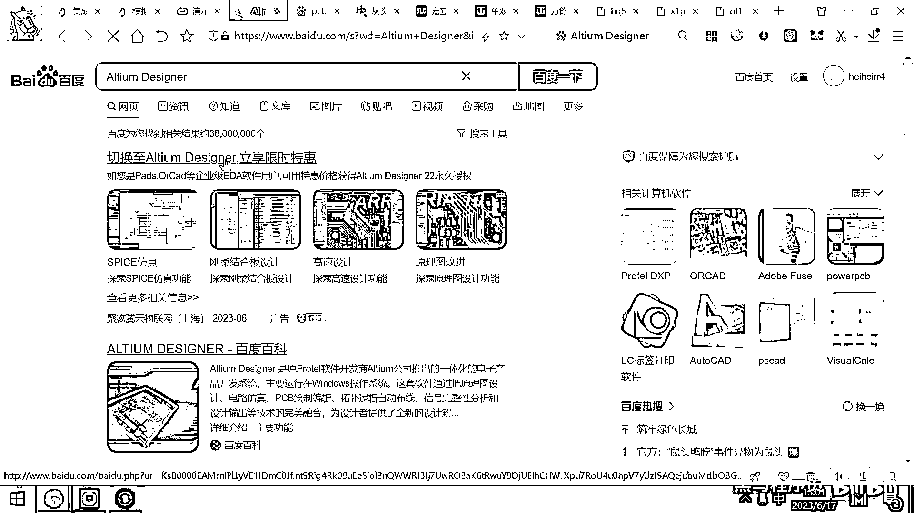

# 黑马程序员嵌入式开发入门模电（模拟电路）基础，从0到1搭建NE555模拟电路、制作电子琴，集成电路应用开发入门教程 - P53：54_eda软件 - 黑马程序员 - BV1cM4y1s7Qk

好 那现在呢 我们这个PCB已经知道它是干嘛的了 也知道它是怎么生产出来的了 对吧，那接下来我们要考虑的问题就是这个PCB应该怎么设计啊，我让工厂帮我设计这个PCB 让工厂帮我把这个PCB给生产出来。

我需要给工厂提供什么样的资料，好 目前的电子就是整个这个电子销 消费电子行业啊 都是设计和生产分离的啊，大家应该听说过 就是这个华为它可以设计出来很厉害的CPU 对吧。

麒麟9000 麒麟什么芯片 但是呢 它现在生产不出来 为啥呀，因为生产是在台湾的台积电生产的 这个美国呢不让台积电给华为生产，那这个华为就有这个处理器的设计的版图 但是它生产不出来。

生产的话需要有很高精度的光刻机才可以生产出来 对吧，那这个PCB啊 还有很多电子产品也是这样的，因为你作为一个设计公司 你不可能再开一个厂 然后把相关的上下游全都搞完。

那一般设计公司呢 就是只是设计图纸 把图纸交给专业的工厂去生产，那中国呢 比较大的PCB的生产厂商呢 一个是嘉丽创 一个是宗信华 还有华秋，这些都是生产PCB比较大的一些公司 你把你的方案提交给他。

他就可以帮你生产出来 那你的方案是怎么来的呢，这个时候就需要用到一个东西了 就叫EDA软件，EDA软件的英文全称呢 就叫这个E是Electronic D是Design。

然后A呢是Automation 叫做电子设计自动化软件，它实际上就是一个特殊的软件 就跟大家用的Word Office Powerpoint类似。

它就是一个软件 但用这个软件呢 它可以很方便的帮助你干嘛呀，你可以画这个电路 对吧 你可以对这个电路布局，然后呢 你还可以进行仿真 然后电路性能呢 可以进行一些优化测试。

然后生成什么电路图PCB原理图 好 这个就是EDA软件干的事情。

好 其实我们上课用的这个软件 它属于一个仿真软件。

这个功能呢 如果是强大的EDA软件 就会具有这样的仿真功能，你的这些板子都不需要生产出来 你都不需要焊，你在这个EDA软件里面仿真一下 你就知道这个电路呢 有没有问题了。

这个其实也属于EDA软件的一部分。

好 那目前呢 画这个电路板 这个最厉害的EDA软件叫什么呢。

最厉害的EDA软件呢 叫Autumn Design，如果呢 如果大家呢 是因为有一个行业呢 叫PCB layout工程师，就是专门给这个PCB布线的 它的工作呢 就是布线。

好 这个layout工程师呢 一般他们就会用AD这样的软件呢 去布线，这家软件公司呢 它的前身是叫Potel99SE，我上大学的时候学的布线软件就是这个Potel99SE。

但现在呢 你去这个招聘市场上看 还有不少公司在用这个Potel99SE，这是因为搞硬件的很多公司呀 他们基本上都不升级自己的技术，有一个什么东西能用 就这样一直用下来了。

好 这是Potel99SE 后来呢 它被Autumn这样一个公司收购了，然后Autumn公司呢 开发出来了这个Autumn Design这样的一个PCB设计软件，好 但这个软件呢 收费非常贵。

就你买一个license 在一个电脑上用这个正版的Autumn Design呢 大概要十多万块钱。

那所以国内基本上用这个软件的公司呢 全都是盗版软件。

但是这个公司呢 它的这个法务呢 很厉害。

那你就去搜一下这样一个东西 你就能在这个上面看到大量的这个帖子 对吧，好 这个公司呢 收到了AD的律师函，然后我们法务收到了这个律师函，然后 哎 收到了这个律师函 收到了这个律师函。

大家去这个百度上去搜一下，然后甚至还有AD断网了 还被发律师函，怎么一回事呢，就是这个软件呀 它后面实际上是内置的 有这个后门的，它会去收集你用这个软件的IP地址 收集你的网络收发的一些信息。

然后呢 你用了它的盗版软件 对吧，那你就用呗，它就把你的IP呀 你的位置 你的一些关键信息 然后收集出来，然后悄悄的就往他公司服务器发一个邮件，好 发了邮件之后呢 人家一看。

噢 你这个IP 这个公司没有买过我的正版授权，然后人家的这个法务呢 就就过来了，这个法务给你一个律师函 你赔钱，要么我们就起诉他 你看 要交这个十二万五的这个费用 对吧，好 那还有一些公司呢 害怕被告。

他干的这个事情就是专门搞一台电脑，然后装一个AD盗版的 然后不连网 对吧，你看 断网了 还被发律师函。

这说明你 你虽然断了网 但有的时候你 你不注意 对吧，你擦了一下网线 然后他就把这个东西发走了，发走之后 那就来找你要钱了 对吧。

这也是很常见的信息 你看 公司被盯上了，然后怎么办 这个非常非常的多。

好 那这个软件呢 因为它是很贵的版权费 对吧，然后另外呢 就是他也是这个国外的，没有我们自主知识产权，所以我们上课呢 也不用这个东西，那我们上课用的这个叫嘉丽创EDA。

这个就嘉丽创公司为我们提供的一个免费的EDA软件，它直接在线的 然后功能的也很强大。

还支持这个多人协作，然后对嘉丽创EDA的网站呢 很简单。

就是直接3w。lichuangeda就可以了。

好 大家看 它是叫高效的国产PCB设计工具 对吧。

永久免费 那你随便用，然后里面呢 有上百万种的元器件的封装，然后跟这个商城 还有这个生产制造呢 无缝的打通。

所以这个嘉丽创呢 还是把这个生态呢 给做起来了。

好 另外呢 前一段时间 大家看华为发布了一个新闻，说华为已经把它所有的EDA产品给国产化，实际上他们用的这个EDA设计软件呢。

就是嘉丽创去提供的 为他们专门定制的EDA的版本。

好 那目前呢 嘉丽创EDA呢 有两个版本，一个是标准版 一个是专业版，这个标准版呢 是给那些创客呀，给那些玩电子的爱好者去设计的，它只支持几百个器件 面向的是学生 老师 还有这个创客。

那这个专业版呢 它支持几万个元器件 也不会卡顿，并且呢 这个约束呢 很严格，这个是面向企业的，然后我们丧客呢 是用这个专业版呢 来带大家呢 去画这个版图。

好 这是整个嘉丽创EDA的介绍。

好 那EDA软件呢 干的这个事情呢。

就是帮助你去完成这个板子的设计 对吧，一旦你把这个板子设计完毕之后呢，你就可以把你的设计图纸。

这个图纸实际上是一个叫GRBR的文件。

你把这个文件交给工厂，这个工厂呢 就可以帮助你快速的生产出来了，你二号下单 可能三号中午呢 就能够拿到你的PCB了。

謝謝。