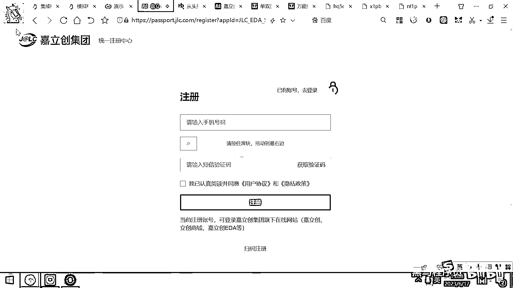

# 黑马程序员嵌入式开发入门模电（模拟电路）基础，从0到1搭建NE555模拟电路、制作电子琴，集成电路应用开发入门教程 - P54：55_立创eda绘制原理图 - 黑马程序员 - BV1cM4y1s7Qk

好 那在这个PPT里面呢。

这有一个也是电路板生产的流程图。

大家有有兴趣的话，可以去打开这个微信链接。

然后去看一下这个PCB到底是怎么生产出来的，他其实需要工厂的有很多很贵重的这种生产设备。

才能够生产出来。

你看他要去制造这个双层铺铜的新版。

对吧，制造完毕之后，在这个光灶下去覆膜。

覆膜之后呢，去电镀对吧，电镀这个保护膜，电镀完保护膜之后呢。

就放到这个溶液里面去复刻，放到这个碱性溶液或者酸性溶液里面复刻。

好，那复刻完了之后呢，再用氢氧化钠呢，把不需要的铜箔呢。

给腐蚀掉，那你就拿到了这个PCB的板子，那这个板子呢，还是需要再去打孔检查，对吧，然后再成压，然后反正这个操作呢，很复杂。

经过几十个步骤啊。

那一天呢，才能够把它给生产出来，好，上一期呢，这个嘉丽创邀请我们带学生去这个工厂里面去参观了一下啊，所以一期呢，有一些学生呢，去这个厂里面去看了一下啊，那这个厂呢，有有十万平方。

然后里面很多很多设备一步一步是怎么生产出来的，好，这也是，这个这个公司的资产呢。

也是非常重的，好，那行，那我们下面呢，就去看一下如何进行这个嘉丽创EDA软件的这个使用了。

好，那第一步呢，大家要先去注册一个账号，好，这个注册账号呢。

很简单，你就点这个右上角的注册，好，再看一下这个网站，这个网站呢。

就叫丽创EDA，对吧，啊，这个丽创是拼音，然后EDA呢，是这个软件的名字，然后CN呢是中国的域名。

我们点击这个注册，好，那其实嘉丽创呢，他他这个企业呢。

很有思想，然后他不仅搞的有中文版的丽创EDA，其实有二十多个国家啊，他部署的都有他的EDA软件啊，那像国外的叫easyeda。com。

这个其实也是丽创EDA。

你去你去打开这个网站，然后你看这个长得基本上一样啊。

然后里面的东西也都一样，对吧，这个其实就是他的国外版本啊。

那如果呢，你去你去这个YouTube上看一些海外的这些创客UP主啊，然后他们做电路版呢，也是用的这个easyeda。

用的嘉丽创的这个EDA，好，那注册，然后注册的话呢，你这个地方就点这儿，对吧，注册账号点这里好，那他现在你可以用微信扫一扫注册，对吧，也可以用这个手机号码去注册，反正这个注册呢。

就跟注册一个普通网站的会员是一模一样的啊。

那直接下一步下一步去注册就可以了，好，注册完毕之后呢，那就可以来到EDA的专业版里面去新建工程了，好，那我们带大家呢，来演示一下怎么新建工程，好。

那打开这个丽创EDA。

然后我现在已经注册过了，我就直接登录，好。

那登录完毕之后，在这个右上角呢，就会显示你的用户的logo小图标，对吧，然后你的用户名啊，这个你起叫什么名字都可以啊。

这是用户名，好，然后呢，在这有一个选项就叫丽创EDA的编辑器了。

那大家呢，选用这个专业版专业版。

它整个这个EDA软件呢，是基于Chrome浏览器内核开发的啊。

就所以呢，大家需要用这个谷歌的浏览器啊。

就这个叫Chrome的浏览器啊，要下一个这个谷歌的浏览器。

那我用的这个浏览器呢，是360浏览器啊。

这个360浏览器呢，它其实也是Chrome浏览器，只不过披了一个360的壳啊，那这个其实也是Chrome浏览器好，那有的时候登录状态呢。

没有同步过来。

你就再点一下这个登录啊，然后他这个登录状态呢，就被同步过来了，好。

那那行，那大概呢，就是这样的一个界面好，你们打开这个你们第一次打开的话，可能看到的就是这样的一个界面对吧。

他还有一些教程帮助你快速入门啊。

然后有很多功能，那我们要干的第一个事情是什么呢，就是要在这新建一个工程对吧。

好，大家点击这个地方有个新建工程。

或者呢，是在这个文件这儿，你看这有一个什么呀，新建工程啊。

这两种做法都可以新建一个工程好，那这个工程起什么名字呢。

你就你就随便起个名字了，好，那第一个案例呢，我们希望做的简单一点，我们就带大家呢，做一个做一个开关，然后做一个灯一打开这个开关灯就亮。

好。

那我们第一个项目呢，给他起个简单的名字就叫就叫开关电路啊，你在你在这就可以输入这个工程名了，开关电路好，那由于整个EDA软件呢，都是中国人开发的啊，所以这个里头中文支持非常友好啊。

你写这个中文名是没问题的，那如果你用Patel99或者用这个AD啊，是不能用这个中文的好，工程叫开关电路，然后你看他还自动的帮你干了一个啥呀，生成了这个工程的链接就叫KiKi，KiKi对吧，开关电路啊。

那这个工程的点击下保存就被创建出来了，好，那之前呢。

我已经我已经创建过这样的工程名了好，所以一边保存，他说这个已经存在对吧。

那我们给他起个名字叫开关电路2啊，点击保存。

好，那创建好这个工程之后呢，大家看一下他其实就在这个左边呢，就列出来了这这样的一个工程，对吧，这个就是开关电路，开关电路好，那你们呢，由于你们还没画过什么东西，这个里面全是空的啊。

我这个已经画过很多东西了，所以列出来的内容很多，你们应该就是左边就只有只有这一个标题。

然后里面有个开关电路，好。

那行，那整个这个工程创建好打开之后呢，大概就是长这个样子啊，看这有一个标签叫工程设计对吧，上面是工程名叫开关电路，然后呢，这个里面有一个东西叫board了，board是什么，就是你的开发板对吧。

任何一个开发板呢，都是由这个上面的叫原理图和下面的PCB组成啊，原理图和PCB呢，是是这样对应的原理图和PCB对应好，整个这个工程界面呢，大家看上方有一些菜单，对吧，文件视图下单设置帮助。

然后这个左边呢，所有工程你们默认看到的应该只有一个，然后当前这个工程就是开关电路，对吧，这下面呢，有一些常用的库啊，电容电阻，然后二极管什么的，这这些是处于这个常用的库，好，第一步呢。

来到这个原理图这个标签，这个界面呢，就是原理图。

好原理图是啥呢，其实就是我们之前用这个电路仿真软件画的这样的图。

这个图就叫做原理图啊，这里面有电源对吧，有电阻，有有电感，然后有电容。

好，把它们用线连在一起，这个就叫做原理图，好，那我们我们第一个小案例想画什么东西呢。

来看一下我们第一个小案例的原理图长什么样子。

好，我们需要画的这是一个开关电路啊，我们要画的是一个开关电路，这个开关电路需要有一个什么呢，有一个电池盒，对吧，这个电池盒里面就装电池的，然后还要有个什么呢，有个LED灯，然后有一个开关。

有一个线流的电阻，对吧，因为如果没有这个电阻的话，这个这个灯的电压是不是太高了，对吧，一个18650是3。7伏的，而我LED灯呢，是2。8伏2。6伏左右，好，那我们就需要把这些元器件给放到这个原理图上。

好，这些元器件呢，我在这给大家列出来了一些参考物料啊，你可以选用我给大家提供的这些参考物料，你也可以呢自行摸索啊，就反正你找一些便宜的，然后你感觉好用的元器件就可以了，好，第一个元器件是开关。

我带大家去看一下这个开关长什么样子。

好，那来到力创商城搜一下这个编号，好，搜索，好。

你看，哎，我们就搜索到了一个一个开关，对吧，或者叫按键轻触开关，那按下去的时候呢，他就会导通，那弹起来的时候呢，就断开好，这个开关大家看一下，大概五毛钱一个对吧，买的多了三毛钱一个啊，这是一个开关。

你关心这个开关呢，最主要就关心一下他的长相，关心一下他的尺寸，然后关心一下他的使用寿命，你看这个使用寿命是什么呀，可以按100万次以上，对吧，那这个基本上就满足很多场景的需求了，100万次以上。

你平均到每年，假设你的这个电子产品使用是10年，那一年呢按10万次，那一年按10万次，你再去平均到每天对吧，然后你去除以300，那这个可能一天按300次，这样就可以用10年，一天按3000次，对吧。

10万除以300是多少呀，3000，一天按3000次都可以用10年，所以这么便宜，性能呢还比较稳定，好，那这是第一个东西是开关，好，那这个开关你选好之后，你怎么把它给放到我的这个电路图里呢，好。

那大家看这里面有一个有一个按钮叫什么呀，F7是放置，对吧，放置什么放置元器件，好，他有一个快捷键，这个叫shift F，那你直接按shift F也可以，好，元器件的标号呢。

力创桑城和这个EDA呢是打通的啊，你把这个标号往这一放，然后大家看右下角这有一个叫放置，对吧，好，那你点一下放置好，这个地方呢就多出来了一个按键啊，就多出来了一个按键，好，我再给大家演示一遍。

shift加上F，然后找到这个按钮，对吧，按一下放置好，就放置上来了，放置完毕之后，哎，这个鼠标左键还有这个东西，然后点击鼠标右键啊，就可以取消选择，好，一个按键呢就放好了，这个按键呢，大家看一下。

他也他的这个原理图也非常容易理解，你看默认情况下，三和四是不是导通的呀，一和二是导通的，那这个开关按键在哪呀，在这如果按下去的时候，是不是就一和四导通了，或者是二和三导通了，对吧。

按下去的时候。

上面和下面就导通，好，那第一个元器件呢，我们放好了啊，现在呢。

来放第二个元器件，就是这个LED的灯，好，这个LED灯长什么样子呢，我们来去搜一下，好，那这有一个LED灯，好，这是一个黄灯，黄色的LED灯，好，黄色的LED灯，然后这个灯呢。

大家看一下他发的这个颜色是黄色，对吧，然后工作的电压是多少呀，2。1伏对吧，这是他工作的电压，好，那有了这个东西之后呢，我们也是shift+f，然后去放置这个灯了，那你看这有个黄灯，然后点击放置。

然后就灯就有了，对吧，好。

那第三个元器件是什么呢，是一个电阻。

好，这个电阻呢，大概100欧就够了，你也可以选个200欧，300欧的，这个都行，反正只要是一个线流电阻就行了，好，大家看这有一个电阻，这个电阻长这个样子，然后它是100欧的，精度是正负5%。

所以它很便宜，一毛钱一个买的多了，九分钱一个，好，我们呢，把这个电阻呢，也给放过来，好，点击，点击放置，好，这个电阻呢，就放过来了，好，最后还缺一个什么呀，还缺一个18650的电池盒，对吧。

这个实际上是装电池的，那大家看一下，你在这去搜索一下，哎，这有一个18650的电池盒，这个电池盒呢，也是我们后面做项目呢，经常会用到这个18650的电池盒，然后你看这个电池盒呢，大概几块钱。

那那你你就把这个元器件呢，给放进来就行了，Ctrl+F，好，然后点击放置，好，点击放置，行，那这些元器件呢，已经全都有了，对吧，好，有了这些元器件之后，下一步我们要干的事情是什么呀，把它们给连接在一起。

对吧，那怎么连呢，你看这有一个按钮，这个按钮叫导线，对吧，或者呢，你按这个F7，这个下面呢，也有一个导线啊，你就选这个导线就可以了啊，它的快捷键呢，你们的快捷键应该是Alt+W，我不喜欢同时按两个键。

我就把这个Alt给去掉了，我就直接是W这样一个快捷键，好，这个快捷键的设置可以在哪设置呢，在EDA工具里面好，它会有一个东西呢，叫做叫做设置，EDA的设置，可能我们需要去来到，啊，在这个地方藏起来了啊。

在这儿有一个设置，然后这个设置里面呢，有一个叫快捷键，对吧，这个快捷键里面呢，你看它比如说你布线的话，这里面有有这个叫什么单路布线，这个快捷键就是W对吧，你们的应该是Alt+W啊。

这个你你你喜欢什么样的快捷键，你就搞一个快捷键，这样会方便一些好，我就直接点这个按钮了，点这个按钮，大家看一下从电池的正极接根线，对吧，然后这个线连上这个开关，然后这个开关的上面再连上这个灯，这个灯呢。

再连到这个电池的负极，好，这样我们的这个电路呢，就已经画好了，好，作为专业的EDA软件，大家看有多么的方便，好，我我这样连上之后，他一旦这个电路画好，你看一下是不是你可以随意的拖动它呀，对吧。

之前我们用的那个电路仿真软件在那儿想去拖动一下，操作起来麻烦的很，对吧，你看作为专业的软件，它操作起来呢，就非常简单，好，这个电路就是电池的正极，然后连通这个电阻，让电阻呢，经过开关，然后经过灯。

再回到电池的负极，对吧，好，那这样的话，我们这个原理图呢。

就已经把它给画完了，拜拜！。