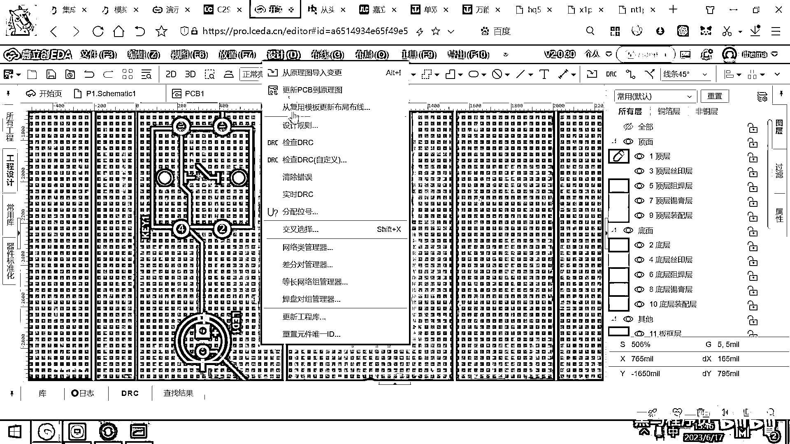

# 黑马程序员嵌入式开发入门模电（模拟电路）基础，从0到1搭建NE555模拟电路、制作电子琴，集成电路应用开发入门教程 - P56：57_绘制pcb的小细节 - 黑马程序员 - BV1cM4y1s7Qk

好 那上一节课呢 我们带大家呢 画了一个原理图。

非常简单的原理图。

然后带大家呢 设计了一个PCB 对吧，那这个PCB在设计的时候呀，这里面有一些很重要的小细节，我在这呢 要给大家强调一下。

在你画完这个PCB之后。

在上面设计工具里面，这有一个选项叫检查DRC，检查DRC是什么意思呢，DRC是检查你这个板子的电气化的特性。

意思就是你设计的这个板子呀。

能不能生产出来，生产出来的话 这些线之间会不会有干涉。

这个就是DRC。

好 我给大家举一个最简单的DRC错误的例子，你看这根线是不是从这儿 然后来到这个灯的下面呀。

我把这个线挪一挪 让它挪得非常非常靠近这个焊盘，好 大家看 这根线是不是跟这个焊盘 跟这个洞离得很近呀，离得非常近。

好 那如果是这个样子的话。

我们再来去设计 然后去检查一下DRC。

好 大家看一下 它就爆出来了一个错误，这个错误是什么，焊盘到导线 然后这个距离为0N，应该大于6个N，好 这个N是什么呢，这个单位呀 它是一个英字的单位，叫毫英寸 毫英寸。

那如果呢 大家觉得这个单位看着不太舒服，你可以把这个单位呢 给换成这个毫米，那你就比较容易理解了，好 我们再来去检查一下DRC，好 那这个DRC 大家看说，这条线 距这个四号焊盘的距离是多少呀。

对向一到对向二的距离是零毫米，应该大于多少，应该大于0。152毫米，这样的一个步线没有通过DRC。

会带来一个什么问题呢，你想你的板子 这个地方是辐刻了一条铜线的 对吧，那辐刻完铜线之后，它在生产这个PCB的时候呀。

你看一下这个2D的图。

它在生产这个PCB的时候，我这个按钮这儿 它是需要打一个洞的 对吧，它需要用钻头在这儿打一个洞，那打洞的时候，就把这条线呢 给打断了，你这个板子生产出来之后，电路不通，这个线跟这个线之间没有连通。

原因呢 就是DRC都没通过。

那电路呢 肯定是不通的，所以大家在画完这个板子之后呢，一定要记得干嘛呀，一定要去 在这个设计里面去检查DRC。

只要这个DRC没有问题，你的原理图是正确的。

DRC没有问题，你这个板子寄过来之后呢，是一定可用的。

DRC是非常非常重要的一个，一个可用性的 制造可用性的检查。

这个大家呢 一定要去跑一跑这个DRC。

看一看这个检查的结果，好 另外呢 就是。

这个板子呀 现在生产出来，如果你拿到手上之后。

你会发现呢 这个手感很差，这个手感很差，那如果这个锂电池散热比较大的话，这个板子呢 摸着也会有一点点烫。

为啥呢 因为当前这个板子呀，你去看它的3D图。

就是只有 这儿有一点点铜，这儿有一点点铜，这儿有一点点铜，别的地方 你看一下，是不是全都是玻璃纤维的这个基板呀。

对吧 全是这个玻璃纤维的基板。

那怎么让这个板子拿起来手感更好，散热更好，然后稳定性更好呢，好 有一个非常简单的办法，就叫做铺铜，什么叫铺铜，你看 这儿有一个小标签，虚线的小标签，这个叫铺铜，然后你点一下这个小标签之后。

从左上角拉到右下角。

然后它说这有一个铺铜区域，是顶层，然后铺的这个网络铺什么呢，你可以铺一个GND网络。

好 那当前这个板子太简单了。

我们都没有画GND，那这个GND网络，实际上应该是把它给单独的列出来，好 或者我在这儿再标一个标签吧，大家看这儿有一个标签，这个标签是GND 对吧，我们把这个负极跟这个GND连在一起。

好 那我多加一个GND，这样就多了一个GND的标号。

这个标号来到的话，我们可以去设计更新一下这个原理图。

基于原理图去更新一下这个板子，好 那这个更新完了之后。

现在我的PCB的原理图里面，已经有GND了。

我们点这个按钮，然后来进行铺铜，好 大家看这个网络就可以选什么，选这个GND了，也就是说整个电池的负极。

我都把它给铺出来，作为GND的网络，好 这个铺完之后。

大家看一下，稍微往下再拉一下，然后重新铺一下铜。

铺铜管理器。

好 我们去重新铺一下铜。

铺完铜之后，我们再来去预览这个板子，你会发现这个板子就非常非常的好看了。

为什么呢，因为所有的空白的地方，它都已经铺上了铜，你看，你看这有一条铜线，对吧，但这个铜线的周围，是不是也全都铺上了铜。

你再去摸这个板子，手感就会非常好，然后它散热性能也很好，因为整个这个板子，这个正面都已经铺了一层铜了，那同样的话。

这个板子的背面。

我们也是可以给它铺铜的，好 怎么做呢，按一下键盘上的F，或者是ALTER+F，它就直接把这个板子的正反面，给切换了一下，你看，我按一下F，然后这个小笔就变成什么了，就变成底层了。

再按一下F。

这个小笔就变成顶层，好 在这个底层，我们再用铺铜管理器。

把它一框，然后铺一个铜，好 大家看。

整个这个板子的底面，也全都铺上了铜箔。

好 板子的两边都铺上了铜箔之后，你再去预览这个效果。

你看，一圈铜对吧，然后这个背面，也全都是铜，好，那板子的散热，就好很多，好，另外你摸起来，这个手感，也非常非常的好，不是之前的那种塑料的手感了，这个就是金属质感，所以一般高端一点的PCB。

它肯定都是要去做铺铜的，铺铜一是可以减少信号的干扰，二是增加散热，三是让这个板子的手感，外观变得很漂亮，好。

大家是可以去。

画完这个板子之后，可以去铺一下铜，也請大家多多指教。