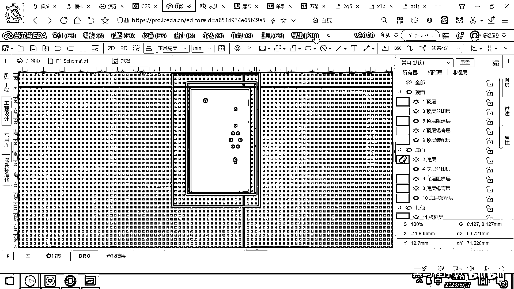
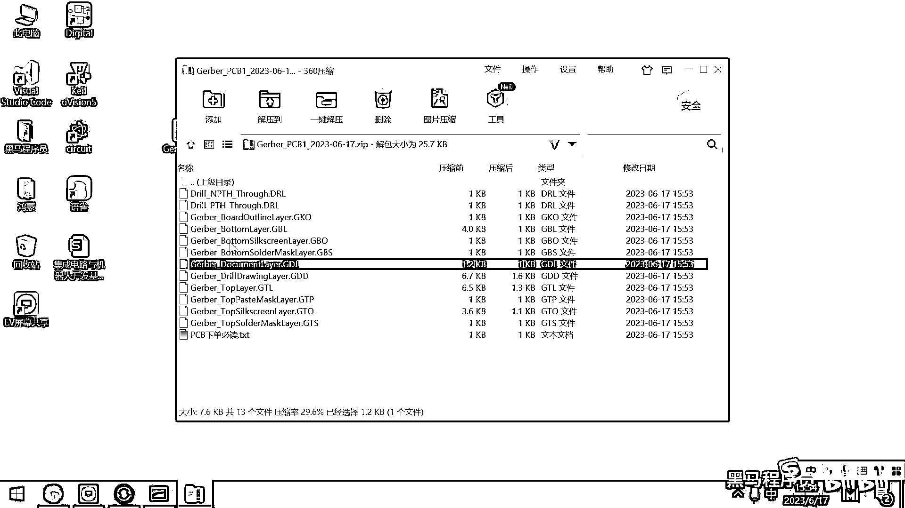
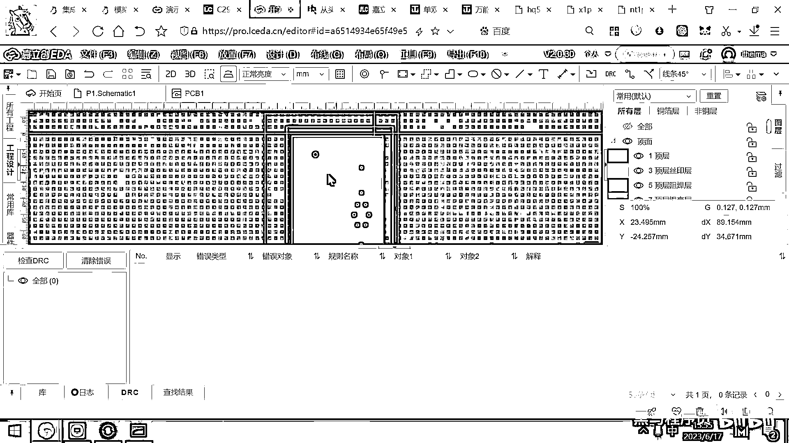
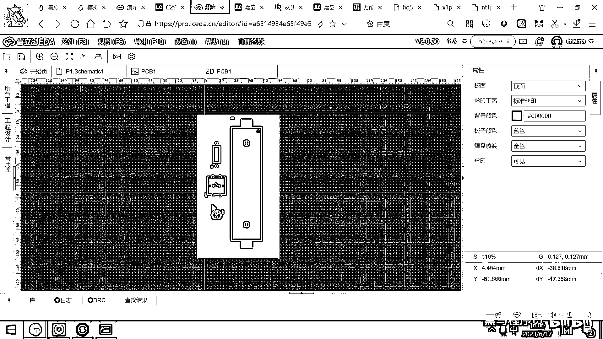
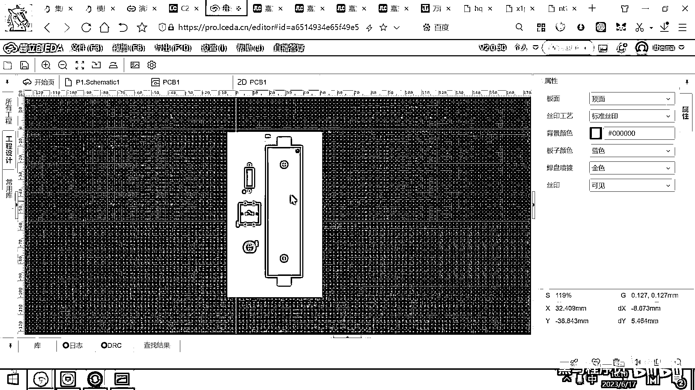

# 黑马程序员嵌入式开发入门模电（模拟电路）基础，从0到1搭建NE555模拟电路、制作电子琴，集成电路应用开发入门教程 - P57：58_pcb下单流程 - 黑马程序员 - BV1cM4y1s7Qk

好 那这个PCB我们已经绘制完了，绘制完之后，现在有同学有问题了，说这个东西做完了。

怎么让工厂帮我生产出来呢，那工厂拿到了我的这个设计稿，到底是什么样子的呢，好 其实这个很简单。

大家看一下，这有一个按钮叫什么呀，导出，好 这个导出里面，有个叫PCB的质版文件，这就是一个Jibber的文件。

你直接点这个导出PCB的质版文件，好 选择这个一键导出就可以了。

直接导出，导出之前，他其实还是很智能的，问你，你要不要再检查一下DRC。

我们说好 检查，这个检查完了，DRC没错，那自动就已经导出来了，好 这个文件，我把它给放到桌面。

然后我们来看一下它长什么样子，好，它实际上是一个ZIP的压缩包。

这个压缩包打开的话，你看一下里头有很多个文件，有很多个文件，这个就是工厂所用的质版文件，好，这里面，大家看有Bottom的Layer，什么意思，底层的这个布线信息，然后有这个Top的Layer。

上层的布线信息，有什么文档层的布线信息。

好，这些，都被存到这个文件里了，好，这个文件，是PCB工厂的一个通用的格式文件，你有了这个文件之后，你不仅可以在家立创下单，然后把它给生产出来，你说我跑到华秋。

可不可以生产。

也可以生产，甚至你说，我到这个淘宝上去找一个PCB的生产厂商。

那你直接在这个淘宝上去搜索，这个PCB的生产。

然后你去聊一个淘宝的客服，然后你需要给他提供的是什么。

你要提供的也是一个，这个Jibber的文件。

你就把这个文件交给淘宝的客服，然后他就可以帮你把这个板子给生产出来了。

好，其实在中国不是特别重视版权保护。

你看在淘宝上有好多PCB超版。

对吧，这个PCB超版，然后有很多这样的服务。

PCB超版是咋回事。

你的布线，大家想一下，你好不容易画了一个PCB。

对吧，你把这个线布好了，然后另外一个厂家一看，你这个东西挺好卖的，对吧，然后销量也挺好，市场也挺好，怎么做的，买一个你的产品。

然后到淘宝上找一个PCB的超版厂就可以了。

人家超版厂用的设备，就是医院里面的X光机器，然后他去拍一下，然后你的整个线路，怎么连的，怎么连的，谁连谁，他就看得一清二楚了，然后他可以很快的，把做出来一个一模一样的板子，这个就是PCB超版，好。

所以为啥，软件跟硬件必须要结合在一起才有前途，因为如果你是纯硬件的电路，这个东西拿出去了，然后别人花个几百块钱一超版，很快做出来的东西跟你一模一样，但如果你的产品是软件硬件，结合在一起的，板子超过来了。

处理器里面没有你写的代码，对吧，你写的代码，他没有，他还是跑不了你的程序，运行不出来，你要的效果，对吧，好，当然。

当然处理器的程序也有专门的提取的。

对吧，好。

有很多这样的店，就是专门从MCU里面去搞出来固件的，有一些这样的店，但是只能是少量的MCU，可以把固件搞出来，有很多固件，搜进去之后是弄不出来的，这个叫，你就搜叫固件提取，然后在淘宝上。

实际上也是有很多这样的服务的。

对吧，有不少的，你看华强北。

然后他可以去提取一些。

或者叫提取HEX，好。

这个搜不出来，是吧。

不应该搜天猫，应该搜所有，你看。

这个关键字不太清楚了，就反正华强北，然后也有很多这样的科技，可以把固件给提取出来，你在写代码的时候，就需要有一些加密性的措施，对吧，有一些序列号，或者什么放在里面。

一个板子。

一个序列号，这样他提取出来之后也用不了，所以软硬件结合。

才会有更高的壁垒，如果是纯硬件设计的话，还是很容易被抄袭和仿冒的。

这是刚才我们给大家演示的。

这样一个效果，好，这个Giber文件有了之后。

你就可以让工厂去生产制造了，好，嘉丽创的平台。

它非常方便，它已经把从生产设计到制造的流程，全都已经打通了，你设计好这个板子之后，你说我现在就想把它给生产出来，怎么做，你看，这直接这有一个按钮叫什么。

叫下单。

你点一下下单就可以了，好，这下面有个叫PCB下单。

你点PCB下单，好，不用检查DRC了，检查一下也无所谓。

好，要检查一下DRC，然后直接就弹出来一个新的页面，帮助你进行PCB的下单了，好，这个下单，大家看一下，这个下单，你瞧，这里面有很多的参数配置，好，那FPC软板，这个是很薄的那种柔性的电路板。

这个价格很贵，一般是做显示器的连接的排插线的，这个我们不用，我们用的就是FR4的玻璃纤维的基板，好，这个是FR4，好，后面有铝基板，这个铝基板，你说你要做一个焊台，做一个电热器，或者做发热量很大的灯。

需要用铝基板，铜基板散热更好，铜基板是散热更好的铝基板，然后还有高频板，然后这种4×6×的高频板，我们通常画的都是两层四层的，这样的玻璃纤维的FR4的基板，好，那这个就选这个，然后板子的尺寸。

只要是在10厘米×10厘米以内，在佳丽创每个月，都可以享受两次免费打样，并且包邮的这样的一个机会，就相当于白嫖，对吧，这个是叫9厘米，对吧，这个5厘米，10×10厘米以下，就可以免费打样。

一旦你这个板子超过了10厘米的话，这个费用就比较高了，一块板子，大概就要20块钱，它打样最少是做5片，你尺寸超了，可能就要花个80左右，七八十块钱，才能做5片板子，所以大家在设计的时候。

我们设计的这个板子，都应该是10厘米×10厘米以内，好，板子的乘数，我们是正反两面的双乘板，你就选双乘板就可以了，好，这个类型，工业消费，航空医疗，无所谓，这个是它做统计用的，好，然后这有一个叫。

确认生产稿，什么是确认生产稿，如果你花了三块钱的话，加利创的工程师，会帮你再瞄一眼，看一看，生产稿，有没有肉眼可见的问题，比如说，焊盘跟焊盘叠在一起了，这个按钮压着另外一个元器件了。

它会帮你看一些肉眼可见的问题，原理性的问题，它不会帮你看的，你说我原理图画的对不对，它也看不到你的原理图，这个确认生产稿，就是加了三块钱，它会帮你再多看一眼，我们肯定不用它看了，对吧，这个不需要，好。

那这个出板子的方式，就是单片，因为你画的就是单片的板子，就单片就可以了，板子的厚度就用1。6，1。6毫米的板子就可以了，选其他厚度的话，价格都会贵，你看，超薄的要多收100块，这个要多收100，0。

8的可能不需要多收，好，中间的这三种厚度，不需要多收钱，然后2。0的也需要多收钱，因为这几个都是非标准的尺寸，然后板材的话，有普通的板材，也有进口板材，这个有什么KB的，还有台湾的板材都贵一点，好。

这个外层的铜箔，这个就是你的玻璃纤维板子上，附的铜，到底有多厚，是一盎司还是两盎司，还是4。5盎司，好，这个附的铜越多就越贵，你看，我附一个4。5盎司的价格，一下就变成400多了，对吧，一盎司的话。

这个就是20块，好，这个是一分价钱一分货，好，然后祖汉的颜色是什么，大家见的绝大多数的PCB板子，都是绿色的，对吧，是因为他刷的绝缘漆是绿色的，这个嘉丽创，它实际上还有很多别的颜色的漆，比如说有红色。

黄色，蓝色，白色，黑色，紫色，好，你想让你的PCB板子是其他的颜色，你就刷其他的漆就行了，但是大家在这学的时候，强烈大家用绿色的祖汉，为什么，因为绿色的生产最快，你选一个黄色的，选一个白色的。

可能一星期才生产出来，你选这个绿色的，你今天下班，明天可能就生产出来了，绿色的工艺最成熟，生产的最快，好，另外焊接的时候，也是绿色的最容易焊，别的颜色，别的颜色的板子，焊接的时候不太容易焊。

因为它上面又多了很多这种油墨，好，制服的颜色就是白色，然后这些祖汉的覆盖，就默认就可以了，焊盘的喷度，这里面有几种工艺，一种是有牵的工艺，一种是无牵的工艺，无牵的工艺，一般就要贵好几十块钱。

还有一种成筋的工艺更贵，这个就贵100块了，我们选有牵喷锡就行了，这个是生产过程中，然后锡是有牵的，好，金手指就不需要了，然后默认是你板子做完之后，它会给你全部用非真全测，什么是非真全测。

就是它有一个自动化测试机器，然后会往板子上落下来一些针，然后两个针之间是不是导电，它就测试一下，电路是不是正确，这个是默认都有的，好，接下来选择焦漆，好，焦漆的话，我们就选择48小时免费加急，就可以了。

有的时候，它可以选24小时到48小时，免费加急，基本上就一天板子就做好了，好，这里面还有12小时免费加急，但要收200块钱的加急费，对吧，你看24小时免费，24小时加急，就收50块钱的加急费。

我们也没那么着急，48小时做好就可以了，好，别的服务，它如果搞坏了，它全部赔你，然后如果这个板子，这个板子你看是不是要加半孔，然后金属包边需不需要，这些就默认就可以了，好，然后这个制服工艺就选免费的。

然后别的这些都是，免费免费免费，然后这个生产基地，你我们深圳这边，其实是不需要指定的，因为我们深圳下的订单，基本上都是韶关惠州，珠海这两个厂，这些工厂生产都是，只要今天生产完，明天你就拿到手了，好。

如果你以后是在北京，在别的地方，你就选江苏的厂，它发货会快一点，好，生产日期不需要增加，这下面有一个选项叫，是否smt贴片，好，这个什么意思，就是。

你现在下单拿到的这个板子。

就真的是一个板子，这个板子就长这个样子。

你拿到手，就是这样的一个板子，这个板子上有几个洞。

然后你自己把元器件放上去，拿电烙铁焊一焊，这个板子就焊好了。

就可以工作了，然后这个工厂，它提供的有什么，它提供的有smt贴片服务，就是，你什么都不用管，你只要把图纸原料都告诉他，然后他就自动的帮你把所有的，该焊的东西焊好，该贴的东西贴好，然后寄给你，好。

不过这个收费就比较贵了，smt贴片工程费，一般是需要150~300之间，也就是说，你花500块钱，你这个板子全都焊好，送到你手上，这个大概就是，smt贴片的这样一个选项，好，钢网我们也不需要焊接的时候。

如果有钢网的话，焊的会更容易一些，好，个人的话，然后是不收税的，也不开票，你就在这填一个你的名字就行了，比如说我这有一个名字，起个名字就叫张，好，那这个人，然后名字就是张，这样的话，就不额外的收税费。

如果是企业的话，就要收8%，12%的税费，好，那，叫手动确认订单就可以了，然后下面的是不同交期的订单，可以，不一起发货，那因为本身这个订单，就是免运费的，所以你不同交期的订单，就不要一起发货了，好。

接下来这个地方写一下你的地址，对吧，你就写我们这个创围二号楼，B区，B座南区，然后508叫社，对吧，写你的姓名电话就可以了，然后他就放到快递市了，好，在我们这个片区，最好用的快递是什么呢，是联号通快递。

这个快递基本上是昨天发货，今天就到，大家就选联号通就行了，这个邮费是零，还是包邮的，你不要去选什么，顺丰，还需要花钱，对吧，京东送的也很慢，就这个联号通，你昨天发货，今天到货，这个是。

也不知道他为啥这么快，也没听说过快递，就选这个就行了，好，然后右边这个地方就可以提交订单了，你看提交订单竟然要花多少钱。

要花20块钱，好，这个不用花，你先来到这个叫。

加利创点刊物，你就打开他的官网，好。

在这个官网的里面，你进入到下单平台，然后在下单平台的左下角，隐藏着有一个菜单，叫优惠券中心，你来到这个地方，优惠券中心，然后这有一个选项，叫免费券领取，你把它给点开，好，点开的话，你看这个地方。

就可以领免费券，叫什么一到四层的版，包括旅记版都可以免费打印。

好，我们立刻领取，选择无误，确定领取。

恭喜我，我就得到一个免费的PCB券，对吧，这每一个月，可以免费领两张，好，领好了这个券之后，你在当前这个页面里面刷新一下。

刷新一下。

然后这里面的参数，还是刚才我们给大家填的这些参数。

就不用动了，好，然后大家看一下右边，是不是这个地方，有一张优惠券可以选取，对吧，我们使用优惠券，这个现在就变成免费了，然后我们一提交订单，这个PCB版，大概明天晚上，或者后天早上就生产出来了。

然后在大后天的上午，你就可以拿到手上了，这个就是PCB下单的一个流程，大家自己摸索一下，然后提交一下订单。

这个就可以把PCB给拿到了。

好，大家千万不要去提交PCB，这个做出来没有技术含量。

对吧，就弄一个开关弄一个灯，然后亮起来也没啥用，我们一小会儿，画几个比较实用的电子小字作。

画完之后，你去提交一些别的东西。