# 黑马程序员嵌入式开发入门模电（模拟电路）基础，从0到1搭建NE555模拟电路、制作电子琴，集成电路应用开发入门教程 - P58：59_非接触式电笔原理 - 黑马程序员 - BV1cM4y1s7Qk

好 那行。

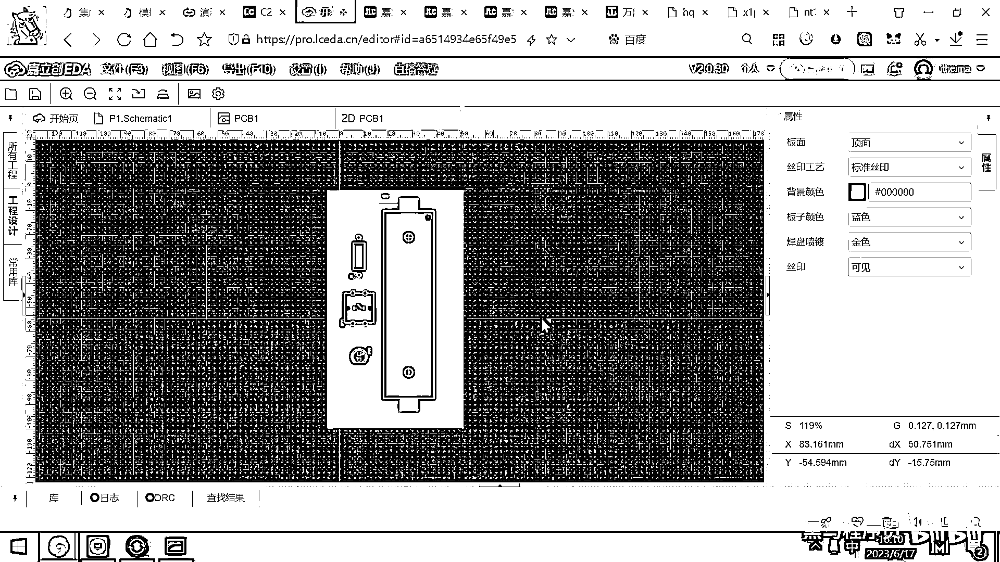

那接下来的话呢，我们先带大家呢，画一个稍微有用一点的电路了，这个电路呢，就是我们在在讲这个摩电基础的时候。

给大家看的三极管的电路。

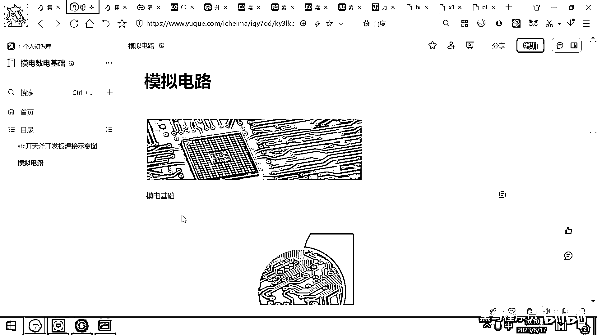

好，在拼多多上有这样的一个产品，卖二十多块钱，对吧，还有还有印象吧。

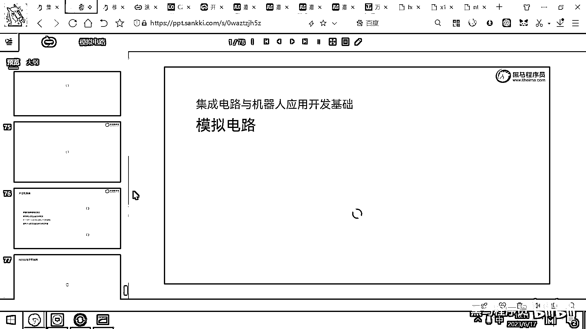

这个产品我们可以自己画一个，我找一下在哪个地方。

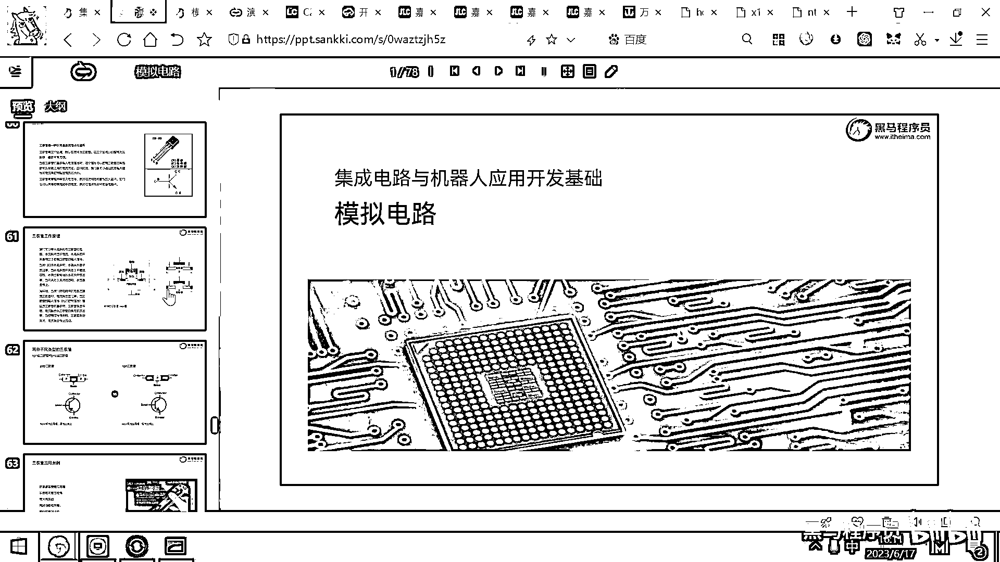

拼多多上有这样的一个产品，叫非接触式的测电笔，对吧，那你不需要把把这个电表塞到那个洞洞里，你就可以分出来哪个是火线，哪个是零线了，对吧，他卖这个二十九块九啊，这个成本呢。

大概是两元钱。

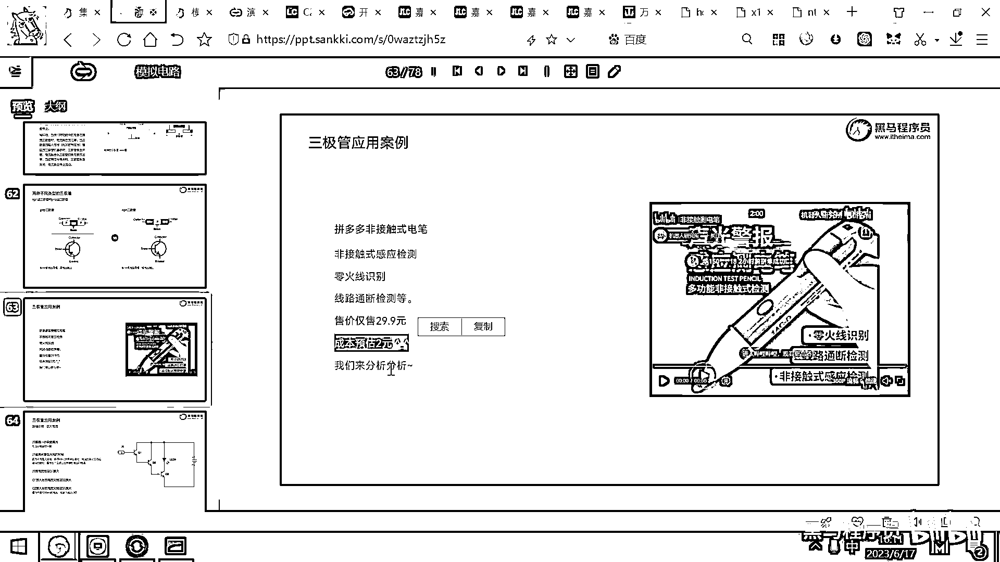

成本呢，大概是两元钱，好，我们来带大家呢，一起画一下这个电路。

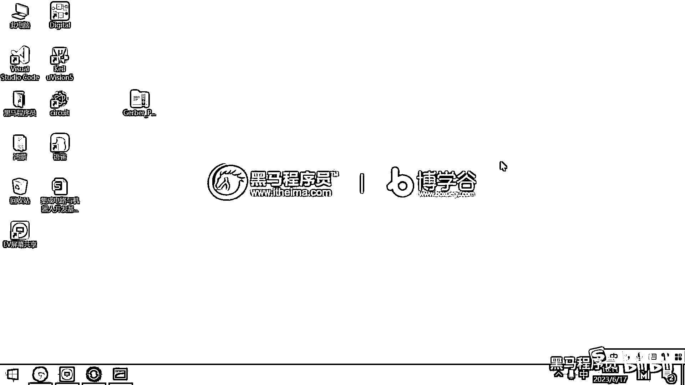

好，这个电路呢，我们先在这个Circuit GS里面简单给大家仿真一下。

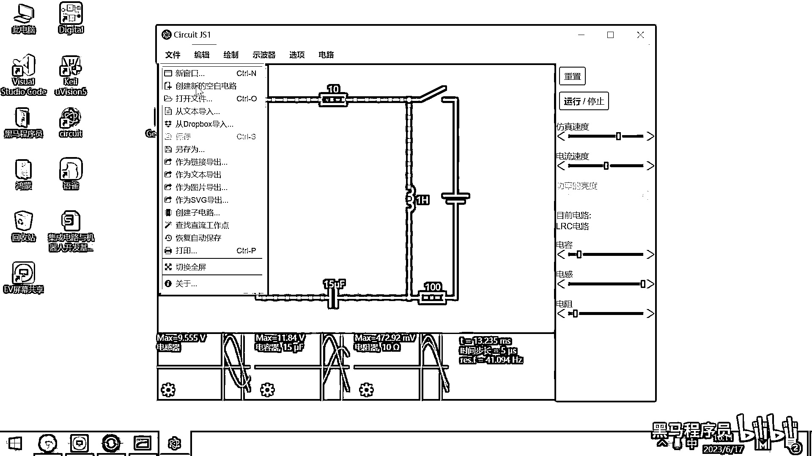

你有一个感觉知道是咋回事，好，那，干嘛呢。

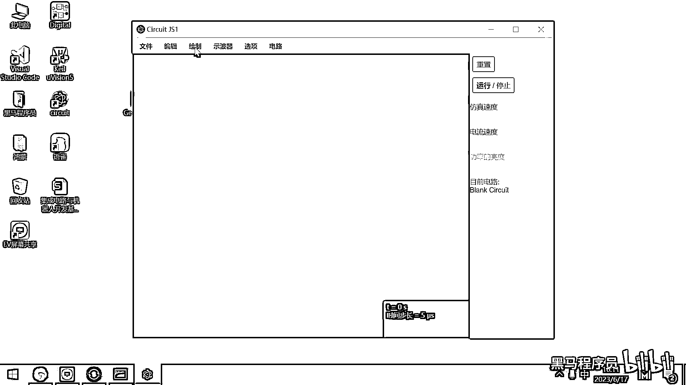

他实际上是需要用到三极管，对吧，我们就找一找这个三极管，NPN类型的三极管。

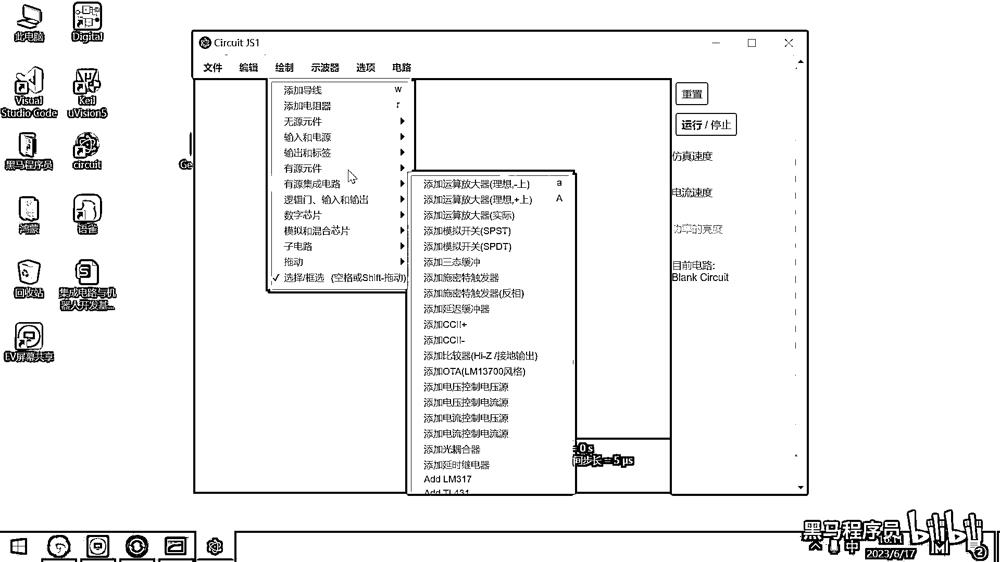

好，这有一个三极管，这个左边呢，我们就直接接一根导线接根导线，然后这个三极管的上方呢，接一个三伏的电池。

因为三伏的电池接到这个。

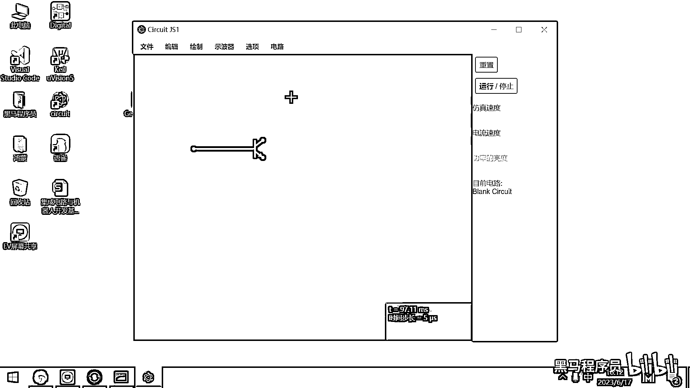

LED灯上的是可以直接点亮的，所以我就在这个上方呢。

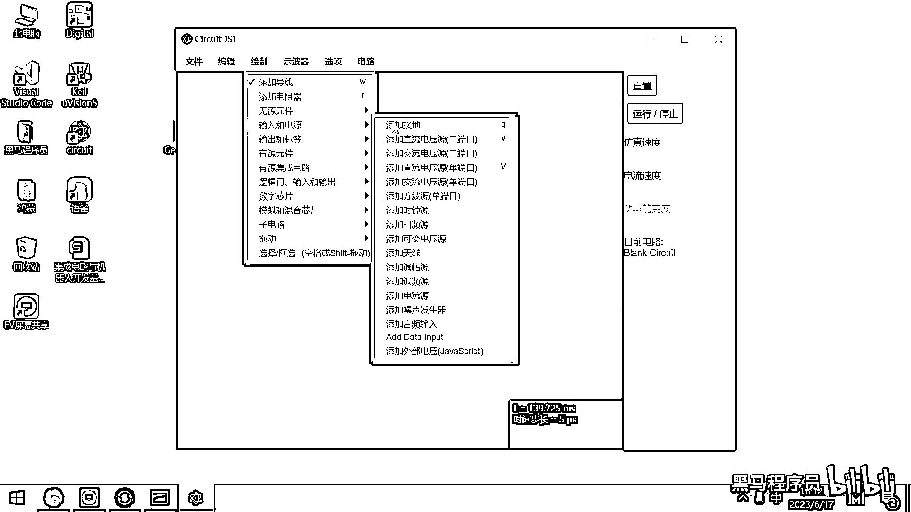

弄一个弄一个电池，这个电池的电压呢。

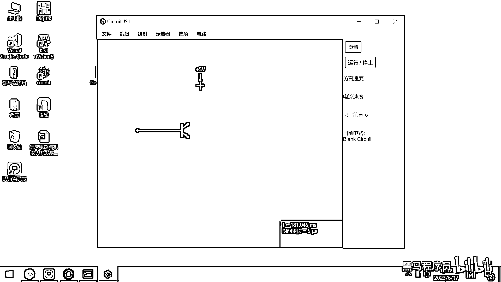

我就直接给他改一下了，把这个电压呢，给改成三伏，改成这个三伏，这是一个三伏的电池的正极，好，那我现在呢，在这儿去连一下他，然后在这儿呢，再折过来，好折过来之后，接下来的操作，大家看一下，Ctrl+C。

Ctrl+V，然后我们把它给挪到这，Ctrl+V，然后把它给挪到这，好，上面的这个电路呢，我把它给接过来，然后这个电路给接过来。

好。

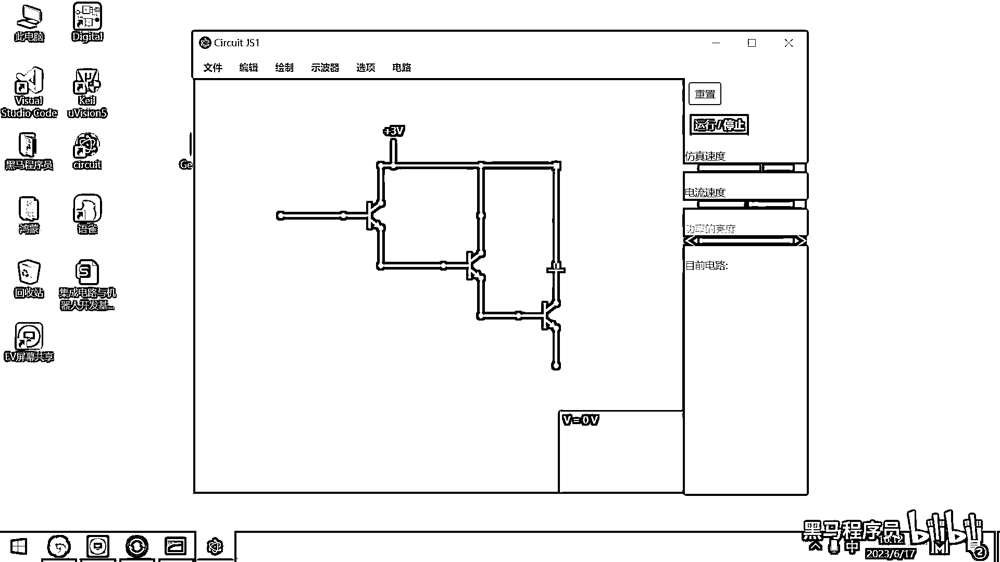

这个接完之后呢，下方我们再给他来一个灯，这个灯是直接绘制一个，添加一个LED灯，这是单向导通的对吧，然后最下面呢，再来一个GND，那行，我们来去来去仿真一下，这个颜色怎么好奇怪啊。

我把这个电流的速度给调大一点，好，大家看。

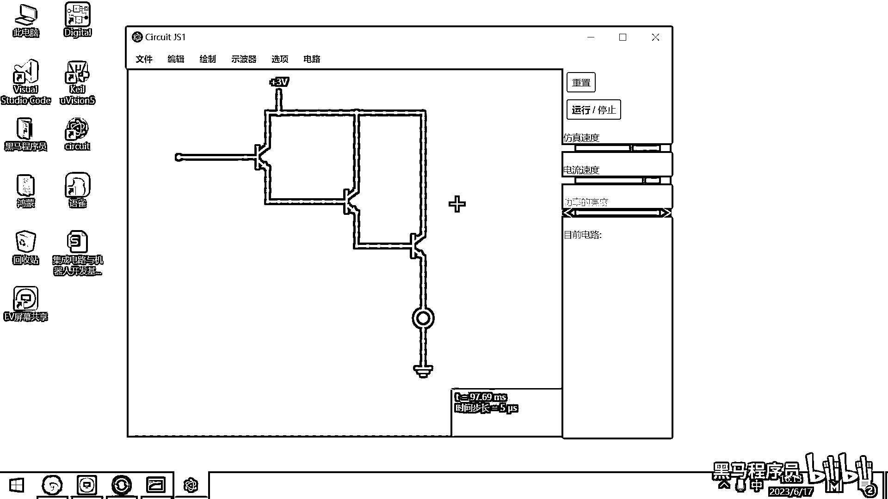

这其实就是一个三级放大的，三级放大的电路。

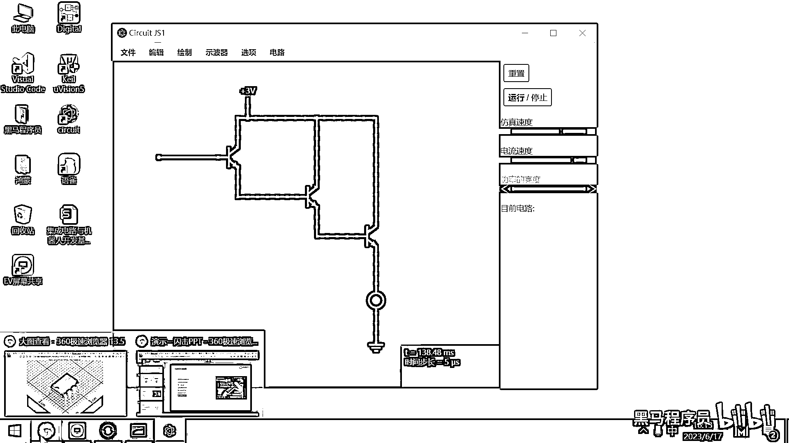

看我们PPT里面的这个原理，这个原理是什么呀，就有一个微弱的电信号是吧，他有可能呢，就会让这个三级管导通一下，那导通完毕之后，由于三级管就有放大特性，对吧，他会把一个小的电流放大一百倍。

然后就放大到这个地方了，这个地方放大一百倍之后，再经过一个三级管，是不是一下就放大了三个一百倍，就放大了十万倍呀，对吧，那十万倍的话，这个电流可能就很大了。

这个LED灯呢就能够亮起来。

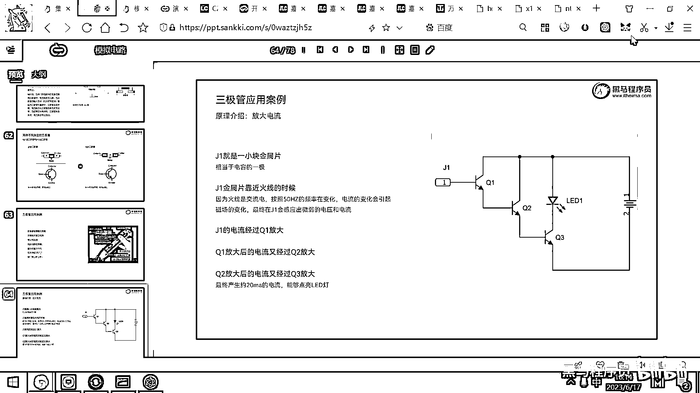

好，我们这个仿真大家也可以看到，哎，这个地方是不是感觉没动，然后这个地方也基本没动，但是最后面这个电流就已经流出来了，对吧，如果你只画一个，如果你只画一个的话，或者把这个地方给断开。

你看这个电流是绝对不会流动的，对吧，但是如果你画三个三级管连续放大的话，这边微弱的电压波动，这边呢，这个灯呢就可以亮起来，好，其实就是这样的一个电路，一个LED灯，一个三级管，一个三级管，一个三级管。

然后接一个三伏的电池，那最终呢，你就可以干嘛呀，就可以去测试哪一个线是火线，哪一个线是零线，因为在火线旁边的话，你把这个导线放到火线的附近，它就会感应出来一点点电流，放大，放大，再放大灯就亮了。

这个就是非接触式电比的一个核心原理，好，这个东西呢，做出来还有一点点用，对吧，大家如果有兴趣的话呢，可以去打样一下这个板子，因为LED灯呢也很便宜，然后这个三级管呢，我们这儿有很多。

你可以去焊一焊这个电路。

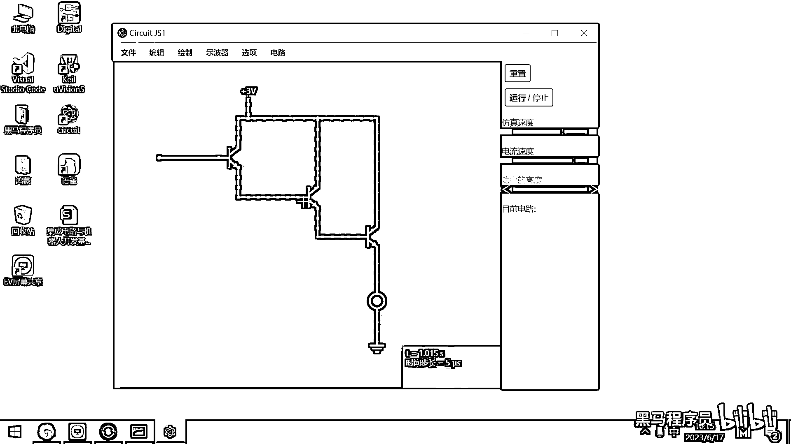

作为一个初学的测试，好，那我在这呢。

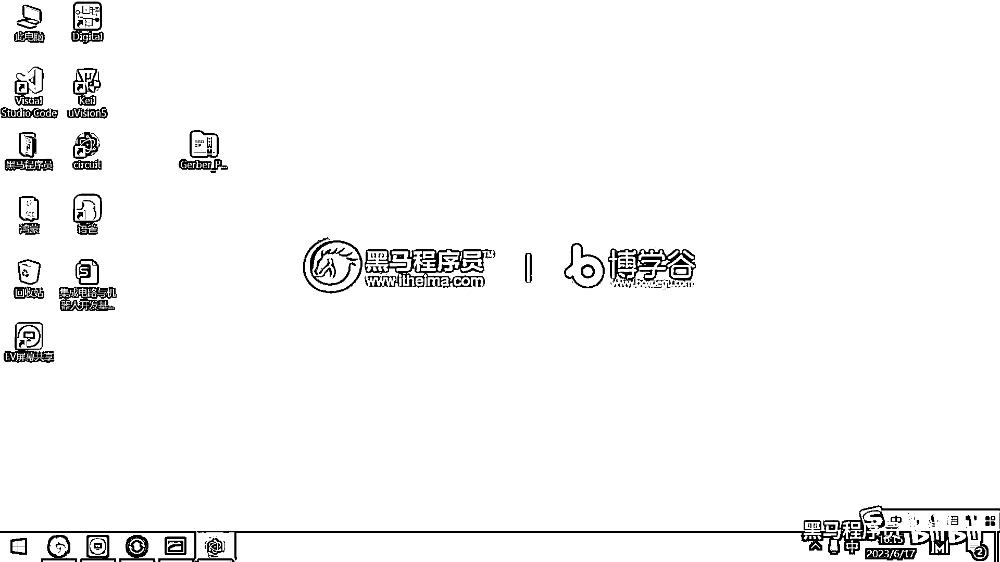

就带大家呢，把这个电路呢给画一下，我们感受一下，(字幕製作:貝爾)。

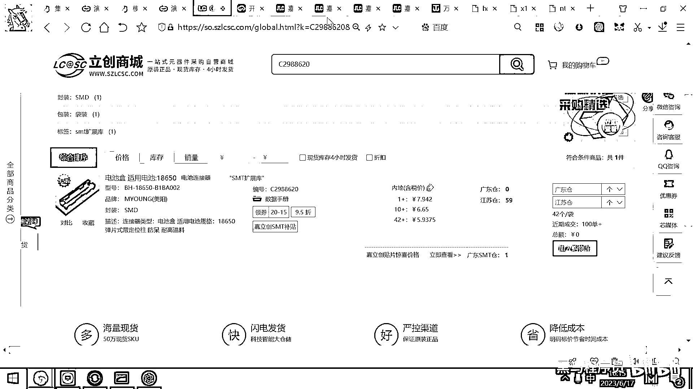

(言論不正確，請見諒)。