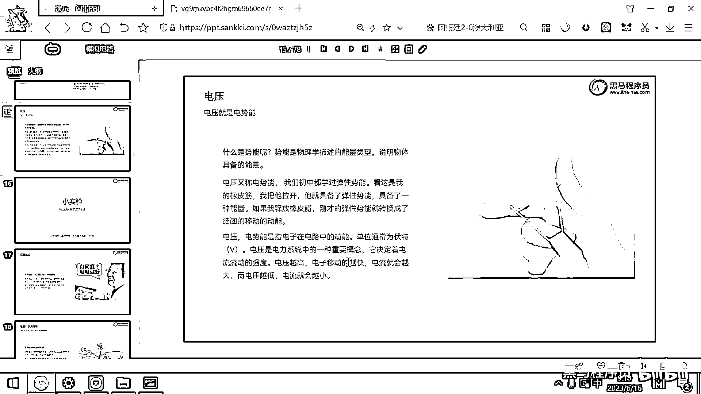

# 黑马程序员嵌入式开发入门模电（模拟电路）基础，从0到1搭建NE555模拟电路、制作电子琴，集成电路应用开发入门教程 - P5：05_电压概念 - 黑马程序员 - BV1cM4y1s7Qk

好 那电流相关的概念呢 我们就给大家介绍完了，回顾一下刚才我们介绍了电流是什么 对吧，如何产生的 然后基于这个电流的方向又有了直流电和交流电 对吧。

电流的单位呢 是安培 电流越大 单位时间内通过的电子就越多，好 那现在呢 我们再来去看一看什么是电压，电压呢 它的物理学术语叫做电势 叫电势能。

电压实际上是一个通称 是我们生活当中的一个 不是特别专业的说法，那专业的电学术语电压呢 是叫电势能，好 势能这个概念大家听说过吧，初中我们学物理 好多都是什么 重力势能 这个有印象吧。

重力势能 好 那还有一个势能呢 是叫弹性势能 也有印象 对吧，应该是初中的物理学那个弹簧 这个弹簧 左弹右弹 然后这个周期是什么 对吧，好 那弹簧有弹性势能 然后有我们站到这个地面上有这个重力势能。

那什么是势能呢 势能是物理学描述的一个能量类型，一旦你说一个东西有势能 就说明这个物体呢 具备的有能量，那电压呢 叫电势能 那我们连在一起呢 就是电压就是一个物体有电的能量 对吧。

那初中呢 我们学过这个弹性势能 那弹性势能就是说这个皮筋呢，有这个弹性的能量 或者弹簧呢 有这个弹性的能量 对吧，好 这个能量呢 实际上是很可怕的一个事情，如果这个能量给你的正好 你就会很舒服 对吧。

那如果这个能量太多了 那接受不了这么多能量就爆炸了，那看七龙珠啊 或者看这些动画片 一般都有这样的场景，就是 啊 能量太多了 我要爆炸了 对吧，那能量如果很多的话 实际上就具有一定的危险性。

好 那右边呢 我这有一个图 这个图呢 是一个橡皮筋，如果一个橡皮筋摆到这儿 没有人拉它，你是不是一点也不害怕它呀 对吧，那如果是一个橡皮筋 我们拿它做了一个弹弓，然后这个弹弓又拉满了 上面还有一个石头。

这个是不是就很吓人呀 千万不要对着人，那橡皮筋 它如果被拉开了 橡皮筋就具有了弹性势能，如果我们一释放这个橡皮筋，那这个橡皮筋就可以把它的弹性势能转化成什么呀。

转化成一个石头呀 或者转化成这个紫片所具有的动能了 对吧，这是我们初中学过的物理，那电压呢 我们说它是一个电势能，这个电势能呢 它其实就是让电子在电路中移动的这个能量。

那如果你的能量越多 就相当于是你把这个橡皮筋拉的越满 对吧，那你把这个橡皮筋拉的越满，那电子是不是移动的就越快 对吧，好 所以电压呢 是电力系统里面的一个重要的概念，它决定了电流流动的强度。

这个电压越高 电子呢 移动的就会越快，那你想电子都移动的更快了，这个电流是不是就变大了，因为电流就是单位时间内通过某一个横截面的远电荷的数量 对吧，那电压越高 电子移动的越快 电流越大。

电压越低 电子移动的越慢 电流呢 越小，好 这个东西呢 就是电压。

